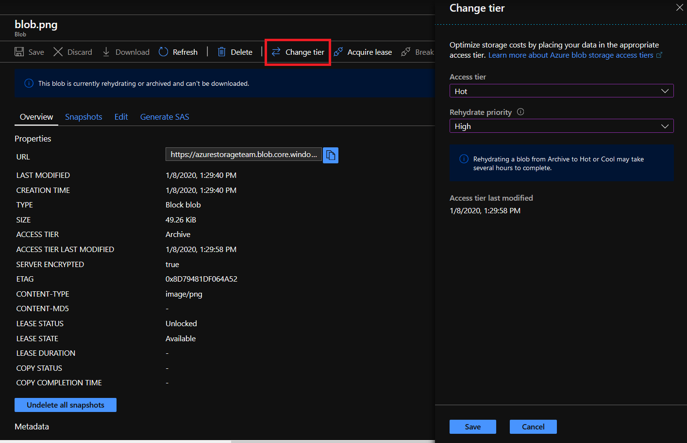

# Azure Blob storage: hot, cool, and archive access tiers

Azure storage offers different access tiers, which allow you to store blob object data in the most cost-effective manner. The available access tiers include:

- **Hot** - Optimized for storing data that is accessed frequently.
- **Cool** - Optimized for storing data that is infrequently accessed and stored for at least 30 days.
- **Archive** - Optimized for storing data that is rarely accessed and stored for at least 180 days with flexible latency requirements (on the order of hours).

The following considerations apply to the different access tiers:

- Only the hot and cool access tiers can be set at the account level. The archive access tier isn't available at the account level.
- Hot, cool, and archive tiers can be set at the blob level during upload or after upload.
- Data in the cool access tier can tolerate slightly lower availability, but still requires high durability, retrieval latency, and throughput characteristics similar to hot data. For cool data, a slightly lower availability service-level agreement (SLA) and higher access costs compared to hot data are acceptable trade-offs for lower storage costs.
- Archive storage stores data offline and offers the lowest storage costs but also the highest data rehydrate and access costs.

Data stored in the cloud grows at an exponential pace. To manage costs for your expanding storage needs, it's helpful to organize your data based on attributes like frequency-of-access and planned retention period to optimize costs. Data stored in the cloud can be different based on how it's generated, processed, and accessed over its lifetime. Some data is actively accessed and modified throughout its lifetime. Some data is accessed frequently early in its lifetime, with access dropping drastically as the data ages. Some data remains idle in the cloud and is rarely, if ever, accessed after it's stored.

Each of these data access scenarios benefits from a different access tier that is optimized for a particular access pattern. With hot, cool, and archive access tiers, Azure Blob storage addresses this need for differentiated access tiers with separate pricing models.

[!INCLUDE [storage-multi-protocol-access-preview](../../../includes/storage-multi-protocol-access-preview.md)]

## Storage accounts that support tiering

Object storage data tiering between hot, cool, and archive is only supported in Blob storage and General Purpose v2 (GPv2) accounts. General Purpose v1 (GPv1) accounts don't support tiering. Customers can easily convert their existing GPv1 or Blob storage accounts to GPv2 accounts through the Azure portal. GPv2 provides new pricing and features for blobs, files, and queues. Some features and prices cuts are only offered in GPv2 accounts. Evaluate using GPv2 accounts after comprehensively reviewing pricing. Some workloads can be more expensive on GPv2 than GPv1. For more information, see [Azure storage account overview](../common/storage-account-overview.md).

Blob storage and GPv2 accounts expose the **Access Tier** attribute at the account level. This attribute allows you to specify the default access tier for any blob that doesn't have it explicit set at the object level. For objects with the tier set at the object level, the account tier won't apply. The archive tier can be applied only at the object level. You can switch between these access tiers at any time.

## Hot access tier

The hot access tier has higher storage costs than cool and archive tiers, but the lowest access costs. Example usage scenarios for the hot access tier include:

- Data that's in active use or expected to be accessed (read from and written to) frequently.
- Data that's staged for processing and eventual migration to the cool access tier.

## Cool access tier

The cool access tier has lower storage costs and higher access costs compared to hot storage. This tier is intended for data that will remain in the cool tier for at least 30 days. Example usage scenarios for the cool access tier include:

- Short-term backup and disaster recovery datasets.
- Older media content not viewed frequently anymore but is expected to be available immediately when accessed.
- Large data sets that need to be stored cost effectively while more data is being gathered for future processing. (*For example*, long-term storage of scientific data, raw telemetry data from a manufacturing facility)

## Archive access tier

The archive access tier has the lowest storage cost. But it has higher data retrieval costs compared to the hot and cool tiers. Data must remain in the archive tier for at least 180 days or be subject to an early deletion charge. Data in the archive tier can take several hours to retrieve depending on the priority of the rehydration. For small objects, a high priority rehydrate may retrieve the object from archive in under 1 hour. See [Rehydrate blob data from the archive tier](storage-blob-rehydration.md) to learn more.

While a blob is in archive storage, the blob data is offline and can't be read, overwritten, or modified. To read or download a blob in archive, you must first rehydrate it to an online tier. You can't take snapshots of a blob in archive storage. However, the blob metadata remains online and available, allowing you to list the blob, its properties, metadata, and blob index tags. Setting or modifying the blob metadata while in archive is not allowed; however you may set and modify the blob index tags. For blobs in archive, the only valid operations are GetBlobProperties, GetBlobMetadata, SetBlobTags, GetBlobTags, FindBlobsByTags, ListBlobs, SetBlobTier, CopyBlob, and DeleteBlob.

Example usage scenarios for the archive access tier include:

- Long-term backup, secondary backup, and archival datasets
- Original (raw) data that must be preserved, even after it has been processed into final usable form.
- Compliance and archival data that needs to be stored for a long time and is hardly ever accessed.

## Account-level tiering

Blobs in all three access tiers can coexist within the same account. Any blob that doesn't have an explicitly assigned tier infers the tier from the account access tier setting. If the access tier comes from the account, you see the **Access Tier Inferred** blob property set to "true", and the **Access Tier** blob property matches the account tier. In the Azure portal, the _access tier inferred_ property is displayed with the blob access tier as **Hot (inferred)** or **Cool (inferred)**.

Changing the account access tier applies to all _access tier inferred_ objects stored in the account that don't have an explicit tier set. If you toggle the account tier from hot to cool, you'll be charged for write operations (per 10,000) for all blobs without a set tier in GPv2 accounts only. There's no charge for this change in Blob storage accounts. You'll be charged for both read operations (per 10,000) and data retrieval (per GB) if you toggle from cool to hot in Blob storage or GPv2 accounts.

## Blob-level tiering

Blob-level tiering allows you to upload data to the access tier of your choice using the [Put Blob](/rest/api/storageservices/put-blob) or [Put Block List](/rest/api/storageservices/put-block-list) operations and change the tier of your data at the object level using the [Set Blob Tier](/rest/api/storageservices/set-blob-tier) operation or [Lifecycle management](#blob-lifecycle-management) feature. You can upload data to your required access tier then easily change the blob access tier among the hot, cool, or archive tiers as usage patterns change, without having to move data between accounts. All tier change requests happen immediately and tier changes between hot and cool are instantaneous. However, rehydrating a blob from archive can take several hours.

The time of the last blob tier change is exposed via the **Access Tier Change Time** blob property. When overwriting a blob in the hot or cool tier, the newly created blob inherits the tier of the blob that was overwritten unless the new blob access tier is explicitly set on creation. If a blob is in the archive tier, it can't be overwritten, so uploading the same blob isn't permitted in this scenario. 

> [!NOTE]
> Archive storage and blob-level tiering only support block blobs. You also cannot currently change the tier of a block blob that has snapshots.

### Blob lifecycle management

Blob Storage lifecycle management offers a rich, rule-based policy that you can use to transition your data to the best access tier and to expire data at the end of its lifecycle. See [Manage the Azure Blob storage lifecycle](storage-lifecycle-management-concepts.md) to learn more.  

> [!NOTE]
> Data stored in a block blob storage account (Premium performance) cannot currently be tiered to hot, cool, or archive using [Set Blob Tier](/rest/api/storageservices/set-blob-tier) or using Azure Blob Storage lifecycle management.
> To move data, you must synchronously copy blobs from the block blob storage account to the hot access tier in a different account using the [Put Block From URL API](/rest/api/storageservices/put-block-from-url) or a version of AzCopy that supports this API.
> The *Put Block From URL* API synchronously copies data on the server, meaning the call completes only once all the data is moved from the original server location to the destination location.

### Blob-level tiering billing

When a blob is uploaded or moved to the hot, cool, or archive tier, it is charged at the corresponding rate immediately upon tier change.

When a blob is moved to a cooler tier (hot->cool, hot->archive, or cool->archive), the operation is billed as a write operation to the destination tier, where the write operation (per 10,000) and data write (per GB) charges of the destination tier apply.

When a blob is moved to a warmer tier (archive->cool, archive->hot, or cool->hot), the operation is billed as a read from the source tier, where the read operation (per 10,000) and data retrieval (per GB) charges of the source tier apply. Early deletion charges for any blob moved out of the cool or archive tier may apply as well. [Rehydrating data from archive](storage-blob-rehydration.md) takes time and data will be charged archive prices until the data is restored online and blob tier changes to hot or cool. The following table summarizes how tier changes are billed:

| | **Write Charges (Operation + Access)** | **Read Charges (Operation + Access)**
| ---- | ----- | ----- |
| **SetBlobTier Direction** | hot->cool,<br> hot->archive,<br> cool->archive | archive->cool,<br> archive->hot,<br> cool->hot

### Cool and archive early deletion

Any blob that is moved into the cool tier (GPv2 accounts only) is subject to a cool early deletion period of 30 days. Any blob that is moved into the archive tier is subject to an archive early deletion period of 180 days. This charge is prorated. For example, if a blob is moved to archive and then deleted or moved to the hot tier after 45 days, you'll be charged an early deletion fee equivalent to 135 (180 minus 45) days of storing that blob in archive.

You may calculate the early deletion by using the blob property, **Last-Modified**, if there has been no access tier changes. Otherwise you can use when the access tier was last modified to cool or archive by viewing the blob property: **access-tier-change-time**. For more information on blob properties, see [Get Blob Properties](https://docs.microsoft.com/rest/api/storageservices/get-blob-properties).

## Comparing block blob storage options

The following table shows a comparison of premium performance block blob storage, and the hot, cool, and archive access tiers.

|                                           | **Premium performance**   | **Hot tier** | **Cool tier**       | **Archive tier**  |
| ----------------------------------------- | ------------------------- | ------------ | ------------------- | ----------------- |
| **Availability**                          | 99.9%                     | 99.9%        | 99%                 | Offline           |
| **Availability** <br> **(RA-GRS reads)**  | N/A                       | 99.99%       | 99.9%               | Offline           |
| **Usage charges**                         | Higher storage costs, lower access, and transaction cost | Higher storage costs, lower access, and transaction costs | Lower storage costs, higher access, and transaction costs | Lowest storage costs, highest access, and transaction costs |
| **Minimum object size**                   | N/A                       | N/A          | N/A                 | N/A               |
| **Minimum storage duration**              | N/A                       | N/A          | 30 days<sup>1</sup> | 180 days
| **Latency** <br> **(Time to first byte)** | Single-digit milliseconds | milliseconds | milliseconds        | hours<sup>2</sup> |

<sup>1</sup> Objects in the cool tier on GPv2 accounts have a minimum retention duration of 30 days. Blob storage accounts don't have a minimum retention duration for the cool tier.

<sup>2</sup> Archive Storage currently supports 2 rehydrate priorities, High and Standard, that offers different retrieval latencies. For more information, see [Rehydrate blob data from the archive tier](storage-blob-rehydration.md).

> [!NOTE]
> Blob storage accounts support the same performance and scalability targets as general-purpose v2 storage accounts. For more information, see [Scalability and performance targets for Blob storage](scalability-targets.md).

## Quickstart scenarios

In this section, the following scenarios are demonstrated using the Azure portal and PowerShell:

- How to change the default account access tier of a GPv2 or Blob storage account.
- How to change the tier of a blob in a GPv2 or Blob storage account.

### Change the default account access tier of a GPv2 or Blob storage account

# [Portal](#tab/azure-portal)
1. Sign in to the [Azure portal](https://portal.azure.com).

1. In the Azure portal, search for and select **All Resources**.

1. Select your storage account.

1. In **Settings**, select **Configuration** to view and change the account configuration.

1. Select the right access tier for your needs: Set the **Access tier** to either **Cool** or **Hot**.

1. Click **Save** at the top.


# [PowerShell](#tab/azure-powershell)
The following PowerShell script can be used to change the account tier. The `$rgName` variable must be initialized with your resource group name. The `$accountName` variable must be initialized with your storage account name. 
```powershell
#Initialize the following with your resource group and storage account names
$rgName = ""
$accountName = ""

#Change the storage account tier to hot
Set-AzStorageAccount -ResourceGroupName $rgName -Name $accountName -AccessTier Hot
```
---

### Change the tier of a blob in a GPv2 or Blob storage account
# [Portal](#tab/azure-portal)
1. Sign in to the [Azure portal](https://portal.azure.com).

1. In the Azure portal, search for and select **All Resources**.

1. Select your storage account.

1. Select your container and then select your blob.

1. In the **Blob properties**, select **Change tier**.

1. Select the **Hot**, **Cool**, or **Archive** access tier. If your blob is currently in archive and you want to rehydrate to an online tier, you may also select a Rehydrate Priority of **Standard** or **High**.

1. Select **Save** at the bottom.



# [PowerShell](#tab/azure-powershell)
The following PowerShell script can be used to change the blob tier. The `$rgName` variable must be initialized with your resource group name. The `$accountName` variable must be initialized with your storage account name. The `$containerName` variable must be initialized with your container name. The `$blobName` variable must be initialized with your blob name. 
```powershell
#Initialize the following with your resource group, storage account, container, and blob names
$rgName = ""
$accountName = ""
$containerName = ""
$blobName == ""

#Select the storage account and get the context
$storageAccount =Get-AzStorageAccount -ResourceGroupName $rgName -Name $accountName
$ctx = $storageAccount.Context

#Select the blob from a container
$blob = Get-AzStorageBlob -Container $containerName -Blob $blobName -Context $ctx

#Change the blob’s access tier to archive
$blob.ICloudBlob.SetStandardBlobTier("Archive")
```
---

## Pricing and billing

All storage accounts use a pricing model for Block blob storage based on the tier of each blob. Keep in mind the following billing considerations:

- **Storage costs**: In addition to the amount of data stored, the cost of storing data varies depending on the access tier. The per-gigabyte cost decreases as the tier gets cooler.
- **Data access costs**: Data access charges increase as the tier gets cooler. For data in the cool and archive access tier, you're charged a per-gigabyte data access charge for reads.
- **Transaction costs**: There's a per-transaction charge for all tiers that increases as the tier gets cooler.
- **Geo-Replication data transfer costs**: This charge only applies to accounts with geo-replication configured, including GRS and RA-GRS. Geo-replication data transfer incurs a per-gigabyte charge.
- **Outbound data transfer costs**: Outbound data transfers (data that is transferred out of an Azure region) incur billing for bandwidth usage on a per-gigabyte basis, consistent with general-purpose storage accounts.
- **Changing the access tier**: Changing the account access tier will result in tier change charges for _access tier inferred_ blobs stored in the account that don't have an explicit tier set. For information on changing the access tier for a single blob, refer to [Blob-level tiering billing](#blob-level-tiering-billing).

> [!NOTE]
> For more information about pricing for Block blobs, see [Azure Storage Pricing](https://azure.microsoft.com/pricing/details/storage/blobs/) page. For more information on outbound data transfer charges, see [Data Transfers Pricing Details](https://azure.microsoft.com/pricing/details/data-transfers/) page.

## FAQ

**Should I use Blob storage or GPv2 accounts if I want to tier my data?**

We recommend you use GPv2 instead of Blob storage accounts for tiering. GPv2 support all the features that Blob storage accounts support plus a lot more. Pricing between Blob storage and GPv2 is almost identical, but some new features and price cuts will only be available on GPv2 accounts. GPv1 accounts don't support tiering.

Pricing structure between GPv1 and GPv2 accounts is different and customers should carefully evaluate both before deciding to use GPv2 accounts. You can easily convert an existing Blob storage or GPv1 account to GPv2 through a simple one-click process. For more information, see [Azure storage account overview](../common/storage-account-overview.md).

**Can I store objects in all three (hot, cool, and archive) access tiers in the same account?**

Yes. The **Access Tier** attribute set at the account level is the default account tier that applies to all objects in that account without an explicit set tier. Blob-level tiering allows you to set the access tier on at the object level regardless of what the access tier setting on the account is. Blobs in any of the three access tiers (hot, cool, or archive) may exist within the same account.

**Can I change the default access tier of my Blob or GPv2 storage account?**

Yes, you can change the default account tier by setting the **Access tier** attribute on the storage account. Changing the account tier applies to all objects stored in the account that don't have an explicit tier set (for example, **Hot (inferred)** or **Cool (inferred)**). Toggling the account tier from hot to cool incurs write operations (per 10,000) for all blobs without a set tier in GPv2 accounts only and toggling from cool to hot incurs both read operations (per 10,000) and data retrieval (per GB) charges for all blobs in Blob storage and GPv2 accounts.

**Can I set my default account access tier to archive?**

No. Only hot and cool access tiers may be set as the default account access tier. Archive can only be set at the object level. On blob upload, You specify the access tier of your choice to be hot, cool, or archive regardless of the default account tier. This functionality allows you to write data directly into the archive tier to realize cost-savings from the moment you create data in blob storage.

**In which regions are the hot, cool, and archive access tiers available in?**

The hot and cool access tiers along with blob-level tiering are available in all regions. Archive storage will initially only be available in select regions. For a complete list, see [Azure products available by region](https://azure.microsoft.com/regions/services/).

**Do the blobs in the cool access tier behave differently than the ones in the hot access tier?**

Blobs in the hot access tier have the same latency as blobs in GPv1, GPv2, and Blob storage accounts. Blobs in the cool access tier have a similar latency (in milliseconds) as blobs in GPv1, GPv2, and Blob storage accounts. Blobs in the archive access tier have several hours of latency in GPv1, GPv2, and Blob storage accounts.

Blobs in the cool access tier have a slightly lower availability service level (SLA) than the blobs stored in the hot access tier. For more information, see [SLA for storage](https://azure.microsoft.com/support/legal/sla/storage/v1_2/).

**Are the operations among the hot, cool, and archive tiers the same?**

All operations between hot and cool are 100% consistent. All valid archive operations including GetBlobProperties, GetBlobMetadata, SetBlobTags, GetBlobTags, FindBlobsByTags, ListBlobs, SetBlobTier, and DeleteBlob are 100% consistent with hot and cool. Blob data can't be read or modified while in the archive tier until rehydrated; only blob metadata read operations are supported while in archive. However blob index tags can be read, set, or modified while in archive.

**When rehydrating a blob from archive tier to the hot or cool tier, how will I know when rehydration is complete?**

During rehydration, you may use the get blob properties operation to poll the **Archive Status** attribute and confirm when the tier change is complete. The status reads "rehydrate-pending-to-hot" or "rehydrate-pending-to-cool" depending on the destination tier. Upon completion, the archive status property is removed, and the **Access Tier** blob property reflects the new hot or cool tier. See [Rehydrate blob data from the archive tier](storage-blob-rehydration.md) to learn more.

**After setting the tier of a blob, when will I start getting billed at the appropriate rate?**

Each blob is always billed according to the tier indicated by the blob's **Access Tier** property. When you set a new online tier for a blob, the **Access Tier** property immediately reflects the new tier for all transitions. However, rehydrating a blob from the offline archive tier to a hot or cool tier can take several hours. In this case, you're billed at archive rates until rehydration is complete, at which point the **Access Tier** property reflects the new tier. Once rehydrated to the online tier, you're billed for that blob at the hot or cool rate.

**How do I determine if I'll incur an early deletion charge when deleting or moving a blob out of the cool or archive tier?**

Any blob that is deleted or moved out of the cool (GPv2 accounts only) or archive tier before 30 days and 180 days respectively will incur a prorated early deletion charge. You can determine how long a blob has been in the cool or archive tier by checking the **Access Tier Change Time** blob property, which provides a stamp of the last tier change. If the blob's tier was never changed, you can check the **Last Modified** blob property. For more information, see [Cool and archive early deletion](#cool-and-archive-early-deletion).

**Which Azure tools and SDKs support blob-level tiering and archive storage?**

Azure portal, PowerShell, and CLI tools and .NET, Java, Python, and Node.js client libraries all support blob-level tiering and archive storage.  

**How much data can I store in the hot, cool, and archive tiers?**

Data storage along with other limits are set at the account level and not per access tier. You can choose to use all of your limit in one tier or across all three tiers. For more information, see [Scalability and performance targets for standard storage accounts](../common/scalability-targets-standard-account.md?toc=%2fazure%2fstorage%2fblobs%2ftoc.json).

## Next steps

Evaluate hot, cool, and archive in GPv2 and Blob storage accounts

- [Check availability of hot, cool, and archive by region](https://azure.microsoft.com/regions/#services)
- [Manage the Azure Blob storage lifecycle](storage-lifecycle-management-concepts.md)
- [Learn about rehydrating blob data from the archive tier](storage-blob-rehydration.md)
- [Determine if premium performance would benefit your app](storage-blob-performance-tiers.md)
- [Evaluate usage of your current storage accounts by enabling Azure Storage metrics](../common/storage-enable-and-view-metrics.md)
- [Check hot, cool, and archive pricing in Blob storage and GPv2 accounts by region](https://azure.microsoft.com/pricing/details/storage/)
- [Check data transfers pricing](https://azure.microsoft.com/pricing/details/data-transfers/)
