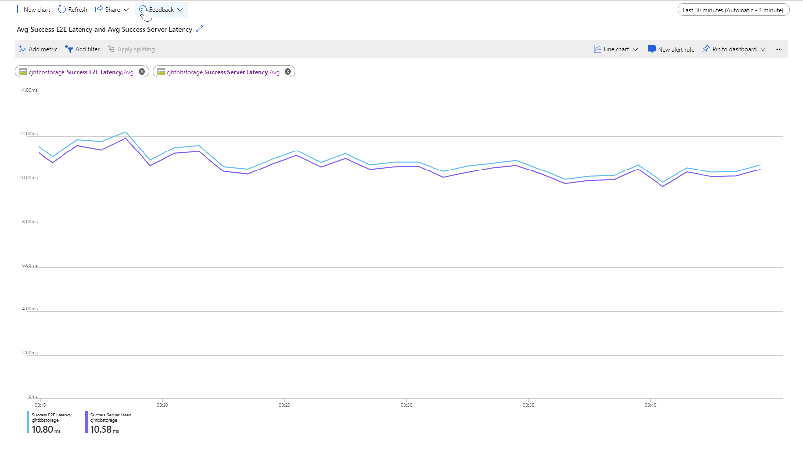
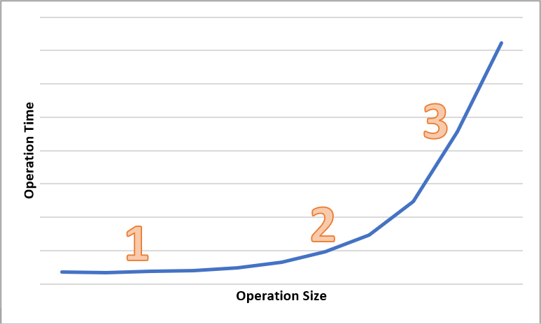

# Latency in Blob storage

Latency, sometimes referenced as response time, is the amount of time that an application must wait for a request to complete. Latency can directly affect an application's performance. Low latency is often important for scenarios with humans in the loop, such as conducting credit card transactions or loading web pages. Systems that need to process incoming events at high rates, such as telemetry logging or IoT events, also require low latency. This article describes how to understand and measure latency for operations on block blobs, and how to design your applications for low latency.

Azure Storage offers two different performance options for block blobs: premium and standard. Premium block blobs offer significantly lower and more consistent latency than standard block blobs via high-performance SSD disks. For more information, see **Premium performance block blob storage** in [Hot, Cool, and Archive access tiers for blob data](access-tiers-overview.md).

## About Azure Storage latency

Azure Storage latency is related to request rates for Azure Storage operations. Request rates are also known as input/output operations per second (IOPS).

To calculate the request rate, first determine the length of time that each request takes to complete, then calculate how many requests can be processed per second. For example, assume that a request takes 50 milliseconds (ms) to complete. An application using one thread with one outstanding read or write operation should achieve 20 IOPS (1 second or 1000 ms / 50 ms per request). Theoretically, if the thread count is doubled to two, then the application should be able to achieve 40 IOPS. If the outstanding asynchronous read or write operations for each thread are doubled to two, then the application should be able to achieve 80 IOPS.

In practice, request rates do not always scale so linearly, due to overhead in the client from task scheduling, context switching, and so forth. On the service side, there can be variability in latency due to pressure on the Azure Storage system, differences in the storage media used, noise from other workloads, maintenance tasks, and other factors. Finally, the network connection between the client and the server may affect Azure Storage latency due to congestion, rerouting, or other disruptions.

Azure Storage bandwidth, also referred to as throughput, is related to the request rate and can be calculated by multiplying the request rate (IOPS) by the request size. For example, assuming 160 requests per second, each 256 KiB of data results in throughput of 40,960 KiB per second or 40 MiB per second.

## Latency metrics for block blobs

Azure Storage provides two latency metrics for block blobs. These metrics can be viewed in the Azure portal:

- **End-to-end (E2E) latency** measures the interval from when Azure Storage receives the first packet of the request until Azure Storage receives a client acknowledgment on the last packet of the response.

- **Server latency** measures the interval from when Azure Storage receives the last packet of the request until the first packet of the response is returned from Azure Storage.

The following image shows the **Average Success E2E Latency** and **Average Success Server Latency** for a sample workload that calls the `Get Blob` operation:

Under normal conditions, there is little gap between end-to-end latency and server latency, which is what the image shows for the sample workload.

If you review your end-to-end and server latency metrics, and find that end-to-end latency is significantly higher than server latency, then investigate and address the source of the additional latency.

If your end-to-end and server latency are similar, but you require lower latency, then consider migrating to premium block blob storage.

## Factors influencing latency

The main factor influencing latency is operation size. It takes longer to complete larger operations, due to the amount of data being transferred over the network and processed by Azure Storage.

The following diagram shows the total time for operations of various sizes. For small amounts of data, the latency interval is predominantly spent handling the request, rather than transferring data. The latency interval increases only slightly as the operation size increases (marked 1 in the diagram below). As the operation size further increases, more time is spent on transferring data, so that the total latency interval is split between request handling and data transfer (marked 2 in the diagram below). With larger operation sizes, the latency interval is almost exclusively spent on transferring data and the request handling is largely insignificant (marked 3 in the diagram below).

Client configuration factors such as concurrency and threading also affect latency. Overall throughput depends on how many storage requests are in flight at any given point in time and on how your application handles threading. Client resources including CPU, memory, local storage, and network interfaces can also affect latency.

Processing Azure Storage requests requires client CPU and memory resources. If the client is under pressure due to an underpowered virtual machine or some runaway process in the system, there are fewer resources available to process Azure Storage requests. Any contention or lack of client resources will result in an increase in end-to-end latency without an increase in server latency, increasing the gap between the two metrics.

Equally important is the network interface and network pipe between the client and Azure Storage. Physical distance alone can be a significant factor, for example if a client VM is in a different Azure region or on-premises. Other factors such as network hops, ISP routing, and internet state can influence overall storage latency.

To assess latency, first establish baseline metrics for your scenario. Baseline metrics provide you with the expected end-to-end and server latency in the context of your application environment, depending on your workload profile, application configuration settings, client resources, network pipe, and other factors. When you have baseline metrics, you can more easily identify abnormal versus normal conditions. Baseline metrics also enable you to observe the effects of changed parameters, such as application configuration or VM sizes.

## Next steps

- [Scalability and performance targets for Blob storage](scalability-targets.md)
- [Performance and scalability checklist for Blob storage](storage-performance-checklist.md)
