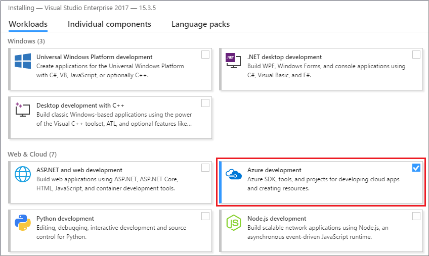
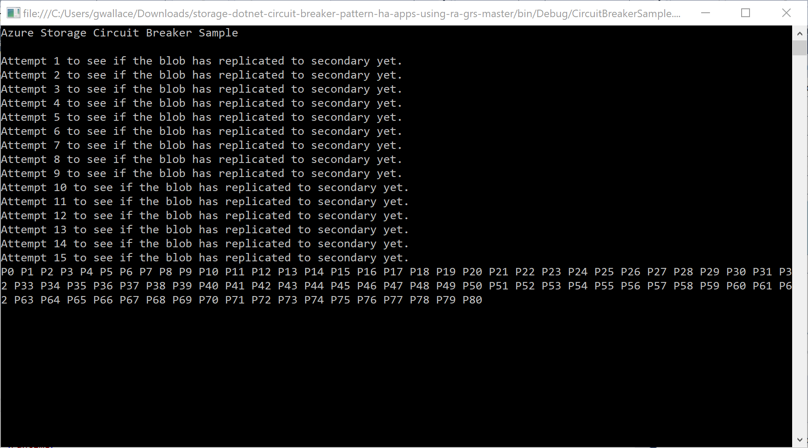

# Tutorial: Build a highly available application with Blob storage

This tutorial is part one of a series. In it, you learn how to make your application data highly available in Azure.

When you've completed this tutorial, you will have a console application that uploads and retrieves a blob from a [read-access geo-redundant](../common/storage-redundancy-grs.md#read-access-geo-redundant-storage) (RA-GRS) storage account.

RA-GRS works by replicating transactions from a primary region to a secondary region. This replication process guarantees that the data in the secondary region is eventually consistent. The application uses the [Circuit Breaker](/azure/architecture/patterns/circuit-breaker) pattern to determine which endpoint to connect to, automatically switching between endpoints as failures and recoveries are simulated.

If you don't have an Azure subscription, [create a free account](https://azure.microsoft.com/free/) before you begin.

In part one of the series, you learn how to:

> [!div class="checklist"]
> * Create a storage account
> * Set the connection string
> * Run the console application

## Prerequisites

To complete this tutorial:

# [.NET](#tab/dotnet)

* Install [Visual Studio 2019](https://www.visualstudio.com/downloads/) with the following workloads:
  - **Azure development**

  

# [Python](#tab/python)

* Install [Python](https://www.python.org/downloads/)
* Download and install [Azure Storage SDK for Python](https://github.com/Azure/azure-storage-python)

# [Java V10 SDK](#tab/java-v10)

* Install and configure [Maven](https://maven.apache.org/download.cgi) to work from the command line
* Install and configure a [JDK](https://www.oracle.com/technetwork/java/javase/downloads/index.html)

# [Node.js](#tab/nodejs)

* Install [Node.js](https://nodejs.org).

---

## Sign in to the Azure portal

Sign in to the [Azure portal](https://portal.azure.com/).

## Create a storage account

A storage account provides a unique namespace to store and access your Azure Storage data objects.

Follow these steps to create a read-access geo-redundant storage account:

1. Select the **Create a resource** button found on the upper left-hand corner of the Azure portal.
2. Select **Storage** from the **New** page.
3. Select **Storage account - blob, file, table, queue** under **Featured**.
4. Fill out the storage account form with the following information, as shown in the following image and select **Create**:

   | Setting       | Suggested value | Description |
   | ------------ | ------------------ | ------------------------------------------------- |
   | **Name** | mystorageaccount | A unique value for your storage account |
   | **Deployment model** | Resource Manager  | Resource Manager contains the latest features.|
   | **Account kind** | StorageV2 | For details on the types of accounts, see [types of storage accounts](../common/storage-introduction.md#types-of-storage-accounts) |
   | **Performance** | Standard | Standard is sufficient for the example scenario. |
   | **Replication**| Read-access geo-redundant storage (RA-GRS) | This is necessary for the sample to work. |
   |**Subscription** | your subscription |For details about your subscriptions, see [Subscriptions](https://account.azure.com/Subscriptions). |
   |**ResourceGroup** | myResourceGroup |For valid resource group names, see [Naming rules and restrictions](https://docs.microsoft.com/azure/architecture/best-practices/naming-conventions). |
   |**Location** | East US | Choose a location. |


## Download the sample

# [.NET](#tab/dotnet)

[Download the sample project](https://github.com/Azure-Samples/storage-dotnet-circuit-breaker-pattern-ha-apps-using-ra-grs/archive/master.zip) and extract (unzip) the storage-dotnet-circuit-breaker-pattern-ha-apps-using-ra-grs.zip file. You can also use [git](https://git-scm.com/) to download a copy of the application to your development environment. The sample project contains a console application.

```bash
git clone https://github.com/Azure-Samples/storage-dotnet-circuit-breaker-pattern-ha-apps-using-ra-grs.git
```

# [Python](#tab/python)

[Download the sample project](https://github.com/Azure-Samples/storage-python-circuit-breaker-pattern-ha-apps-using-ra-grs/archive/master.zip) and extract (unzip) the storage-python-circuit-breaker-pattern-ha-apps-using-ra-grs.zip file. You can also use [git](https://git-scm.com/) to download a copy of the application to your development environment. The sample project contains a basic Python application.

```bash
git clone https://github.com/Azure-Samples/storage-python-circuit-breaker-pattern-ha-apps-using-ra-grs.git
```

# [Java V10 SDK](#tab/java-v10)

[Download the sample project](https://github.com/Azure-Samples/storage-java-V10-ha-ra-grs) and extract the storage-java-ragrs.zip file. You can also use [git](https://git-scm.com/) to download a copy of the application to your development environment. The sample project contains a basic Java application.

```bash
git clone https://github.com/Azure-Samples/storage-java-V10-ha-ra-grs
```

# [Node.js](#tab/nodejs)

[Download the sample project](https://github.com/Azure-Samples/storage-node-v10-ha-ra-grs) and unzip the file. You can also use [git](https://git-scm.com/) to download a copy of the application to your development environment. The sample project contains a basic Node.js application.

```bash
git clone https://github.com/Azure-Samples/storage-java-V10-ha-ra-grs
```

---

## Configure the sample

# [.NET](#tab/dotnet)

In the application, you must provide the connection string for your storage account. You can store this connection string within an environment variable on the local machine running the application. Follow one of the examples below depending on your Operating System to create the environment variable.

In the Azure portal, navigate to your storage account. Select **Access keys** under **Settings** in your storage account. Copy the **connection string** from the primary or secondary key. Run one of the following commands based on your operating system, replacing \<yourconnectionstring\> with your actual connection string. This command saves an environment variable to the local machine. In Windows, the environment variable is not available until you reload the **Command Prompt** or shell you are using.

### Linux

```
export storageconnectionstring=<yourconnectionstring>
```

### Windows

```powershell
setx storageconnectionstring "<yourconnectionstring>"
```

# [Python](#tab/python)

In the application, you must provide your storage account credentials. You can store this information in environment variables on the local machine running the application. Follow one of the examples below depending on your Operating System to create the environment variables.

In the Azure portal, navigate to your storage account. Select **Access keys** under **Settings** in your storage account. Paste the **Storage account name** and **Key** values into the following commands, replacing the \<youraccountname\> and \<youraccountkey\> placeholders. This command saves the environment variables to the local machine. In Windows, the environment variable is not available until you reload the **Command Prompt** or shell you are using.

### Linux

```
export accountname=<youraccountname>
export accountkey=<youraccountkey>
```

### Windows

```powershell
setx accountname "<youraccountname>"
setx accountkey "<youraccountkey>"
```

# [Java V10 SDK](#tab/java-v10)

This sample requires that you securely store the name and key of your storage account. Store them in environment variables local to the machine that will run the sample. Use either the Linux or the Windows example, depending on your operating system, to create the environment variables. In Windows, the environment variable isn't available until you reload the **Command Prompt** or shell you're using.

### Linux example

```
export AZURE_STORAGE_ACCOUNT="<youraccountname>"
export AZURE_STORAGE_ACCESS_KEY="<youraccountkey>"
```

### Windows example

```powershell
setx AZURE_STORAGE_ACCOUNT "<youraccountname>"
setx AZURE_STORAGE_ACCESS_KEY "<youraccountkey>"
```

# [Node.js](#tab/nodejs)

To run this sample, you must add your storage account credentials to the `.env.example` file and then rename it to `.env`.

```
AZURE_STORAGE_ACCOUNT_NAME=<replace with your storage account name>
AZURE_STORAGE_ACCOUNT_ACCESS_KEY=<replace with your storage account access key>
```

You can find this information in the Azure portal by navigating to your storage account and selecting **Access keys** in the **Settings** section.

Install the required dependencies. To do this, open a command prompt, navigate to the sample folder, then enter `npm install`.

---

## Run the console application

# [.NET](#tab/dotnet)

In Visual Studio, press **F5** or select **Start** to begin debugging the application. Visual studio automatically restores missing NuGet packages if configured, visit [Installing and reinstalling packages with package restore](https://docs.microsoft.com/nuget/consume-packages/package-restore#package-restore-overview) to learn more.

A console window launches and the application begins running. The application uploads the **HelloWorld.png** image from the solution to the storage account. The application checks to ensure the image has replicated to the secondary RA-GRS endpoint. It then begins downloading the image up to 999 times. Each read is represented by a **P** or an **S**. Where **P** represents the primary endpoint and **S** represents the secondary endpoint.



In the sample code, the `RunCircuitBreakerAsync` task in the `Program.cs` file is used to download an image from the storage account using the [DownloadToFileAsync](/dotnet/api/microsoft.azure.storage.blob.cloudblob.downloadtofileasync) method. Prior to the download, an [OperationContext](/dotnet/api/microsoft.azure.cosmos.table.operationcontext) is defined. The operation context defines event handlers, that fire when a download completes successfully or if a download fails and is retrying.

# [Python](#tab/python)

To run the application on a terminal or command prompt, go to the **circuitbreaker.py** directory, then enter `python circuitbreaker.py`. The application uploads the **HelloWorld.png** image from the solution to the storage account. The application checks to ensure the image has replicated to the secondary RA-GRS endpoint. It then begins downloading the image up to 999 times. Each read is represented by a **P** or an **S**. Where **P** represents the primary endpoint and **S** represents the secondary endpoint.


In the sample code, the `run_circuit_breaker` method in the `circuitbreaker.py` file is used to download an image from the storage account using the [get_blob_to_path](https://azure.github.io/azure-storage-python/ref/azure.storage.blob.baseblobservice.html) method.

The Storage object retry function is set to a linear retry policy. The retry function determines whether to retry a request, and specifies the number of seconds to wait before retrying the request. Set the **retry\_to\_secondary** value to true, if request should be retried to secondary in case the initial request to primary fails. In the sample application, a custom retry policy is defined in the `retry_callback` function of the storage object.

Before the download, the Service object [retry_callback](https://docs.microsoft.com/python/api/azure.storage.common.storageclient.storageclient?view=azure-python) and [response_callback](https://docs.microsoft.com/python/api/azure.storage.common.storageclient.storageclient?view=azure-python) function is defined. These functions define event handlers that fire when a download completes successfully or if a download fails and is retrying.

# [Java V10 SDK](#tab/java-v10)

To run the sample, use Maven at the command line.

1. open a shell and browse to **storage-blobs-java-v10-quickstart** inside your cloned directory.
2. Enter `mvn compile exec:java`.

This sample creates a test file in your default directory. For Windows users, this directory is **AppData\Local\Temp**. The sample then presents you with the following options of commands which you can enter:

- Enter **P** to execute a put blob operation, this command uploads a temp file to your storage account.
- Enter **L** to perform a list blob operation, this command list the blobs currently in your container.
- Enter **G** to perform a get blob operation, this command downloads a file from your storage account to your local machine.
- Enter **D** to execute a delete blob operation, this command deletes the blob from your storage account.
- Enter **E** to close the sample, this command also deletes all resources the sample created.

This example shows your output if you run the application on Windows.

```
Created quickstart container
Enter a command
(P)utBlob | (L)istBlobs | (G)etBlob | (D)eleteBlobs | (E)xitSample
# Enter a command :
P
Uploading the sample file into the container: https://<storageaccount>.blob.core.windows.net/quickstart
# Enter a command :
L
Listing blobs in the container: https://<storageaccount>.blob.core.windows.net/quickstart
Blob name: SampleBlob.txt
# Enter a command :
G
Get the blob: https://<storageaccount>.blob.core.windows.net/quickstart/SampleBlob.txt
The blob was downloaded to C:\Users\<useraccount>\AppData\Local\Temp\downloadedFile13097087873115855761.txt
# Enter a command :
D
Delete the blob: https://<storageaccount>.blob.core.windows.net/quickstart/SampleBlob.txt

# Enter a command :
>> Blob deleted: https://<storageaccount>.blob.core.windows.net/quickstart/SampleBlob.txt
E
Cleaning up the sample and exiting!
```

You control the sample, so enter commands to have it run the code. Inputs are case-sensitive.

# [Node.js](#tab/nodejs)

To run the sample, open a command prompt, navigate to the sample folder, then enter `node index.js`.

The sample creates a container in your Blob storage account, uploads **HelloWorld.png** into the container, then repeatedly checks whether the container and image have replicated to the secondary region. After replication, it prompts you to enter **D** or **Q** (followed by ENTER) to download or quit. Your output should look similar to the following example:

```
Created container successfully: newcontainer1550799840726
Uploaded blob: HelloWorld.png
Checking to see if container and blob have replicated to secondary region.
[0] Container has not replicated to secondary region yet: newcontainer1550799840726 : ContainerNotFound
[1] Container has not replicated to secondary region yet: newcontainer1550799840726 : ContainerNotFound
...
[31] Container has not replicated to secondary region yet: newcontainer1550799840726 : ContainerNotFound
[32] Container found, but blob has not replicated to secondary region yet.
...
[67] Container found, but blob has not replicated to secondary region yet.
[68] Blob has replicated to secondary region.
Ready for blob download. Enter (D) to download or (Q) to quit, followed by ENTER.
> D
Attempting to download blob...
Blob downloaded from primary endpoint.
> Q
Exiting...
Deleted container newcontainer1550799840726
```

---

## Understand the sample code

# [.NET](#tab/dotnet)

### Retry event handler

The `OperationContextRetrying` event handler is called when the download of the image fails and is set to retry. If the maximum number of retries defined in the application are reached, the [LocationMode](/dotnet/api/microsoft.azure.storage.blob.blobrequestoptions.locationmode) of the request is changed to `SecondaryOnly`. This setting forces the application to attempt to download the image from the secondary endpoint. This configuration reduces the time taken to request the image as the primary endpoint is not retried indefinitely.

```csharp
private static void OperationContextRetrying(object sender, RequestEventArgs e)
{
    retryCount++;
    Console.WriteLine("Retrying event because of failure reading the primary. RetryCount = " + retryCount);

    // Check if we have had more than n retries in which case switch to secondary.
    if (retryCount >= retryThreshold)
    {

        // Check to see if we can fail over to secondary.
        if (blobClient.DefaultRequestOptions.LocationMode != LocationMode.SecondaryOnly)
        {
            blobClient.DefaultRequestOptions.LocationMode = LocationMode.SecondaryOnly;
            retryCount = 0;
        }
        else
        {
            throw new ApplicationException("Both primary and secondary are unreachable. Check your application's network connection. ");
        }
    }
}
```

### Request completed event handler

The `OperationContextRequestCompleted` event handler is called when the download of the image is successful. If the application is using the secondary endpoint, the application continues to use this endpoint up to 20 times. After 20 times, the application sets the [LocationMode](/dotnet/api/microsoft.azure.storage.blob.blobrequestoptions.locationmode) back to `PrimaryThenSecondary` and retries the primary endpoint. If a request is successful, the application continues to read from the primary endpoint.

```csharp
private static void OperationContextRequestCompleted(object sender, RequestEventArgs e)
{
    if (blobClient.DefaultRequestOptions.LocationMode == LocationMode.SecondaryOnly)
    {
        // You're reading the secondary. Let it read the secondary [secondaryThreshold] times,
        //    then switch back to the primary and see if it's available now.
        secondaryReadCount++;
        if (secondaryReadCount >= secondaryThreshold)
        {
            blobClient.DefaultRequestOptions.LocationMode = LocationMode.PrimaryThenSecondary;
            secondaryReadCount = 0;
        }
    }
}
```

# [Python](#tab/python)

### Retry event handler

The `retry_callback` event handler is called when the download of the image fails and is set to retry. If the maximum number of retries defined in the application are reached, the [LocationMode](https://docs.microsoft.com/python/api/azure.storage.common.models.locationmode?view=azure-python) of the request is changed to `SECONDARY`. This setting forces the application to attempt to download the image from the secondary endpoint. This configuration reduces the time taken to request the image as the primary endpoint is not retried indefinitely.

```python
def retry_callback(retry_context):
    global retry_count
    retry_count = retry_context.count
    sys.stdout.write("\nRetrying event because of failure reading the primary. RetryCount= {0}".format(retry_count))
    sys.stdout.flush()

    # Check if we have more than n-retries in which case switch to secondary
    if retry_count >= retry_threshold:

        # Check to see if we can fail over to secondary.
        if blob_client.location_mode != LocationMode.SECONDARY:
            blob_client.location_mode = LocationMode.SECONDARY
            retry_count = 0
        else:
            raise Exception("Both primary and secondary are unreachable. "
                            "Check your application's network connection.")
```

### Request completed event handler

The `response_callback` event handler is called when the download of the image is successful. If the application is using the secondary endpoint, the application continues to use this endpoint up to 20 times. After 20 times, the application sets the [LocationMode](https://docs.microsoft.com/python/api/azure.storage.common.models.locationmode?view=azure-python) back to `PRIMARY` and retries the primary endpoint. If a request is successful, the application continues to read from the primary endpoint.

```python
def response_callback(response):
    global secondary_read_count
    if blob_client.location_mode == LocationMode.SECONDARY:

        # You're reading the secondary. Let it read the secondary [secondaryThreshold] times,
        # then switch back to the primary and see if it is available now.
        secondary_read_count += 1
        if secondary_read_count >= secondary_threshold:
            blob_client.location_mode = LocationMode.PRIMARY
            secondary_read_count = 0
```

# [Java V10 SDK](#tab/java-v10)

With the Java V10 SDK, defining callback handlers is unnecessary and the SDK now has some fundamental differences from the V7 SDK. Instead of LocationMode, we have a secondary **Pipeline**. You may define a secondary pipeline through the **RequestRetryOptions** and, if defined, will allow the application to automatically switch to the secondary pipeline if it fails to reach your data through the primary pipeline.

```java
// We create pipeline options here so that they can be easily used between different pipelines
PipelineOptions myOptions = new PipelineOptions();
myOptions.withRequestRetryOptions(new RequestRetryOptions(RetryPolicyType.EXPONENTIAL, 3, 10, 500L, 1000L, accountName + "-secondary.blob.core.windows.net"));
// We are using a default pipeline here, you can learn more about it at https://github.com/Azure/azure-storage-java/wiki/Azure-Storage-Java-V10-Overview
final ServiceURL serviceURL = new ServiceURL(new URL("https://" + accountName + ".blob.core.windows.net"), StorageURL.createPipeline(creds, myOptions));
```

# [Node.js](#tab/nodejs)

With the Node.js V10 SDK, callback handlers are unnecessary. Instead, the sample creates a pipeline configured with retry options and a secondary endpoint. This allows the application to automatically switch to the secondary pipeline if it fails to reach your data through the primary pipeline.

```javascript
const accountName = process.env.AZURE_STORAGE_ACCOUNT_NAME;
const storageAccessKey = process.env.AZURE_STORAGE_ACCOUNT_ACCESS_KEY;
const sharedKeyCredential = new SharedKeyCredential(accountName, storageAccessKey);

const primaryAccountURL = `https://${accountName}.blob.core.windows.net`;
const secondaryAccountURL = `https://${accountName}-secondary.blob.core.windows.net`;

const pipeline = StorageURL.newPipeline(sharedKeyCredential, {
  retryOptions: {
    maxTries: 3,
    tryTimeoutInMs: 10000,
    retryDelayInMs: 500,
    maxRetryDelayInMs: 1000,
    secondaryHost: secondaryAccountURL
  }
});
```

---

## Next steps

In part one of the series, you learned about making an application highly available with RA-GRS storage accounts.

Advance to part two of the series to learn how to simulate a failure and force your application to use the secondary RA-GRS endpoint.

> [!div class="nextstepaction"]
> [Simulate a failure in connection to your primary storage endpoint](storage-simulate-failure-ragrs-account-app.md)
