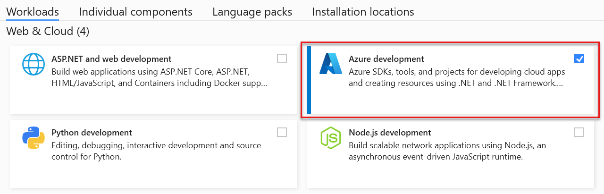
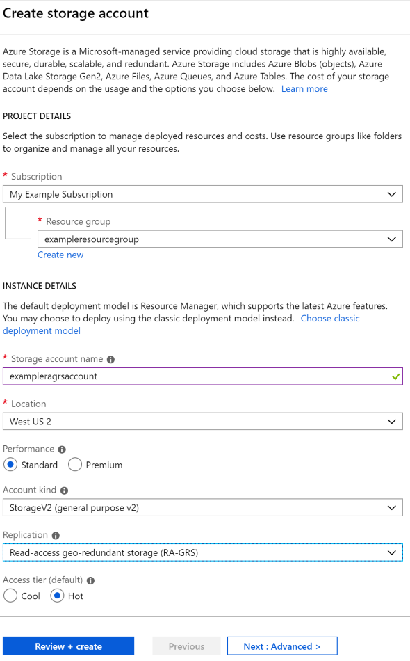
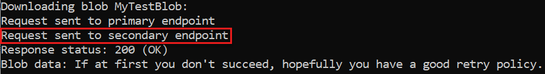

# Tutorial: Build a highly available application with Blob storage

This tutorial is part one of a series. In it, you learn how to make your application data highly available in Azure.

When you've completed this tutorial, you'll have a console application that uploads and retrieves a blob from a [read-access geo-zone-redundant](../common/storage-redundancy.md) (RA-GZRS) storage account.

Geo-redundancy in Azure Storage replicates transactions asynchronously from a primary region to a secondary region that is hundreds of miles away. This replication process guarantees that the data in the secondary region is eventually consistent. The console application uses the [circuit breaker](/azure/architecture/patterns/circuit-breaker) pattern to determine which endpoint to connect to, automatically switching between endpoints as failures and recoveries are simulated.

If you don't have an Azure subscription, [create a free account](https://azure.microsoft.com/free/) before you begin.

In part one of the series, you learn how to:

> [!div class="checklist"]
> - Create a storage account
> - Set the connection string
> - Run the console application

## Prerequisites

To complete this tutorial:

# [.NET](#tab/dotnet)

- Install [Visual Studio 2022](https://www.visualstudio.com/downloads/) with the **Azure development** workload.

  

# [JavaScript](#tab/nodejs)

We're currently working to create code snippets reflecting version 12.x of the Azure Storage client libraries. For more information, see [Announcing the Azure Storage v12 Client Libraries](https://techcommunity.microsoft.com/t5/azure-storage/announcing-the-azure-storage-v12-client-libraries/ba-p/1482394).

# [Python](#tab/python)

We're currently working to create code snippets reflecting version 12.x of the Azure Storage client libraries. For more information, see [Announcing the Azure Storage v12 Client Libraries](https://techcommunity.microsoft.com/t5/azure-storage/announcing-the-azure-storage-v12-client-libraries/ba-p/1482394).

---

## Sign in to the Azure portal

Sign in to the [Azure portal](https://portal.azure.com/).

## Create a storage account

A storage account provides a unique namespace to store and access your Azure Storage data objects.

Follow these steps to create a read-access geo-zone-redundant (RA-GZRS) storage account:

1. Select the **Create a resource** button in the Azure portal.
2. Select **Storage account - blob, file, table, queue** from the **New** page.
4. Fill out the storage account form with the following information, as shown in the following image and select **Create**:

   | Setting       | Sample value | Description |
   | ------------ | ------------------ | ------------------------------------------------- |
   | **Subscription** | *My subscription* | For details about your subscriptions, see [Subscriptions](https://portal.azure.com/#blade/Microsoft_Azure_Billing/SubscriptionsBlade). |
   | **ResourceGroup** | *myResourceGroup* | For valid resource group names, see [Naming rules and restrictions](/azure/architecture/best-practices/resource-naming). |
   | **Name** | *mystorageaccount* | A unique name for your storage account. |
   | **Location** | *East US* | Choose a location. |
   | **Performance** | *Standard* | Standard performance is a good option for the example scenario. |
   | **Account kind** | *StorageV2* | Using a general-purpose v2 storage account is recommended. For more information on types of Azure storage accounts, see [Storage account overview](../common/storage-account-overview.md). |
   | **Replication**| *Read-access geo-zone-redundant storage (RA-GZRS)* | The primary region is zone-redundant and is replicated to a secondary region, with read access to the secondary region enabled. |
   | **Access tier**| *Hot* | Use the hot tier for frequently accessed data. |

    

## Download the sample

# [.NET](#tab/dotnet)

Download the [sample project](https://github.com/Azure-Samples/storage-dotnet-circuit-breaker-pattern-ha-apps-using-ra-grs/archive/master.zip), extract (unzip) the storage-dotnet-circuit-breaker-pattern-ha-apps-using-ra-grs.zip file, then navigate to the v12 folder to find the project files.

You can also use [git](https://git-scm.com/) to clone the repository to your local development environment. The sample project in the v12 folder contains a console application.

```bash
git clone https://github.com/Azure-Samples/storage-dotnet-circuit-breaker-pattern-ha-apps-using-ra-grs.git
```

# [JavaScript](#tab/nodejs)

We're currently working to create code snippets reflecting version 12.x of the Azure Storage client libraries. For more information, see [Announcing the Azure Storage v12 Client Libraries](https://techcommunity.microsoft.com/t5/azure-storage/announcing-the-azure-storage-v12-client-libraries/ba-p/1482394).

# [Python](#tab/python)

We're currently working to create code snippets reflecting version 12.x of the Azure Storage client libraries. For more information, see [Announcing the Azure Storage v12 Client Libraries](https://techcommunity.microsoft.com/t5/azure-storage/announcing-the-azure-storage-v12-client-libraries/ba-p/1482394).

---

## Configure the sample

# [.NET](#tab/dotnet)

Application requests to Azure Blob storage must be authorized. Using the `DefaultAzureCredential` class provided by the `Azure.Identity` client library is the recommended approach for connecting to Azure services in your code. The .NET v12 code sample uses this approach. To learn more, please see the [DefaultAzureCredential overview](/dotnet/azure/sdk/authentication#defaultazurecredential).

You can also authorize requests to Azure Blob Storage by using the account access key. However, this approach should be used with caution to protect access keys from being exposed.

# [JavaScript](#tab/nodejs)

We're currently working to create code snippets reflecting version 12.x of the Azure Storage client libraries. For more information, see [Announcing the Azure Storage v12 Client Libraries](https://techcommunity.microsoft.com/t5/azure-storage/announcing-the-azure-storage-v12-client-libraries/ba-p/1482394).

# [Python](#tab/python)

We're currently working to create code snippets reflecting version 12.x of the Azure Storage client libraries. For more information, see [Announcing the Azure Storage v12 Client Libraries](https://techcommunity.microsoft.com/t5/azure-storage/announcing-the-azure-storage-v12-client-libraries/ba-p/1482394).

---

## Run the console application

# [.NET](#tab/dotnet)

In Visual Studio, press **F5** or select **Start** to begin debugging the application. Visual Studio automatically restores missing NuGet packages if package restore is configured. See [Installing and reinstalling packages with package restore](/nuget/consume-packages/package-restore#package-restore-overview) to learn more.

When the console window launches, the app will get the status of the secondary region and write that information to the console. Then the app will create a container in the storage account and upload a blob to the container. Once the blob is uploaded, the app will continuously check to see if the blob has replicated to the secondary region. This check continues until the blob is replicated, or we reach the maximum number of iterations as defined by the loop conditions.

Next, the application enters a loop with a prompt to download the blob, initially reading from primary storage. Press any key to download the blob. If there's a retryable error reading from the primary region, a retry of the read request is performed against the secondary region endpoint. The console output will show when the region switches to secondary.



To exit the loop and clean up resources, press the `Esc` key at the blob download prompt.

# [JavaScript](#tab/nodejs)

We're currently working to create code snippets reflecting version 12.x of the Azure Storage client libraries. For more information, see [Announcing the Azure Storage v12 Client Libraries](https://techcommunity.microsoft.com/t5/azure-storage/announcing-the-azure-storage-v12-client-libraries/ba-p/1482394).

# [Python](#tab/python)

We're currently working to create code snippets reflecting version 12.x of the Azure Storage client libraries. For more information, see [Announcing the Azure Storage v12 Client Libraries](https://techcommunity.microsoft.com/t5/azure-storage/announcing-the-azure-storage-v12-client-libraries/ba-p/1482394).

---

## Understand the sample code

# [.NET](#tab/dotnet)

The sample creates a `BlobServiceClient` object configured with retry options and a secondary region endpoint. This configuration allows the application to automatically switch to the secondary region if the request fails on the primary region endpoint.

```csharp
string accountName = "<YOURSTORAGEACCOUNTNAME>";
Uri primaryAccountUri = new Uri($"https://{accountName}.blob.core.windows.net/");
Uri secondaryAccountUri = new Uri($"https://{accountName}-secondary.blob.core.windows.net/");

// Provide the client configuration options for connecting to Azure Blob storage
BlobClientOptions blobClientOptions = new BlobClientOptions()
{
    Retry = {
        // The delay between retry attempts for a fixed approach or the delay
        // on which to base calculations for a backoff-based approach
        Delay = TimeSpan.FromSeconds(2),

        // The maximum number of retry attempts before giving up
        MaxRetries = 5,

        // The approach to use for calculating retry delays
        Mode = RetryMode.Exponential,

        // The maximum permissible delay between retry attempts
        MaxDelay = TimeSpan.FromSeconds(10)
    },

    // Secondary region endpoint
    GeoRedundantSecondaryUri = secondaryAccountUri
};

// Create a BlobServiceClient object using the configuration options above
BlobServiceClient blobServiceClient = new BlobServiceClient(primaryAccountUri, new DefaultAzureCredential(), blobClientOptions);
```

When the `GeoRedundantSecondaryUri` property is set in `BlobClientOptions`, retries for GET or HEAD requests will switch to use the secondary endpoint. Subsequent retries will alternate between the primary and secondary endpoint. However, if the status of the response from the secondary Uri is 404, then subsequent retries for the request will no longer use the secondary Uri, as this error code indicates the resource hasn't replicated to the secondary region.

# [JavaScript](#tab/nodejs)

We're currently working to create code snippets reflecting version 12.x of the Azure Storage client libraries. For more information, see [Announcing the Azure Storage v12 Client Libraries](https://techcommunity.microsoft.com/t5/azure-storage/announcing-the-azure-storage-v12-client-libraries/ba-p/1482394).

# [Python](#tab/python)

We're currently working to create code snippets reflecting version 12.x of the Azure Storage client libraries. For more information, see [Announcing the Azure Storage v12 Client Libraries](https://techcommunity.microsoft.com/t5/azure-storage/announcing-the-azure-storage-v12-client-libraries/ba-p/1482394).

---

## Next steps

In part one of the series, you learned about making an application highly available with RA-GZRS storage accounts.

Advance to part two of the series to learn how to simulate a failure and force your application to use the secondary RA-GZRS endpoint.

> [!div class="nextstepaction"]
> [Simulate a failure in reading from the primary region](simulate-primary-region-failure.md)

## Resources

For related code samples using deprecated SDKs, see the following resources:

- [.NET version 11.x](blob-v11-samples-dotnet.md#build-a-highly-available-app-with-blob-storage)
- [JavaScript version 11.x](blob-v11-samples-javascript.md#build-a-highly-available-app-with-blob-storage)
- [Python version 2.1](blob-v2-samples-python.md#build-a-highly-available-app-with-blob-storage)
