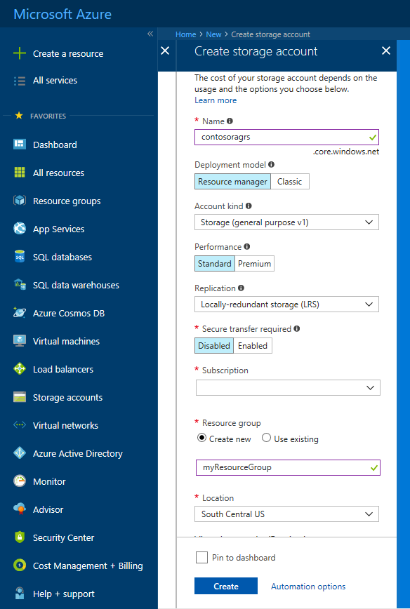
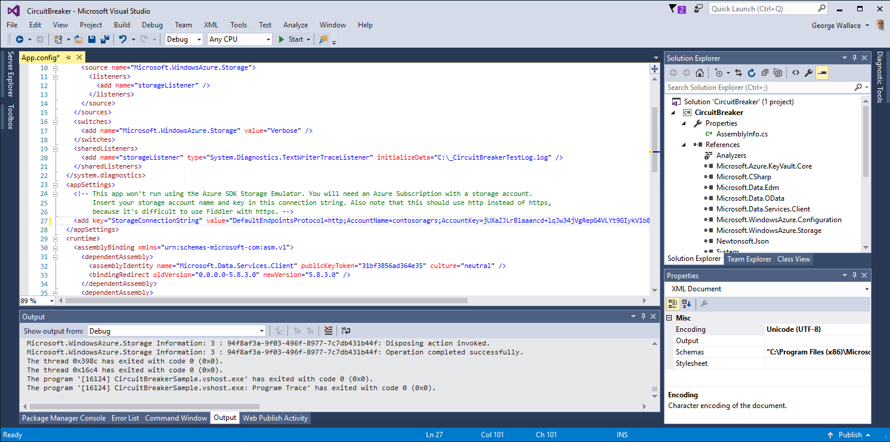

# Make your application data highly available with Azure storage

This tutorial is part one of a series. This tutorial shows you how to make your application data highly available in Azure. When you're finished, you have a .NET core console application that uploads and retrieves a blob to a [read-access geo-redundant](../common/storage-redundancy.md#read-access-geo-redundant-storage) (RA-GRS) storage account. RA-GRS works by replicating transactions from the primary to the secondary region. This replication process guarantees that the data in the secondary region is eventually consistent. The application uses the [Circuit Breaker](/azure/architecture/patterns/circuit-breaker.md) pattern to determine which endpoint to connect to. The application switches to secondary endpoint when a failure is simulated.

In part one of the series, you learn how to:

> [!div class="checklist"]
> * Create a storage account
> * Download the sample
> * Set the connection string
> * Run the console application

## Prerequisites

To complete this tutorial:

* Install [Visual Studio 2017](https://www.visualstudio.com/downloads/) with the following workloads:
  - **Azure development**

  

* Download and install [Fiddler](https://www.telerik.com/download/fiddler)

[!INCLUDE [quickstarts-free-trial-note](../../../includes/quickstarts-free-trial-note.md)]

## Log in to the Azure portal

Log in to the [Azure portal](https://portal.azure.com/).

## Create a storage account

A storage account provides a unique namespace to store and access your Azure storage data objects.

Follow these steps to create a read-access geo-redundant storage account:

1. Select the **New** button found on the upper left-hand corner of the Azure portal.

2. Select **Storage** from the **New** page, and select **Storage account - blob, file, table, queue** under **Featured**.
3. Fill out the storage account form with the following information, as shown in the following image and select **Create**:

   | Setting       | Suggested value | Description |
   | ------------ | ------------------ | ------------------------------------------------- |
   | **Name** | mystorageaccount | A unique value for your storage account |
   | **Deployment model** | Resource Manager  | Resource Manager contains the latest features.|
   | **Account kind** | General purpose | For details on the types of accounts, see [types of storage accounts](../common/storage-introduction.md#types-of-storage-accounts) |
   | **Performance** | Standard | Standard is sufficient for the example scenario. |
   | **Replication**| Read-access geo-redundant storage (RA-GRS) | This is necessary for the sample to work. |
   |**Secure transfer required** | Disabled| Secure transfer is not required for this scenario. |
   |**Subscription** | your subscription |For details about your subscriptions, see [Subscriptions](https://account.windowsazure.com/Subscriptions). |
   |**ResourceGroup** | myResourceGroup |For valid resource group names, see [Naming rules and restrictions](https://docs.microsoft.com/azure/architecture/best-practices/naming-conventions). |
   |**Location** | East US | Choose a location. |



## Download the sample

[Download the sample project](https://github.com/Azure-Samples/storage-dotnet-circuit-breaker-pattern-ha-apps-using-ra-grs/archive/master.zip).

Extract (unzip) the storage-dotnet-circuit-breaker-pattern-ha-apps-using-ra-grs.zip file.
The sample project contains a console application.

## Set the connection string

In the application, you must provide the connection string for your storage account. It is recommended to store this connection string within an environment variable on the local machine running the application. Follow one of the examples below depending on your Operating System to create the environment variable.

In the Azure portal, navigate to your storage account. Select **Access keys** under **Settings** in your storage account. Copy the **connection string** from the primary or secondary key. Replace \<yourconnectionstring\> with your actual connection string by running one of the following commands based on your Operating System. This command saves an environment variable to the local machine. In Windows, the environment variable is not available until to reload the **Command Prompt** or shell you are using. Replace **\<storageConnectionString\>** in the following sample:

### Linux

```bash
export storageconnectionstring=<yourconnectionstring>
```

### Windows

```cmd
setx storageconnectionstring "<yourconnectionstring>"
```



## Run the console application

In Visual Studio, press **F5** or select **Start** to start debugging the application. Visual studio automatically restores missing NuGet packages if configured, visit to [Installing and reinstalling packages with package restore](https://docs.microsoft.com/nuget/consume-packages/package-restore#package-restore-overview) to learn more.

A console window launches and the application begins running. The application uploads the **HelloWorld.png** image from the solution to the storage account. The application checks to ensure the image has replicated to the secondary RA-GRS endpoint. It then begins downloading the image up to 999 times. Each read is represented by a **P** or a **S**. Where **P** represents the primary endpoint and **S** represents the secondary endpoint.


In the sample code, the `RunCircuitBreakerAsync` task in the `Program.cs` file is used to download an image from the storage account using the [DownloadToFileAsync](/dotnet/api/microsoft.windowsazure.storage.blob.cloudblockblob.downloadtofileasync?view=azure-dotnet) method. Prior to the download an [OperationContext](/dotnet/api/microsoft.windowsazure.storage.operationcontext?view=azure-dotnet) is defined. The operation context defines event handlers, that fire when a download completes successfully or if a download fails and is retrying.

### Retry event handler

The `Operation_context_Retrying` event handler is called when the download of the image fails and is set to rety. If the maximum number of retries, which are defined in the application are reached, the [LocationMode](/dotnet/api/microsoft.windowsazure.storage.blob.blobrequestoptions.locationmode?view=azure-dotnet#Microsoft_WindowsAzure_Storage_Blob_BlobRequestOptions_LocationMode) of the request is changed to `SecondaryOnly`. This setting forces the application to attempt to download the image from the secondary endpoint. This configuration reduces the time taken to request the image as the primary endpoint is not retried indefinitely.

```csharp
private static void Operation_context_Retrying(object sender, RequestEventArgs e)
{
    retryCount++;
    Console.WriteLine("Retrying event because of failure reading the primary. RetryCount = " + retryCount);

    // Check if we have had more than n retries in which case switch to secondary.
    if (retryCount >= retryThreshold)
    {

        // Check to see if we can fail over to secondary.
        if (blobClient.DefaultRequestOptions.LocationMode != LocationMode.SecondaryOnly)
        {
            blobClient.DefaultRequestOptions.LocationMode = LocationMode.SecondaryOnly;
            retryCount = 0;
        }
        else
        {
            throw new ApplicationException("Both primary and secondary are unreachable. Check your application's network connection. ");
        }
    }
}
```

### Request completed event handler

The `Operation_context_RequestCompleted` event handler is called when the download of the image is successful. If the application is using the secondary endpoint, the application continues to use this endpoint up to 20 times. After 20 times, the application sets the [LocationMode](/dotnet/api/microsoft.windowsazure.storage.blob.blobrequestoptions.locationmode?view=azure-dotnet#Microsoft_WindowsAzure_Storage_Blob_BlobRequestOptions_LocationMode) back to `PrimaryThenSecondary` and retries the primary endpoint. If a request is successful, the application continues to read from the primary endpoint.

```csharp
private static void Operation_context_RequestCompleted(object sender, RequestEventArgs e)
{
    if (blobClient.DefaultRequestOptions.LocationMode == LocationMode.SecondaryOnly)
    {
        // You're reading the secondary. Let it read the secondary [secondaryThreshold] times, 
        //    then switch back to the primary and see if it's available now.
        secondaryReadCount++;
        if (secondaryReadCount >= secondaryThreshold)
        {
            blobClient.DefaultRequestOptions.LocationMode = LocationMode.PrimaryThenSecondary;
            secondaryReadCount = 0;
        }
    }
}
```

## Next steps

In part one of the series, you learned about making an application highly available with RA-GRS storage accounts, such as how to:

> [!div class="checklist"]
> * Create a storage account
> * Download the sample
> * Set the connection string
> * Run the console application

Advance to part two of the series to learn how to simulate a failure and force your application to use the secondary RA-GRS endpoint.

> [!div class="nextstepaction"]
> [Simulate a failure in connection to your primary storage endpoint](storage-simulate-failure-ragrs-account-app.md)
