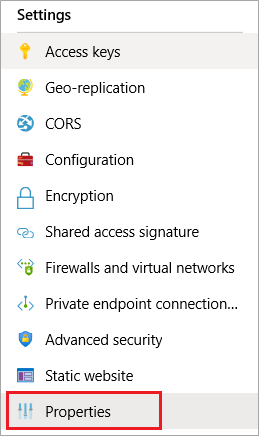

# Map a custom domain name to an Azure Blob Storage endpoint

CNAME stands for Canonical Name and it's used to alias one name to another.


<a id="endpoint" />

## Get the destination endpoint

You can map a custom domain to either the blob service or [static website](storage-blob-static-website-how-to?tabs=azure-portal.md) endpoint.

1. In the [Azure portal](https://portal.azure.com), go to your storage account.

2. In the menu pane, under **Settings**, select **Properties**.  

   

3. If you want to map a custom domain to your blob service endpoint, copy the **Primary Blob Service Endpoint** to a text file.

   If you want to map a custom domain to your static website endpoint, copy the **Primary static website endpoint** to a text file.

4. Remove the protocol identifier (*e.g.*, HTTPS) and the trailing slash in the URL. For example, a static website endpoint `https://mystorageaccount.z5.web.core.windows.net/` becomes `mystorageaccount.z5.web.core.windows.net`.

5. You'll need this string in the next section.

## Register a custom domain

When you register your custom domain with Azure, you first modify the DNS record for the domain. Then, in the Azure portal, you register the domain so that Azure can recognize the custom domain. 

> [!IMPORTANT]
> Your domain will be briefly unavailable to your users. If your custom domain currently supports an application that can't have any downtime, pre-register the domain with Azure. See the [Pre-register a custom domain](#pre-register) section of this article. 

First, create a CNAME record that maps your custom domain to your blob endpoint.  Then, in Portal, you'll register the domain with Azure.

1. Sign in to your domain registrar's website, and then go to the page for managing DNS setting.

   > [!TIP]
   > You might find the page in a section named **Domain Name**, **DNS**, or **Name Server Management**.

2. Find the section for managing CNAME records. 

   > [!TIP]
   > You might have to go to an advanced settings page and look for **CNAME**, **Alias**, or **Subdomains**.

3. Create a CNAME record. As part of that record, provide the following items: 

   - The subdomain alias such as **www** or **photos**. 
   
     The subdomain is required, root domains are not supported.
      
   - The endpoint that you obtained in the [Get the destination endpoint](#endpoint) section earlier in this article. 

4. In the [Azure portal](https://portal.azure.com), go to your storage account.

5. In the menu pane, under **Blob Service**, select **Custom domain**.  

   

   The **Custom domain** pane opens.

6. In the **Domain name** text box, enter the name of your custom domain, including the subdomain  
   
   For example, if your domain is *contoso.com* and your subdomain alias is *www*, enter **www\.contoso.com**. If your subdomain is *photos*, enter **photos.contoso.com**.

7. To register the custom domain, choose the **Save** button.

   After the CNAME record has propagated through the Domain Name Servers (DNS), and if your users have the appropriate permissions, they can view blob data by using the custom domain.

   Pre-register your custom domain with Azure

<a id="Pre-register" />

## Pre-register a custom domain

When you pre-register your custom domain with Azure, you permit Azure to recognize your custom domain without having to modify the DNS record for the domain. That way, when you do modify the DNS record for the domain, it will be mapped to the blob endpoint with no downtime.

## Test your custom domain

To confirm that your custom domain is mapped to your blob service endpoint, create a blob in a public container within your storage account. Then, in a web browser, access the blob by using a URI in the following format: `http://<subdomain.customdomain>/<mycontainer>/<myblob>`

For example, to access a web form in the *myforms* container in the *photos.contoso.com* custom subdomain, you might use the following URI: `http://photos.contoso.com/myforms/applicationform.htm`

## Deregister a custom domain

To deregister a custom domain for your Blob storage endpoint, use one of the following procedures.

### Azure portal

To remove the custom domain setting, do the following:

1. In the [Azure portal](https://portal.azure.com), go to your storage account.

1. In the menu pane, under **Blob Service**, select **Custom domain**.  
   The **Custom domain** pane opens.

1. Clear the contents of the text box that contains your custom domain name.

1. Select the **Save** button.

After the custom domain has been removed successfully, you will see a portal notification that your storage account was successfully updated.

### Azure CLI

To remove a custom domain registration, use the [az storage account update](https://docs.microsoft.com/cli/azure/storage/account) CLI command, and then specify an empty string (`""`) for the `--custom-domain` argument value.

* Command format:

  ```azurecli
  az storage account update \
      --name <storage-account-name> \
      --resource-group <resource-group-name> \
      --custom-domain ""
  ```

* Command example:

  ```azurecli
  az storage account update \
      --name mystorageaccount \
      --resource-group myresourcegroup \
      --custom-domain ""
  ```

### PowerShell

[!INCLUDE [updated-for-az](../../../includes/updated-for-az.md)]

To remove a custom domain registration, use the [Set-AzStorageAccount](/powershell/module/az.storage/set-azstorageaccount) PowerShell cmdlet, and then specify an empty string (`""`) for the `-CustomDomainName` argument value.

* Command format:

  ```powershell
  Set-AzStorageAccount `
      -ResourceGroupName "<resource-group-name>" `
      -AccountName "<storage-account-name>" `
      -CustomDomainName ""
  ```

* Command example:

  ```powershell
  Set-AzStorageAccount `
      -ResourceGroupName "myresourcegroup" `
      -AccountName "mystorageaccount" `
      -CustomDomainName ""
  ```

## Next steps
* [Map a custom domain to an Azure Content Delivery Network (CDN) endpoint](../../cdn/cdn-map-content-to-custom-domain.md)
* [Use Azure CDN to access blobs by using custom domains over HTTPS](storage-https-custom-domain-cdn.md)
* [Static website hosting in Azure Blob storage (preview)](storage-blob-static-website.md)
