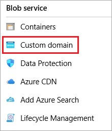

# Map a custom domain to an Azure Blob Storage endpoint

You can map a custom domain to a blob service endpoint or a [static website](storage-blob-static-website.md) endpoint. 

[!INCLUDE [updated-for-az](../../../includes/storage-data-lake-gen2-support.md)]

> [!NOTE] 
> This mapping works only for subdomains (for example: `www.contoso.com`). If you want your web endpoint to be available on the root domain (for example: `contoso.com`), then you'll have to use Azure CDN. For guidance, see the [Map a custom domain with HTTPS enabled](#enable-https) section of this article. Because your going to that section of this article to enable the root domain of your custom domain, the step within that section for enabling HTTPS is optional. 

<a id="enable-http"></a>

## Map a custom domain with only HTTP enabled

This approach is easier, but enables only HTTP access. If the storage account is configured to [require secure transfer](../common/storage-require-secure-transfer.md) over HTTPS, then you must enable HTTPS access for your custom domain. 

To enable HTTPS access, see the [Map a custom domain with HTTPS enabled](#enable-https) section of this article. 

<a id="map-a-domain"></a>

### Map a custom domain

> [!IMPORTANT]
> Your custom domain will be briefly unavailable to users while you complete the configuration. If your domain currently supports an application with a service-level agreement (SLA) that requires zero downtime, then follow the steps in the [Map a custom domain with zero downtime](#zero-down-time) section of this article to ensure that users can access your domain while the DNS mapping takes place.

If you are unconcerned that the domain is briefly unavailable to your users, follow these steps.

:heavy_check_mark: Step 1: Get the host name of your storage endpoint.

:heavy_check_mark: Step 2: Create a canonical name (CNAME) record with your domain provider.

:heavy_check_mark: Step 3: Register the custom domain with Azure. 

:heavy_check_mark: Step 4: Test your custom domain.

<a id="endpoint"></a>

#### Step 1: Get the host name of your storage endpoint 

The host name is the storage endpoint URL without the protocol identifier and the trailing slash. 

1. In the [Azure portal](https://portal.azure.com), go to your storage account.

2. In the menu pane, under **Settings**, select **Properties**.  

3. Copy the value of the **Primary Blob Service Endpoint** or the **Primary static website endpoint** to a text file. 

4. Remove the protocol identifier (*e.g.*, HTTPS) and the trailing slash from that string. The following table contains examples.

   | Type of endpoint |  endpoint | host name |
   |------------|-----------------|-------------------|
   |blob service  | `https://mystorageaccount.blob.core.windows.net/` | `mystorageaccount.blob.core.windows.net` |
   |static website  | `https://mystorageaccount.z5.web.core.windows.net/` | `mystorageaccount.z5.web.core.windows.net` |
  
   Set this value aside for later.

<a id="create-cname-record"></a>

#### Step 2: Create a canonical name (CNAME) record with your domain provider

Create a CNAME record to point to your host name. A CNAME record is a type of DNS record that maps a source domain name to a destination domain name.

1. Sign in to your domain registrar's website, and then go to the page for managing DNS setting.

   You might find the page in a section named **Domain Name**, **DNS**, or **Name Server Management**.

2. Find the section for managing CNAME records. 

   You might have to go to an advanced settings page and look for **CNAME**, **Alias**, or **Subdomains**.

3. Create a CNAME record. As part of that record, provide the following items: 

   - The subdomain alias such as `www` or `photos`. The subdomain is required, root domains are not supported. 
      
   - The host name that you obtained in the [Get the host name of your storage endpoint](#endpoint) section earlier in this article. 

<a id="register"></a>

#### Step 3: Register your custom domain with Azure

1. In the [Azure portal](https://portal.azure.com), go to your storage account.

2. In the menu pane, under **Blob Service**, select **Custom domain**.  

   

   The **Custom domain** pane opens.

3. In the **Domain name** text box, enter the name of your custom domain, including the subdomain  
   
   For example, if your domain is *contoso.com* and your subdomain alias is *www*, enter `www.contoso.com`. If your subdomain is *photos*, enter `photos.contoso.com`.

4. To register the custom domain, choose the **Save** button.

   After the CNAME record has propagated through the Domain Name Servers (DNS), and if your users have the appropriate permissions, they can view blob data by using the custom domain.

#### Step 4: Test your custom domain

To confirm that your custom domain is mapped to your blob service endpoint, create a blob in a public container within your storage account. Then, in a web browser, access the blob by using a URI in the following format: `http://<subdomain.customdomain>/<mycontainer>/<myblob>`

For example, to access a web form in the *myforms* container in the *photos.contoso.com* custom subdomain, you might use the following URI: `http://photos.contoso.com/myforms/applicationform.htm`

<a id="zero-down-time"></a>

### Map a custom domain with zero downtime

> [!NOTE]
> If you are unconcerned that the domain is briefly unavailable to your users, then consider following the steps in the [Map a custom domain](#map-a-domain) section of this article. It's a simpler approach with fewer steps.  

If your domain currently supports an application with a service-level agreement (SLA) that requires zero downtime, then follow these steps to ensure that users can access your domain while the DNS mapping takes place. 

:heavy_check_mark: Step 1: Get the host name of your storage endpoint.

:heavy_check_mark: Step 2: Create a intermediary canonical name (CNAME) record with your domain provider.

:heavy_check_mark: Step 3: Pre-register the custom domain with Azure.

:heavy_check_mark: Step 4: Create a CNAME record with your domain provider.

:heavy_check_mark: Step 5: Test your custom domain.

<a id="endpoint-2"></a>

#### Step 1: Get the host name of your storage endpoint 

The host name is the storage endpoint URL without the protocol identifier and the trailing slash. 

1. In the [Azure portal](https://portal.azure.com), go to your storage account.

2. In the menu pane, under **Settings**, select **Properties**.  

3. Copy the value of the **Primary Blob Service Endpoint** or the **Primary static website endpoint** to a text file. 

4. Remove the protocol identifier (*e.g.*, HTTPS) and the trailing slash from that string. The following table contains examples.

   | Type of endpoint |  endpoint | host name |
   |------------|-----------------|-------------------|
   |blob service  | `https://mystorageaccount.blob.core.windows.net/` | `mystorageaccount.blob.core.windows.net` |
   |static website  | `https://mystorageaccount.z5.web.core.windows.net/` | `mystorageaccount.z5.web.core.windows.net` |
  
   Set this value aside for later.

#### Step 2: Create a intermediary canonical name (CNAME) record with your domain provider

Create a temporary CNAME record to point to your host name. A CNAME record is a type of DNS record that maps a source domain name to a destination domain name.

1. Sign in to your domain registrar's website, and then go to the page for managing DNS setting.

   You might find the page in a section named **Domain Name**, **DNS**, or **Name Server Management**.

2. Find the section for managing CNAME records. 

   You might have to go to an advanced settings page and look for **CNAME**, **Alias**, or **Subdomains**.

3. Create a CNAME record. As part of that record, provide the following items: 

   - The subdomain alias such as `www` or `photos`. The subdomain is required, root domains are not supported.

     Add the `asverify` subdomain to the alias. For example: `asverify.www` or `asverify.photos`.
       
   - The host name that you obtained in the [Get the host name of your storage endpoint](#endpoint) section earlier in this article. 

     Add the subdomain `asverify` to the host name. For example: `asverify.mystorageaccount.blob.core.windows.net`.

4. To register the custom domain, choose the **Save** button.

   If the registration is successful, the portal notifies you that your storage account was successfully updated. Your custom domain has been verified by Azure, but traffic to your domain is not yet being routed to your storage account.

#### Step 3: Pre-register your custom domain with Azure

When you pre-register your custom domain with Azure, you permit Azure to recognize your custom domain without having to modify the DNS record for the domain. That way, when you do modify the DNS record for the domain, it will be mapped to the blob endpoint with no downtime.

1. In the [Azure portal](https://portal.azure.com), go to your storage account.

2. In the menu pane, under **Blob Service**, select **Custom domain**.  

   

   The **Custom domain** pane opens.

3. In the **Domain name** text box, enter the name of your custom domain, including the subdomain  
   
   For example, if your domain is *contoso.com* and your subdomain alias is *www*, enter `www.contoso.com`. If your subdomain is *photos*, enter `photos.contoso.com`.

4. Select the **Use indirect CNAME validation** check box.

5. To register the custom domain, choose the **Save** button.
  
   After the CNAME record has propagated through the Domain Name Servers (DNS), and if your users have the appropriate permissions, they can view blob data by using the custom domain.

#### Step 4: Create a CNAME record with your domain provider

Create a temporary CNAME record to point to your host name.

1. Sign in to your domain registrar's website, and then go to the page for managing DNS setting.

   You might find the page in a section named **Domain Name**, **DNS**, or **Name Server Management**.

2. Find the section for managing CNAME records. 

   You might have to go to an advanced settings page and look for **CNAME**, **Alias**, or **Subdomains**.

3. Create a CNAME record. As part of that record, provide the following items: 

   - The subdomain alias such as `www` or `photos`. The subdomain is required, root domains are not supported.
      
   - The host name that you obtained in the [Get the host name of your storage endpoint](#endpoint-2) section earlier in this article. 

#### Step 5: Test your custom domain

To confirm that your custom domain is mapped to your blob service endpoint, create a blob in a public container within your storage account. Then, in a web browser, access the blob by using a URI in the following format: `http://<subdomain.customdomain>/<mycontainer>/<myblob>`

For example, to access a web form in the *myforms* container in the *photos.contoso.com* custom subdomain, you might use the following URI: `http://photos.contoso.com/myforms/applicationform.htm`

### Remove a custom domain mapping

To remove a custom domain mapping, deregister the custom domain. Use one of the following procedures.

#### [Portal](#tab/azure-portal)

To remove the custom domain setting, do the following:

1. In the [Azure portal](https://portal.azure.com), go to your storage account.

2. In the menu pane, under **Blob Service**, select **Custom domain**.  
   The **Custom domain** pane opens.

3. Clear the contents of the text box that contains your custom domain name.

4. Select the **Save** button.

After the custom domain has been removed successfully, you will see a portal notification that your storage account was successfully updated

#### [Azure CLI](#tab/azure-cli)

To remove a custom domain registration, use the [az storage account update](https://docs.microsoft.com/cli/azure/storage/account) CLI command, and then specify an empty string (`""`) for the `--custom-domain` argument value.

* Command format:

  ```azurecli
  az storage account update \
      --name <storage-account-name> \
      --resource-group <resource-group-name> \
      --custom-domain ""
  ```

* Command example:

  ```azurecli
  az storage account update \
      --name mystorageaccount \
      --resource-group myresourcegroup \
      --custom-domain ""
  ```

#### [PowerShell](#tab/azure-powershell)

[!INCLUDE [updated-for-az](../../../includes/updated-for-az.md)]

To remove a custom domain registration, use the [Set-AzStorageAccount](/powershell/module/az.storage/set-azstorageaccount) PowerShell cmdlet, and then specify an empty string (`""`) for the `-CustomDomainName` argument value.

* Command format:

  ```powershell
  Set-AzStorageAccount `
      -ResourceGroupName "<resource-group-name>" `
      -AccountName "<storage-account-name>" `
      -CustomDomainName ""
  ```

* Command example:

  ```powershell
  Set-AzStorageAccount `
      -ResourceGroupName "myresourcegroup" `
      -AccountName "mystorageaccount" `
      -CustomDomainName ""
  ```
---

<a id="enable-https"></a>

## Map a custom domain with HTTPS enabled

This approach involves more steps, but it enables HTTPS access. 

If you don't need users to access your blob or web content by using HTTPS, then see the [Map a custom domain with only HTTP enabled](#enable-http) section of this article. 

To map a custom domain and enable HTTPS access, do the following:

1. Enable [Azure CDN](../../cdn/cdn-overview.md) on your blob or web endpoint. 

   For a Blob Storage endpoint, see [Integrate an Azure storage account with Azure CDN](../../cdn/cdn-create-a-storage-account-with-cdn.md). 

   For a static website endpoint, see [Integrate a static website with Azure CDN](static-website-content-delivery-network.md).

2. [Map Azure CDN content to a custom domain](../../cdn/cdn-map-content-to-custom-domain.md).

3. [Enable HTTPS on an Azure CDN custom domain](../../cdn/cdn-custom-ssl.md).

   > [!NOTE] 
   > When you update your static website, be sure to clear cached content on the CDN edge servers by purging the CDN endpoint. For more information, see [Purge an Azure CDN endpoint](../../cdn/cdn-purge-endpoint.md).

4. (Optional) Review the following guidance:

   * [Shared access signature (SAS) tokens with Azure CDN](https://docs.microsoft.com/azure/cdn/cdn-storage-custom-domain-https#shared-access-signatures).

   * [HTTP-to-HTTPS redirection with Azure CDN](https://docs.microsoft.com/azure/cdn/cdn-storage-custom-domain-https#http-to-https-redirection).

   * [Pricing and billing when using Blob Storage with Azure CDN](https://docs.microsoft.com/azure/cdn/cdn-storage-custom-domain-https#http-to-https-redirection).

## Next steps

* [Learn about static website hosting in Azure Blob storage](storage-blob-static-website.md)
