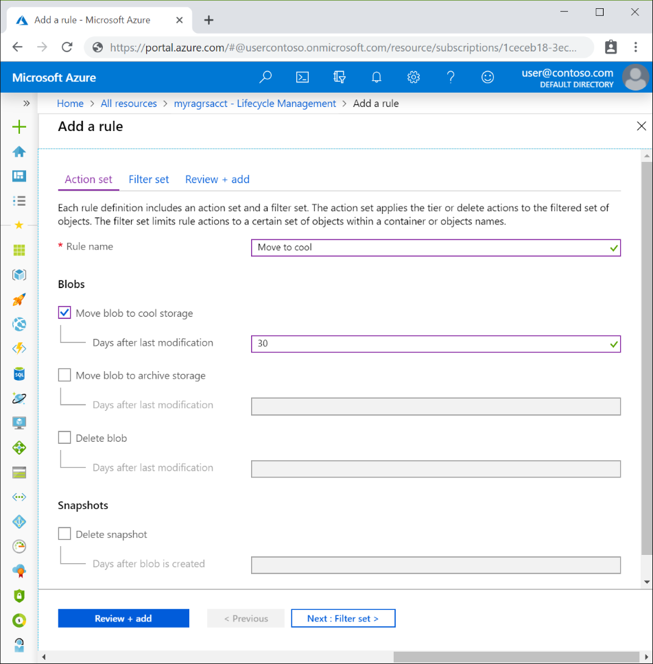
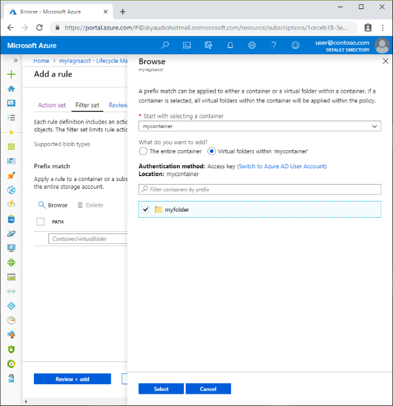

# Manage the Azure Blob storage lifecycle

Data sets have unique lifecycles. Early in the lifecycle, people access some data often. But the need for access drops drastically as the data ages. Some data stays idle in the cloud and is rarely accessed once stored. Some data expires days or months after creation, while other data sets are actively read and modified throughout their lifetimes. Azure Blob storage lifecycle management offers a rich, rule-based policy for GPv2 and Blob storage accounts. Use the policy to transition your data to the appropriate access tiers or expire at the end of the data's lifecycle.

The lifecycle management policy lets you:

- Transition blobs to a cooler storage tier (hot to cool, hot to archive, or cool to archive) to optimize for performance and cost
- Delete blobs at the end of their lifecycles
- Define rules to be run once per day at the storage account level
- Apply rules to containers or a subset of blobs (using prefixes as filters)

Consider a scenario where data gets frequent access during the early stages of the lifecycle, but only occasionally after two weeks. Beyond the first month, the data set is rarely accessed. In this scenario, hot storage is best during the early stages. Cool storage is most appropriate for occasional access. Archive storage is the best tier option after the data ages over a month. By adjusting storage tiers in respect to the age of data, you can design the least expensive storage options for your needs. To achieve this transition, lifecycle management policy rules are available to move aging data to cooler tiers.

[!INCLUDE [storage-multi-protocol-access-preview](../../../includes/storage-multi-protocol-access-preview.md)]

## Storage account support

The lifecycle management policy is available with General Purpose v2 (GPv2) accounts, Blob storage accounts, and Premium Block Blob storage accounts. In the Azure portal, you can upgrade an existing General Purpose (GPv1) account to a GPv2 account. For more information about storage accounts, see [Azure storage account overview](../common/storage-account-overview.md).  

## Pricing

The lifecycle management feature is free of charge. Customers are charged the regular operation cost for the [List Blobs](https://docs.microsoft.com/rest/api/storageservices/list-blobs) and [Set Blob Tier](https://docs.microsoft.com/rest/api/storageservices/set-blob-tier) API calls. Delete operation is free. For more information about pricing, see [Block Blob pricing](https://azure.microsoft.com/pricing/details/storage/blobs/).

## Regional availability

The lifecycle management feature is available in all Azure regions.

## Add or remove a policy

You can add, edit, or remove a policy by using any of the following methods:

* [Azure portal](https://portal.azure.com)
* [Azure PowerShell](https://github.com/Azure/azure-powershell/releases)
* [Azure CLI](https://docs.microsoft.com/cli/azure/install-azure-cli)
* [REST APIs](https://docs.microsoft.com/rest/api/storagerp/managementpolicies)

A policy can be read or written in full. Partial updates are not supported. 

> [!NOTE]
> If you enable firewall rules for your storage account, lifecycle management requests may be blocked. You can unblock these requests by providing exceptions for trusted Microsoft services. For more information, see the Exceptions section in [Configure firewalls and virtual networks](https://docs.microsoft.com/azure/storage/common/storage-network-security#exceptions).

This article shows how to manage policy by using the portal and PowerShell methods.  

# [Portal](#tab/azure-portal)

There are two ways to add a policy through the Azure portal. 

* [Azure portal List view](#azure-portal-list-view)
* [Azure portal Code view](#azure-portal-code-view)

#### Azure portal List view

1. Sign in to the [Azure portal](https://portal.azure.com).

2. In the Azure portal, search for and select your storage account. 

3. Under **Blob Service**, select **Lifecycle management** to view or change your rules.

4. Select the **List view** tab.

5. Select **Add rule** and then fill out the **Action set** form fields. In the following example, blobs are moved to cool storage if they haven't been modified for 30 days.

   

6. Select **Filter set** to add an optional filter. Then, select **Browse** to specify a container and folder by which to filter.

   

8. Select **Review + add** to review the policy settings.

9. Select **Add** to add the new policy.

#### Azure portal Code view
1. Sign in to the [Azure portal](https://portal.azure.com).

2. In the Azure portal, search for and select your storage account.

3. Under **Blob Service**, select **Lifecycle management** to view or change your policy.

4. The following JSON is an example of a policy that can be pasted into the **Code view** tab.

   ```json
   {
     "rules": [
       {
         "name": "ruleFoo",
         "enabled": true,
         "type": "Lifecycle",
         "definition": {
           "filters": {
             "blobTypes": [ "blockBlob" ],
             "prefixMatch": [ "container1/foo" ]
           },
           "actions": {
             "baseBlob": {
               "tierToCool": { "daysAfterModificationGreaterThan": 30 },
               "tierToArchive": { "daysAfterModificationGreaterThan": 90 },
               "delete": { "daysAfterModificationGreaterThan": 2555 }
             },
             "snapshot": {
               "delete": { "daysAfterCreationGreaterThan": 90 }
             }
           }
         }
       }
     ]
   }
   ```

5. Select **Save**.

6. For more information about this JSON example, see the [Policy](#policy) and [Rules](#rules) sections.

# [Powershell](#tab/azure-powershell)

The following PowerShell script can be used to add a policy to your storage account. The `$rgname` variable must be initialized with your resource group name. The `$accountName` variable must be initialized with your storage account name.

```powershell
#Install the latest module
Install-Module -Name Az -Repository PSGallery

#Initialize the following with your resource group and storage account names
$rgname = ""
$accountName = ""

#Create a new action object
$action = Add-AzStorageAccountManagementPolicyAction -BaseBlobAction Delete -daysAfterModificationGreaterThan 2555
$action = Add-AzStorageAccountManagementPolicyAction -InputObject $action -BaseBlobAction TierToArchive -daysAfterModificationGreaterThan 90
$action = Add-AzStorageAccountManagementPolicyAction -InputObject $action -BaseBlobAction TierToCool -daysAfterModificationGreaterThan 30
$action = Add-AzStorageAccountManagementPolicyAction -InputObject $action -SnapshotAction Delete -daysAfterCreationGreaterThan 90

# Create a new filter object
# PowerShell automatically sets BlobType as “blockblob” because it is the only available option currently
$filter = New-AzStorageAccountManagementPolicyFilter -PrefixMatch ab,cd

#Create a new rule object
#PowerShell automatically sets Type as “Lifecycle” because it is the only available option currently
$rule1 = New-AzStorageAccountManagementPolicyRule -Name Test -Action $action -Filter $filter

#Set the policy
$policy = Set-AzStorageAccountManagementPolicy -ResourceGroupName $rgname -StorageAccountName $accountName -Rule $rule1
```

# [Template](#tab/template)

You can define lifecycle management by using Azure Resource Manager templates. Here is a sample template to deploy a RA-GRS GPv2 storage account with a lifecycle management policy.

```json
{
  "$schema": "https://schema.management.azure.com/schemas/2015-01-01/deploymentTemplate.json#",
  "contentVersion": "1.0.0.0",
  "parameters": {},
  "variables": {
    "storageAccountName": "[uniqueString(resourceGroup().id)]"
  },
  "resources": [
    {
      "type": "Microsoft.Storage/storageAccounts",
      "name": "[variables('storageAccountName')]",
      "location": "[resourceGroup().location]",
      "apiVersion": "2019-04-01",
      "sku": {
        "name": "Standard_RAGRS"
      },
      "kind": "StorageV2",
      "properties": {
        "networkAcls": {}
      }
    },
    {
      "name": "[concat(variables('storageAccountName'), '/default')]",
      "type": "Microsoft.Storage/storageAccounts/managementPolicies",
      "apiVersion": "2019-04-01",
      "dependsOn": [
        "[variables('storageAccountName')]"
      ],
      "properties": {
        "policy": {...}
      }
    }
  ],
  "outputs": {}
}
```

---

## Policy

A lifecycle management policy is a collection of rules in a JSON document:

```json
{
  "rules": [
    {
      "name": "rule1",
      "enabled": true,
      "type": "Lifecycle",
      "definition": {...}
    },
    {
      "name": "rule2",
      "type": "Lifecycle",
      "definition": {...}
    }
  ]
}
```

A policy is a collection of rules:

| Parameter name | Parameter type | Notes |
|----------------|----------------|-------|
| `rules`        | An array of rule objects | At least one rule is required in a policy. You can define up to 100 rules in a policy.|

Each rule within the policy has several parameters:

| Parameter name | Parameter type | Notes | Required |
|----------------|----------------|-------|----------|
| `name`         | String |A rule name can include up to 256 alphanumeric characters. Rule name is case-sensitive.  It must be unique within a policy. | True |
| `enabled`      | Boolean | An optional boolean to allow a rule to be temporary disabled. Default value is true if it's not set. | False | 
| `type`         | An enum value | The current valid type is `Lifecycle`. | True |
| `definition`   | An object that defines the lifecycle rule | Each definition is made up of a filter set and an action set. | True |

## Rules

Each rule definition includes a filter set and an action set. The [filter set](#rule-filters) limits rule actions to a certain set of objects within a container or objects names. The [action set](#rule-actions) applies the tier or delete actions to the filtered set of objects.

### Sample rule

The following sample rule filters the account to run the actions on objects that exist inside `container1` and start with `foo`.  

>[!NOTE]
>Lifecycle management only supports block blob type.  

- Tier blob to cool tier 30 days after last modification
- Tier blob to archive tier 90 days after last modification
- Delete blob 2,555 days (seven years) after last modification
- Delete blob snapshots 90 days after snapshot creation

```json
{
  "rules": [
    {
      "name": "ruleFoo",
      "enabled": true,
      "type": "Lifecycle",
      "definition": {
        "filters": {
          "blobTypes": [ "blockBlob" ],
          "prefixMatch": [ "container1/foo" ]
        },
        "actions": {
          "baseBlob": {
            "tierToCool": { "daysAfterModificationGreaterThan": 30 },
            "tierToArchive": { "daysAfterModificationGreaterThan": 90 },
            "delete": { "daysAfterModificationGreaterThan": 2555 }
          },
          "snapshot": {
            "delete": { "daysAfterCreationGreaterThan": 90 }
          }
        }
      }
    }
  ]
}
```

### Rule filters

Filters limit rule actions to a subset of blobs within the storage account. If more than one filter is defined, a logical `AND` runs on all filters.

Filters include:

| Filter name | Filter type | Notes | Is Required |
|-------------|-------------|-------|-------------|
| blobTypes   | An array of predefined enum values. | The current release supports `blockBlob`. | Yes |
| prefixMatch | An array of strings for prefixes to be match. Each rule can define up to 10 prefixes. A prefix string must start with a container name. For example, if you want to match all blobs under `https://myaccount.blob.core.windows.net/container1/foo/...` for a rule, the prefixMatch is `container1/foo`. | If you don't define prefixMatch, the rule applies to all blobs within the storage account.  | No |

### Rule actions

Actions are applied to the filtered blobs when the run condition is met.

Lifecycle management supports tiering and deletion of blobs and deletion of blob snapshots. Define at least one action for each rule on blobs or blob snapshots.

| Action        | Base Blob                                   | Snapshot      |
|---------------|---------------------------------------------|---------------|
| tierToCool    | Support blobs currently at hot tier         | Not supported |
| tierToArchive | Support blobs currently at hot or cool tier | Not supported |
| delete        | Supported                                   | Supported     |

>[!NOTE]
>If you define more than one action on the same blob, lifecycle management applies the least expensive action to the blob. For example, action `delete` is cheaper than action `tierToArchive`. Action `tierToArchive` is cheaper than action `tierToCool`.

The run conditions are based on age. Base blobs use the last modified time to track age, and blob snapshots use the snapshot creation time to track age.

| Action run condition             | Condition value                          | Description                             |
|----------------------------------|------------------------------------------|-----------------------------------------|
| daysAfterModificationGreaterThan | Integer value indicating the age in days | The condition for base blob actions     |
| daysAfterCreationGreaterThan     | Integer value indicating the age in days | The condition for blob snapshot actions |

## Examples

The following examples demonstrate how to address common scenarios with lifecycle policy rules.

### Move aging data to a cooler tier

This example shows how to transition block blobs prefixed with `container1/foo` or `container2/bar`. The policy transitions blobs that haven't been modified in over 30 days to cool storage, and blobs not modified in 90 days to the archive tier:

```json
{
  "rules": [
    {
      "name": "agingRule",
      "enabled": true,
      "type": "Lifecycle",
      "definition": {
        "filters": {
          "blobTypes": [ "blockBlob" ],
          "prefixMatch": [ "container1/foo", "container2/bar" ]
        },
        "actions": {
          "baseBlob": {
            "tierToCool": { "daysAfterModificationGreaterThan": 30 },
            "tierToArchive": { "daysAfterModificationGreaterThan": 90 }
          }
        }
      }
    }
  ]
}
```

### Archive data at ingest

Some data stays idle in the cloud and is rarely, if ever, accessed once stored. The following lifecycle policy is configured to archive data once it's ingested. This example transitions block blobs in the storage account within container `archivecontainer` into an archive tier. The transition is accomplished by acting on blobs 0 days after last modified time:

> [!NOTE] 
> It is recommended to upload your blobs directly the archive tier to be more efficient. You can use the x-ms-acess-tier header for [PutBlob](https://docs.microsoft.com/rest/api/storageservices/put-blob) or [PutBlockList](https://docs.microsoft.com/rest/api/storageservices/put-block-list) with REST version 2018-11-09 and newer or our latest blob storage client libraries. 

```json
{
  "rules": [
    {
      "name": "archiveRule",
      "enabled": true,
      "type": "Lifecycle",
      "definition": {
        "filters": {
          "blobTypes": [ "blockBlob" ],
          "prefixMatch": [ "archivecontainer" ]
        },
        "actions": {
          "baseBlob": {
              "tierToArchive": { "daysAfterModificationGreaterThan": 0 }
          }
        }
      }
    }
  ]
}

```

### Expire data based on age

Some data is expected to expire days or months after creation. You can configure a lifecycle management policy to expire data by deletion based on data age. The following example shows a policy that deletes all block blobs older than 365 days.

```json
{
  "rules": [
    {
      "name": "expirationRule",
      "enabled": true,
      "type": "Lifecycle",
      "definition": {
        "filters": {
          "blobTypes": [ "blockBlob" ]
        },
        "actions": {
          "baseBlob": {
            "delete": { "daysAfterModificationGreaterThan": 365 }
          }
        }
      }
    }
  ]
}
```

### Delete old snapshots

For data that is modified and accessed regularly throughout its lifetime, snapshots are often used to track older versions of the data. You can create a policy that deletes old snapshots based on snapshot age. The snapshot age is determined by evaluating the snapshot creation time. This policy rule deletes block blob snapshots within container `activedata` that are 90 days or older after snapshot creation.

```json
{
  "rules": [
    {
      "name": "snapshotRule",
      "enabled": true,
      "type": "Lifecycle",
    "definition": {
        "filters": {
          "blobTypes": [ "blockBlob" ],
          "prefixMatch": [ "activedata" ]
        },
        "actions": {
          "snapshot": {
            "delete": { "daysAfterCreationGreaterThan": 90 }
          }
        }
      }
    }
  ]
}
```

## FAQ

**I created a new policy, why do the actions not run immediately?**  
The platform runs the lifecycle policy once a day. Once you configure a policy, it can take up to 24 hours for some actions to run for the first time.  

**If I update an existing policy, how long does it take for the actions to run?**  
The updated policy takes up to 24 hours to go into effect. Once the policy is in effect, it could take up to 24 hours for the actions to run. Therefore, the policy may take up to 48 hours to execute.   

**I manually rehydrated an archived blob, how do I prevent it from being moved back to the Archive tier temporarily?**  
When a blob is moved from one access tier to another, its last modification time doesn't change. If you manually rehydrate an archived blob to hot tier, it would be moved back to archive tier by the lifecycle management engine. Disable the rule that affects this blob temporarily to prevent it from being archived again. Re-enable the rule when the blob can be safely moved back to archive tier. You may also copy the blob to another location if it needs to stay in hot or cool tier permanently.

## Next steps

Learn how to recover data after accidental deletion:

- [Soft delete for Azure Storage blobs](../blobs/storage-blob-soft-delete.md)
