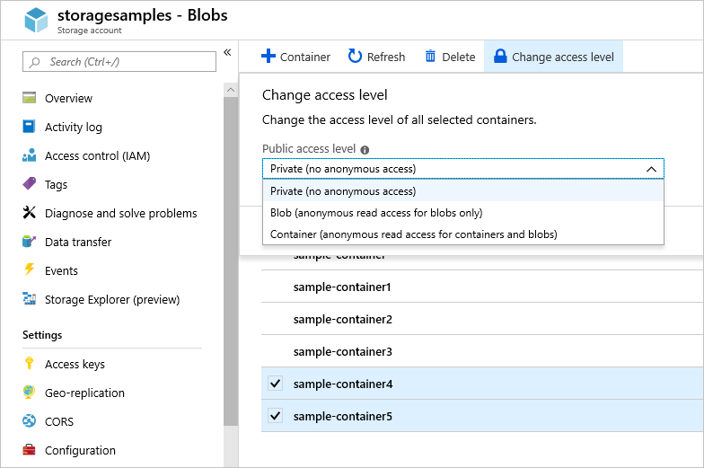

# Manage anonymous read access to containers and blobs

You can enable anonymous, public read access to a container and its blobs in Azure Blob storage. By doing so, you can grant read-only access to these resources without sharing your account key, and without requiring a shared access signature (SAS).

Public read access is best for scenarios where you want certain blobs to always be available for anonymous read access. For more fine-grained control, you can create a shared access signature. Shared access signatures enable you to provide restricted access using different permissions, for a specific time period. For more information about creating shared access signatures, see [Using shared access signatures (SAS) in Azure Storage](../common/storage-sas-overview.md?toc=%2fazure%2fstorage%2fblobs%2ftoc.json).

## Grant anonymous users permissions to containers and blobs

By default, a container and any blobs within it may be accessed only by a user that has been given appropriate permissions. To grant anonymous users read access to a container and its blobs, you can set the container public access level. When you grant public access to a container, then anonymous users can read blobs within a publicly accessible container without authorizing the request.

You can configure a container with the following permissions:

- **No public read access:** The container and its blobs can be accessed only by the storage account owner. This is the default for all new containers.
- **Public read access for blobs only:** Blobs within the container can be read by anonymous request, but container data is not available. Anonymous clients cannot enumerate the blobs within the container.
- **Public read access for container and its blobs:** All container and blob data can be read by anonymous request. Clients can enumerate blobs within the container by anonymous request, but cannot enumerate containers within the storage account.

### Set container public access level in the Azure portal

From the [Azure portal](https://portal.azure.com), you can update the public access level for one or more containers:

1. Navigate to your storage account overview in the Azure portal.
1. Under **Blob service** on the menu blade, select **Blobs**.
1. Select the containers for which you want to set the public access level.
1. Use the **Change access level** button to display the public access settings.
1. Select the desired public access level from the **Public access level** dropdown and click the OK button to apply the change to the selected containers.

The following screenshot shows how to change the public access level for the selected containers.



> [!NOTE]
> You cannot change the public access level for an individual blob. Public access level is set only at the container level.

### Set container public access level with .NET

# [\.NET v12 SDK](#tab/dotnet)

To set the permissions for a container, call the [BlobContainerClient.SetAccessPolicy](https://docs.microsoft.com/dotnet/api/azure.storage.blobs.blobcontainerclient.setaccesspolicy?view=azure-dotnet) method. 

The following example sets the container's permissions to full public read access. To set permissions to public read access for blobs only, pass the **PublicAccessType.Blob** field into the [BlobContainerClient.SetAccessPolicy](https://docs.microsoft.com/dotnet/api/azure.storage.blobs.blobcontainerclient.setaccesspolicy?view=azure-dotnet) method. To remove all permissions for anonymous users, use the **BlobContainerPublicAccessType.None** field.

:::code language="csharp" source="~/azure-storage-snippets/blobs/howto/dotnet/dotnet-v12/Security.cs" id="Snippet_SetPublicContainerPermissions":::

# [\.NET v11 SDK](#tab/dotnet11)

To set the permissions for a container using the Azure Storage client library for .NET, first retrieve the container's existing permissions by calling one of the following methods:

- [GetPermissions](/dotnet/api/microsoft.azure.storage.blob.cloudblobcontainer.getpermissions)
- [GetPermissionsAsync](/dotnet/api/microsoft.azure.storage.blob.cloudblobcontainer.getpermissionsasync)

Next, set the **PublicAccess** property on the [BlobContainerPermissions](/dotnet/api/microsoft.azure.storage.blob.blobcontainerpermissions) object that is returned by the **GetPermissions** method.

Finally, call one of the following methods to update the container's permissions:

- [SetPermissions](/dotnet/api/microsoft.azure.storage.blob.cloudblobcontainer.setpermissions)
- [SetPermissionsAsync](/dotnet/api/microsoft.azure.storage.blob.cloudblobcontainer.setpermissionsasync)

The following example sets the container's permissions to full public read access. To set permissions to public read access for blobs only, set the **PublicAccess** property to **BlobContainerPublicAccessType.Blob**. To remove all permissions for anonymous users, set the property to **BlobContainerPublicAccessType.Off**.

```csharp
private static async Task SetPublicContainerPermissions(CloudBlobContainer container)
{
    BlobContainerPermissions permissions = await container.GetPermissionsAsync();
    permissions.PublicAccess = BlobContainerPublicAccessType.Container;
    await container.SetPermissionsAsync(permissions);

    Console.WriteLine("Container {0} - permissions set to {1}", container.Name, permissions.PublicAccess);
}
```

---

## Access containers and blobs anonymously

A client that accesses containers and blobs anonymously can use constructors that do not require credentials. The following examples show a few different ways to reference containers and blobs anonymously.

### Create an anonymous client object

You can create a new service client object for anonymous access by providing the Blob storage endpoint for the account. However, you must also know the name of a container in that account that's available for anonymous access.

# [\.NET v12 SDK](#tab/dotnet)

:::code language="csharp" source="~/azure-storage-snippets/blobs/howto/dotnet/dotnet-v12/Security.cs" id="Snippet_CreateAnonymousBlobClient":::

# [\.NET v11 SDK](#tab/dotnet11)

```csharp
public static void CreateAnonymousBlobClient()
{
    // Create the client object using the Blob storage endpoint for your account.
    CloudBlobClient blobClient = new CloudBlobClient(
        new Uri(@"https://storagesamples.blob.core.windows.net"));

    // Get a reference to a container that's available for anonymous access.
    CloudBlobContainer container = blobClient.GetContainerReference("sample-container");

    // Read the container's properties. 
    // Note this is only possible when the container supports full public read access.
    container.FetchAttributes();
    Console.WriteLine(container.Properties.LastModified);
    Console.WriteLine(container.Properties.ETag);
}
``` 

---

### Reference a container anonymously

If you have the URL to a container that is anonymously available, you can use it to reference the container directly.

# [\.NET v12 SDK](#tab/dotnet)

:::code language="csharp" source="~/azure-storage-snippets/blobs/howto/dotnet/dotnet-v12/Security.cs" id="Snippet_ListBlobsAnonymously":::

# [\.NET v11 SDK](#tab/dotnet11)

```csharp
public static void ListBlobsAnonymously()
{
    // Get a reference to a container that's available for anonymous access.
    CloudBlobContainer container = new CloudBlobContainer(
        new Uri(@"https://storagesamples.blob.core.windows.net/sample-container"));

    // List blobs in the container.
    // Note this is only possible when the container supports full public read access.
    foreach (IListBlobItem blobItem in container.ListBlobs())
    {
        Console.WriteLine(blobItem.Uri);
    }
}
``` 

---

### Reference a blob anonymously

If you have the URL to a blob that is available for anonymous access, you can reference the blob directly using that URL:

# [\.NET v12 SDK](#tab/dotnet)

:::code language="csharp" source="~/azure-storage-snippets/blobs/howto/dotnet/dotnet-v12/Security.cs" id="Snippet_DownloadBlobAnonymously":::

# [\.NET v11 SDK](#tab/dotnet11)

```csharp
public static void DownloadBlobAnonymously()
{
    CloudBlockBlob blob = new CloudBlockBlob(
        new Uri(@"https://storagesamples.blob.core.windows.net/sample-container/logfile.txt"));
    blob.DownloadToFile(@"C:\Temp\logfile.txt", FileMode.Create);
}
``` 

---

## Next steps

- [Authorizing access to Azure Storage](../common/storage-auth.md)
- [Grant limited access to Azure Storage resources using shared access signatures (SAS)](../common/storage-sas-overview.md)
- [Blob Service REST API](/rest/api/storageservices/blob-service-rest-api)
