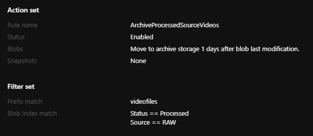

# Manage and find Azure Blob data with blob index tags

As datasets get larger, finding a specific object in a sea of data can be difficult. Blob index tags provide data management and discovery capabilities by using key-value index tag attributes. You can categorize and find objects within a single container or across all containers in your storage account. As data requirements change, objects can be dynamically categorized by updating their index tags. Objects can remain in-place with their current container organization.

Blob index tags let you:

- Dynamically categorize your blobs using key-value index tags

- Quickly find specific tagged blobs across an entire storage account

- Specify conditional behaviors for blob APIs based on the evaluation of index tags

- Use index tags for advanced controls on features like [blob lifecycle management](./lifecycle-management-overview.md)

Consider a scenario where you have millions of blobs in your storage account, accessed by many different applications. You want to find all related data from a single project. You aren't sure what's in scope as the data can be spread across multiple containers with different naming conventions. However, your applications upload all data with tags based on their project. Instead of searching through millions of blobs and comparing names and properties, you can use `Project = Contoso` as your discovery criteria. Blob index will filter all containers across your entire storage account to quickly find and return just the set of 50 blobs from `Project = Contoso`.

To get started with examples on how to use blob index, see [Use blob index tags to manage and find data](storage-blob-index-how-to.md).

## Blob index tags and data management

Container and blob name prefixes are one-dimensional categorizations. Blob index tags allow for multi-dimensional categorization for [blob data types (Block, Append, or Page)](/rest/api/storageservices/understanding-block-blobs--append-blobs--and-page-blobs). Multi-dimensional categorization is natively indexed by Azure Blob Storage so you can quickly find your data.

Consider the following five blobs in your storage account:

- *container1/transaction.csv*

- *container2/campaign.docx*

- *photos/bannerphoto.png*

- *archives/completed/2019review.pdf*

- *logs/2020/01/01/logfile.txt*

These blobs are separated using a prefix of *container/virtual folder/blob name*. You can set an index tag attribute of `Project = Contoso` on these five blobs to categorize them together while maintaining their current prefix organization. Adding index tags eliminates the need to move data by exposing the ability to filter and find data using the index.

## Setting blob index tags

Blob index tags are key-value attributes that can be applied to new or existing objects within your storage account. You can specify index tags during the upload process using [Put Blob](/rest/api/storageservices/put-blob), [Put Block List](/rest/api/storageservices/put-block-list), or [Copy Blob](/rest/api/storageservices/copy-blob) operations and the optional `x-ms-tags` header. If you already have blobs in your storage account, call [Set Blob Tags](/rest/api/storageservices/set-blob-tags) passing a formatted XML document with the index tags in the body of the request.

> [!IMPORTANT]
> Setting blob index tags can be performed by the [Storage Blob Data Owner](../../role-based-access-control/built-in-roles.md#storage-blob-data-owner) and by anyone with a Shared Access Signature that has permission to access the blob's tags (the `t` SAS permission).
>
> In addition, RBAC users with the `Microsoft.Storage/storageAccounts/blobServices/containers/blobs/tags/write` permission can perform this operation.

You can apply a single tag on your blob to describe when your data was finished processing.

> "processedDate" = '2020-01-01'

You can apply multiple tags on your blob to be more descriptive of the data.

> "Project" = 'Contoso'
> "Classified" = 'True'
> "Status" = 'Unprocessed'
> "Priority" = '01'

To modify the existing index tag attributes, retrieve the existing tag attributes, modify the tag attributes, and replace with the [Set Blob Tags](/rest/api/storageservices/set-blob-tags) operation. To remove all index tags from the blob, call the `Set Blob Tags` operation with no tag attributes specified. As blob index tags are a subresource to the blob data contents, `Set Blob Tags` doesn't modify any underlying content and doesn't change the blob's last-modified-time or eTag. You can create or modify index tags for all current base blobs. Index tags are also preserved for previous versions but they aren't passed to the blob index engine, so you cannot query index tags to retrieve previous versions. Tags on snapshots or soft-deleted blobs cannot be modified.

The following limits apply to blob index tags:

- Each blob can have up to 10 blob index tags

- Tag keys must be between one and 128 characters.

- Tag values must be between zero and 256 characters.

- Tag keys and values are case-sensitive.

- Tag keys and values only support string data types. Any numbers, dates, times, or special characters are saved as strings.

- If versioning is enabled, index tags are applied to a specific version of blob. If you set index tags on the current version, and a new version is created, then the tag won't be associated with the new version. The tag will be associated only with the previous version.

- Tag keys and values must adhere to the following naming rules:

  - Alphanumeric characters:

    - **a** through **z** (lowercase letters)

    - **A** through **Z** (uppercase letters)

    - **0** through **9** (numbers)

  - Valid special characters: space, plus, minus, period, colon, equals, underscore, forward slash (` +-.:=_/`)

## Getting and listing blob index tags

Blob index tags are stored as a subresource alongside the blob data and can be retrieved independently from the underlying blob data content. Blob index tags for a single blob can be retrieved with the [Get Blob Tags](/rest/api/storageservices/get-blob-tags) operation. The [List Blobs](/rest/api/storageservices/list-blobs) operation with the `include:tags` parameter will also return all blobs within a container along with their blob index tags.

> [!IMPORTANT]
> Getting and listing blob index tags can be performed by the [Storage Blob Data Owner](../../role-based-access-control/built-in-roles.md#storage-blob-data-owner) and by anyone with a Shared Access Signature that has permission to access the blob's tags (the `t` SAS permission).
>
> In addition, RBAC users with the `Microsoft.Storage/storageAccounts/blobServices/containers/blobs/tags/read` permission can perform this operation.

For any blobs with at least one blob index tag, the `x-ms-tag-count` is returned in the [List Blobs](/rest/api/storageservices/list-blobs), [Get Blob](/rest/api/storageservices/get-blob), and [Get Blob Properties](/rest/api/storageservices/get-blob-properties) operations indicating the count of index tags on the blob.

## Finding data using blob index tags

The indexing engine exposes your key-value attributes into a multi-dimensional index. After you set your index tags, they exist on the blob and can be retrieved immediately. 

It might take some time before the blob index updates. This is true for both adding tags and editing existing ones. The amount of time required depends on the workload. For example, if a [Set Blob Tags](/rest/api/storageservices/set-blob-tags) operation takes 30 minutes to complete at a rate of 15000 to 20000 transactions per second, then it can take up to 10 minutes to index all of those blobs. At a lower rate, the indexing delay can be under a second. The distribution of traffic also affects indexing delays. For example, if a client application sets tags on blobs in sequential order under the same container, the delay could be higher than it would be if tags are applied to blobs that aren't located together.

After the blob index updates, you can use the native query and discovery capabilities offered by Blob Storage.

The [Find Blobs by Tags](/rest/api/storageservices/find-blobs-by-tags) operation enables you to get a filtered set of blobs whose index tags match a given query expression. `Find Blobs by Tags` supports filtering across all containers within your storage account or you can scope the filtering to just a single container. Since all the index tag keys and values are strings, relational operators use a lexicographic sorting.

> [!IMPORTANT]
> Finding data using blob index tags can be performed by the [Storage Blob Data Owner](../../role-based-access-control/built-in-roles.md#storage-blob-data-owner) and by anyone with a Shared Access Signature that has permission to find blobs by tags (the `f` SAS permission).
>
> In addition, RBAC users with the `Microsoft.Storage/storageAccounts/blobServices/containers/blobs/filter/action` permission can perform this operation.

The following criteria applies to blob index filtering:

- Tag keys should be enclosed in double quotes (")

- Tag values and container names should be enclosed in single quotes (')

- The @ character is only allowed for filtering on a specific container name (for example, `@container = 'ContainerName'`)

- Filters are applied with lexicographic sorting on strings

- Same sided range operations on the same key are invalid (for example, `"Rank" > '10' AND "Rank" >= '15'`)

- When using REST to create a filter expression, characters should be URI encoded

- Tag queries are optimized for equality match using a single tag (e.g. StoreID = "100").  Range queries using a single tag involving >, >=, <, <= are also efficient. Any query using AND with more than one tag will not be as efficient.  For example, Cost > "01" AND Cost <= "100" is efficient. Cost > "01 AND StoreID = "2" is not as efficient.

The below table shows all the valid operators for `Find Blobs by Tags`:

|  Operator  |  Description  | Example |
|------------|---------------|---------|
|     =      |     Equal     | `"Status" = 'In Progress'` |
|     >      |  Greater than | `"Date" > '2018-06-18'` |
|     >=     |  Greater than or equal | `"Priority" >= '5'` |
|     <      |  Less than   | `"Age" < '32'` |
|     <=     |  Less than or equal  | `"Priority" <= '5'` |
|    AND     |  Logical and  | `"Rank" >= '010' AND "Rank" < '100'` |
| @container | Scope to a specific container | `@container = 'videofiles' AND "status" = 'done'` |

> [!NOTE]
> Be familiar with lexicographical ordering when setting and querying on tags.
>
> - Numbers are sorted before letters. Numbers are sorted based on the first digit.
> - Uppercase letters are sorted before lowercase letters.
> - Symbols aren't standard. Some symbols are sorted before numeric values. Other symbols are sorted before or after letters.

## Conditional blob operations with blob index tags

In REST versions 2019-10-10 and higher, most [blob service APIs](/rest/api/storageservices/operations-on-blobs) now support a conditional header, `x-ms-if-tags`, such that the operation will only succeed if the specified blob index condition is met. If the condition isn't met, you'll get `error 412: The condition specified using HTTP conditional header(s) is not met`.

The `x-ms-if-tags` header may be combined with the other existing HTTP conditional headers (If-Match, If-None-Match, and so on). If multiple conditional headers are provided in a request, they all must evaluate true for the operation to succeed. All conditional headers are effectively combined with logical AND.

The below table shows the valid operators for conditional operations:

|  Operator  |  Description  | Example |
|------------|---------------|---------|
|     =      |     Equal     | `"Status" = 'In Progress'` |
|     <>     |   Not equal   | `"Status" <> 'Done'` |
|     >      |  Greater than | `"Date" > '2018-06-18'` |
|     >=     |  Greater than or equal | `"Priority" >= '5'` |
|     <      |  Less than   | `"Age" < '32'` |
|     <=     |  Less than or equal  | `"Priority" <= '5'` |
|    AND     |  Logical and  | `"Rank" >= '010' AND "Rank" < '100'` |
|     OR     | Logical or   | `"Status" = 'Done' OR "Priority" >= '05'` |

> [!NOTE]
> There are two additional operators, not equal and logical or, that are allowed in the conditional `x-ms-if-tags` header for blob operations but do not exist in the `Find Blobs by Tags` operation.

## Platform integrations with blob index tags

Blob index tags not only help you categorize, manage, and search on your blob data, but also provide integration with other Blob Storage features, such as [lifecycle management](./lifecycle-management-overview.md).

### Lifecycle management

Using the `blobIndexMatch` as a rule filter in lifecycle management, you can move data to cooler tiers or delete data based on the index tags applied to your blobs. You can be more granular in your rules and only move or delete blobs if they match the specified tags criteria.

You can set a blob index match as a standalone filter set in a lifecycle rule to apply actions on tagged data. Or you can combine both a prefix and a blob index to match more specific data sets. Specifying multiple filters in a lifecycle rule applies a logical AND operation. The action will only apply if *all* filter criteria match.

The following sample lifecycle management rule applies to block blobs in a container called `videofiles`. The rule tiers blobs to archive storage only if the data matches the blob index tag criteria of `"Status" == 'Processed' AND "Source" == 'RAW'`.

# [Portal](#tab/azure-portal)



# [JSON](#tab/json)

```json
{
    "rules": [
        {
            "enabled": true,
            "name": "ArchiveProcessedSourceVideos",
            "type": "Lifecycle",
            "definition": {
                "actions": {
                    "baseBlob": {
                        "tierToArchive": {
                            "daysAfterModificationGreaterThan": 0
                        }
                    }
                },
                "filters": {
                    "blobIndexMatch": [
                        {
                            "name": "Status",
                            "op": "==",
                            "value": "Processed"
                        },
                        {
                            "name": "Source",
                            "op": "==",
                            "value": "RAW"
                        }
                    ],
                    "blobTypes": [
                        "blockBlob"
                    ],
                    "prefixMatch": [
                        "videofiles/"
                    ]
                }
            }
        }
    ]
}
```

---

## Permissions and authorization

You can authorize access to blob index tags using one of the following approaches:

- Using Azure role-based access control (Azure RBAC) to grant permissions to a Microsoft Entra security principal. Use Microsoft Entra ID for superior security and ease of use. For more information about using Microsoft Entra ID with blob operations, see [Authorize access to data in Azure Storage](../common/authorize-data-access.md).

- Using a shared access signature (SAS) to delegate access to blob index. For more information about shared access signatures, see [Grant limited access to Azure Storage resources using shared access signatures (SAS)](../common/storage-sas-overview.md).

- Using the account access keys to authorize operations with Shared Key. For more information, see [Authorize with Shared Key](/rest/api/storageservices/authorize-with-shared-key).

Blob index tags are a subresource to the blob data. A user with permissions or a SAS token to read or write blobs may not have access to the blob index tags.

### Role-based access control

Callers using an [Microsoft Entra identity](../common/authorize-data-access.md) may be granted the following permissions to operate on blob index tags.

| Blob index tag operations                                          | Azure RBAC action                                                             |
|--------------------------------------------------------------------|-------------------------------------------------------------------------------|
| [Set Blob Tags](/rest/api/storageservices/set-blob-tags)           | Microsoft.Storage/storageAccounts/blobServices/containers/blobs/tags/write    |
| [Get Blob Tags](/rest/api/storageservices/get-blob-tags)           | Microsoft.Storage/storageAccounts/blobServices/containers/blobs/tags/read     |
| [Find Blobs by Tags](/rest/api/storageservices/find-blobs-by-tags) | Microsoft.Storage/storageAccounts/blobServices/containers/blobs/filter/action |

Additional permissions, separate from the underlying blob data, are required for index tag operations. The [Storage Blob Data Owner](../../role-based-access-control/built-in-roles.md#storage-blob-data-owner) role is granted permissions for all three blob index tag operations. 

### SAS permissions

Callers using a [shared access signature (SAS)](../common/storage-sas-overview.md) may be granted scoped permissions to operate on blob index tags.

#### Service SAS for a blob

The following permissions may be granted in a service SAS for a blob to allow access to blob index tags. The blob read (`r`) and write (`w`) permissions alone aren't enough to allow reading or writing its index tags.

| Permission | URI symbol | Allowed operations                |
|------------|------------|-----------------------------------|
| Index tags |     t      | Get and set index tags for a blob |

#### Service SAS for a container

The following permissions may be granted in a service SAS for a container to allow filtering on blob tags. The blob list (`i`) permission isn't enough to allow filtering blobs by their index tags.

| Permission | URI symbol | Allowed operations         |
|------------|------------|----------------------------|
| Index tags |     f      | Find blobs with index tags |

#### Account SAS

The following permissions may be granted in an account SAS to allow access to blob index tags and filtering on blob tags. 

| Permission | URI symbol | Allowed operations                |
|------------|------------|-----------------------------------|
| Index tags |     t      | Get and set index tags for a blob |
| Index tags |     f      | Find blobs with index tags |

The blob read (`r`) and write (`w`) permissions alone aren't enough to allow reading or writing its index tags, and the list (`i`) permission isn't enough to allow filtering blobs by their index tags.

## Choosing between metadata and blob index tags

Both blob index tags and metadata provide the ability to store arbitrary user-defined key-value properties alongside a blob resource. Both can be retrieved and set directly, without returning or altering the contents of the blob. It's possible to use both metadata and index tags.

Only index tags are automatically indexed and made searchable by the native Blob Storage service. Metadata can't be natively indexed or searched. You must use a separate service such as [Azure Search](../../search/search-blob-ai-integration.md). Blob index tags have additional permissions for reading, filtering, and writing that are separate from the underlying blob data. Metadata uses the same permissions as the blob and is returned as HTTP headers by the [Get Blob](/rest/api/storageservices/get-blob) and [Get Blob Properties](/rest/api/storageservices/get-blob-properties) operations. Blob index tags are encrypted at rest using a [Microsoft-managed key](../common/storage-service-encryption.md). Metadata is encrypted at rest using the same encryption key specified for blob data.

The following table summarizes the differences between metadata and blob index tags:

|              |   Metadata   |   Blob index tags  |
|--------------|--------------|--------------------|
| **Limits**      | No numerical limit, 8 KB total, case insensitive | 10 tags per blob max, 768 bytes per tag, case sensitive |
| **Updates**    | Not allowed on archive tier, `Set Blob Metadata` replaces all existing metadata, `Set Blob Metadata` changes the blob's last-modified-time | Allowed for all access tiers, `Set Blob Tags` replaces all existing tags, `Set Blob Tags` doesn't change the blob's last-modified-time |
| **Storage**     | Stored with the blob data | Subresource of the blob data |
| **Indexing & Querying** | Must use a separate service such as Azure Search | Indexing and querying capabilities built into Blob Storage |
| **Encryption** | Encrypted at rest with the same encryption key used for blob data | Encrypted at rest with a Microsoft-managed encryption key |
| **Pricing** | Size of metadata is included in the storage costs for a blob | Fixed cost per index tag |
| **Header response** | Metadata returned as headers in `Get Blob` and `Get Blob Properties` | Tag count returned by `Get Blob` or `Get Blob Properties`, tags returned only by `Get Blob Tags` and `List Blobs` |
| **Permissions**  | Read or write permissions to blob data extends to metadata | Additional permissions are required to read, filter, or write index tags |
| **Naming** | Metadata names must adhere to the naming rules for C# identifiers | Blob index tags support a wider range of alphanumeric characters |

## Pricing

You're charged for the monthly average number of index tags within a storage account. There's no cost for the indexing engine. Requests to Set Blog Tags, Get Blob Tags, and Find Blob Tags are charged at the current respective transaction rates. Note that the number of list transactions consumed when doing a Find Blobs by Tag transaction is equal to the number of clauses in the request. For example, the query (StoreID = 100) is one list transaction.  The query (StoreID = 100 AND SKU = 10010) is two list transactions. See [Block Blob pricing to learn more](https://azure.microsoft.com/pricing/details/storage/blobs/).

<a id="regional-availability-and-storage-account-support"></a>

## Feature support

[!INCLUDE [Blob Storage feature support in Azure Storage accounts](../../../includes/azure-storage-feature-support.md)]

## Conditions and known issues

This section describes known issues and conditions.

- Only general-purpose v2 accounts and premium block blob accounts are supported. Premium page blob, legacy blob, and accounts with a hierarchical namespace enabled aren't supported. General-purpose v1 accounts won't be supported.

- Uploading page blobs with index tags doesn't persist the tags. Set the tags after uploading a page blob.

- If Blob storage versioning is enabled, you can still use index tags on the current version. Index tags are preserved for previous versions, but those tags aren't passed to the blob index engine, so you cannot use them to retrieve previous versions. If you promote a previous version to the current version, then the tags of that previous version become the tags of the current version. Because those tags are associated with the current version, they are passed to the blob index engine and you can query them.

- There is no API to determine if index tags are indexed.

- Lifecycle management only supports equality checks with blob index match.

- `Copy Blob` doesn't copy blob index tags from the source blob to the new destination blob. You can specify the tags you want applied to the destination blob during the copy operation.

## Frequently asked questions (FAQ)

See [Blob index tags FAQ](storage-blob-faq.yml#blob-index-tags).

## Next steps

For an example of how to use blob index, see [Use blob index to manage and find data](storage-blob-index-how-to.md).

Learn about [lifecycle management](./lifecycle-management-overview.md) and set a rule with blob index matching.
