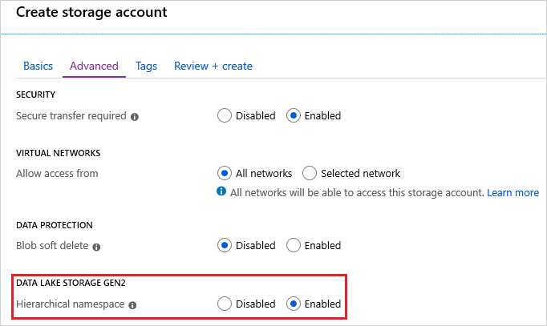

# How to use Blob storage from Python

Intro text here.

## Create a storage account

To create a storage account, see [Create a storage account](../common/storage-quickstart-create-account.md?toc=%2fazure%2fstorage%2fblobs%2ftoc.json).

Enable a hierarchical namespace if you want to use the code snippets in this article that perform operations on a hierarchical file system.



## Install Python and the Azure SDK for Python

See these resources:

* [Python](https://www.python.org/downloads/)

* [Azure Storage SDK for Python](https://github.com/Azure/azure-sdk-for-python)

## Add Python modules

Add these import statements to your code file.

```python
import os, uuid, sys
from azure.storage.blob import BlockBlobService, PublicAccess
```

### Modules featured in this snippet

> [!div class="checklist"]
> * [BlockBlobService](https://docs.microsoft.com/python/api/azure-storage-blob/azure.storage.blob.blockblobservice?view=azure-python) module
> * [PublicAccess](https://docs.microsoft.com/python/api/azure-storage-blob/azure.storage.blob.models.publicaccess?view=azure-python) module

[!INCLUDE [storage-copy-account-key-portal](../../../includes/storage-copy-account-key-portal.md)]

## Create a container and set permissions

Create an instance of the [BlockBlobService](https://docs.microsoft.com/python/api/azure-storage-blob/azure.storage.blob.blockblobservice.blockblobservice?view=azure-python) class by using the name of your storage account and the storage account key that you obtained the previous section.

Then, create a container and set the permissions on that container.

```python
def create_container(storage_account_name, storage_account_key):
    global block_blob_service
    block_blob_service = BlockBlobService(account_name=storage_account_name, account_key=storage_account_key)

    global container_name
    container_name = 'my-blob'
    block_blob_service.create_container(container_name)

    # Set the permission so the blobs are public.
    block_blob_service.set_container_acl(container_name, public_access=PublicAccess.Container)
```

### APIs featured in this snippet

> [!div class="checklist"]
> * [BlockBlobService](https://docs.microsoft.com/python/api/azure-storage-blob/azure.storage.blob.blockblobservice.blockblobservice?view=azure-python) class
> * [BaseBlobService.set_container_acl](https://docs.microsoft.com/python/api/azure-storage-blob/azure.storage.blob.baseblobservice.baseblobservice?view=azure-python#set-container-acl-container-name--signed-identifiers-none--public-access-none--lease-id-none--if-modified-since-none--if-unmodified-since-none--timeout-none-) method
> * [BaseBlobService.create_container](https://docs.microsoft.com/python/api/azure-storage-blob/azure.storage.blob.baseblobservice.baseblobservice?view=azure-python#create-container-container-name--metadata-none--public-access-none--fail-on-exist-false--timeout-none-) method

## Upload blobs to the container

Upload a file by calling the [create_blob_from_path]() method. Pass these items as parameters to the method:

* The name of the container.
* The fully qualified path of your file. This path includes the file name (For example: `C:\users\contoso\myfile.txt`).
* The name that you want to give to the file. You'll use that name to refer to the file in the storage account.

```python
def upload_blob(file_path, file_name):
    block_blob_service.create_blob_from_path(container_name, file_path, file_name)
```

### APIs featured in this snippet

> [!div class="checklist"]
> * [BlockBlobService](https://docs.microsoft.com/python/api/azure-storage-blob/azure.storage.blob.blockblobservice.blockblobservice?view=azure-python) class.
> * [BlockBlobService.create_blob_from_path](https://docs.microsoft.com/python/api/azure-storage-blob/azure.storage.blob.blockblobservice.blockblobservice?view=azure-python#create-blob-from-path-container-name--blob-name--file-path--content-settings-none--metadata-none--validate-content-false--progress-callback-none--max-connections-2--lease-id-none--if-modified-since-none--if-unmodified-since-none--if-match-none--if-none-match-none--timeout-none-) method

## List blobs in the container

Get a list of files in the container by calling the [list_blobs](https://docs.microsoft.com/python/api/azure-storage-blob/azure.storage.blob.baseblobservice.baseblobservice?view=azure-python#list-blobs-container-name--prefix-none--num-results-none--include-none--delimiter-none--marker-none--timeout-none-) method.

This method returns a generator object. You can iterate through the items in that object.

```python
def list_blobs():
    print("\nList blobs in the container")
    generator = block_blob_service.list_blobs(container_name)
    for blob in generator:
        print("\t Blob name: " + blob.name)
```

### APIs featured in this snippet

> [!div class="checklist"]
> * [BlockBlobService](https://docs.microsoft.com/python/api/azure-storage-blob/azure.storage.blob.blockblobservice.blockblobservice?view=azure-python) class
> * [BaseBlobService.list_blobs](https://docs.microsoft.com/python/api/azure-storage-blob/azure.storage.blob.baseblobservice.baseblobservice?view=azure-python#list-blobs-container-name--prefix-none--num-results-none--include-none--delimiter-none--marker-none--timeout-none-) method

## Download blobs from the container

Download blobs to your local disk calling the [get_blob_to_path]() method. Pass these items as parameters to the method:

* The name of the container.
* The name of the blob file.
* The fully qualified path to a location on your local machine. This path includes the file name that you'd like to give the downloaded file (For example: `C:\users\contoso\myfile-downloaded.txt`).

```python
def download_blob(file_name, file_destination_path):
    block_blob_service.get_blob_to_path(container_name, local_file_name, file_destination_path)
```

### APIs featured in this snippet

> [!div class="checklist"]
> * [BlockBlobService](https://docs.microsoft.com/python/api/azure-storage-blob/azure.storage.blob.blockblobservice.blockblobservice?view=azure-python) class
> * [BaseBlobService.get_blob_to_path](https://docs.microsoft.com/python/api/azure-storage-blob/azure.storage.blob.baseblobservice.baseblobservice?view=azure-python#get-blob-to-path-container-name--blob-name--file-path--open-mode--wb---snapshot-none--start-range-none--end-range-none--validate-content-false--progress-callback-none--max-connections-2--lease-id-none--if-modified-since-none--if-unmodified-since-none--if-match-none--if-none-match-none--timeout-none-) method

## Delete blobs from the container

Delete a blob by calling the [delete_blob](https://docs.microsoft.com/python/api/azure-storage-blob/azure.storage.blob.baseblobservice.baseblobservice?view=azure-python#delete-blob-container-name--blob-name--snapshot-none--lease-id-none--delete-snapshots-none--if-modified-since-none--if-unmodified-since-none--if-match-none--if-none-match-none--timeout-none-) method. Pass these items as parameters to the method:

* The name of the container.
* The name of the blob file.

```python
def delete_blob(file_name):
    block_blob_service.delete_blob(container_name, file_name)

```

### APIs featured in this snippet

> [!div class="checklist"]
> * [BlockBlobService](https://docs.microsoft.com/python/api/azure-storage-blob/azure.storage.blob.blockblobservice.blockblobservice?view=azure-python) class
> * [BaseBlobService.delete_blob](https://docs.microsoft.com/python/api/azure-storage-blob/azure.storage.blob.baseblobservice.baseblobservice?view=azure-python#delete-blob-container-name--blob-name--snapshot-none--lease-id-none--delete-snapshots-none--if-modified-since-none--if-unmodified-since-none--if-match-none--if-none-match-none--timeout-none-)

## Delete the container

Delete a container by calling the [delete_container](https://docs.microsoft.com/python/api/azure-storage-blob/azure.storage.blob.baseblobservice.baseblobservice?view=azure-python#delete-container-container-name--fail-not-exist-false--lease-id-none--if-modified-since-none--if-unmodified-since-none--timeout-none-) method.

```python
def delete_container():
    block_blob_service.delete_container(container_name)
```

### APIs featured in this snippet

> [!div class="checklist"]
> * [BlockBlobService](https://docs.microsoft.com/python/api/azure-storage-blob/azure.storage.blob.blockblobservice.blockblobservice?view=azure-python) class
> * [BaseBlobService.delete_container](https://docs.microsoft.com/python/api/azure-storage-blob/azure.storage.blob.baseblobservice.baseblobservice?view=azure-python#delete-container-container-name--fail-not-exist-false--lease-id-none--if-modified-since-none--if-unmodified-since-none--timeout-none-)

## Add directories to the container

This snippet applies only to accounts that have a hierarchical namespace.

```python

```

### APIs featured in this snippet

> [!div class="checklist"]
> * [Type]()
> * [Method]()

## Add files to directories in the container

This snippet applies only to accounts that have a hierarchical namespace.

```python

```

### APIs featured in this snippet

> [!div class="checklist"]
> * [Type]()
> * [Method]()

## Set Access Control Lists (ACL) permission on a directory

This snippet applies only to accounts that have a hierarchical namespace.

```python

```

### APIs featured in this snippet

> [!div class="checklist"]
> * [Type]()
> * [Method]()

## Set Access Control Lists (ACL) permission on a file in a directory

This snippet applies only to accounts that have a hierarchical namespace.

```python

```

### APIs featured in this snippet

> [!div class="checklist"]
> * [Type]()
> * [Method]()

## Something here for append data and flush methods (scenario TBD)

This snippet applies only to accounts that have a hierarchical namespace.

```python

```

### APIs featured in this snippet

> [!div class="checklist"]
> * [Type]()
> * [Method]()

## Next steps

Explore more APIs in the [blob package](https://docs.microsoft.com/python/api/azure-storage-blob/azure.storage.blob?view=azure-python) section of the [Azure Client SDK for Python](https://docs.microsoft.com/python/api/overview/azure/storage/client?view=azure-python) docs.
