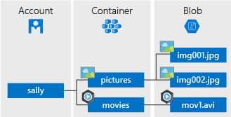

# Quickstart: Azure Blob storage client library v11 for .NET

Get started with the Azure Blob Storage client library v11 for .NET. Azure Blob Storage is Microsoft's object storage solution for the cloud. Follow steps to install the package and try out example code for basic tasks. Blob storage is optimized for storing massive amounts of unstructured data.

> [!NOTE]
> This quickstart uses a legacy version of the Azure Blob storage client library. To get started with the latest version, see [Quickstart: Azure Blob storage client library v12 for .NET](storage-quickstart-blobs-dotnet.md).

Use the Azure Blob Storage client library for .NET to:

* Create a container
* Set permissions on a container
* Create a blob in Azure Storage
* Download the blob to your local computer
* List all of the blobs in a container
* Delete a container

Additional resources:

* [API reference documentation](/dotnet/api/overview/azure/storage)
* [Library source code](https://github.com/Azure/azure-storage-net/tree/master/Blob)
* [Package (NuGet)](https://www.nuget.org/packages/Microsoft.Azure.Storage.Blob/)
* [Samples](https://azure.microsoft.com/resources/samples/?sort=0&service=storage&platform=dotnet&term=blob)

[!INCLUDE [storage-multi-protocol-access-preview](../../../includes/storage-multi-protocol-access-preview.md)]

## Prerequisites

* Azure subscription - [create one for free](https://azure.microsoft.com/free/)
* Azure Storage account - [create a storage account](../common/storage-account-create.md)
* Current [.NET Core SDK](https://dotnet.microsoft.com/download/dotnet-core) for your operating system. Be sure to get the SDK and not the runtime.

## Setting up

This section walks you through preparing a project to work with the Azure Blob Storage client library for .NET.

### Create the project

First, create a .NET Core application named *blob-quickstart*.

1. In a console window (such as cmd, PowerShell, or Bash), use the `dotnet new` command to create a new console app with the name *blob-quickstart*. This command creates a simple "Hello World" C# project with a single source file: *Program.cs*.

   ```console
   dotnet new console -n blob-quickstart
   ```

2. Switch to the newly created *blob-quickstart* folder and build the app to verify that all is well.

   ```console
   cd blob-quickstart
   ```

   ```console
   dotnet build
   ```

The expected output from the build should look something like this:

```output
C:\QuickStarts\blob-quickstart> dotnet build
Microsoft (R) Build Engine version 16.0.450+ga8dc7f1d34 for .NET Core
Copyright (C) Microsoft Corporation. All rights reserved.

  Restore completed in 44.31 ms for C:\QuickStarts\blob-quickstart\blob-quickstart.csproj.
  blob-quickstart -> C:\QuickStarts\blob-quickstart\bin\Debug\netcoreapp2.1\blob-quickstart.dll

Build succeeded.
    0 Warning(s)
    0 Error(s)

Time Elapsed 00:00:03.08
```

### Install the package

While still in the application directory, install the Azure Blob Storage client library for .NET package by using the `dotnet add package` command.

```console
dotnet add package Microsoft.Azure.Storage.Blob
```

### Set up the app framework

From the project directory:

1. Open the *Program.cs* file in your editor
2. Remove the `Console.WriteLine` statement
3. Add `using` directives
4. Create a `ProcessAsync` method where the main code for the example will reside
5. Asynchronously call the `ProcessAsync` method from `Main`

Here's the code:

```csharp
using System;
using System.IO;
using System.Threading.Tasks;
using Microsoft.Azure.Storage;
using Microsoft.Azure.Storage.Blob;

namespace blob_quickstart
{
    class Program
    {
        public static async Task Main()
        {
            Console.WriteLine("Azure Blob Storage - .NET quickstart sample\n");

            await ProcessAsync();

            Console.WriteLine("Press any key to exit the sample application.");
            Console.ReadLine();
        }

        private static async Task ProcessAsync()
        {
        }
    }
}
```

### Copy your credentials from the Azure portal

When the sample application makes a request to Azure Storage, it must be authorized. To authorize a request, add your storage account credentials to the application as a connection string. View your storage account credentials by following these steps:

1. Navigate to the [Azure portal](https://portal.azure.com).
2. Locate your storage account.
3. In the **Settings** section of the storage account overview, select **Access keys**. Here, you can view your account access keys and the complete connection string for each key.
4. Find the **Connection string** value under **key1**, and select the **Copy** button to copy the connection string. You will add the connection string value to an environment variable in the next step.

    

### Configure your storage connection string

After you have copied your connection string, write it to a new environment variable on the local machine running the application. To set the environment variable, open a console window, and follow the instructions for your operating system. Replace `<yourconnectionstring>` with your actual connection string.

#### Windows

```cmd
setx AZURE_STORAGE_CONNECTION_STRING "<yourconnectionstring>"
```

After you add the environment variable in Windows, you must start a new instance of the command window.

#### Linux

```bash
export AZURE_STORAGE_CONNECTION_STRING="<yourconnectionstring>"
```

#### MacOS

```bash
export AZURE_STORAGE_CONNECTION_STRING="<yourconnectionstring>"
```

After you add the environment variable, restart any running programs that will need to read the environment variable. For example, restart your development environment or editor before continuing.

## Object model

Azure Blob storage is optimized for storing massive amounts of unstructured data. Unstructured data is data that does not adhere to a particular data model or definition, such as text or binary data. Blob storage offers three types of resources:

* The storage account.
* A container in the storage account
* A blob in a container

The following diagram shows the relationship between these resources.



Use the following .NET classes to interact with these resources:

* [CloudStorageAccount](/dotnet/api/microsoft.azure.storage.cloudstorageaccount): The `CloudStorageAccount` class represents your Azure storage account. Use this class to authorize access to Blob storage using your account access keys.
* [CloudBlobClient](/dotnet/api/microsoft.azure.storage.blob.cloudblobclient): The `CloudBlobClient` class provides a point of access to the Blob service in your code.
* [CloudBlobContainer](/dotnet/api/microsoft.azure.storage.blob.cloudblobcontainer): The `CloudBlobContainer` class represents a blob container in your code.
* [CloudBlockBlob](/dotnet/api/microsoft.azure.storage.blob.cloudblockblob): The `CloudBlockBlob` object represents a block blob in your code. Block blobs are made up of blocks of data that can be managed individually.

## Code examples

These example code snippets show you how to perform the following with the Azure Blob storage client library for .NET:

   * [Authenticate the client](#authenticate-the-client)
   * [Create a container](#create-a-container)
   * [Set permissions on a container](#set-permissions-on-a-container)
   * [Upload blobs to a container](#upload-blobs-to-a-container)
   * [List the blobs in a container](#list-the-blobs-in-a-container)
   * [Download blobs](#download-blobs)
   * [Delete a container](#delete-a-container)

### Authenticate the client

The code below checks that the environment variable contains a connection string that can be parsed to create a [CloudStorageAccount](/dotnet/api/microsoft.azure.storage.cloudstorageaccount) object pointing to the storage account. To check that the connection string is valid, use the [TryParse](/dotnet/api/microsoft.azure.storage.cloudstorageaccount.tryparse) method. If `TryParse` is successful, it initializes the `storageAccount` variable and returns `true`.

Add this code inside the `ProcessAsync` method:

```csharp
// Retrieve the connection string for use with the application. The storage 
// connection string is stored in an environment variable on the machine 
// running the application called AZURE_STORAGE_CONNECTION_STRING. If the 
// environment variable is created after the application is launched in a 
// console or with Visual Studio, the shell or application needs to be closed
// and reloaded to take the environment variable into account.
string storageConnectionString = Environment.GetEnvironmentVariable("AZURE_STORAGE_CONNECTION_STRING");

// Check whether the connection string can be parsed.
CloudStorageAccount storageAccount;
if (CloudStorageAccount.TryParse(storageConnectionString, out storageAccount))
{
    // If the connection string is valid, proceed with operations against Blob
    // storage here.
    // ADD OTHER OPERATIONS HERE
}
else
{
    // Otherwise, let the user know that they need to define the environment variable.
    Console.WriteLine(
        "A connection string has not been defined in the system environment variables. " +
        "Add an environment variable named 'AZURE_STORAGE_CONNECTION_STRING' with your storage " +
        "connection string as a value.");
    Console.WriteLine("Press any key to exit the application.");
    Console.ReadLine();
}
```

> [!NOTE]
> To perform the rest of the operations in this article, replace `// ADD OTHER OPERATIONS HERE` in the code above with the code snippets in the following sections.

### Create a container

To create the container, first create an instance of the [CloudBlobClient](/dotnet/api/microsoft.azure.storage.blob.cloudblobclient) object, which points to Blob storage in your storage account. Next, create an instance of the [CloudBlobContainer](/dotnet/api/microsoft.azure.storage.blob.cloudblobcontainer) object, then create the container.

In this case, the code calls the [CreateAsync](/dotnet/api/microsoft.azure.storage.blob.cloudblobcontainer.createasync) method to create the container. A GUID value is appended to the container name to ensure that it is unique. In a production environment, it's often preferable to use the [CreateIfNotExistsAsync](/dotnet/api/microsoft.azure.storage.blob.cloudblobcontainer.createifnotexistsasync) method to create a container only if it does not already exist.

> [!IMPORTANT]
> Container names must be lowercase. For more information about naming containers and blobs, see [Naming and Referencing Containers, Blobs, and Metadata](/rest/api/storageservices/naming-and-referencing-containers--blobs--and-metadata).

```csharp
// Create the CloudBlobClient that represents the 
// Blob storage endpoint for the storage account.
CloudBlobClient cloudBlobClient = storageAccount.CreateCloudBlobClient();

// Create a container called 'quickstartblobs' and 
// append a GUID value to it to make the name unique.
CloudBlobContainer cloudBlobContainer = 
    cloudBlobClient.GetContainerReference("quickstartblobs" + 
        Guid.NewGuid().ToString());
await cloudBlobContainer.CreateAsync();
```

### Set permissions on a container

Set permissions on the container so that any blobs in the container are public. If a blob is public, it can be accessed anonymously by any client.

```csharp
// Set the permissions so the blobs are public.
BlobContainerPermissions permissions = new BlobContainerPermissions
{
    PublicAccess = BlobContainerPublicAccessType.Blob
};
await cloudBlobContainer.SetPermissionsAsync(permissions);
```

### Upload blobs to a container

The following code snippet gets a reference to a `CloudBlockBlob` object by calling the [GetBlockBlobReference](/dotnet/api/microsoft.azure.storage.blob.cloudblobcontainer.getblockblobreference) method on the container created in the previous section. It then uploads the selected local file to the blob by calling the [​Upload​From​FileAsync](/dotnet/api/microsoft.azure.storage.blob.cloudblockblob.uploadfromfileasync) method. This method creates the blob if it doesn't already exist, and overwrites it if it does.

```csharp
// Create a file in your local MyDocuments folder to upload to a blob.
string localPath = Environment.GetFolderPath(Environment.SpecialFolder.MyDocuments);
string localFileName = "QuickStart_" + Guid.NewGuid().ToString() + ".txt";
string sourceFile = Path.Combine(localPath, localFileName);
// Write text to the file.
File.WriteAllText(sourceFile, "Hello, World!");

Console.WriteLine("Temp file = {0}", sourceFile);
Console.WriteLine("Uploading to Blob storage as blob '{0}'", localFileName);

// Get a reference to the blob address, then upload the file to the blob.
// Use the value of localFileName for the blob name.
CloudBlockBlob cloudBlockBlob = cloudBlobContainer.GetBlockBlobReference(localFileName);
await cloudBlockBlob.UploadFromFileAsync(sourceFile);
```

### List the blobs in a container

List the blobs in the container by using the [​List​BlobsSegmentedAsync](/dotnet/api/microsoft.azure.storage.blob.cloudblobcontainer.listblobssegmentedasync) method. In this case, only one blob has been added to the container, so the listing operation returns just that one blob.

If there are too many blobs to return in one call (by default, more than 5000), then the `​List​BlobsSegmentedAsync` method returns a segment of the total result set and a continuation token. To retrieve the next segment of blobs, you provide in the continuation token returned by the previous call, and so on, until the continuation token is null. A null continuation token indicates that all of the blobs have been retrieved. The code shows how to use the continuation token for the sake of best practices.

```csharp
// List the blobs in the container.
Console.WriteLine("List blobs in container.");
BlobContinuationToken blobContinuationToken = null;
do
{
    var results = await cloudBlobContainer.ListBlobsSegmentedAsync(null, blobContinuationToken);
    // Get the value of the continuation token returned by the listing call.
    blobContinuationToken = results.ContinuationToken;
    foreach (IListBlobItem item in results.Results)
    {
        Console.WriteLine(item.Uri);
    }
} while (blobContinuationToken != null); // Loop while the continuation token is not null.

```

### Download blobs

Download the blob created previously to your local file system by using the [​Download​To​FileAsync](/dotnet/api/microsoft.azure.storage.blob.cloudblob.downloadtofileasync) method. The example code adds a suffix of "_DOWNLOADED" to the blob name so that you can see both files in local file system.

```csharp
// Download the blob to a local file, using the reference created earlier.
// Append the string "_DOWNLOADED" before the .txt extension so that you 
// can see both files in MyDocuments.
string destinationFile = sourceFile.Replace(".txt", "_DOWNLOADED.txt");
Console.WriteLine("Downloading blob to {0}", destinationFile);
await cloudBlockBlob.DownloadToFileAsync(destinationFile, FileMode.Create);
```

### Delete a container

The following code cleans up the resources the app created by deleting the entire container using [Cloud​Blob​Container.​DeleteAsync](/dotnet/api/microsoft.azure.storage.blob.cloudblobcontainer.deleteasync). You can also delete the local files if you like.

```csharp
Console.WriteLine("Press the 'Enter' key to delete the example files, " +
    "example container, and exit the application.");
Console.ReadLine();
// Clean up resources. This includes the container and the two temp files.
Console.WriteLine("Deleting the container");
if (cloudBlobContainer != null)
{
    await cloudBlobContainer.DeleteIfExistsAsync();
}
Console.WriteLine("Deleting the source, and downloaded files");
File.Delete(sourceFile);
File.Delete(destinationFile);
```

## Run the code

This app creates a test file in your local *MyDocuments* folder and uploads it to Blob storage. The example then lists the blobs in the container and downloads the file with a new name so that you can compare the old and new files.

Navigate to your application directory, then build and run the application.

```console
dotnet build
```

```console
dotnet run
```

The output of the app is similar to the following example:

```output
Azure Blob storage - .NET Quickstart example

Created container 'quickstartblobs33c90d2a-eabd-4236-958b-5cc5949e731f'

Temp file = C:\Users\myusername\Documents\QuickStart_c5e7f24f-a7f8-4926-a9da-96
97c748f4db.txt
Uploading to Blob storage as blob 'QuickStart_c5e7f24f-a7f8-4926-a9da-9697c748f
4db.txt'

Listing blobs in container.
https://storagesamples.blob.core.windows.net/quickstartblobs33c90d2a-eabd-4236-
958b-5cc5949e731f/QuickStart_c5e7f24f-a7f8-4926-a9da-9697c748f4db.txt

Downloading blob to C:\Users\myusername\Documents\QuickStart_c5e7f24f-a7f8-4926
-a9da-9697c748f4db_DOWNLOADED.txt

Press any key to delete the example files and example container.
```

When you press the **Enter** key, the application deletes the storage container and the files. Before you delete them, check your *MyDocuments* folder for the two files. You can open them and observe that they are identical. Copy the blob's URL from the console window and paste it into a browser to view the contents of the blob.

After you've verified the files, hit any key to finish the demo and delete the test files.

## Next steps

In this quickstart, you learned how to upload, download, and list blobs using .NET.

To learn how to create a web app that uploads an image to Blob storage, continue to:

> [!div class="nextstepaction"]
> [Upload and process an image](storage-upload-process-images.md)

* To learn more about .NET Core, see [Get started with .NET in 10 minutes](https://dotnet.microsoft.com/learn/dotnet/hello-world-tutorial/intro).
* To explore a sample application that you can deploy from Visual Studio for Windows, see the [.NET Photo Gallery Web Application Sample with Azure Blob Storage](https://azure.microsoft.com/resources/samples/storage-blobs-dotnet-webapp/).