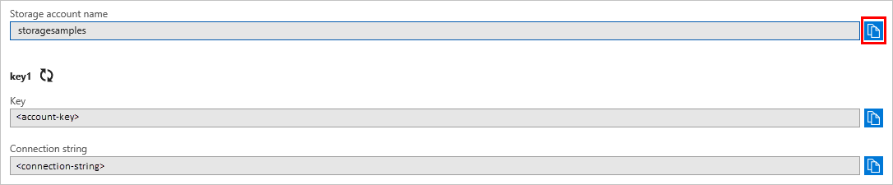

# Quickstart: Azure Blob storage client library version 12 for .NET

Get started with the Azure Blob Storage client library v12 for .NET. Azure Blob Storage is Microsoft's object storage solution for the cloud. Follow steps to install the package and try out example code for basic tasks. Blob storage is optimized for storing massive amounts of unstructured data.

Use the Azure Blob Storage client library v12 for .NET to:

* Create a container
* Set permissions on a container
* Create a blob in Azure Storage
* Download the blob to your local computer
* List all of the blobs in a container
* Delete a container

[API reference documentation](https://docs.microsoft.com/dotnet/api/overview/azure/storage?view=azure-dotnet) | [Library source code](https://github.com/Azure/azure-sdk-for-net/tree/master/sdk/storage/Azure.Storage.Blobs) | [Package (NuGet)](https://www.nuget.org/packages/Azure.Storage.Blobs/12) | [Samples](https://azure.microsoft.com/resources/samples/?sort=0&service=storage&platform=dotnet&term=blob)

## Prerequisites

* Azure subscription - [create one for free](https://azure.microsoft.com/free/)
* Azure Storage account - [create a storage account](https://docs.microsoft.com/azure/storage/common/storage-quickstart-create-account)
* Current [.NET Core SDK](https://dotnet.microsoft.com/download/dotnet-core) for your operating system. Be sure to get the SDK and not the runtime.

## Setting up

This section walks you through preparing a project to work with the Azure Blob Storage client library v12 for .NET.

### Create the project

First, create a .NET Core application named *blob-quickstart-v12*.

1. In a console window (such as cmd, PowerShell, or Bash), use the `dotnet new` command to create a new console app with the name *blob-quickstart-v12*. This command creates a simple "Hello World" C# project with a single source file: *Program.cs*.

   ```console
   dotnet new console -n blob-quickstart-v12
   ```

2. Switch to the newly created *blob-quickstart* folder and build the app to verify that all is well.

   ```console
   cd blob-quickstart-v12
   ```

   ```console
   dotnet build
   ```

The expected output from the build should look something like this:

```output
C:\QuickStarts\blob-quickstart-v12> dotnet build
Microsoft (R) Build Engine version 16.3.0+0f4c62fea for .NET Core
Copyright (C) Microsoft Corporation. All rights reserved.

  Restore completed in 42.22 ms for C:\Users\mhopkins\Code\blob-quickstart-v12\blob-quickstart-v12.csproj.
  blob-quickstart-v12 -> C:\Users\mhopkins\Code\blob-quickstart-v12\bin\Debug\netcoreapp3.0\blob-quickstart-v12.dll

Build succeeded.
    0 Warning(s)
    0 Error(s)

Time Elapsed 00:00:05.88
```

### Install the package

While still in the application directory, install the Azure Blob Storage client library for .NET package by using the `dotnet add package` command.

```console
dotnet add package Azure.Storage.Blobs --version 12.0.0-preview.4
```

### Set up the app framework

From the project directory:

1. Open the *Program.cs* file in your editor
2. Remove the `Console.WriteLine("Hello World!");` statement
3. Add `using` directives
4. Declare and initialize a member variable that contains the path to the local *Documents* directory
4. Create a `ProcessAsync` method where the main code for the example will reside
5. Asynchronously call the `ProcessAsync` method from `Main`

Here's the code:

```csharp
    using Azure.Storage;
    using Azure.Storage.Blobs;
    using Azure.Storage.Blobs.Models;
    using System;
    using System.IO;
    using System.Threading.Tasks;

namespace blob_quickstart_v12
{
    class Program
    {
        private static readonly string myDocumentsPath = 
            Environment.GetFolderPath(Environment.SpecialFolder.MyDocuments) + '\\';

        public static void Main()
        {
            Console.WriteLine("Azure Blob Storage v12 - .NET quickstart sample\n");

            // Run the examples asynchronously, wait for the results before proceeding
            ProcessAsync().GetAwaiter().GetResult();

            Console.WriteLine("Press any key to exit the sample application.");
            Console.ReadLine();
        }

        private static async Task ProcessAsync()
        {
        }
    }
}
```

### Copy your credentials from the Azure portal

When the sample application makes a request to Azure Storage, it must be authorized. To authorize a request, add your storage account name and access key to the application. View your storage account credentials by following these steps:

1. Navigate to the [Azure portal](https://portal.azure.com).
2. Select your storage account.
3. In the **Settings** section of the storage account overview, select **Access keys**. Here, you can view your storage account name and access keys.
4. Find the **Storage account name** and select the **Copy** button to copy the connection string. You will add the account name string value to an environment variable in the next step. Paste the string into a blank file in your text editor.

    

5. Find the **Key** value under **key1**, and select the **Copy** button to copy the connection string. You will add the connection string value to an environment variable in the next step. Paste the string into your text editor.

    

### Configure your storage account name and access key

After you have copied your credential strings, write them to new environment variables on the local machine running the application. To set the environment variable, open a console window, and follow the instructions for your operating system. Replace `<youraccountname>` with your actual **Storage account name** value that you copied into your text editor. Replace `<youraccesskey>` with your actual **Key** value, also from your text editor.

#### Windows

```cmd
setx ACCOUNT_NAME "<youraccountname>"
setx ACCESS_KEY "<youraccesskey>"
```

   After you add the environment variables in Windows, you must start a new instance of the command window.

#### Linux

```bash
export ACCOUNT_NAME "<youraccountname>"
export ACCESS_KEY "<youraccesskey>"
```

#### MacOS

```bash
export ACCOUNT_NAME "<youraccountname>"
export ACCESS_KEY "<youraccesskey>"
```

#### Restart programs

After you add the environment variables, restart any running programs that will need to read them. For example, restart your development environment or editor before continuing.

## Object model

Azure Blob storage is optimized for storing massive amounts of unstructured data. Unstructured data is data that does not adhere to a particular data model or definition, such as text or binary data. Blob storage offers three types of resources:

* The storage account
* A container in the storage account
* A blob in the container

The following diagram shows the relationship between these resources.


Use the following .NET classes to interact with these resources:

* [BlobContainerClient](/dotnet/api/azure.storage.blobs.blobcontainerclient): The `BlobContainerClient` class allows you to manipulate Azure Storage containers and their blobs.
* [BlobClient](/dotnet/api/azure.storage.blobs.blobclient): The `BlobClient` class allows you to manipulate Azure Storage blobs.
* [BlobDownloadInfo](/dotnet/api/azure.storage.blobs.models.blobdownloadinfo): The `BlobDownloadInfo` class represents the properties and content returned from downloading a blob.

## Code examples

These example code snippets show you how to perform the following with the Azure Blob storage client library for .NET:

   * [Authenticate the client](#authenticate-the-client)
   * [Create a container](#create-a-container)
   * [Set permissions on a container](#set-permissions-on-a-container)
   * [Upload blobs to a container](#upload-blobs-to-a-container)
   * [List the blobs in a container](#list-the-blobs-in-a-container)
   * [Download blobs](#download-blobs)
   * [Delete a container](#delete-a-container)

### Authenticate the client

The code below creates a `StorageSharedKeyCredential` object consisting of the account name and access key for the storage account. It retrieves the values of these strings from the environment variables created in the [Configure your storage account name and access key](#configure-your-storage-account-name-and-access-key) section.

Add this code inside the `ProcessAsync` method:

```csharp
// Retrieve the account name and access key for the storage account. These strings are stored
// in environment variables on the machine running the application. If the environment variables 
// are created after the application is launched in a console or with Visual Studio, the shell 
// needs to be closed and reloaded to pick up the new environment variables.
string accountName = Environment.GetEnvironmentVariable("ACCOUNT_NAME");
string accessKey = Environment.GetEnvironmentVariable("ACCESS_KEY");

// Create a new credential object consisting of the account name and access key
StorageSharedKeyCredential sharedKeyCredential = new StorageSharedKeyCredential(accountName, accessKey);
```

The `StorageSharedKeyCredential` is used in the call to create a new container.

### Create a container

To create a container, first instantiate a [Uri]() object containing the path to a new container you will create.

Next, create an instance of the [BlobContainerClient](/dotnet/api/azure.storage.blobs.blobcontainerclient) class, then create the container.

A GUID value is appended to the container name to ensure that it is unique. Call the [CreateIfNotExistsAsync](/dotnet/api/azure.storage.blobs.blobcontainerclient.createifnotexistsasync) method to create the container only if it does not already exist.

> [!IMPORTANT]
> Container names must be lowercase. For more information about naming containers and blobs, see [Naming and Referencing Containers, Blobs, and Metadata](https://docs.microsoft.com/rest/api/storageservices/naming-and-referencing-containers--blobs--and-metadata).

Add this code inside the `ProcessAsync` method:

```csharp
// Create a URI with a unique name for the container
string UriPath = "https://" + accountName + ".blob.core.windows.net/quickstartblobs" + Guid.NewGuid().ToString();
Uri containerUri = new Uri(UriPath);

// Create an object that represents the container
BlobContainerClient container = new BlobContainerClient(containerUri, sharedKeyCredential);

// Create the actual container if it doesn't already exist
await container.CreateIfNotExistsAsync();
```

### Set permissions on a container

Set permissions on the container so that any blobs in the container are public. If a blob is public, it can be accessed anonymously by any client.

```csharp
// Set permissions so blobs in the container are publicly readable
await container.SetAccessPolicyAsync(PublicAccessType.BlobContainer);
```

### Upload blobs to a container

The following code snippet gets a reference to a `BlobClient` object by calling the [GetBlobClient](/dotnet/api/azure.storage.blobs.blobcontainerclient.getblobclient) method on the container from the [Create a container](#create-a-container) section. It then uploads the selected local file to the blob by calling the [​Upload​Async](/dotnet/api/azure.storage.blobs.blobclient.uploadasync) method. This method creates the blob if it doesn't already exist, and overwrites it if it does.

Add this code inside the `ProcessAsync` method:

```csharp
// Path to the local documents folder
string myDocumentsPath = Environment.GetFolderPath(Environment.SpecialFolder.MyDocuments) + '\\';

// Create a file in your local myDocumentsPath folder to upload to a blob
string fileName = "QuickStart_" + Guid.NewGuid().ToString() + ".txt";
string filePath = myDocumentsPath + fileName;

// Write text to the file
await File.WriteAllTextAsync(filePath, "Hello, World!");

Console.WriteLine("Uploading to Blob storage as blob {0}\n", fileName);

// Get a reference to a blob
BlobClient blob = container.GetBlobClient(fileName);

// Open the file and upload its data
using (FileStream file = File.OpenRead(myDocumentsPath + fileName))
{
    await blob.UploadAsync(file);
}
```

### List the blobs in a container

List the blobs in the container by calling the [GetBlobsAsync](/dotnet/api/azure.storage.blobs.blobcontainerclient.getblobsasync) method. In this case, only one blob has been added to the container, so the listing operation returns just that one blob.

Add this code inside the `ProcessAsync` method:

```csharp
Console.WriteLine("Listing blobs...");

// List all blobs in the container
await foreach (BlobItem blobItem in container.GetBlobsAsync())
{
    Console.WriteLine("\t" + blobItem.Name);
}
```

### Download blobs

Download the blob created previously by calling the [​Download​Async](/dotnet/api/azure.storage.blobs.specialized.blobbaseclient.downloadasync) method. The example code adds a suffix of "_DOWNLOADED" to the file name so that you can see both files in local file system.

Add this code inside the `ProcessAsync` method:

```csharp
// Download the blob to a local file, using the reference created earlier. 
// Append the string "_DOWNLOADED" before the .txt extension so that you can see both files in MyDocuments.
string downloadedFile = fileName.Replace(".txt", "_DOWNLOADED.txt");

Console.WriteLine("Downloading blob to {0}\n", downloadedFile);

// Download the blob's contents and save it to a file
BlobDownloadInfo download = await blob.DownloadAsync();

using (FileStream file = File.OpenWrite(myDocumentsPath + downloadedFile))
{
    await download.Content.CopyToAsync(file);
}
```

### Delete a container

The following code cleans up the resources the app created by deleting the entire container using [​DeleteAsync](/dotnet/api/microsoft.azure.storage.blob.cloudblobcontainer.deleteasync). You can also delete the local files if you like.

The app pauses for user input by calling `Console.ReadLine` before it deletes the container, blob, and files. This is a good chance to verify that the resources were actually created correctly, before they are deleted.

Add this code inside the `ProcessAsync` method:

```csharp
Console.WriteLine("Press any key to begin clean up.");
Console.ReadLine();

// Clean up
Console.WriteLine("Deleting blob container\n");
await container.DeleteAsync();

Console.WriteLine("Deleting the local source and downloaded files\n");
File.Delete(myDocumentsPath + fileName);
File.Delete(myDocumentsPath + downloadedFile);
```

## Run the code

This app creates a test file in your local *MyDocuments* folder and uploads it to Blob storage. The example then lists the blobs in the container and downloads the file with a new name so that you can compare the old and new files.

Navigate to your application directory, then build and run the application.

```console
dotnet build
```

```console
dotnet run
```

The output of the example application is similar to the following example:

```output
Azure Blob Storage v12 - .NET quickstart sample

Uploading to Blob storage as blob QuickStart_3ef0ce98-affb-46e2-8156-d733be3df9aa.txt

Listing blobs...
        QuickStart_3ef0ce98-affb-46e2-8156-d733be3df9aa.txt
Downloading blob to QuickStart_3ef0ce98-affb-46e2-8156-d733be3df9aa_DOWNLOADED.txt

Press any key to begin clean up.

Deleting blob container

Deleting the local source and downloaded files
```

When you press the **Enter** key, the application deletes the storage container and the files. Before you delete them, check your *MyDocuments* folder for the two files. You can open them and observe that they are identical. Copy the blob's URL from the console window and paste it into a browser to view the contents of the blob.

After you've verified the files, hit any key to finish the demo and delete the test files.

## Next steps

In this quickstart, you learned how to upload, download, and list blobs using .NET.

To learn how to create a web app that uploads an image to Blob storage, continue to:

> [!div class="nextstepaction"]
> [Upload and process an image](storage-upload-process-images.md)

* To learn more about .NET Core, see [Get started with .NET in 10 minutes](https://www.microsoft.com/net/learn/get-started/).
* To explore a sample application that you can deploy from Visual Studio for Windows, see the [.NET Photo Gallery Web Application Sample with Azure Blob Storage](https://azure.microsoft.com/resources/samples/storage-blobs-dotnet-webapp/).
