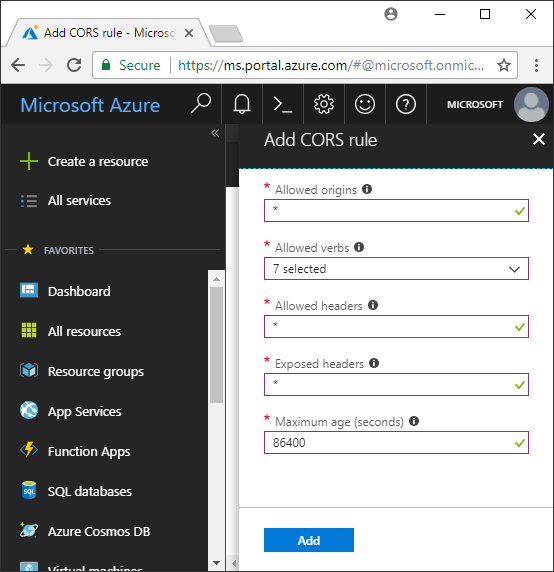

<!-- Customer intent: As a web application developer I want to interface with Azure Blob storage entirely on the client so that I can build a SPA application that is able to upload and delete files on blob storage. -->

# Quickstart: Upload, list, and delete blobs using JavaScript/HTML in the Browser
This quickstart demonstrates how to manage blobs from code running entirely in the browser. The approach used here shows how to use required security measures to ensure protected access to your blob storage account. To complete this quickstart, you need an [Azure subscription](https://azure.microsoft.com/free/?WT.mc_id=A261C142F).

[!INCLUDE [storage-create-account-portal-include](../../../includes/storage-create-account-portal-include.md)]

## Setting up storage account CORS rules 
Before your web application can access a blob storage from the client, the account must be configured to enable [cross-origin resource sharing](https://docs.microsoft.com/rest/api/storageservices/cross-origin-resource-sharing--cors--support-for-the-azure-storage-services), or CORS. 

Return to the Azure portal and select your storage account. To define a new CORS rule, return to the **Settings** section and click on the **CORS** link. Next, click the **Add** button to open the **Add CORS rule** window. For this quickstart, you create an open CORS rule:



The following table describes each CORS setting and explains the values used to define the rule.

|Setting  |Value  | Description |
|---------|---------|---------|
| Allowed origins | * | Accepts a comma-delimited list of domains set as acceptable origins. Setting the value to `*` allows all domains access to the storage account. |
| Allowed verbs     | delete, get, head, merge, post, options, and put | Lists the HTTP verbs allowed to execute against the storage account. For the purposes of this quickstart, select all available options. |
| Allowed headers | * | Defines a list of request headers (including prefixed headers) allowed by the storage account. Setting the value to `*` allows all headers access. |
| Exposed headers | * | Lists the allowed response headers by the account. Setting the value to `*` allows the account to send any header.  |
| Maximum age (seconds) | 86400 | The maximum amount of time the browser caches the preflight OPTIONS request. A value of *86400* allows the cache to remain for a full day. |

> [!IMPORTANT]
> Ensure any settings you use in production expose the minimum amount of access necessary to your storage account in order to maintain secure access. The CORS settings described here are appropriate for a quickstart as it defines a lenient security policy. These settings, however, are not recommended for a real-world context.

Next, you use the Azure cloud shell to create a security token.

[!INCLUDE [Open the Azure cloud shell](../../../includes/cloud-shell-try-it.md)]

## Create a Shared Access Signature
The shared access signature (SAS) is used by the code running in the browser to authorize requests to Blob storage. By using the SAS, the client can authorize access to storage resources without the account access key or connection string. For more information on SAS, see [Using shared access signatures (SAS)](../common/storage-dotnet-shared-access-signature-part-1.md).

You can create a SAS using the Azure CLI through the Azure cloud shell or with the Azure Storage Explorer. The following table describes the parameters you need to provide values for in order to generate a SAS with the CLI.

| Parameter      |Description  | Placeholder |
|----------------|-------------|-------------|
| *expiry*       | The expiration date of the access token in YYYY-MM-DD format. Enter tomorrow's date for use with this quickstart. | *FUTURE_DATE* |
| *account-name* | The storage account name. Use the name set aside in an earlier step. | *YOUR_STORAGE_ACCOUNT_NAME* |
| *account-key*  | The storage account key. Use the key set aside in an earlier step. | *YOUR_STORAGE_ACCOUNT_KEY* |

The following script used the Azure CLI to create a SAS that you can pass to a JavaScript blob service.

> [!NOTE]
> For best results remove the extra spaces between parameters before pasting the command into the Azure cloud shell.

```bash
az storage account generate-sas
                    --permissions racwdl
                    --resource-types sco
                    --services b
                    --expiry FUTURE_DATE
                    --account-name YOUR_STORAGE_ACCOUNT_NAME
                    --account-key YOUR_STORAGE_ACCOUNT_KEY
```
You may find the series of values after each parameter a bit cryptic. These parameter values are taken from the first letter of their respective permission. The following table explains where the values come from: 

| Parameter        | Value   | Description  |
|------------------|---------|---------|
| *permissions*    | racwdl  | This SAS allows *read*, *append*, *create*, *write*, *delete*, and *list* capabilities. |
| *resource-types* | sco     | The resources affected by the SAS are *service*, *container*, and *object*. |
| *services*       | b       | The service affected by the SAS is the *blob* service. |

Now that the SAS is generated, copy the value returned in the console into your text editor. You use this value in an upcoming step.

> [!IMPORTANT]
> In production, always pass SAS tokens using SSL. Also, SAS tokens should be generated on the server and sent to the HTML page in order pass back to Azure Blob Storage. One approach you may consider is to use a serverless function to generate SAS tokens. The Azure Portal includes function templates that feature the ability to generate a SAS with a JavaScript function.

## Implement the HTML page

### Set up the web application
The Azure Storage JavaScript client libraries will not work directly from the file system and must be served from a web server. Therefore, the following steps detail how to use a simple local web server with Node.js.

> [!NOTE]
> This section shows you how to create a local web server which requires Node.js being installed on your machine. If you do not wish to install Node.js then you can use any other means of running a local web server.

First, create a new folder for your project and name it *azure-blobs-javascript*. Next, open a command prompt in the *azure-blobs-javascript* folder and prepare the application to install the web server module by entering the following command:

```bash
npm init -y
```
Running *init* adds files needed to help install a web server module. To install the module, enter the following command:

```bash
npm i http-server
```
Next, edit the *package.json* file and replace the existing *scripts* definition with the following code snippet:

```javascript
"scripts": {
    "start": "http-server"
}
```
Finally, in your command prompt, enter `npm start` to start the web server:

```bash
npm start
```

### Get the blob storage client library
[Download the JavaScript client libraries](https://aka.ms/downloadazurestoragejs), extract the contents of the zip, and place the script files from the *bundle* folder in a folder named *scripts*.

### Add the client script reference to the page
Create an HTML page at the root of the *azure-blobs-javascript* folder and name it *index.html*. Once the page is created, add the following markup to the page.

```html
<!DOCTYPE html>
<html>
    <body>
        <button id="create-button">Create Container</button>

        <input type="file" id="fileinput" />
        <button id="upload-button">Upload</button>

        <button id="list-button">List</button>
        
        <button id="delete-button">Delete</button>
    </body>
    <script src="scripts/azure-storage.blob.min.js"></script>
    <script>
        // Blob-related code goes here
    </script>
</html>
```
This markup adds the following to the page:

- a reference to *scripts/azure-storage.blob.js*
- buttons used to create a container, upload, list, and delete blobs
- an *INPUT* element used to upload a file
- a placeholder for storage-specific code

### Create an instance of BlobService 
The [BlobService](https://azure.github.io/azure-storage-node/BlobService.html) provides an interface to Azure Blob Storage. To create an instance of the service, you need to provide the storage account name and the SAS generated in a previous step.

```javascript
const account = {
    name: YOUR_STORAGE_ACCOUNT_NAME,
    sas:  YOUR_SAS
};

const blobUri = 'https://' + account.name + '.blob.core.windows.net';
const blobService = AzureStorage.Blob.createBlobServiceWithSas(blobUri, account.sas);
```

### Create a blob container
With the blob service created you can now create a new container to hold an uploaded blob. The [createContainerIfNotExists](https://azure.github.io/azure-storage-node/BlobService.html#createContainerIfNotExists__anchor) method creates a new container and does not return an error if the container already exists.

```javascript
document.getElementById('create-button').addEventListener('click', () => {

    blobService.createContainerIfNotExists('mycontainer',  (error, container) => {
        if (error) {
            // Handle create container error
        } else {
            console.log(container.name);
        }
    });

});
```

### Upload a blob
To upload a blob from an HTML form, you get a reference to the selected file from an *INPUT* element. The selected file is available via the `files` array when the element's *type* is set to *file*.

From script, you can reference the HTML element and pass the selected file to the blob service.

```javascript
document.getElementById('upload-button').addEventListener('click', () => {

    const file = document.getElementById('fileinput').files[0];

    blobService.createBlockBlobFromBrowserFile('mycontainer', 
                                                file.name, 
                                                file, 
                                                (error, result) => {
                                                    if(error) {
                                                        // Handle blob error
                                                    } else {
                                                        console.log('Upload is successful');
                                                    }
                                                });

});
```

The method [createBlockBlobFromBrowserFile](https://azure.github.io/azure-storage-node/BlobService.html#createBlockBlobFromBrowserFile__anchor) uses the browser file directly to upload to a blob container.

### List blobs
Once you have uploaded a file into the blob container, you access a list of blobs in the container using the [listBlobsSegmented](https://azure.github.io/azure-storage-node/BlobService.html#listBlobsSegmented__anchor) method.

```javascript
document.getElementById('list-button').addEventListener('click', () => {

    blobService.listBlobsSegmented('mycontainer', null, (error, results) => {
        if (error) {
            // Handle list blobs error
        } else {
            results.entries.forEach(blob => {
                console.log(blob.name);
            });
        }
    });
    
});
```

The *listBlobsSegmented* method returns a collection of blobs. By default the collection quantity is 5,000 blobs, but you can adjust this value to fit your needs. The [continuation sample](https://github.com/Azure/azure-storage-node/blob/master/examples/samples/continuationsample.js#L132) demonstrates how to work with a large number of blobs and how the client library supports paging. 


### Delete blobs
You can delete the blob you uploaded by calling [deleteBlobIfExists](https://azure.github.io/azure-storage-node/BlobService.html#deleteBlobIfExists__anchor).

```javascript
document.getElementById('delete-button').addEventListener('click', () => {

    var blobName = YOUR_BLOB_NAME;
    blobService.deleteBlobIfExists('mycontainer', blobName, (error, result) => {
        if (error) {
            // Handle delete blob error
        } else {
            console.log('Blob deleted successfully');
        }
    });
    
});
```
> [!WARNING]
> In order for this code sample to work, you need to provide a string value for *blobName*.

## Clean up resources
To clean up the resources created during this quickstart, return to the [Azure portal](https://portal.azure.com) and select your storage account. Once selected, you can delete the storage account by going to: **Overview > Delete storage account**.

## Next steps
Explore the samples to learn how to download blobs and report progress during file uploads.

> [!div class="nextstepaction"]
> [Blob storage client libraries](https://github.com/Azure/azure-storage-node/tree/master/browser)
