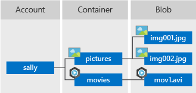

# Quickstart: Azure Blob Storage client library for Node.js

Get started with the Azure Blob Storage client library for Node.js to manage blobs and containers. Follow these steps to install the package and try out example code for basic tasks.

[API reference](/javascript/api/@azure/storage-blob) |
[Library source code](https://github.com/Azure/azure-sdk-for-js/tree/master/sdk/storage/storage-blob) | [Package (npm)](https://www.npmjs.com/package/@azure/storage-blob) | [Samples](../common/storage-samples-javascript.md?toc=/azure/storage/blobs/toc.json#blob-samples)

## Prerequisites

- An Azure account with an active subscription. [Create an account for free](https://azure.microsoft.com/free/?ref=microsoft.com&utm_source=microsoft.com&utm_medium=docs&utm_campaign=visualstudio).
- An Azure Storage account. [Create a storage account](../common/storage-account-create.md).
- [Node.js LTS](https://nodejs.org/en/download/).

## Create the Node.js project

Create a JavaScript application named *blob-quickstart*.

1. In a console window (such as cmd, PowerShell, or Bash), create a new directory for the project.

    ```console
    mkdir blob-quickstart
    ```

1. Switch to the newly created *blob-quickstart* directory.

    ```console
    cd blob-quickstart
    ```

1. Create a *package.json*. 

    ```console
    npm init -y
    ```

1. Open the project in Visual Studio Code:

    ```console
    code .
    ```

## Install the packages

From the project directory, install the following packages using the `npm install` command. 

1. Install the Azure Storage npm package:

    ```console
    npm install @azure/storage-blob
    ```

1. Install the Azure Identity npm package for a passwordless connection:

    ```console
    npm install @azure/identity
    ```
    
1. Install other dependencies used in this quickstart:

    ```console
    npm install uuid dotenv
    ```

## Create JavaScript file

From the project directory:

1. Create a new file named `index.js`.
1. Copy the following code into the file. More code will be added as you go through this quickstart.

    :::code language="javascript" source="~/azure_storage-snippets/blobs/quickstarts/JavaScript/V12/nodejs/boilerplate.js" :::

## Object model

Azure Blob storage is optimized for storing massive amounts of unstructured data. Unstructured data is data that doesn't adhere to a particular data model or definition, such as text or binary data. Blob storage offers three types of resources:

- The storage account
- A container in the storage account
- A blob in the container

The following diagram shows the relationship between these resources.



Use the following JavaScript classes to interact with these resources:

- [BlobServiceClient](/javascript/api/@azure/storage-blob/blobserviceclient): The `BlobServiceClient` class allows you to manipulate Azure Storage resources and blob containers.
- [ContainerClient](/javascript/api/@azure/storage-blob/containerclient): The `ContainerClient` class allows you to manipulate Azure Storage containers and their blobs.
- [BlobClient](/javascript/api/@azure/storage-blob/blobclient): The `BlobClient` class allows you to manipulate Azure Storage blobs.


## Code examples

These example code snippets show you how to do the following tasks with the Azure Blob Storage client library for JavaScript:

- [Authenticate to Azure and authorize access to blob data](#authenticate-to-azure-and-authorize-access-to-blob-data)
- [Create a container](#create-a-container)
- [Upload blobs to a container](#upload-blobs-to-a-container)
- [List the blobs in a container](#list-the-blobs-in-a-container)
- [Download blobs](#download-blobs)
- [Delete a container](#delete-a-container)

Sample code is also available on [GitHub](https://github.com/Azure-Samples/AzureStorageSnippets/tree/master/blobs/quickstarts/JavaScript/V12/nodejs).

### Authenticate to Azure and authorize access to blob data

[!INCLUDE [storage-quickstart-passwordless-auth-intro](../../../includes/storage-quickstart-passwordless-auth-intro.md)]

### [Passwordless (Recommended)](#tab/managed-identity)

`DefaultAzureCredential` supports multiple authentication methods and determines which method should be used at runtime. This approach enables your app to use different authentication methods in different environments (local vs. production) without implementing environment-specific code.

The order and locations in which `DefaultAzureCredential` looks for credentials can be found in the [Azure Identity library overview](/javascript/api/overview/azure/identity-readme#defaultazurecredential).

For example, your app can authenticate using your Azure CLI sign-in credentials with when developing locally. Your app can then use a [managed identity](../../active-directory/managed-identities-azure-resources/overview.md) once it has been deployed to Azure. No code changes are required for this transition.

#### Assign roles to your Azure AD user account

[!INCLUDE [assign-roles](../../../includes/assign-roles.md)]

#### Sign in and connect your app code to Azure using DefaultAzureCredential

You can authorize access to data in your storage account using the following steps:

1. Make sure you're authenticated with the same Azure AD account you assigned the role to on your storage account. You can authenticate via the Azure CLI, Visual Studio Code, or Azure PowerShell.

    #### [Azure CLI](#tab/sign-in-azure-cli)

    Sign-in to Azure through the Azure CLI using the following command:

    ```azurecli
    az login
    ```

    #### [Visual Studio Code](#tab/sign-in-visual-studio-code)

    You'll need to [install the Azure CLI](/cli/azure/install-azure-cli) to work with `DefaultAzureCredential` through Visual Studio Code.

    On the main menu of Visual Studio Code, navigate to **Terminal > New Terminal**.

    Sign-in to Azure through the Azure CLI using the following command:

    ```azurecli
    az login
    ```

    #### [PowerShell](#tab/sign-in-powershell)

    Sign-in to Azure using PowerShell via the following command:

    ```azurepowershell
    Connect-AzAccount
    ```

2. To use `DefaultAzureCredential`, make sure that the **@azure\identity** package is [installed](#install-the-packages), and the class is imported:

    :::code language="javascript" source="~/azure_storage-snippets/blobs/quickstarts/JavaScript/V12/nodejs/index.js" id="snippet_StorageAcctInfo_without_secrets":::

3. Add this code inside the `try` block. When the code runs on your local workstation, `DefaultAzureCredential` uses the developer credentials of the prioritized tool you're logged into to authenticate to Azure. Examples of these tools include Azure CLI or Visual Studio Code.

    :::code language="javascript" source="~/azure_storage-snippets/blobs/quickstarts/JavaScript/V12/nodejs/index.js" id="snippet_StorageAcctInfo_create_client":::

4. Make sure to update the storage account name, `AZURE_STORAGE_ACCOUNT_NAME`, in the `.env` file or your environment's variables. The storage account name can be found on the overview page of the Azure portal.

    :::image type="content" source="./media/storage-quickstart-blobs-python/storage-account-name.png" alt-text="A screenshot showing how to find the storage account name.":::

    > [!NOTE]
    > When deployed to Azure, this same code can be used to authorize requests to Azure Storage from an application running in Azure. However, you'll need to enable managed identity on your app in Azure. Then configure your storage account to allow that managed identity to connect. For detailed instructions on configuring this connection between Azure services, see the [Auth from Azure-hosted apps](/azure/developer/javascript/sdk/authentication/azure-hosted-apps) tutorial.

### [Connection String](#tab/connection-string)

A connection string includes the storage account access key and uses it to authorize requests. Always be careful to never expose the keys in an unsecure location.

> [!NOTE]
> To authorize data access with the storage account access key, you'll need permissions for the following Azure RBAC action: [Microsoft.Storage/storageAccounts/listkeys/action](../../role-based-access-control/resource-provider-operations.md#microsoftstorage). The least privileged built-in role with permissions for this action is [Reader and Data Access](../../role-based-access-control/built-in-roles.md#reader-and-data-access), but any role which includes this action will work.

[!INCLUDE [retrieve credentials](../../../includes/retrieve-credentials.md)]

#### Configure your storage connection string

After you copy the connection string, write it to a new environment variable on the local machine running the application. To set the environment variable, open a console window, and follow the instructions for your operating system. Replace `<yourconnectionstring>` with your actual connection string.

**Windows**:

```cmd
setx AZURE_STORAGE_CONNECTION_STRING "<yourconnectionstring>"
```

After you add the environment variable in Windows, you must start a new instance of the command window.

**Linux**:

```bash
export AZURE_STORAGE_CONNECTION_STRING="<yourconnectionstring>"
```

**.env file**:

```bash
AZURE_STORAGE_CONNECTION_STRING="<yourconnectionstring>"
```

The code below retrieves the connection string for the storage account from the environment variable created earlier, and uses the connection string to construct a service client object.

Add this code inside the `try` block:

:::code language="javascript" source="~/azure_storage-snippets/blobs/quickstarts/JavaScript/V12/nodejs/index.js" id="snippet_StorageAcctInfo__with_secrets":::

> [!IMPORTANT]
> The account access key should be used with caution. If your account access key is lost or accidentally placed in an insecure location, your service may become vulnerable. Anyone who has the access key is able to authorize requests against the storage account, and effectively has access to all the data. `DefaultAzureCredential` provides enhanced security features and benefits and is the recommended approach for managing authorization to Azure services.

---

## Create a container

1. Decide on a name for the new container.  Container names must be lowercase. 

    For more information about naming containers and blobs, see [Naming and Referencing Containers, Blobs, and Metadata](/rest/api/storageservices/naming-and-referencing-containers--blobs--and-metadata).

1. Add this code to the end of the `main` function:

    :::code language="javascript" source="~/azure_storage-snippets/blobs/quickstarts/JavaScript/V12/nodejs/index.js" id="snippet_CreateContainer":::

    The preceding code takes a [BlobServiceClient](/javascript/api/@azure/storage-blob/blobserviceclient) object and calls the [getContainerClient](/javascript/api/@azure/storage-blob/blobserviceclient#getcontainerclient-string-) method to get a reference to a container. Finally, the code calls [create](/javascript/api/@azure/storage-blob/containerclient#create-containercreateoptions-) to actually create the container in your storage account.

To learn more about creating a container, and to explore more code samples, see [Create a blob container with JavaScript](storage-blob-container-create-javascript.md).

## Upload blobs to a container

Copy the following code to the end of the `main` function to upload a text string to a blob:

:::code language="javascript" source="~/azure_storage-snippets/blobs/quickstarts/JavaScript/V12/nodejs/index.js" id="snippet_UploadBlobs":::

The preceding code gets a reference to a [BlockBlobClient](/javascript/api/@azure/storage-blob/blockblobclient) object by calling the [getBlockBlobClient](/javascript/api/@azure/storage-blob/containerclient#getblockblobclient-string-) method on the [ContainerClient](/javascript/api/@azure/storage-blob/containerclient) from the [Create a container](#create-a-container) section.
The code uploads the text string data to the blob by calling the [upload](/javascript/api/@azure/storage-blob/blockblobclient#upload-httprequestbody--number--blockblobuploadoptions-) method.

To learn more about uploading blobs, and to explore more code samples, see [Upload a blob with JavaScript](storage-blob-upload-javascript.md).

## List the blobs in a container

Add the following code to the end of the `main` function to list the blobs in the container. 

:::code language="javascript" source="~/azure_storage-snippets/blobs/quickstarts/JavaScript/V12/nodejs/index.js" id="snippet_ListBlobs":::

The preceding code calls the [listBlobsFlat](/javascript/api/@azure/storage-blob/containerclient#listblobsflat-containerlistblobsoptions-) method. In this case, only one blob has been added to the container, so the listing operation returns just that one blob.

To learn more about listing blobs, and to explore more code samples, see [List blobs with JavaScript](storage-blobs-list-javascript.md).

## Download blobs

1. Add the following code to the end of the `main` function to download the previously created blob into the app runtime.

    :::code language="javascript" source="~/azure_storage-snippets/blobs/quickstarts/JavaScript/V12/nodejs/index.js" id="snippet_DownloadBlobs":::

    The preceding code calls the [download](/javascript/api/@azure/storage-blob/blockblobclient#download-undefined---number--undefined---number--blobdownloadoptions-) method. 

2. Copy the following code *after* the `main` function to convert a stream back into a string.

    :::code language="javascript" source="~/azure_storage-snippets/blobs/quickstarts/JavaScript/V12/nodejs/index.js" id="snippet_ConvertStreamToText":::

To learn more about downloading blobs, and to explore more code samples, see [Download a blob with JavaScript](storage-blob-download-javascript.md).

## Delete a container

Add this code to the end of the `main` function to delete the container and all its blobs:

:::code language="javascript" source="~/azure_storage-snippets//blobs/quickstarts/JavaScript/V12/nodejs/index.js" id="snippet_DeleteContainer":::

The preceding code cleans up the resources the app created by removing the entire container using the [​delete](/javascript/api/@azure/storage-blob/containerclient#delete-containerdeletemethodoptions-) method. You can also delete the local files, if you like.

To learn more about deleting a container, and to explore more code samples, see [Delete and restore a blob container with JavaScript](storage-blob-container-delete-javascript.md).

## Run the code

1. From a Visual Studio Code terminal, run the app.

    ```console
    node index.js
    ```

2. The output of the app is similar to the following example:

    ```output
    Azure Blob storage - JavaScript quickstart sample
    
    Creating container...
             quickstart4a0780c0-fb72-11e9-b7b9-b387d3c488da
    
    Uploading to Azure Storage as blob:
             quickstart4a3128d0-fb72-11e9-b7b9-b387d3c488da.txt
    
    Listing blobs...
             quickstart4a3128d0-fb72-11e9-b7b9-b387d3c488da.txt
    
    Downloaded blob content...
             Hello, World!
    
    Deleting container...
    Done
    ```

Step through the code in your debugger and check your [Azure portal](https://portal.azure.com) throughout the process. Check to see that the container is being created. You can open the blob inside the container and view the contents.

## Clean up 

1. When you're done with this quickstart, delete the `blob-quickstart` directory.
1. If you're done using your Azure Storage resource, use the [Azure CLI to remove the Storage resource](storage-quickstart-blobs-cli.md#clean-up-resources). 

## Next steps

In this quickstart, you learned how to upload, download, and list blobs using JavaScript.

To see Blob storage sample apps, continue to:

> [!div class="nextstepaction"]
> [Azure Blob Storage library for JavaScript samples](https://github.com/Azure/azure-sdk-for-js/tree/master/sdk/storage/storage-blob/samples)

- To learn more, see the [Azure Blob Storage client libraries for JavaScript](/javascript/api/overview/azure/storage-blob-readme).
- For tutorials, samples, quickstarts, and other documentation, visit [Azure for JavaScript and Node.js developers](/azure/developer/javascript/).