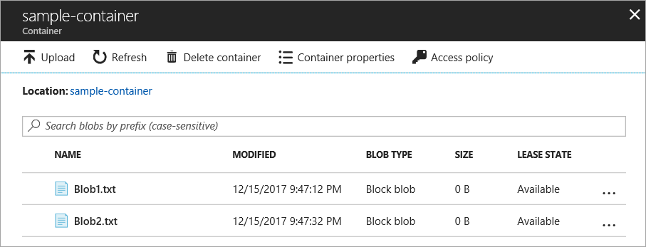

# Quickstart: Upload, download, and list blobs using the Azure portal

In this quickstart, you learn how to use the [Azure portal](https://portal.azure.com/) to create a container in Azure Storage, and to upload and download block blobs in that container.

## Prerequisites

If you don't have an Azure subscription, create a [free account](https://azure.microsoft.com/free/?WT.mc_id=A261C142F) before you begin.

[!INCLUDE [storage-create-account-portal-include](../../../includes/storage-create-account-portal-include.md)]

## Create a container

To create a container in the Azure portal, follow these steps:

1. Navigate to your new storage account in the Azure portal.
2. In the left menu for the storage account, scroll to the **Blob Service** section, then select **Browse Blobs**.
3. Click the **Add Container** button.
4. Enter a name for your new container. The container name must be lowercase, must start with a letter or number and can contain only letters, numbers, and the dash (-) character. See [Naming and Referencing Containers, Blobs, and Metadata](https://docs.microsoft.com/rest/api/storageservices/naming-and-referencing-containers--blobs--and-metadata) for more information about container and blob names.
5. Set the level of public access to the container. The default level is **Private (no anonymous access)**.
6. Click **OK** to create the container.

    

## Upload a block blob

Block blobs consist of blocks of data assembled to make a blob. Most scenarios using Blob storage employ block blobs. Block blobs are ideal for storing text and binary data in the cloud, like files, images, and videos. This quickstart shows how to work with block blobs. 

To upload a block blob to your new container in the Azure portal, follow these steps:

1. In the Azure portal, navigate to the container you created in the previous section.
2. Select the container to show a list of blobs it contains. In this case, since you created a new container, it won't yet contain any blobs.
3. Click the **Upload** button to upload a blob to the container.
4. Browse your local file system to find a file to upload as a block blob, and click **Upload**.
     
    

5. Upload as many blobs as you like in this way. You'll see that the new blobs are now listed within the container.

    

## Download a block blob

You can download a block blob to display in the browser or save to your local file system. To download a block blob, follow these steps:

1. Navigate to the list of blobs that you uploaded in the previous section. 
2. Select the blob to download.
3. Right-click the **More** button (**...**), and select **Download**. 

## Clean up resources

To remove the resources you created in this quickstart, you can simply delete the container. All blobs in the container will also be deleted.

To delete the container:

1. In the Azure portal, navigate to the list of containers in your storage account.
2. Select the container to delete.
3. Right-click the **More** button (**...**), and select **Delete**.
4. Confirm that you want to delete the container.

       

## Next steps

In this quickstart, you learned how to transfer files between a local disk and Azure Blob storage using .NET. To learn more about working with Blob storage, continue to the Blob storage How-to.

> [!div class="nextstepaction"]
> [Blob Storage Operations How-To](storage-dotnet-how-to-use-blobs.md)

