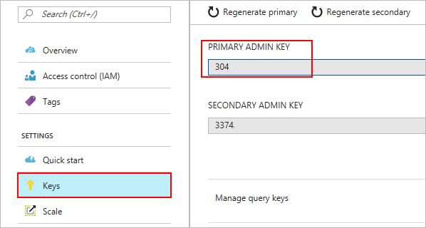
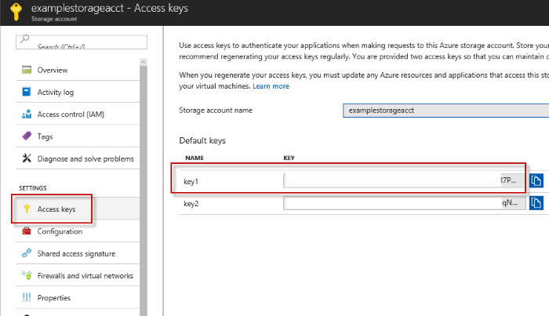
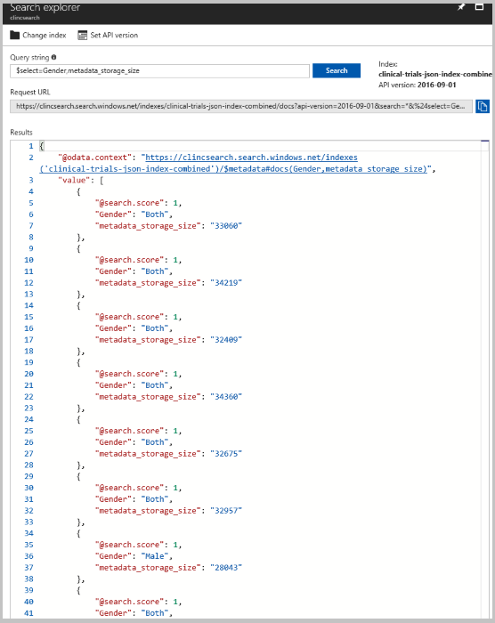

# Search semi-structured data in cloud Storage

This tutorial is part two of a two-part series. In these tutorials, you learn how to search semi-structured and unstructured data. Semi-structured data, such as JSON, contains tags or markings which separate content within the data. It differs from structured data in that it is data that is not formally structured such as data models for relational databases.

In this part you learn how to:

> [!div class="checklist"]
> * Create an Azure Search Service using the REST API
> * Use the Azure Search Service to search your container

## Prerequisites

To complete this tutorial:

* Complete the [previous tutorial](./storage-unstructured-search.md)
* A REST client
* Some familiarity with REST API queries

## Setup

To complete this tutorial you need to have a REST client. For the purposes of this tutorial, we are using [Postman](https://www.getpostman.com/). Feel free to use a different REST client if you're already comfortable with a particular one.

After installing postman, launch it.

If this is your first time making REST calls to Azure, here's a brief introduction of the components that are important for this tutorial: The request method for every call in this tutorial is "POST." The header keys, which are "Content-type" and "api-key", application/json and your "admin key" (this is a placeholder for your search primary key). The rest of the call (including the brackets) is the body of your call. Depending on the client you're using, there may be some variations on how you construct your query but that's the gist of it.

The search api-key is required, it can be found under **Keys** inside your search service. This api-key must be in the header of every API call this tutorial directs you to make. So note it down.

  

## Download the sample data

For this tutorial, a sample data set has been prepared for you. **Download [clinical-trials-json.zip](https://github.com/roygara/storage-blob-integration-with-cdn-search-hdi/raw/master/clinical-trials-json.zip)** and unzip it to its own folder.

Contained in the sample are example JSON files, which were originally text files obtained from [clinicaltrials.gov](https://clinicaltrials.gov/ct2/results). We have already converted them to JSON for your convenience.

## Log in to Azure

Log in to the [Azure portal](http://portal.azure.com).

## Upload the sample data

Navigate back to the storage account from the previous tutorial, open the **data** container, and click **Upload**.

Click **Advanced** and enter "clinical-trials-json", then upload all of the JSON files you downloaded.

After the upload completes, the files should appear in their own subfolder inside the data container.

## Connect your search service to your blob storage

In the last tutorial, we connected our search service to our storage via the UI. In this tutorial, we make the connection via the API. We are using the REST API to perform the connection because the UI does not currently support JSON indexing.

The URL (also known as an endpoint) for each call must end with **api-version=2016-09-01-Preview** and each call should return a **201 Created.** The generally available api-version does not yet have the capability to handle json as a jsonArray, currently only the preview api-version does.

 Additionally, the `[service name]` in the example URLs is the name of the search service created in the last tutorial. So note the name of your search service down as well. An example of a properly constructed URL would be: `https://mysearch.search.windows.net/datasources?api-version=2016-09-01-Preview`

You also need the name of your storage account and your storage account key, the storage account key can be found in your storage account under **Access Keys**. As pictured below:

  

Execute the following three API calls from your REST client.

The first API call creates a data source, which is what you use to specify what data to index. 

```json
POST https://[service name].search.windows.net/datasources?api-version=2016-09-01-Preview
Content-Type: application/json
api-key: [admin key]

{
    "name" : "clinical-trials-json",
    "type" : "azureblob",
    "credentials" : { "connectionString" : "DefaultEndpointsProtocol=https;AccountName=[storage account name];AccountKey=[storage account key];" },
    "container" : { "name" : "data", "query" : "clinical-trials-json" }
}
```
The second API call creates an index, it sets all the parameters and their attributes.

```json
POST https://[service name].search.windows.net/indexes?api-version=2016-09-01-Preview
Content-Type: application/json   
api-key: [admin key] 

{
  "name": "clinical-trials-json-index",  
  "fields": [
  {"name": "FileName", "type": "Edm.String", "searchable": false, "retrievable": true, "facetable": false, "filterable": false, "sortable": true},
  {"name": "Description", "type": "Edm.String", "searchable": true, "retrievable": false, "facetable": false, "filterable": false, "sortable": false},
  {"name": "MinimumAge", "type": "Edm.Int32", "searchable": false, "retrievable": true, "facetable": true, "filterable": true, "sortable": true},
  {"name": "Title", "type": "Edm.String", "searchable": true, "retrievable": true, "facetable": false, "filterable": true, "sortable": true},
  {"name": "URL", "type": "Edm.String", "searchable": false, "retrievable": false, "facetable": false, "filterable": false, "sortable": false},
  {"name": "MyURL", "type": "Edm.String", "searchable": false, "retrievable": true, "facetable": false, "filterable": false, "sortable": false},
  {"name": "Gender", "type": "Edm.String", "searchable": false, "retrievable": true, "facetable": true, "filterable": true, "sortable": false},
  {"name": "MaximumAge", "type": "Edm.Int32", "searchable": false, "retrievable": true, "facetable": true, "filterable": true, "sortable": true},
  {"name": "Summary", "type": "Edm.String", "searchable": true, "retrievable": true, "facetable": false, "filterable": false, "sortable": false},
  {"name": "NCTID", "type": "Edm.String", "key": true, "searchable": true, "retrievable": true, "facetable": false, "filterable": true, "sortable": true},
  {"name": "Phase", "type": "Edm.String", "searchable": false, "retrievable": true, "facetable": true, "filterable": true, "sortable": false},
  {"name": "Date", "type": "Edm.String", "searchable": false, "retrievable": true, "facetable": false, "filterable": false, "sortable": true},
  {"name": "OverallStatus", "type": "Edm.String", "searchable": false, "retrievable": true, "facetable": true, "filterable": true, "sortable": false},
  {"name": "OrgStudyId", "type": "Edm.String", "searchable": true, "retrievable": true, "facetable": false, "filterable": true, "sortable": false},
  {"name": "HealthyVolunteers", "type": "Edm.String", "searchable": false, "retrievable": true, "facetable": true, "filterable": true, "sortable": false},
  {"name": "Keywords", "type": "Collection(Edm.String)", "searchable": true, "retrievable": true, "facetable": true, "filterable": false, "sortable": false},
  {"name": "metadata_storage_last_modified", "type":"Edm.DateTimeOffset", "searchable": false, "retrievable": true, "filterable": true, "sortable": false},
  {"name": "metadata_storage_size", "type":"Edm.String", "searchable": false, "retrievable": true, "filterable": true, "sortable": false},
  {"name": "metadata_content_type", "type":"Edm.String", "searchable": true, "retrievable": true, "filterable": true, "sortable": false}
  ],
  "suggesters": [
  {
    "name": "sg",
    "searchMode": "analyzingInfixMatching",
    "sourceFields": ["Title"]
  }
  ]
}
```

The third and final call creates an indexer. An indexer connects the data source to the target search index and (optionally) provides a schedule to automate the data refresh.

```json
POST https://[service name].search.windows.net/indexers?api-version=2016-09-01-Preview
Content-Type: application/json
api-key: [admin key]

{
  "name" : "clinical-trials-json-indexer",
  "dataSourceName" : "clinical-trials-json",
  "targetIndexName" : "clinical-trials-json-index",
  "parameters" : { "configuration" : { "parsingMode" : "jsonArray" } }
}
```

## Search your JSON files

Now that the search service has been connected to your data container you can begin searching your files.

Open up the portal and navigate back to your search service. Open up the search explorer, as shown in the [previous tutorial](storage-unstructured-search.md#Search-your-text-files).

As before, the data can be queried in a number of ways: particular terms (such as Myopia), the full data set, system properties, or user-defined metadata. Both system properties and user-defined metadata may only be searched with the select parameter if they were marked as retrievable during creation of the target index. Once parameters are created in the target index they may not be altered, though additional parameters may be added.

A basic query would be `$select=Gender,metadata_storage_size`, which limits the return to those two parameters.

  

A more complex query would be `$filter=MinimumAge ge 20 and MaximumAge lt 75`, which returns only results in which the parameters MinimumAge is greater than or equal to 20 and MaximumAge is less than 75.

If you'd like to experiment and try a few more queries yourself, feel free to do so. Know that Logical operators (and, or, not) work as well as comparison operators (eq, ne, gt, lt, ge, le). String comparisons are case-sensitive. 

Keep in mind that $filter will only worked with metadata with the filterable parameter.

## Clean-up

Now that you've completed the tutorial, you can go ahead and clean up all your resources.

The quickest way to accomplish this is to delete the resource group you created for the tutorial.

In this tutorial, you learned about searching semi-structured data such as how to:

> [!div class="checklist"]
> * Create an Azure Search Service using the REST API7
> * Use the Azure Search Service to search your container