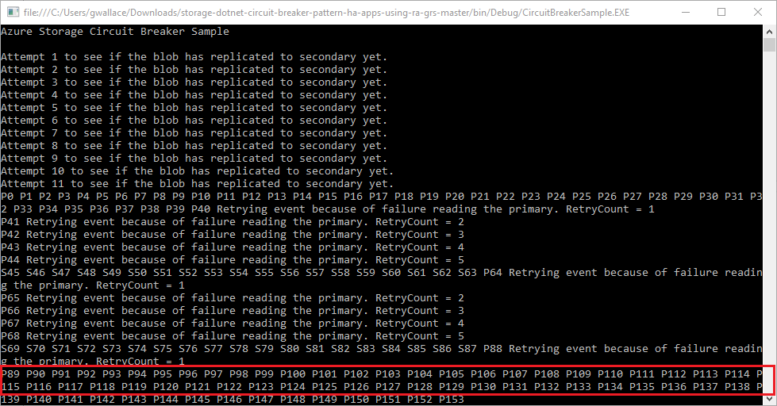

 
Replace  `<destination_ip>` with your storage account IP address, and `<gateway_ip>` with your local host IP address. To resume the application, press **any key**.

Once the application starts running again, the requests to the primary endpoint begin to fail. The application attempts to reconnect to the primary endpoint 5 times. After the failure threshold of five attempts, it requests the image from the secondary read-only endpoint. After the application successfully retrieves the image 20 times from the secondary endpoint, the application attempts to connect to the primary endpoint. If the primary endpoint is still unreachable, the application resumes reading from the secondary endpoint. This pattern is the [Circuit Breaker](/azure/architecture/patterns/circuit-breaker.md) pattern described in the previous tutorial.

### Simulate primary endpoint restoration

To simulate the primary endpoint functioning again, delete the static route of the primary endpoint from the routing table. This allows all requests to the primary endpoint to be routed through the default gateway. 

To delete the static route of a destination host, the storage account, type the following command on a Windows command prompt or linux terminal. 
 
# [Linux](#tab/linux)

route del <destination_ip> gw <gateway_ip>

# [Windows](#tab/windows)

route delete <destination_ip>

---

Press **any key** to resume the application. The application continues reading from the primary endpoint until it hits 999 reads.

## Next steps

In part two of the series, you learned about simulating a failure to test read access geo-redundant storage, such as how to:

> [!div class="checklist"]
> * Run and pause the application
> * Simulate a failure with [fiddler](#simulate-a-failure-with-fiddler) or [an invalid static route](#simulate-a-failure-with-an-invalid-static-route) 
> * Simulate primary endpoint restoration

Read the following article to learn more about how RA-GRS storage works (and its associated risks).

> [!div class="nextstepaction"]
> [Designing HA apps with RA-GRS](../common/storage-designing-ha-apps-with-ragrs.md)

[previous-tutorial]: storage-create-geo-redundant-storage.md