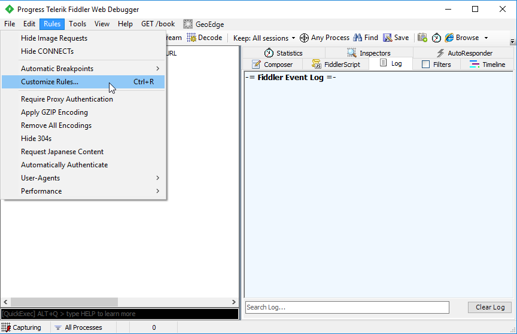
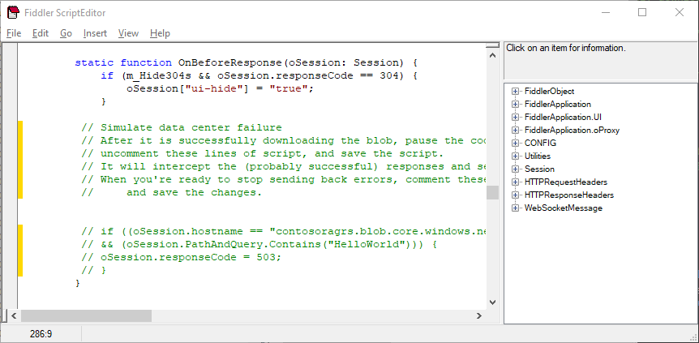

# Tutorial: Simulate a failure in accessing read-access redundant storage

This tutorial is part two of a series. In it, you learn about the benefits of a [read-access geo-redundant](../common/storage-redundancy-grs.md#read-access-geo-redundant-storage) (RA-GRS) by simulating a failure.

In order to simulate a failure, you can use either [Static Routing](#simulate-a-failure-with-an-invalid-static-route) or [Fiddler](#simulate-a-failure-with-fiddler). Both methods will allow you to simulate failure for requests to the primary endpoint of your [read-access geo-redundant](../common/storage-redundancy-grs.md#read-access-geo-redundant-storage) (RA-GRS) storage account, causing the application read from the secondary endpoint instead.

If you don't have an Azure subscription, [create a free account](https://azure.microsoft.com/free/) before you begin.

In part two of the series, you learn how to:

> [!div class="checklist"]
> * Run and pause the application
> * Simulate a failure with [an invalid static route](#simulate-a-failure-with-an-invalid-static-route) or [Fiddler](#simulate-a-failure-with-fiddler)
> * Simulate primary endpoint restoration

## Prerequisites

Before you begin this tutorial, complete the previous tutorial: [Make your application data highly available with Azure storage][previous-tutorial].

To simulate a failure with static routing, you will use an elevated command prompt.

To simulate a failure using Fiddler, download and [install Fiddler](https://www.telerik.com/download/fiddler)

## Simulate a failure with an invalid static route

You can create an invalid static route for all requests to the primary endpoint of your [read-access geo-redundant](../common/storage-redundancy-grs.md#read-access-geo-redundant-storage) (RA-GRS) storage account. In this tutorial, the local host is used as the gateway for routing requests to the storage account. Using the local host as the gateway causes all requests to your storage account primary endpoint to loop back inside the host, which subsequently leads to failure. Follow the following steps to simulate a failure, and primary endpoint restoration with an invalid static route.

### Start and pause the application

Use the instructions in the [previous tutorial][previous-tutorial] to launch the sample and download the test file, confirming that it comes from primary storage. Depending on your target platform, you can then manually pause the sample or wait at a prompt.

### Simulate failure

While the application is paused, open a command prompt on Windows as an administrator or run terminal as root on Linux.

Get information about the storage account primary endpoint domain by entering the following command on a command prompt or terminal, replacing `STORAGEACCOUNTNAME` with the name of your storage account.

```
nslookup STORAGEACCOUNTNAME.blob.core.windows.net
```

Copy to the IP address of your storage account to a text editor for later use.

To get the IP address of your local host, type `ipconfig` on the Windows command prompt, or `ifconfig` on the Linux terminal.

To add a static route for a destination host, type the following command on a Windows command prompt or Linux terminal, replacing `<destination_ip>` with your storage account IP address and `<gateway_ip>` with your local host IP address.

#### Linux

```
route add <destination_ip> gw <gateway_ip>
```

#### Windows

```
route add <destination_ip> <gateway_ip>
```

In the window with the running sample, resume the application or press the appropriate key to download the sample file and confirm that it comes from secondary storage. You can then pause the sample again or wait at the prompt.

### Simulate primary endpoint restoration

To simulate the primary endpoint becoming functional again, delete the invalid static route from the routing table. This allows all requests to the primary endpoint to be routed through the default gateway. Type the following command on a Windows command prompt or Linux terminal.

#### Linux

```
route del <destination_ip> gw <gateway_ip>
```

#### Windows

```
route delete <destination_ip>
```

You can then resume the application or press the appropriate key to download the sample file again, this time confirming that it once again comes from primary storage.

## Simulate a failure with Fiddler

To simulate failure with Fiddler, you inject a failed response for requests to the primary endpoint of your RA-GRS storage account.

The following sections depict how to simulate a failure and primary endpoint restoration with fiddler.

### Launch fiddler

Open Fiddler, select **Rules** and **Customize Rules**.



The Fiddler ScriptEditor launches and displays the **SampleRules.js** file. This file is used to customize Fiddler.

Paste the following code sample in the `OnBeforeResponse` function, replacing `STORAGEACCOUNTNAME` with the name of your storage account. Depending on the sample, you may also need to replace `HelloWorld` with the name of the test file (or a prefix such as `sampleFile`) being downloaded. The new code is commented out to ensure that it doesn't run immediately.

Once complete, select **File** and **Save** to save your changes. Leave the ScriptEditor window open for use in the following steps.

```javascript
	/*
		// Simulate data center failure
		// After it is successfully downloading the blob, pause the code in the sample,
		// uncomment these lines of script, and save the script.
		// It will intercept the (probably successful) responses and send back a 503 error.
		// When you're ready to stop sending back errors, comment these lines of script out again
		//     and save the changes.

		if ((oSession.hostname == "STORAGEACCOUNTNAME.blob.core.windows.net")
	        && (oSession.PathAndQuery.Contains("HelloWorld"))) {
		    oSession.responseCode = 503;
		}
	*/
```



### Start and pause the application

Use the instructions in the [previous tutorial][previous-tutorial] to launch the sample and download the test file, confirming that it comes from primary storage. Depending on your target platform, you can then manually pause the sample or wait at a prompt.

### Simulate failure

While the application is paused, switch back to Fiddler and uncomment the custom rule you saved in the `OnBeforeResponse` function. Be sure to select **File** and **Save** to save your changes so the rule will take effect. This code looks for requests to the RA-GRS storage account and, if the path contains the name of the sample file, returns a response code of `503 - Service Unavailable`.

In the window with the running sample, resume the application or press the appropriate key to download the sample file and confirm that it comes from secondary storage. You can then pause the sample again or wait at the prompt.

### Simulate primary endpoint restoration

In Fiddler, remove or comment out the custom rule again. Select **File** and **Save** to ensure the rule will no longer be in effect.

In the window with the running sample, resume the application or press the appropriate key to download the sample file and confirm that it comes from primary storage once again. You can then exit the sample.

## Next steps

In part two of the series, you learned about simulating a failure to test read access geo-redundant storage.

To learn more about how RA-GRS storage works, as well as its associated risks, read the following article:

> [!div class="nextstepaction"]
> [Designing HA apps with RA-GRS](../common/storage-designing-ha-apps-with-ragrs.md)

[previous-tutorial]: storage-create-geo-redundant-storage.md
