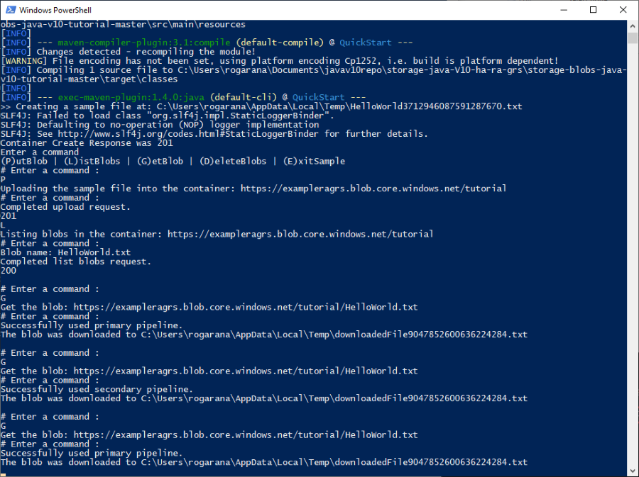

Replace  `<destination_ip>` with your storage account IP address, and `<gateway_ip>` with your local host IP address.

Now that you've introduced the failure, enter **G** to test the failure. It will inform you that it is using the secondary pipeline as opposed to the primary pipeline.

### Simulate primary endpoint restoration

To simulate the primary endpoint functioning again, delete the static route of the primary endpoint from the routing table. This allows all requests to the primary endpoint to be routed through the default gateway.

To delete the static route of a destination host, the storage account, type the following command on a Windows command prompt or linux terminal.

# [Linux](#tab/linux)

route del <destination_ip> gw <gateway_ip>

# [Windows](#tab/windows)

route delete <destination_ip>

---

Enter **G** to test the download. The application will report that it is now using the primary pipeline again.

## Next steps

In part two of the series, you learned about simulating a failure to test read access geo-redundant storage:

Read the following article to learn more about how RA-GRS storage works in general, as well as its associated risks.

> [!div class="nextstepaction"]
> [Designing HA apps with RA-GRS](../common/storage-designing-ha-apps-with-ragrs.md)

[previous-tutorial]: storage-create-geo-redundant-storage.md