# Tutorial: Search unstructured data in cloud storage

In this tutorial, you learn how to search unstructured data by using [Azure Search](../../search/search-what-is-azure-search.md), using data stored in Azure Blob storage. Unstructured data is data that either is not organized in a pre-defined manner or does not have a data model. An example is a .txt file.

This tutorial requires that you have an Azure subscription. If you don't have an Azure subscription, create a [free account](https://azure.microsoft.com/free/?WT.mc_id=A261C142F) before you begin.

In this tutorial you learn how to:

> [!div class="checklist"]
> * Create a resource group
> * Create a storage account
> * Create a container
> * Upload data to your container
> * Create a search service through the portal
> * Connect a search service to a storage account
> * Create a data source
> * Configure the index
> * Create an indexer
> * Use the search service to search your container

## Prerequisites

Every storage account must belong to an Azure resource group. A resource group is a logical container for grouping your Azure services. When you create a storage account, you have the option to either create a new resource group or use an existing resource group. This tutorial creates a new resource group.

Sign in to the [Azure portal](https://portal.azure.com).

[!INCLUDE [storage-create-account-portal-include](../../../includes/storage-create-account-portal-include.md)]

A sample data set has been prepared for you so that you can make use of it for this tutorial. Download [clinical-trials.zip](https://github.com/Azure-Samples/storage-blob-integration-with-cdn-search-hdi/raw/master/clinical-trials.zip) and unzip it to its own folder.

The sample consists of text files obtained from [clinicaltrials.gov](https://clinicaltrials.gov/ct2/results). This tutorial uses them as example text files that are searched using Azure Search services.

## Create a container

Containers are similar to folders and are used to store blobs.

For this tutorial, you use a single container to store the text files obtained from clinicaltrials.gov.

1. Go to your storage account in the Azure portal.

2. Select **Browse blobs** under **Blob Service**.

3. Add a new container.

4. Name the container **data** and select **Container** for the public access level.

5. Select **OK** to create the container.

   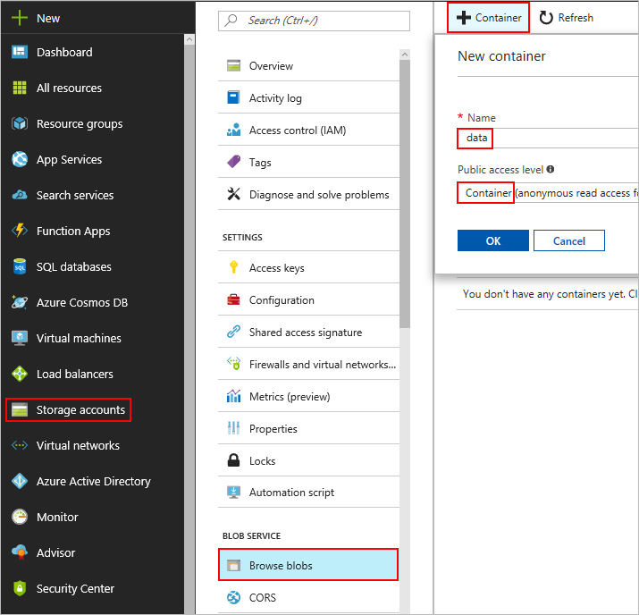

## Upload the example data

Now that you have a container, you can upload your example data to it.

1. Select your container and select **Upload**.

2. Select the blue folder icon next to the **Files** field and browse to the local folder where you extracted the sample data.

3. Select all of the extracted files and select **Open**.

4. Select **Upload** to begin the upload process.

   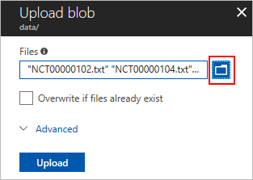

The upload process might take a moment.

After it finishes, go back into your data container to confirm the text files were uploaded.

  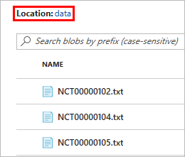

## Create a search service

Azure Search is a search-as-a-service cloud solution that gives developers APIs and tools for adding a search experience over your data.

For this tutorial, you use a search service to search the text files obtained from clinicaltrials.gov.

1. Go to your storage account in the Azure portal.

2. Scroll down and select **Add Azure Search** under **BLOB SERVICE**.

3. Under **Import Data**, select **Pick your service**.

4. Select **Click here to create a new search service**.

5. Inside **New Search Service** enter a unique name for your search service in the **URL** field.

6. Under **Resource group**, select **Use existing** and choose the resource group that you created earlier.

7. For **Pricing tier**, select the **Free** tier and click **Select**.

8. Select **Create** to create the search service.

   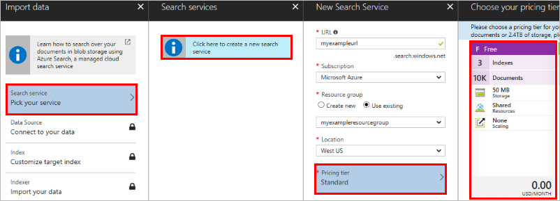

## Connect your search service to your container

Now that you have a search service, you can attach it to your blob storage. This section walks you through the process of choosing a data source, creating an index, and creating an indexer.

1. Go to your storage account.

2. Select **Add Azure Search** under **BLOB SERVICE**.

3. Select **Search Service** inside **Import Data**, and then click the search service that you created in the preceding section. This opens **New data source**.

### Create a data source

  A data source specifies which data to index and how to access the data. A data source can be used multiple times by the same search service.

1. Enter a name for the data source. Under **Data to extract**, select **Content and Metadata**. The data source specifies which parts of the blob are indexed.

2. Because the blobs you're using are text files, set **Parsing Mode** to **Text**.

   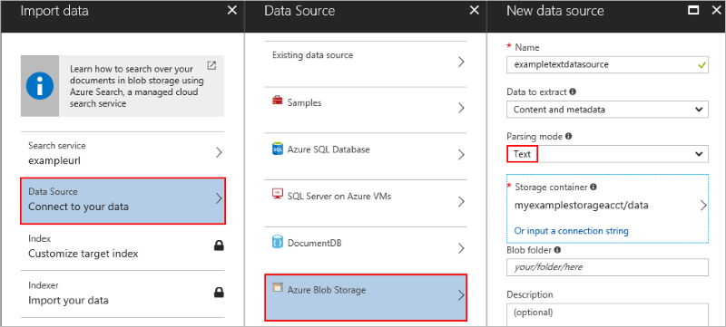

3. Select **Storage Container** to list the available storage accounts.

4. Select your storage account, and then select the container that you created previously.

   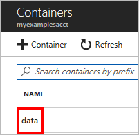

5. Click **Select** to return to **New data source**, and select **OK** to continue.

### Configure the index

  An index is a collection of fields from your data source that can be searched. You set and configure parameters on these fields so that your search service knows what ways your data should be searched.

1. In **Import data**, select **Customize target index**.

2. Enter a name for your index in the **Index name** field.

3. Select the **Retrievable** attribute's check box under **metadata_storage_name**.

   

4. Select **OK**, which brings up **Create an Indexer**.

The parameters of your index and the attributes you give those parameters are important. The parameters specify *what* data to store, and the attributes specify *how* to store that data.

The **FIELD NAME** column contains the parameters. The following table provides a listing of the available attributes and their descriptions.

#### Field attributes

| Attribute | Description |
| --- | --- |
| *Key* |A string that provides the unique ID of each document, used for document lookup. Every index must have one key. Only one field can be the key, and its type must be set to Edm.String. |
| *Retrievable* |Specifies whether a field can be returned in a search result. |
| *Filterable* |Allows the field to be used in filter queries. |
| *Sortable* |Allows a query to sort search results using this field. |
| *Facetable* |Allows a field to be used in a faceted navigation structure for user self-directed filtering. Typically, fields containing repetitive values that you can use to group documents together (for example, multiple documents that fall under a single brand or service category) work best as facets. |
| *Searchable* |Marks the field as full-text searchable. |

### Create an indexer

  An indexer connects a data source with a search index, and provides a schedule to reindex your data.

1. Enter a name in the **Name** field and select **OK**.

   

2. You are brought back to **Import Data**. Select **OK** to complete the connection process.

You've now successfully connected your blob to your search service. It takes a few minutes for the portal to show that the index is populated. However, the search service begins indexing immediately so you can begin searching right away.

## Search your text files

To search your files, open the search explorer inside the index of your newly created search service.

The following steps show you where to find the search explorer and provides you some example queries:

1. Go to all resources and find your newly created search service.

   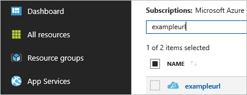

2. Select your index to open it.

   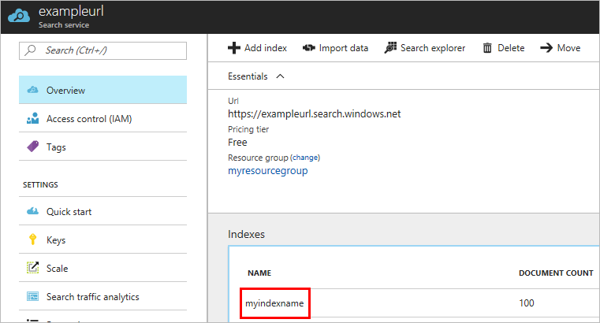

3. Select **Search Explorer** to open the search explorer, where you can make live queries on your data.

   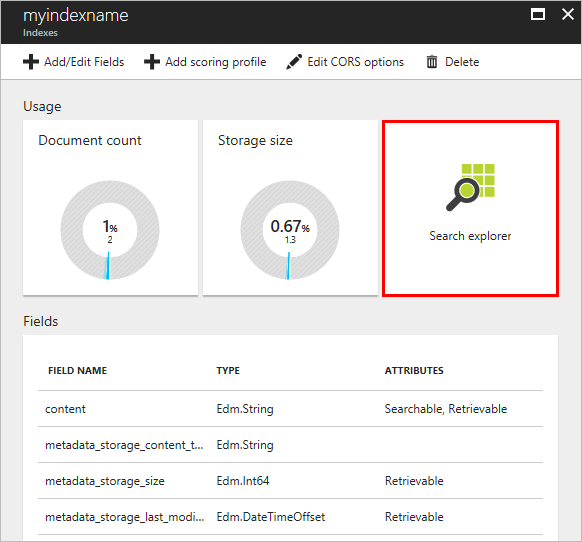

4. Select **Search** while the query string field is empty. An empty query returns *all* the data from your blobs.

   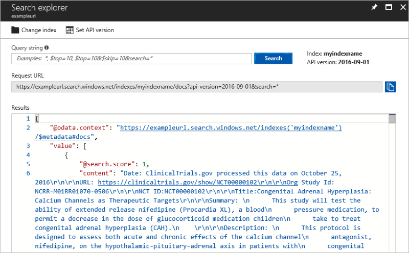

### Perform a full-text search

Enter **Myopia** in the **Query string** field, and select **Search**. This step starts a search of the files' contents and returns a subset of them, which contains the word "Myopia."

  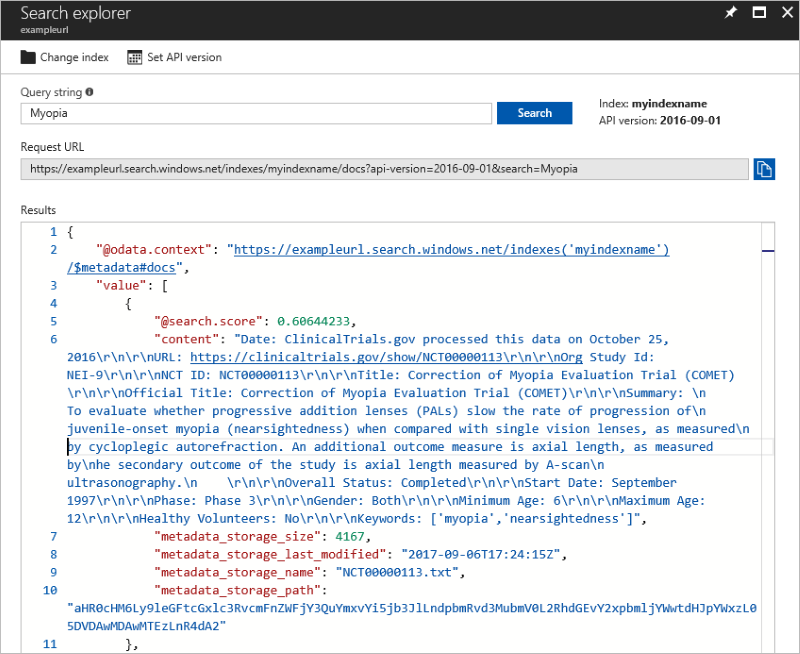

### Perform a system properties search

In addition to a full-text search, you can create queries that search by system properties using the `$select` parameter.

Enter `$select=metadata_storage_name` into the query string and press **Enter**. This causes only that particular field to return.

The query string is directly modifying the URL, so spaces are not permitted. To search multiple fields, use a comma, such as: `$select=metadata_storage_name,metadata_storage_path`

The `$select` parameter can only be used with fields that are marked retrievable when defining your index.

  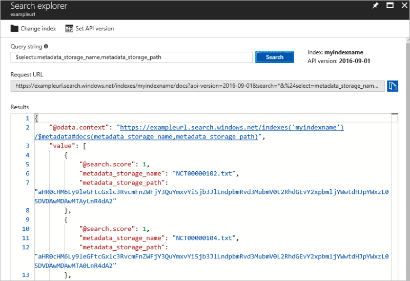

You have now completed this tutorial and have a searchable set of unstructured data.

## Clean up resources

The easiest way to remove the resources you've created is to delete the resource group. Removing the resource group also deletes all resources included within the group. In the following example, removing the resource group removes the storage account and the resource group itself.

1. In the Azure portal, go to the list of resource groups in your subscription.
2. Select the resource group that you want to delete.
3. Select the **Delete resource group** button and enter the name of the resource group in the deletion field.
4. Select **Delete**.

## Next steps

Follow this link to learn more about indexing documents with Azure Search:

> [!div class="nextstepaction"]
> [Indexing Documents in Azure Blob Storage with Azure Search](../../search/search-howto-indexing-azure-blob-storage.md)
