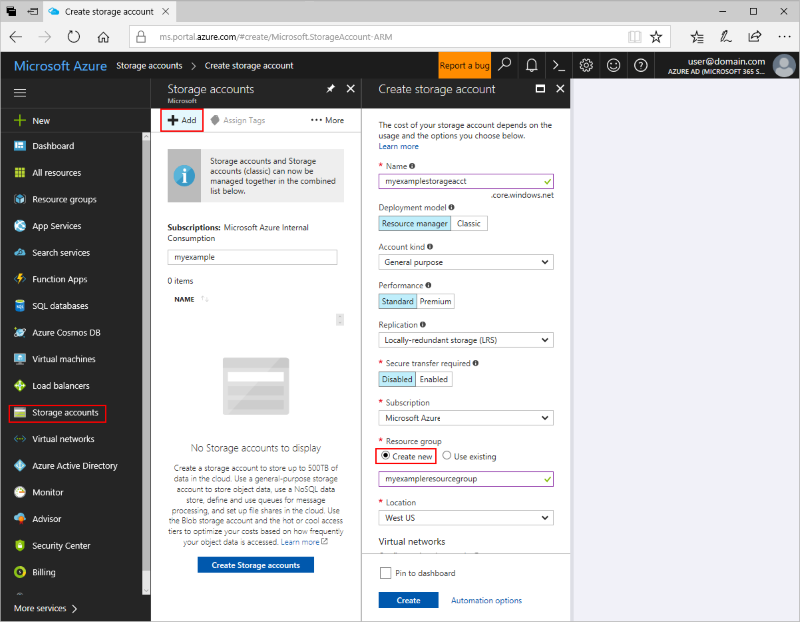
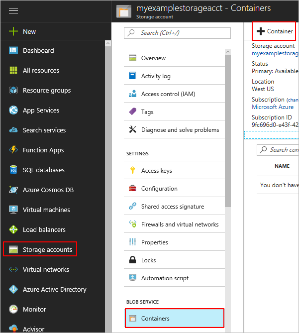
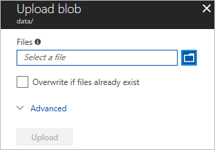
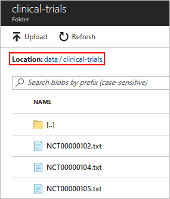
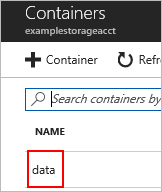
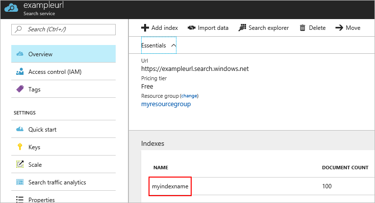
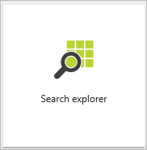
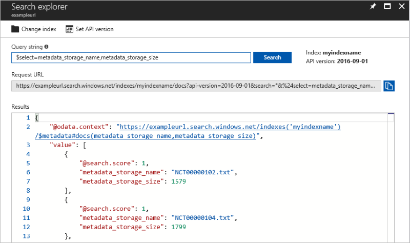

# Search unstructured data in cloud Storage

This tutorial is part one of a two-part series. In these tutorials, you learn how to search semi-structured and unstructured data. In this tutorial, you search unstructured data. Unstructured data is data that either is not organized in a pre-defined manner or does not have a data model. An example would be a .txt file.

In this part you learn how to:

> [!div class="checklist"]
> * Create a resource group
> * Create a storage account
> * Create a container
> * Upload data to your container
> * Create a search service through the portal
> * Use the search service to search your container

## Download the sample

For this tutorial, a sample data set has been prepared for you. **Download [clinical-trials.zip](https://github.com/roygara/storage-blob-integration-with-cdn-search-hdi/raw/master/clinical-trials.zip)** and unzip it to its own folder.

Contained in the sample is a set of example text files obtained from [clinicaltrials.gov](https://clinicaltrials.gov/ct2/results). We are using them as the example text files to search in Azure.

## Log in to Azure

Log in to the [Azure portal](http://portal.azure.com).

## Create a storage account

A storage account provides a unique location to store and access your Azure Storage data objects. All objects in a storage account are billed together as a group. By default, the data in your account is available only to you, the account owner.

Currently there are two types of storage accounts but, for the purposes of this tutorial, we are only using the "General-purpose storage account.

If you do not yet have a General-purpose storage account, here's how to create one:

1. On the left, click **Storage Accounts**, then click **Add.**

2. Enter a name for your storage account. 

3. Leave Deployment model as **Resource Manager** and make sure to select **General purpose** for Account kind.

4. Select **Locally-redundant storage (LRS)** for Replication.

5. Select to create a new resource group, give it a unique name, and select a location appropriate for you.
    We recommend creating a separate resource group for these sequences of tutorials so that you may easily clean up all associated resources after completing both tutorials.

6. Leave the remaining values as their defaults but be sure to select an appropriate subscription.

7. Click **Create.**

  

## Create a Container

Containers are blob-specific, they exist to store blobs and are similar to folders.

Blobs are basically files, like those that you store on your computer (or tablet, mobile device, and so on). They can be pictures, Microsoft Excel files, HTML files, virtual hard disks (VHDs), database backups, and big data such as logs.  

For this tutorial, we are using a single container to store the text obtained from clinicaltrials.gov in a blob.

1. Navigate to and open your storage account.

2. Scroll down and click **Containers** under **Blob Storage.**

3. Click **+Container** to create a new container.

4. Name the container "data" and select **Container** for the public access level.

  

## Upload the example data

Now that you have a container, you can upload your example data to it.

1. Click your container to open it, bringing up the container's overview.

2. Click **Upload**.

  

3. Click the blue folder icon pictured next to the files field and navigate to the folder where you extracted the sample data. 

4. Open the folder and select all of its contents, then when you've finished click **Upload** to begin the upload process.

The upload process may take a moment.

After it completes, if you navigate back into your data container, you should see all the text files.

  

## Create a Search Service

Azure Search is a search-as-a-service cloud solution that gives developers APIs and tools for adding a rich search experience over your data in web, mobile, and enterprise applications.

If you do not yet have a Search Service, here's how to create one:

1. Navigate to and open your storage account if it is not yet open.

2. Scroll down and click **Add Azure Search** under **Blob Storage.**

3. **Import Data** opens up. Click **Search Service**.

4. Click the information button to create a new search service.

  **New Search Service** opens up. 

5. Fill in the URL field, be aware that you are only constructing the beginning of the URL. An example URL would be: "yourInputHere".search.windows.net

6. Choose the resource group you created earlier, the appropriate subscription, location, and pricing tier. For the purpose of this tutorial, we recommend the **Free** tier.

7. Click **Create** to create the search service.

  

You've now successfully created a search service. You can connect this search service to multiple Azure resources.

## Connect your search service to your blob storage

Now that you have a search service, you can attach it to your blob storage. This section walks you through that process.

1. Navigate back to your storage account and open it. 

2. Scroll down and click **Add Azure Search** under **BLOB SERVICE.**

3. Select **Search Service** inside **Import Data** and then click the search service you created.

    You can now proceed to the next part, **Data Source.** Click that if it doesn't automatically appears.

 **New data source** appears.

### New Data Source

    A data source specifies which data to index, credentials needed to access the data, and policies to identify changes in the data (new, modified, or deleted blobs). A data source can be used multiple times in the same search service.

1. Enter a name of your choosing and make sure **Data to extract** is set as **Content and Metadata** and that **Parsing Mode** is **Text**.
    
    a. In the future, for your own data, you can also select **Storage metadata only** if you wish to limit the data that is indexed to standard blob properties or user-defined properties.
    
    b. You can also choose **All metadata** to obtain both standard blob properties and *all* content-type specific metadata. 

2. Click **Select an Account and Container** opening up **Storage accounts.**

  

3. Click on the storage account you created earlier. Causing **Containers** to appear.

  

4. Click on the **data** container and then click **Select**. Doing so brings you back to **New data source.**

5. Leave the remaining fields blank.

6. Click **OK**, which brings up **Index**, after a slight delay.

### Index

    The index allows you to specify the fields *documents*, attributes, and other constructs that shape the search experience. A document is treated like a single unit of searchable data in your index. If you were to think of this process in the context of a database, an index is like a table and documents are rows in the table.

    The parameters of your target index and what attributes you give those parameters are important. The parameters specify *what* data to store, the attributes specify *how* to store that data.
    
### Field attributes
| Attribute | Description |
| --- | --- |
| *Key* |A string that provides the unique ID of each document, used for document lookup. Every index must have one key. Only one field can be the key, and its type must be set to Edm.String. |
| *Retrievable* |Specifies whether a field can be returned in a search result. |
| *Filterable* |Allows the field to be used in filter queries. |
| *Sortable* |Allows a query to sort search results using this field. |
| *Facetable* |Allows a field to be used in a faceted navigation structure for user self-directed filtering. Typically fields containing repetitive values that you can use to group multiple documents together (for example, multiple documents that fall under a single brand or service category) work best as facets. |
| *Searchable* |Marks the field as full-text searchable. |

1. Fill in the **Index name** and then make sure the **content** field name is both retrievable and searchable.

2. Click the dropdown and change the **Key** to **metadata_storage_name**.

  

3. Click **OK**, which brings up **Create an Indexer.**

### Create an Indexer
    
    An indexer connects a data source with a target search index, and provides a schedule to automate the data refresh.

1. Fill in the **Name** field with a name of your choosing and then click **OK**.

  

2. Doing so brings you back to **Import Data** where you can click **OK** and complete the connection process.

You've now successfully connected your blob to your search service. The search service begins indexing immediately and you can begin searching right away.

## Search your text files

To search your files, you need to open the search explorer inside the index of your newly created search service.

The following steps show you where to find it and provide you some example queries:

1. Navigate to all resources and find your newly created search service.

2. Click on it, opening the overview of your search service.

  

3. Click on your index inside of indexes to open it up. 

  

4. Click **Search Explorer**, bringing up search explorer where you can make live queries on your data.

  

5. Click **Search** while the query string is empty.

    Leaving the query string empty is the equivalent to an "*" query and returns all data in the data container.

  

7. Enter a query, such as "Myopia", initiating a search of the contents of the files and the results now contain a much smaller response.

   

    You may also create queries that search by system properties using the `$select` parameter.

8. Enter `$select=metadata_storage_name` into the query string and press enter, returning only that particular field.
    
    a. The query string is directly modifying the URL, so spaces are not permitted. To search multiple fields use a comma, like this example: `$select=metadata_storage_name,metadata_storage_size`
    
    b. The `$select` parameter can only be used with fields that are marked retrievable.

   

You have now completed part one of this tutorial and have a searchable set of unstructured data.

Make sure **not** to delete any resources created in this tutorial, as most of them will be reused in the subsequent tutorial.

## Next steps

In this tutorial, you learned about searching unstructured data such as how to:

> [!div class="checklist"]
> * Create a resource group
> * Create a storage account
> * Create a container
> * Uploading data to your container
> * Create a Search Service
> * Using the Search Service to search your container

Advance to the next tutorial to learn about semi-structured search.  

> [!div class="nextstepaction"]
> [Searching Structured Data](./storage-semi-structured-search.md)