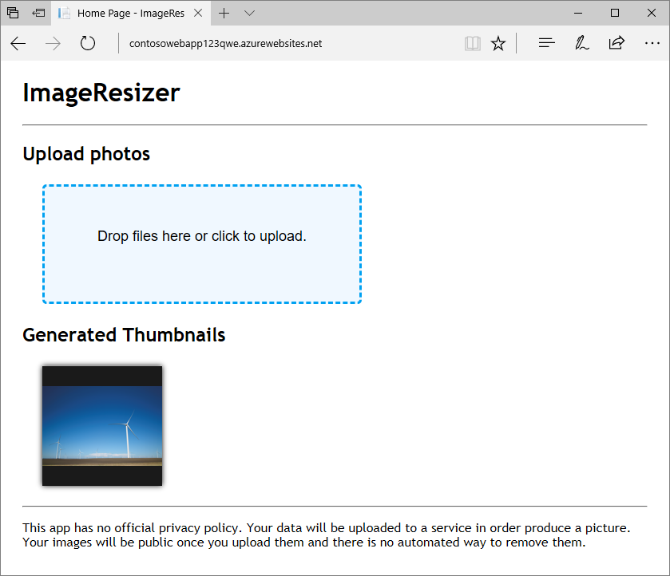
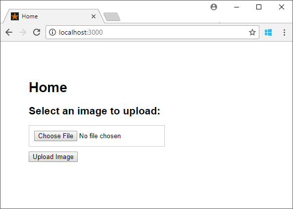
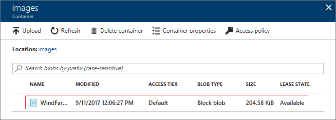

# Tutorial: Upload image data in the cloud with Azure Storage

This tutorial is part one of a series. In this tutorial, you will learn how to deploy a web app that uses the Azure Storage Client Library to upload images to a storage account. When you're finished, you'll have a web app that stores and displays images from Azure storage.

# [\.NET](#tab/dotnet)


# [Node.js V2 SDK](#tab/nodejs)


# [Node.js V10 SDK](#tab/nodejsv10)


---

In part one of the series, you learn how to:

> [!div class="checklist"]
> * Create a storage account
> * Create a container and set permissions
> * Retrieve an access key
> * Deploy a web app to Azure
> * Configure app settings
> * Interact with the web app

## Prerequisites

To complete this tutorial, you need an Azure subscription. Create a [free account](https://azure.microsoft.com/free/?ref=microsoft.com&utm_source=microsoft.com&utm_medium=docs&utm_campaign=visualstudio) before you begin.

[!INCLUDE [cloud-shell-try-it.md](../../../includes/cloud-shell-try-it.md)]

To install and use the CLI locally, this tutorial requires that you run the Azure CLI version 2.0.4 or later. Run `az --version` to find the version. If you need to install or upgrade, see [Install the Azure CLI]( /cli/azure/install-azure-cli). 

## Create a resource group 

Create a resource group with the [az group create](/cli/azure/group) command. An Azure resource group is a logical container into which Azure resources are deployed and managed.  

The following example creates a resource group named `myResourceGroup`.

```azurecli-interactive
az group create --name myResourceGroup --location southeastasia 
```

## Create a storage account

The sample uploads images to a blob container in an Azure Storage account. A storage account provides a unique namespace to store and access your Azure storage data objects. Create a storage account in the resource group you created by using the [az storage account create](/cli/azure/storage/account) command.

> [!IMPORTANT]
> In part 2 of the tutorial, you use Azure Event Grid with Blob storage. Make sure to create your storage account in an Azure region that supports Event Grid. For a list of supported regions, see [Azure products by region](https://azure.microsoft.com/global-infrastructure/services/?products=event-grid&regions=all).

In the following command, replace your own globally unique name for the Blob storage account where you see the `<blob_storage_account>` placeholder.  

```azurecli-interactive
blobStorageAccount=<blob_storage_account>

az storage account create --name $blobStorageAccount \
--location southeastasia --resource-group myResourceGroup \
--sku Standard_LRS --kind blobstorage --access-tier hot 
```

## Create Blob storage containers

The app uses two containers in the Blob storage account. Containers are similar to folders and store blobs. The *images* container is where the app uploads full-resolution images. In a later part of the series, an Azure function app uploads resized image thumbnails to the *thumbnails* container.

Get the storage account key by using the [az storage account keys list](/cli/azure/storage/account/keys) command. Then, use this key to create two containers with the [az storage container create](/cli/azure/storage/container) command.  

The *images* container's public access is set to `off`. The *thumbnails* container's public access is set to `container`. The `container` public access setting permits users who visit the web page to view the thumbnails.

```azurecli-interactive
blobStorageAccountKey=$(az storage account keys list -g myResourceGroup \
-n $blobStorageAccount --query [0].value --output tsv)

az storage container create -n images --account-name $blobStorageAccount \
--account-key $blobStorageAccountKey --public-access off

az storage container create -n thumbnails --account-name $blobStorageAccount \
--account-key $blobStorageAccountKey --public-access container

echo "Make a note of your Blob storage account key..."
echo $blobStorageAccountKey
```

Make a note of your Blob storage account name and key. The sample app uses these settings to connect to the storage account to upload the images. 

## Create an App Service plan

An [App Service plan](../../app-service/overview-hosting-plans.md) specifies the location, size, and features of the web server farm that hosts your app.

Create an App Service plan with the [az appservice plan create](/cli/azure/appservice/plan) command.

The following example creates an App Service plan named `myAppServicePlan` in the **Free** pricing tier:

```azurecli-interactive
az appservice plan create --name myAppServicePlan --resource-group myResourceGroup --sku Free
```

## Create a web app

The web app provides a hosting space for the sample app code that's deployed from the GitHub sample repository. Create a [web app](../../app-service/overview.md) in the `myAppServicePlan` App Service plan with the [az webapp create](/cli/azure/webapp) command.  

In the following command, replace `<web_app>` with a unique name. Valid characters are `a-z`, `0-9`, and `-`. If `<web_app>` is not unique, you get the error message: _Website with given name `<web_app>` already exists._ The default URL of the web app is `https://<web_app>.azurewebsites.net`.  

```azurecli-interactive
webapp=<web_app>

az webapp create --name $webapp --resource-group myResourceGroup --plan myAppServicePlan
```

## Deploy the sample app from the GitHub repository

# [\.NET](#tab/dotnet)

App Service supports several ways to deploy content to a web app. In this tutorial, you deploy the web app from a [public GitHub sample repository](https://github.com/Azure-Samples/storage-blob-upload-from-webapp). Configure GitHub deployment to the web app with the [az webapp deployment source config](/cli/azure/webapp/deployment/source) command.

The sample project contains an [ASP.NET MVC](https://www.asp.net/mvc) app. The app accepts an image, saves it to a storage account, and displays images from a thumbnail container. The web app uses the [Microsoft.Azure.Storage](/dotnet/api/overview/azure/storage), [Microsoft.Azure.Storage.Blob](/dotnet/api/microsoft.azure.storage.blob), and the Microsoft.Azure.Storage.Auth namespaces from the Azure Storage client library to interact with Azure storage.

```azurecli-interactive
az webapp deployment source config --name $webapp \
--resource-group myResourceGroup --branch master --manual-integration \
--repo-url https://github.com/Azure-Samples/storage-blob-upload-from-webapp
```

# [Node.js V2 SDK](#tab/nodejs)
App Service supports several ways to deploy content to a web app. In this tutorial, you deploy the web app from a [public GitHub sample repository](https://github.com/Azure-Samples/storage-blob-upload-from-webapp-node). Configure GitHub deployment to the web app with the [az webapp deployment source config](/cli/azure/webapp/deployment/source) command. 

```azurecli-interactive
az webapp deployment source config --name $webapp \
--resource-group myResourceGroup --branch master --manual-integration \
--repo-url https://github.com/Azure-Samples/storage-blob-upload-from-webapp-node
```

# [Node.js V10 SDK](#tab/nodejsv10)
App Service supports several ways to deploy content to a web app. In this tutorial, you deploy the web app from a [public GitHub sample repository](https://github.com/Azure-Samples/storage-blob-upload-from-webapp-node-v10). Configure GitHub deployment to the web app with the [az webapp deployment source config](/cli/azure/webapp/deployment/source) command. 

```azurecli-interactive
az webapp deployment source config --name $webapp \
--resource-group myResourceGroup --branch master --manual-integration \
--repo-url https://github.com/Azure-Samples/storage-blob-upload-from-webapp-node-v10
```

---

## Configure web app settings

# [\.NET](#tab/dotnet)

The sample web app uses the [Azure Storage Client Library](/dotnet/api/overview/azure/storage) to request access tokens, which are used to upload images. The storage account credentials used by the Storage SDK are set in the app settings for the web app. Add app settings to the deployed app with the [az webapp config appsettings set](/cli/azure/webapp/config/appsettings) command.

```azurecli-interactive
az webapp config appsettings set --name $webapp --resource-group myResourceGroup \
--settings AzureStorageConfig__AccountName=$blobStorageAccount \
AzureStorageConfig__ImageContainer=images  \
AzureStorageConfig__ThumbnailContainer=thumbnails \
AzureStorageConfig__AccountKey=$blobStorageAccountKey  
```

# [Node.js V2 SDK](#tab/nodejs)

The sample web app uses the [Azure Storage Client Library](https://docs.microsoft.com/javascript/api/azure-storage) to request access tokens, which are used to upload images. The storage account credentials used by the Storage SDK are set in the app settings for the web app. Add app settings to the deployed app with the [az webapp config appsettings set](/cli/azure/webapp/config/appsettings) command.

```azurecli-interactive
storageConnectionString=$(az storage account show-connection-string --resource-group $resourceGroupName \
--name $blobStorageAccount --query connectionString --output tsv)

az webapp config appsettings set --name $webapp --resource-group myResourceGroup \
--settings AzureStorageConfig__ImageContainer=images  \
AzureStorageConfig__ThumbnailContainer=thumbnails \
AzureStorageConfig__AccountName=$blobStorageAccount \
AzureStorageConfig__AccountKey=$blobStorageAccountKey \
AZURE_STORAGE_CONNECTION_STRING=$storageConnectionString
```

# [Node.js V10 SDK](#tab/nodejsv10)

The sample web app uses the [Azure Storage Client Library](https://github.com/Azure/azure-storage-js) to request access tokens, which are used to upload images. The storage account credentials used by the Storage SDK are set in the app settings for the web app. Add app settings to the deployed app with the [az webapp config appsettings set](/cli/azure/webapp/config/appsettings) command.

```azurecli-interactive
az webapp config appsettings set --name $webapp --resource-group myResourceGroup \
--settings AZURE_STORAGE_ACCOUNT_NAME=$blobStorageAccount \
AZURE_STORAGE_ACCOUNT_ACCESS_KEY=$blobStorageAccountKey
```

---

After you deploy and configure the web app, you can test the image upload functionality in the app.

## Upload an image

To test the web app, browse to the URL of your published app. The default URL of the web app is `https://<web_app>.azurewebsites.net`.

# [\.NET](#tab/dotnet)

Select the **Upload photos** region to select and upload a file, or drag a file onto the region. The image disappears if successfully uploaded. The **Generated Thumbnails** section will remain empty until we test it later in this topic.


In the sample code, the `UploadFiletoStorage` task in the *Storagehelper.cs* file is used to upload the images to the *images* container within the storage account using the [UploadFromStreamAsync](/dotnet/api/microsoft.azure.storage.blob.cloudblockblob.uploadfromstreamasync) method. The following code sample contains the `UploadFiletoStorage` task.

```csharp
public static async Task<bool> UploadFileToStorage(Stream fileStream, string fileName, AzureStorageConfig _storageConfig)
{
    // Create storagecredentials object by reading the values from the configuration (appsettings.json)
    StorageCredentials storageCredentials = new StorageCredentials(_storageConfig.AccountName, _storageConfig.AccountKey);

    // Create cloudstorage account by passing the storagecredentials
    CloudStorageAccount storageAccount = new CloudStorageAccount(storageCredentials, true);

    // Create the blob client.
    CloudBlobClient blobClient = storageAccount.CreateCloudBlobClient();

    // Get reference to the blob container by passing the name by reading the value from the configuration (appsettings.json)
    CloudBlobContainer container = blobClient.GetContainerReference(_storageConfig.ImageContainer);

    // Get the reference to the block blob from the container
    CloudBlockBlob blockBlob = container.GetBlockBlobReference(fileName);

    // Upload the file
    await blockBlob.UploadFromStreamAsync(fileStream);

    return await Task.FromResult(true);
}
```

The following classes and methods are used in the preceding task:

|Class  |Method  |
|---------|---------|
|[StorageCredentials](/dotnet/api/microsoft.azure.cosmos.table.storagecredentials)     |         |
|[CloudStorageAccount](/dotnet/api/microsoft.azure.cosmos.table.cloudstorageaccount)    |  [CreateCloudBlobClient](/dotnet/api/microsoft.azure.storage.blob.blobaccountextensions.createcloudblobclient)       |
|[CloudBlobClient](/dotnet/api/microsoft.azure.storage.blob.cloudblobclient)     |[GetContainerReference](/dotnet/api/microsoft.azure.storage.blob.cloudblobclient.getcontainerreference)         |
|[CloudBlobContainer](/dotnet/api/microsoft.azure.storage.blob.cloudblobcontainer)    | [GetBlockBlobReference](/dotnet/api/microsoft.azure.storage.blob.cloudblobcontainer.getblockblobreference)        |
|[CloudBlockBlob](/dotnet/api/microsoft.azure.storage.blob.cloudblockblob)     | [UploadFromStreamAsync](/dotnet/api/microsoft.azure.storage.file.cloudfile.uploadfromstreamasync)        |

# [Node.js V2 SDK](#tab/nodejs)

Select **Choose File** to select a file, then click **Upload Image**. The **Generated Thumbnails** section will remain empty until we test it later in this topic. 



In the sample code, the `post` route is responsible for uploading the image into a blob container. The route uses the modules to help process the upload:

- [multer](https://github.com/expressjs/multer) implements the upload strategy for the route handler.
- [into-stream](https://github.com/sindresorhus/into-stream) converts the buffer into a stream as required by [createBlockBlobFromStream].(https://azure.github.io/azure-sdk-for-node/azure-storage-legacy/latest/BlobService.html)

As the file is sent to the route, the contents of the file stay in memory until the file is uploaded to the blob container.

> [!IMPORTANT]
> Loading large files into memory may have a negative effect on your web app's performance. If you expect users to post large files, you may want to consider staging files on the web server file system and then scheduling uploads into Blob storage. Once the files are in Blob storage, you can remove them from the server file system.

```javascript
const
      express = require('express')
    , router = express.Router()

    , multer = require('multer')
    , inMemoryStorage = multer.memoryStorage()
    , uploadStrategy = multer({ storage: inMemoryStorage }).single('image')

    , azureStorage = require('azure-storage')
    , blobService = azureStorage.createBlobService()

    , getStream = require('into-stream')
    , containerName = 'images'
;

const handleError = (err, res) => {
    res.status(500);
    res.render('error', { error: err });
};

const getBlobName = originalName => {
    const identifier = Math.random().toString().replace(/0\./, ''); // remove "0." from start of string
    return `${originalName}-${identifier}`;
};

router.post('/', uploadStrategy, (req, res) => {

    const
          blobName = getBlobName(req.file.originalname)
        , stream = getStream(req.file.buffer)
        , streamLength = req.file.buffer.length
    ;

    blobService.createBlockBlobFromStream(containerName, blobName, stream, streamLength, err => {

        if(err) {
            handleError(err);
            return;
        }

        res.render('success', { 
            message: 'File uploaded to Azure Blob storage.' 
        });
    });
});
```

# [Node.js V10 SDK](#tab/nodejsv10)

Select **Choose File** to select a file, then click **Upload Image**. The **Generated Thumbnails** section will remain empty until we test it later in this topic. 


In the sample code, the `post` route is responsible for uploading the image into a blob container. The route uses the modules to help process the upload:

- [multer](https://github.com/expressjs/multer) implements the upload strategy for the route handler.
- [into-stream](https://github.com/sindresorhus/into-stream) converts the buffer into a stream as required by [createBlockBlobFromStream](https://azure.github.io/azure-sdk-for-node/azure-storage-legacy/latest/BlobService.html).

As the file is sent to the route, the contents of the file stay in memory until the file is uploaded to the blob container.

> [!IMPORTANT]
> Loading large files into memory may have a negative effect on your web app's performance. If you expect users to post large files, you may want to consider staging files on the web server file system and then scheduling uploads into Blob storage. Once the files are in Blob storage, you can remove them from the server file system.

```javascript
const {
  Aborter,
  BlobURL,
  BlockBlobURL,
  ContainerURL,
  ServiceURL,
  StorageURL,
  SharedKeyCredential,
  uploadStreamToBlockBlob
} = require('@azure/storage-blob');

const express = require('express');
const router = express.Router();
const multer = require('multer');
const inMemoryStorage = multer.memoryStorage();
const uploadStrategy = multer({ storage: inMemoryStorage }).single('image');
const getStream = require('into-stream');
const containerName = 'images';
const ONE_MEGABYTE = 1024 * 1024;
const uploadOptions = { bufferSize: 4 * ONE_MEGABYTE, maxBuffers: 20 };
const ONE_MINUTE = 60 * 1000;
const aborter = Aborter.timeout(30 * ONE_MINUTE);

const sharedKeyCredential = new SharedKeyCredential(
  process.env.AZURE_STORAGE_ACCOUNT_NAME,
  process.env.AZURE_STORAGE_ACCOUNT_ACCESS_KEY);
const pipeline = StorageURL.newPipeline(sharedKeyCredential);
const serviceURL = new ServiceURL(
  `https://${process.env.AZURE_STORAGE_ACCOUNT_NAME}.blob.core.windows.net`,
  pipeline
);

const getBlobName = originalName => {
  // Use a random number to generate a unique file name, 
  // removing "0." from the start of the string.
  const identifier = Math.random().toString().replace(/0\./, ''); 
  return `${identifier}-${originalName}`;
};

router.post('/', uploadStrategy, async (req, res) => {

    const blobName = getBlobName(req.file.originalname);
    const stream = getStream(req.file.buffer);
    const containerURL = ContainerURL.fromServiceURL(serviceURL, containerName);
    const blobURL = BlobURL.fromContainerURL(containerURL, blobName);
    const blockBlobURL = BlockBlobURL.fromBlobURL(blobURL);

    try {
      
      await uploadStreamToBlockBlob(aborter, stream,
        blockBlobURL, uploadOptions.bufferSize, uploadOptions.maxBuffers);

      res.render('success', { message: 'File uploaded to Azure Blob storage.' });   

    } catch (err) {

      res.render('error', { message: 'Something went wrong.' });

    }
});
```
---

## Verify the image is shown in the storage account

Sign in to the [Azure portal](https://portal.azure.com). From the left menu, select **Storage accounts**, then select the name of your storage account. Under **Blob Service**, select **Blobs**, then select the **images** container.

Verify the image is shown in the container.



## Test thumbnail viewing

To test thumbnail viewing, you'll upload an image to the **thumbnails** container to check whether the app can read the **thumbnails** container.

Sign in to the [Azure portal](https://portal.azure.com). From the left menu, select **Storage accounts**, then select the name of your storage account. Under **Blob Service**, select **Blobs**, then select the **thumbnails** container. Select **Upload** to open the **Upload blob** pane.

Choose a file with the file picker and select **Upload**.

Navigate back to your app to verify that the image uploaded to the **thumbnails** container is visible.

# [\.NET](#tab/dotnet)


# [Node.js V2 SDK](#tab/nodejs)


# [Node.js V10 SDK](#tab/nodejsv10)


---

In part two of the series, you automate thumbnail image creation so you don't need this image. In the **thumbnails** container in the Azure portal, select the image you uploaded and select **Delete** to delete the image. 

You can enable CDN to cache content from your Azure storage account. For more information about how to enable CDN with your Azure storage account, see [Integrate an Azure storage account with Azure CDN](../../cdn/cdn-create-a-storage-account-with-cdn.md).

## Next steps

In part one of the series, you learned how to configure a web app to interact with storage.

Go on to part two of the series to learn about using Event Grid to trigger an Azure function to resize an image.

> [!div class="nextstepaction"]
> [Use Event Grid to trigger an Azure Function to resize an uploaded image](../../event-grid/resize-images-on-storage-blob-upload-event.md?toc=%2fazure%2fstorage%2fblobs%2ftoc.json)
