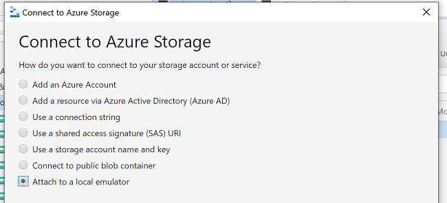
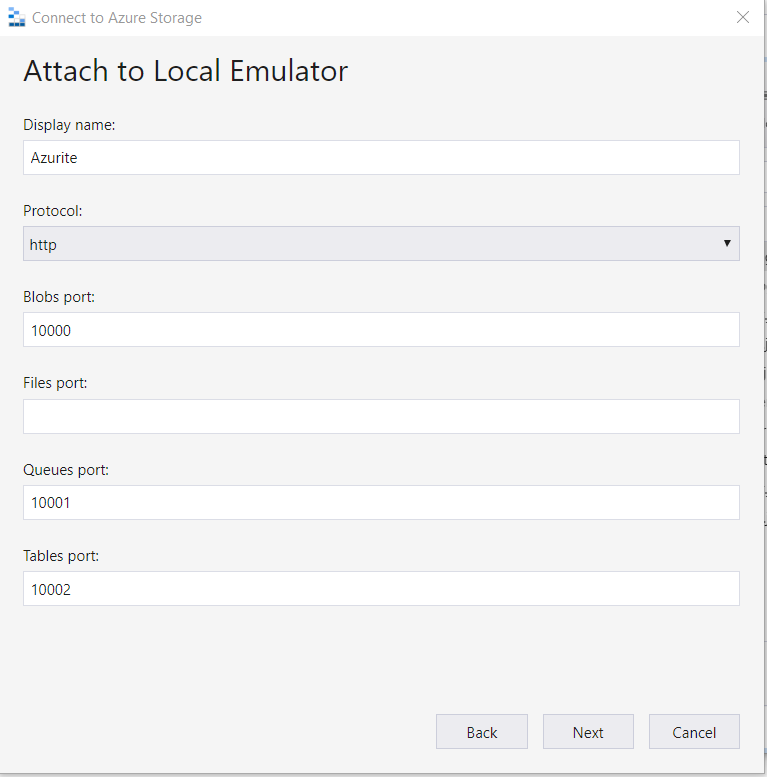
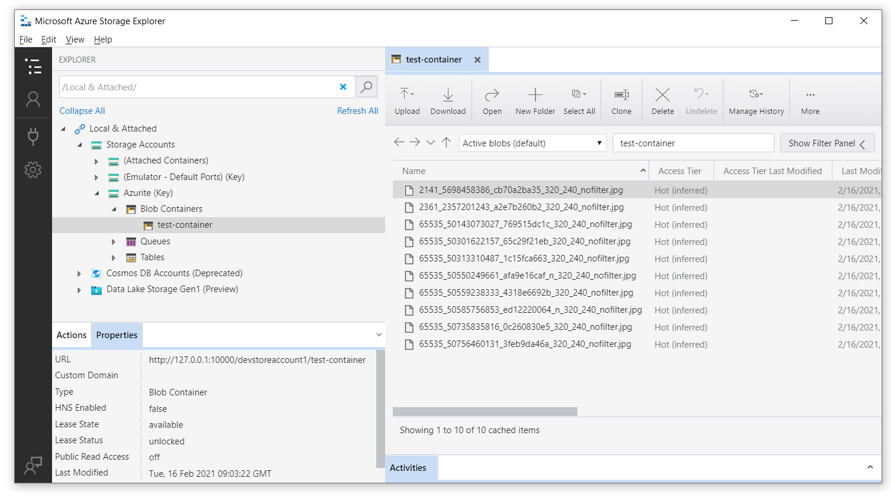
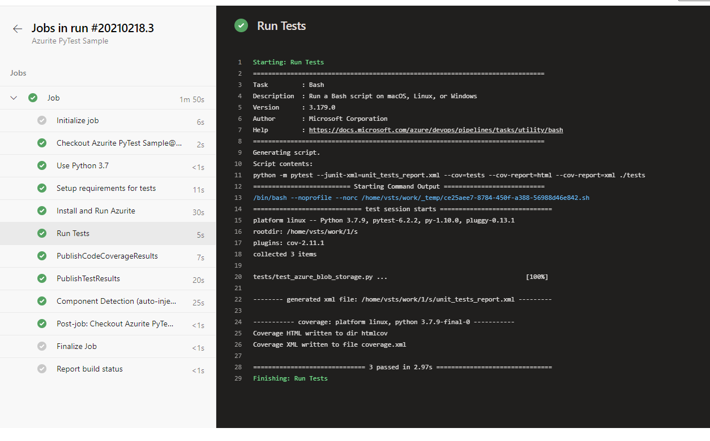

# Using Azurite to run blob storage tests in pipeline

This document determines the approach for writing automated tests with a short feedback loop (i.e. unit tests) against security considerations (private endpoints) for the Azure Blob Storage functionality.

Once private endpoints are enabled for the Azure Storage accounts, the current tests will fail when executed locally or as part of a pipeline because this connection will be blocked.

## 1. Run tests on your local

Python 3.8.7 is used for this, but it should be fine on other 3.x versions as well.

1. Install and run Azurite for local tests:

   Option 1: using npm:

   ```bash
   # Install Azurite
   npm install -g azurite
   
   # Create azurite directory
   mkdir c:/azurite
   
   # Launch Azurite for Windows
   azurite --silent --location c:\azurite --debug c:\azurite\debug.log
   ```

   Option 2: using docker

   ```bash
   docker run -p 10000:10000 mcr.microsoft.com/azure-storage/azurite azurite-blob --blobHost 0.0.0.0
   ```

1. In Azure Storage Explorer, select `Attach to a local emulator`

   

1. Provide a Display name and port number, then your connection will be ready and you can use Storage Explorer to manage your local blob storage.

   

   To test and see how these endpoints are running you can attach your local blob storage to the [**Azure Storage Explorer**](https://azure.microsoft.com/en-us/features/storage-explorer/).

1. Create a virtual python environment  
   `python -m venv .venv`

1. Container name and initilize env variables: Use conftest.py for test.

   ```python
   from azure.storage.blob import BlobServiceClient
   import os

   def pytest_generate_tests(metafunc):
      os.environ['STORAGE_CONNECTION_STRING'] = 'DefaultEndpointsProtocol=http;AccountName=devstoreaccount1;AccountKey=Eby8vdM02xNOcqFlqUwJPLlmEtlCDXJ1OUzFT50uSRZ6IFsuFq2UVErCz4I6tq/K1SZFPTOtr/KBHBeksoGMGw==;BlobEndpoint=http://127.0.0.1:10000/devstoreaccount1;'
      os.environ['STORAGE_CONTAINER'] = 'test-container'

      # Crete container for Azurite for the first run
      blob_service_client = BlobServiceClient.from_connection_string(os.environ.get("STORAGE_CONNECTION_STRING"))
      try:
         blob_service_client.create_container(os.environ.get("STORAGE_CONTAINER"))
      except Exception as e:
         print(e)
   ```

   **Note: value for `STORAGE_CONNECTION_STRING` is default value for Azurite, it's not a private key*

1. Install the dependencies  

    `pip install -r requirements_tests.txt`

1. Run tests:

   ```bash
   python -m pytest ./tests
   ```

After running tests, you can see the files in your local blob storage



## 2. Run tests on Azure Pipelines

After running tests in our local we need to make sure these tests pass on Azure Pipelines too. We have 2 options here, we can use docker image as hosted agent on Azure or using npm package in the Pipeline steps. In our case we use npm packages.
  
```bash
trigger:
- master

steps:
- task: UsePythonVersion@0
  displayName: 'Use Python 3.7'
  inputs:
    versionSpec: 3.7

- bash: |
    pip install -r requirements_tests.txt
  displayName: 'Setup requirements for tests'
  
- bash: |
    sudo npm install -g azurite
    sudo mkdir azurite
    sudo azurite --silent --location azurite --debug azurite\debug.log &
  displayName: 'Install and Run Azurite'

- bash: |
    python -m pytest --junit-xml=unit_tests_report.xml --cov=tests --cov-report=html --cov-report=xml ./tests
  displayName: 'Run Tests'

- task: PublishCodeCoverageResults@1
  inputs:
    codeCoverageTool: Cobertura
    summaryFileLocation: '$(System.DefaultWorkingDirectory)/**/coverage.xml'
    reportDirectory: '$(System.DefaultWorkingDirectory)/**/htmlcov'

- task: PublishTestResults@2
  inputs:
    testResultsFormat: 'JUnit'
    testResultsFiles: '**/*_tests_report.xml'
    failTaskOnFailedTests: true
```

Once we set up our pipeline in Azure Pipelines, result will be like below


