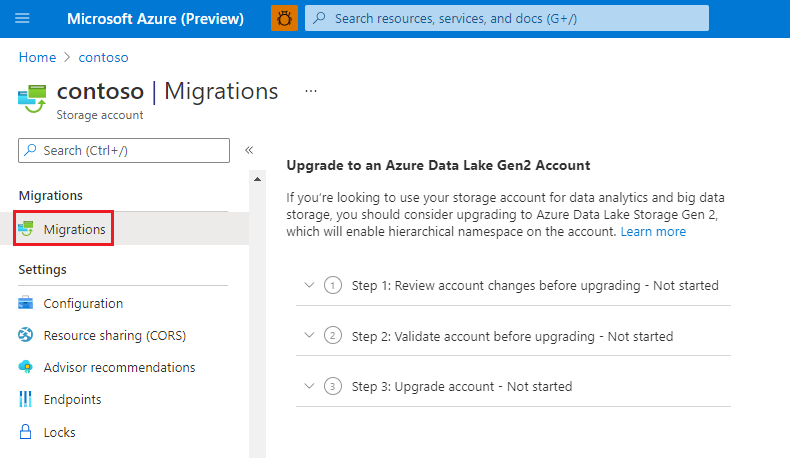
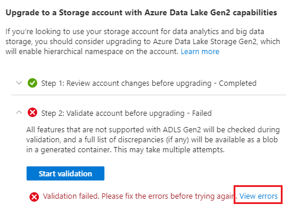
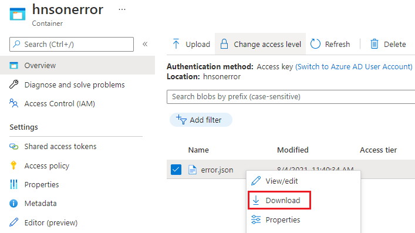
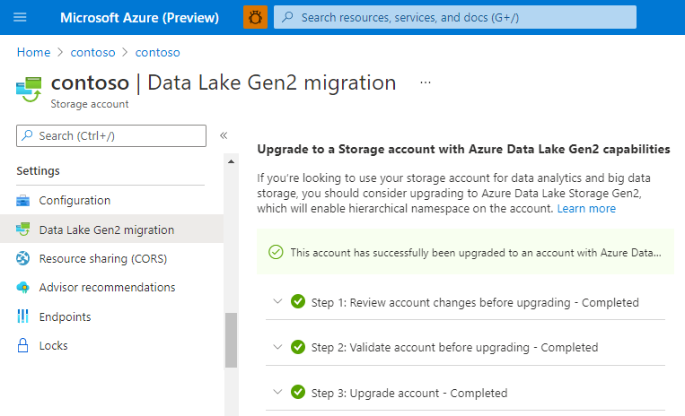
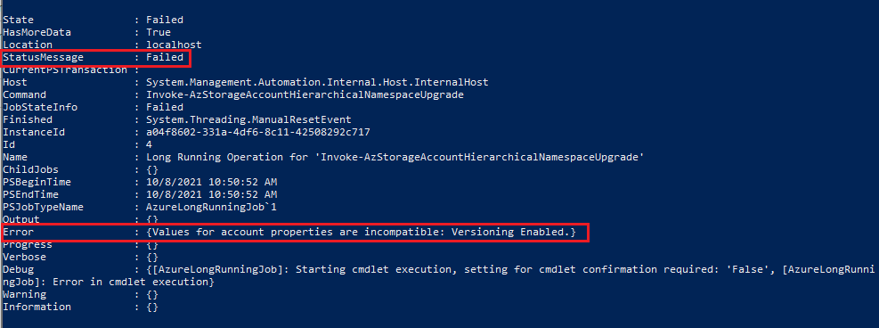
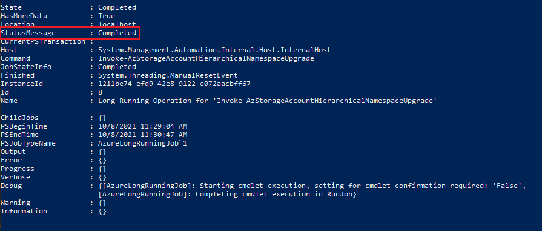
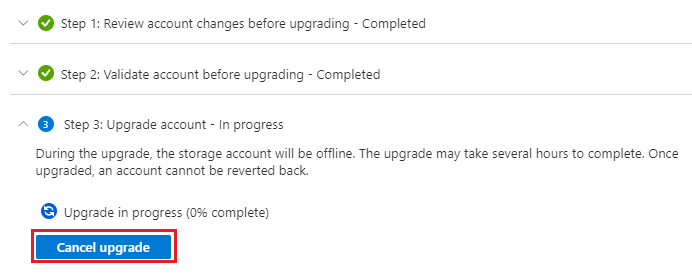
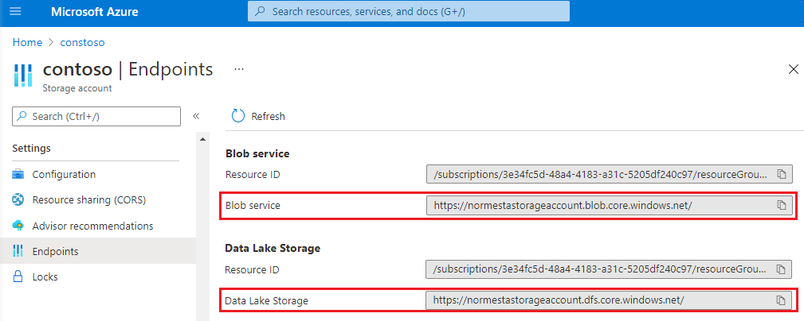

# Upgrade Azure Blob Storage with Azure Data Lake Storage Gen2 capabilities

This article helps you to enable a hierarchical namespace and unlock capabilities such as file and directory-level security and faster operations. These capabilities are widely used by big data analytics workloads and are referred to collectively as Azure Data Lake Storage Gen2.

To learn more about these capabilities and evaluate the impact of this upgrade on workloads, applications, costs, service integrations, tools, features, and documentation, see [Upgrading Azure Blob Storage with Azure Data Lake Storage Gen2 capabilities](upgrade-to-data-lake-storage-gen2.md).

> [!IMPORTANT]
> An upgrade is one-way. There's no way to revert your account once you've performed the upgrade. We recommend that you validate your upgrade in a nonproduction environment.

## Prepare to upgrade

To prepare to upgrade your storage account to Data Lake Storage Gen2:

> [!div class="checklist"]
> - [Review feature support](#review-feature-support)
> - [Ensure the segments of each blob path are named](#ensure-the-segments-of-each-blob-path-are-named)
> - [Prevent write activity to the storage account](#prevent-write-activity-to-the-storage-account)

### Review feature support

Your storage account might be configured to use features that aren't yet supported in Data Lake Storage Gen2 enabled accounts. If your account is using such features, the upgrade will not pass the validation step. Review the [Blob Storage feature support in Azure Storage accounts](storage-feature-support-in-storage-accounts.md) article to identify unsupported features. If you're using any such features in your account, disable them before you begin the upgrade.

The following features are supported for Data Lake Storage Gen2 accounts, but are not supported by the upgrade process:

- Blob snapshots
- Encryption scopes
- Immutable storage
- Last access time tracking for lifecycle management
- Soft delete for blobs
- Soft delete for containers

If your storage account has such features enabled, you must disable them before performing the upgrade. If you want to resume using the features after the upgrade is complete, re-enable them.

In some cases, you will have to allow time for clean-up operations after a feature is disabled before upgrading. One example is the [blob soft delete](soft-delete-blob-overview.md) feature. You must disable blob soft delete and then allow all soft-delete blobs to expire before you can upgrade the account.

> [!IMPORTANT]
> You cannot upgrade a storage account to Data Lake Storage Gen2 that has **ever** had the change feed feature enabled.
> Simply disabling change feed will not allow you to perform an upgrade. To convert such an account to Data Lake Storage Gen2, you must perform a manual migration. For migration options, see [Migrate a storage account](../common/storage-account-overview.md#migrate-a-storage-account).

### Ensure the segments of each blob path are named

The migration process creates a directory for each path segment of a blob. Data Lake Storage Gen2 directories must have a name so for migration to succeed, each path segment in a virtual directory must have a name. The same requirement is true for segments that are named only with a space character. If any path segments are either unnamed (`//`) or named only with a space character (`_`), then before you proceed with the migration, you must copy those blobs to a new path that is compatible with these naming requirements.

### Prevent write activity to the storage account

The upgrade might fail if an application writes to the storage account during the upgrade. To prevent such write activity:

1. Quiesce any applications or services that might perform write operations.
1. Release or break existing leases on containers and blobs in the storage account.
1. Acquire new leases on all containers and blobs in the account. The new leases should be infinite or long enough to prevent write access for the duration of the upgrade.

After the upgrade has completed, break the leases you created to resume allowing write access to the containers and blobs.

> [!WARNING]
> Breaking an active lease without gracefully disabling applications or virtual machines that are currently accessing those resources could have unexpected results. Be sure to quiesce any current write activities before breaking any current leases.

## Perform the upgrade

### [Portal](#tab/azure-portal)

1. Sign in to the [Azure portal](https://portal.azure.com/) to get started.

2. Locate your storage account and display the account overview.

3. Select **Data Lake Gen2 migration**.

   The **Upgrade to a Storage account with Azure Data Lake Gen2 capabilities** configuration page appears.

   > [!div class="mx-imgBorder"]
   > 

4. Expand the **Step 1: Review account changes before upgrading** section and click **Review and agree to changes**.

5. In the **Review account changes** page, select the checkbox and then click **Agree to changes**.

6. Expand the **Step 2: Validate account before upgrading** section and then click **Start validation**.

   If validation fails, an error appears in the page. In some cases, a **View errors** link appears. If that link appears, select it. 

   > [!div class="mx-imgBorder"]
   > 

   Then, from the context menu of the **error.json** file, select **Download**.

   > [!div class="mx-imgBorder"]
   > 

   Open the downloaded file to determine why the account did not pass the validation step. The following JSON indicates that an incompatible feature is enabled on the account. In this case, you would disable the feature and then start the validation process again.

   ```json
   {
    "startTime": "2021-08-04T18:40:31.8465320Z",
    "id": "45c84a6d-6746-4142-8130-5ae9cfe013a0",
    "incompatibleFeatures": [
        "Blob Delete Retention Enabled"
    ],
    "blobValidationErrors": [],
    "scannedBlobCount": 0,
    "invalidBlobCount": 0,
    "endTime": "2021-08-04T18:40:34.9371480Z"
   }
   ```

7. After your account has been successfully validated, expand the **Step 3: Upgrade account** section, and then click **Start upgrade**.

   > [!IMPORTANT]
   > Write operations are disabled while your account is being upgraded. Read operations aren't disabled, but we strongly recommend that you suspend read operations as they might destabilize the upgrade process.

   When the migration has completed successfully, a message similar to the following appears. 

   > [!div class="mx-imgBorder"]
   > 

### [PowerShell](#tab/azure-powershell)

1. Open a Windows PowerShell command window.

2. Make sure that you have the latest Azure PowerShell module. See [Install Azure PowerShell module](/powershell/azure/install-azure-powershell).

3. Sign in to your Azure subscription with the `Connect-AzAccount` command and follow the on-screen directions.

   ```powershell
   Connect-AzAccount
   ```

4. If your identity is associated with more than one subscription, then set your active subscription.

   ```powershell
   $context = Get-AzSubscription -SubscriptionId <subscription-id>
   Set-AzContext $context
   ```

   Replace the `<subscription-id>` placeholder value with the ID of your subscription.

6. Validate your storage account by using the following command.

   ```powershell
   $result = Invoke-AzStorageAccountHierarchicalNamespaceUpgrade -ResourceGroupName "<resource-group-name>" -Name "<storage-account-name>" -RequestType Validation -AsJob
   ```

   - Replace the `<resource-group-name>` placeholder value with the name of your resource group.

   - Replace the `<storage-account-name>` placeholder value with the name of your storage account.

   Depending on the size of your account, this process can take some time. You can use the `asJob` switch to run the command in a background job so that your client isn't blocked. The command runs remotely, but the job exists on your local machine or the VM from which you run the command. The results are transmitted to your local machine or the VM.

7. To check the status of the job, and display all of the properties of the job in a list, pipe the return variable to the `Format-List` cmdlet. 

   ```powershell
   $result | Format-List -Property *
   ```

   If the validation succeeds, the **State** property will be set to **Completed**.

   If validation fails, the **State** property will be set to **Failed**, and the **Error** property will show validation errors. 

   The following output indicates that an incompatible feature is enabled on the account. In this case, you would disable the feature and then start the validation process again.

   > [!div class="mx-imgBorder"]
   > 

   In some cases, the **Error** property provides you with a path to a file named **error.json**. You can open that file to determine why the account did not pass the validation step. 

   The following JSON indicates that an incompatible feature is enabled on the account. In this case, you would disable the feature and then start the validation process again.

   ```json
   {
    "startTime": "2021-08-04T18:40:31.8465320Z",
    "id": "45c84a6d-6746-4142-8130-5ae9cfe013a0",
    "incompatibleFeatures": [
        "Blob Delete Retention Enabled"
    ],
    "blobValidationErrors": [],
    "scannedBlobCount": 0,
    "invalidBlobCount": 0,
    "endTime": "2021-08-04T18:40:34.9371480Z"
   }
   ```

8. After your account has been successfully validated, start the upgrade by running the following command.
   
   ```powershell
   $result = Invoke-AzStorageAccountHierarchicalNamespaceUpgrade -ResourceGroupName "<resource-group-name>" -Name "<storage-account-name>" -RequestType Upgrade -AsJob -Force
   ```

   Like the validation example above, this example uses the `asJob` switch to run the command in a background job. The `Force` switch overrides prompts to confirm the upgrade.  If you don't use the `AsJob` switch, you don't have to use the `Force` switch because you can just respond to the prompts.

   > [!IMPORTANT]
   > Write operations are disabled while your account is being upgraded. Read operations aren't disabled, but we strongly recommend that you suspend read operations as they might destabilize the upgrade process.

   To check the status of the job, use the same techniques as described in the previous steps. As the process runs, the **State** property will be set to **Running**.

   When the migration has completed successfully, the **State** property will be set to **Completed** and the **Error** property will not show any errors.
   
   > [!div class="mx-imgBorder"]
   > 

   > [!IMPORTANT]
   > A rough estimate of the upgrade time would be approximately 5-10 minutes per 2 million blobs. For example, if the account has 10 million blobs, then the upgrade will take approximately 25-50 minutes. Accounts that contain fewer than 2 million blobs typically upgrade in less than 10 minutes.

### [Azure CLI](#tab/azure-cli)

1. First, open the [Azure Cloud Shell](../../cloud-shell/overview.md), or if you've [installed](/cli/azure/install-azure-cli) the Azure CLI locally, open a command console application such as Windows PowerShell.

2. Verify that the version of Azure CLI that have installed is `2.29.0` or higher by using the following command.

   ```azurecli
    az --version
   ```

   If your version of Azure CLI is lower than `2.29.0`, then install the latest version. For more information, see [Install the Azure CLI](/cli/azure/install-azure-cli).

2. If your identity is associated with more than one subscription, then set your active subscription.

   ```azurecli
      az account set --subscription <subscription-id>
   ```

   Replace the `<subscription-id>` placeholder value with the ID of your subscription.

3. Validate your storage account by using the following command.

   ```azurecli
   az storage account hns-migration start --type validation -n <storage-account-name> -g <resource-group-name>
   ```

   - Replace the `<resource-group-name>` placeholder value with the name of your resource group.

   - Replace the `<storage-account-name>` placeholder value with the name of your storage account.

   If the validation succeeds, the process completes and no errors appear.
   
   If validation fails, a validation error will appear in the console. For example, the error `(IncompatibleValuesForAccountProperties) Values for account properties are incompatible: Versioning Enabled` indicates that an incompatible feature (Versioning) is enabled on the account. In this case, you would disable the feature and then start the validation process again.

   In some cases, the path to a file named **error.json** appears in the console. You can open that file to determine why the account did not pass the validation step. 

   The following JSON indicates that an incompatible feature is enabled on the account. In this case, you would disable the feature and then start the validation process again.

   ```json
   {
    "startTime": "2021-08-04T18:40:31.8465320Z",
    "id": "45c84a6d-6746-4142-8130-5ae9cfe013a0",
    "incompatibleFeatures": [
        "Blob Delete Retention Enabled"
    ],
    "blobValidationErrors": [],
    "scannedBlobCount": 0,
    "invalidBlobCount": 0,
    "endTime": "2021-08-04T18:40:34.9371480Z"
   }
   ```

5. After your account has been successfully validated, start the upgrade by running the following command.
   
   ```azurecli
   az storage account hns-migration start --type upgrade -n storage-account-name -g <resource-group-name>
   ```

   > [!IMPORTANT]
   > Write operations are disabled while your account is being upgraded. Read operations aren't disabled, but we strongly recommend that you suspend read operations as they might destabilize the upgrade process.

   If the migration succeeds, the process completes and no errors appear.

---

## Stop the upgrade

You can stop the migration before it completes.

### [Portal](#tab/azure-portal)

To stop the upgrade before it completes, select **Cancel upgrade** while the upgrade is in progress.

> [!div class="mx-imgBorder"]
> 

### [PowerShell](#tab/azure-powershell)

To stop the upgrade before it completes, use the `Stop-AzStorageAccountHierarchicalNamespaceUpgrade` command.

```powershell
Stop-AzStorageAccountHierarchicalNamespaceUpgrade -ResourceGroupName <resource-group-name> -Name <storage-account-name>
```

### [Azure CLI](#tab/azure-cli)

To stop the upgrade before it completes, use the `az storage account hns-migration stop` command.

```azurecli
az storage account hns-migration stop -n <storage-account-name> -g <resource-group-name>
```

---


## Migrate data, workloads, and applications 

1. Configure [services in your workloads](./data-lake-storage-supported-azure-services.md) to point to either the **Blob service** endpoint or the **Data Lake storage** endpoint.

   > [!div class="mx-imgBorder"]
   > 
  
3. For Hadoop workloads that use Windows Azure Storage Blob driver or [WASB](https://hadoop.apache.org/docs/current/hadoop-azure/index.html) driver, make sure to modify them to use the [Azure Blob File System (ABFS)](https://hadoop.apache.org/docs/stable/hadoop-azure/abfs.html) driver. Unlike the WASB driver that makes requests to the **Blob service** endpoint, the ABFS driver will make requests to the **Data Lake Storage** endpoint of your account.

2. Test custom applications to ensure that they work as expected with your upgraded account. 

   [Multi-protocol access on Data Lake Storage](data-lake-storage-multi-protocol-access.md) enables most applications to continue using Blob APIs without modification. If you encounter issues or you want to use APIs to work with directory operations and ACLs, consider moving some of your code to use Data Lake Storage Gen2 APIs. See guides for [.NET](data-lake-storage-directory-file-acl-dotnet.md), [Java](data-lake-storage-directory-file-acl-java.md), [Python](data-lake-storage-directory-file-acl-python.md), [Node.js](data-lake-storage-acl-javascript.md), and [REST](/rest/api/storageservices/data-lake-storage-gen2). 

3. Test any custom scripts to ensure that they work as expected with your upgraded account. 

   As is the case with Blob APIs, many of your scripts will likely work without requiring you to modify them. However, if  needed, you can upgrade script files to use Data Lake Storage Gen2 [PowerShell cmdlets](data-lake-storage-directory-file-acl-powershell.md), and [Azure CLI commands](data-lake-storage-directory-file-acl-cli.md).
 

## See also

[Introduction to Azure Data Lake storage Gen2](data-lake-storage-introduction.md)
