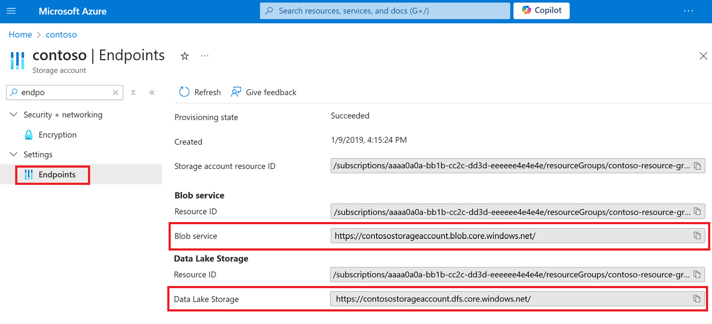

#  Upgrade Azure Blob Storage with Azure Data Lake Storage Gen2 capabilities

This article helps you unlock capabilities such as file and directory-level security and faster operations. These capabilities are widely used by big data analytics workloads and are referred to collectively as Azure Data Lake Storage Gen2. 

To learn more about these capabilities and evaluate the impact of this upgrade on workloads, applications, costs, service integrations, tools, features, and documentation, see [Upgrading Azure Blob Storage with Azure Data Lake Storage Gen2 capabilities](upgrade-to-data-lake-storage-gen2.md).

> [!IMPORTANT]
> An upgrade is one-way. There's no way to revert your account once you've performed the upgrade. We recommend that you validate your upgrade in a non production environment.

## Perform the upgrade

### [Portal](#tab/azure-portal)

1. Sign in to the [Azure portal](https://portal.azure.com/) to get started.

2. Locate your storage account and display the account overview.

3. Select **Migrations**.

   The **Upgrade to an Azure Data Lake Gen2 Account** configuration page appears.

   > [!div class="mx-imgBorder"]
   > 

4. Expand the **Step 1: Review account changes before upgrading** section and click **Review and agree to changes**.

5. In the **Review account changes** page, select the checkbox and then click **Agree to changes**.

6. Expand the **Step 2: Validate account before upgrading** section and then click **Start validation**.

   Put something here about what to do if you encounter errors.

7. Expand the **Step 3: Upgrade account** section, and then click **Start upgrade**.

### [Azure CLI](#tab/azure-cli)

<a id="cli"></a>

You can upgrade your account by using the [Azure Command-Line Interface (CLI)](/cli/azure/).

1. First, open the [Azure Cloud Shell](../../cloud-shell/overview.md), or if you've [installed](/cli/azure/install-azure-cli) the Azure CLI locally, open a command console application such as Windows PowerShell.

2. If your identity is associated with more than one subscription, then set your active subscription to subscription of the storage account that will host your static website.

   ```azurecli-interactive
   az account set --subscription <subscription-id>
   ```

   Replace the `<subscription-id>` placeholder value with the ID of your subscription.

3. Step goes here.

### [PowerShell](#tab/azure-powershell)

<a id="powershell"></a>

You can enable static website hosting by using the Azure PowerShell module.

1. Open a Windows PowerShell command window.

2. Verify that you have Azure PowerShell module Az version 0.7 or later.

   ```powershell
   Get-InstalledModule -Name Az -AllVersions | select Name,Version
   ```

   If you need to install or upgrade, see [Install Azure PowerShell module](/powershell/azure/install-Az-ps).

3. Sign in to your Azure subscription with the `Connect-AzAccount` command and follow the on-screen directions.

   ```powershell
   Connect-AzAccount
   ```

4. If your identity is associated with more than one subscription, then set your active subscription to subscription of the storage account that will host your static website.

   ```powershell
   $context = Get-AzSubscription -SubscriptionId <subscription-id>
   Set-AzContext $context
   ```

   Replace the `<subscription-id>` placeholder value with the ID of your subscription.

5. Get the storage account context that defines the storage account you want to use.

   ```powershell
   $storageAccount = Get-AzStorageAccount -ResourceGroupName "<resource-group-name>" -AccountName "<storage-account-name>"
   $ctx = $storageAccount.Context
   ```

   * Replace the `<resource-group-name>` placeholder value with the name of your resource group.

   * Replace the `<storage-account-name>` placeholder value with the name of your storage account.

6. Step goes here.

---

## Migrate data, workloads, and applications 

1. Configure [services in your workloads](data-lake-storage-integrate-with-azure-services.md) to point to either the **Blob service** endpoint or the **Data Lake storage** endpoint.

   > [!div class="mx-imgBorder"]
   > 
  
3. For Hadoop workloads that use Windows Azure Storage Blob driver or [WASB](https://hadoop.apache.org/docs/current/hadoop-azure/index.html) driver, make sure to modify them to use the the Azure Blob File System driver or [ABFS driver](https://hadoop.apache.org/docs/stable/hadoop-azure/abfs.html). 

2. Test custom applications to ensure that they work as expected with your upgraded account. 

   [Multi-protocol access on Data Lake Storage](data-lake-storage-multi-protocol-access.md) enables most applications to continue using Blob APIs without modification. If you encounter issues or you want to use APIs to work with directory operations and ACLs, consider moving some of your code to use Data Lake Storage Gen2 APIs. See guides for [.NET](data-lake-storage-directory-file-acl-dotnet.md), [Java](data-lake-storage-directory-file-acl-java.md), [Python](data-lake-storage-directory-file-acl-python.md), [Node.js](data-lake-storage-acl-javascript.md), and [REST](/rest/api/storageservices/data-lake-storage-gen2). 

3. Test any custom scripts to ensure that they work as expected with your upgraded account. 

   As is the case with Blob APIs, many of your scripts will likely work without requiring you to modify them. As needed, upgrade script files to use Data Lake Storage Gen2 [PowerShell cmdlets](data-lake-storage-directory-file-acl-powershell.md), and [Azure CLI commands](data-lake-storage-directory-file-acl-cli.md).
 

## See also

[Introduction to Azure Data Lake storage Gen2](data-lake-storage-introduction.md)