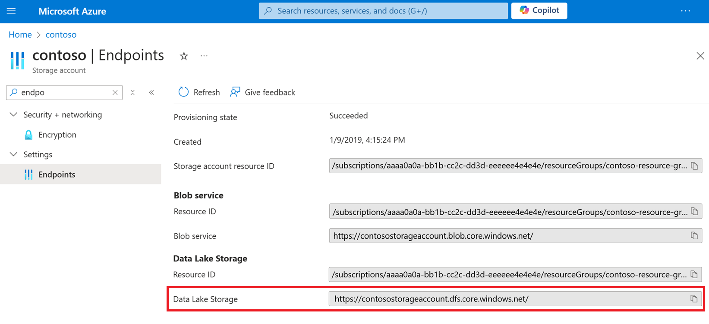

# Upgrading Azure Blob Storage with Azure Data Lake Storage Gen2 capabilities

This article helps you to enable a hierarchical namespace and unlock capabilities such as file- and directory-level security and faster operations. These capabilities are widely used by big data analytics workloads and are referred to collectively as Azure Data Lake Storage Gen2. The most popular capabilities include:

- Higher throughput, input/output operations per second (IOPS), and storage capacity limits.

- Faster operations (such as rename operations) because you can operate on individual node URIs.
 
- Efficient query engine that transfers only the data required to perform a given operation.

- Security at the container, directory, and file level.

To learn more about them, see [Introduction to Azure Data Lake Storage Gen2](data-lake-storage-introduction.md).

This article helps you evaluate the impact on workloads, applications, costs, service integrations, tools, features, and documentation. Make sure to review these impacts carefully. When you are ready to upgrade an account, see this step-by-step guide: [Upgrade Azure Blob Storage with Azure Data Lake Storage Gen2 capabilities](upgrade-to-data-lake-storage-gen2-how-to.md).

> [!IMPORTANT]
> An upgrade is one-way. There's no way to revert your account once you've performed the upgrade. We recommend that you validate your upgrade in a nonproduction environment.

## Impact on availability

Make sure to plan for some downtime in your account while the upgrade process completes. Write operations are disabled while your account is being upgraded. Read operations aren't disabled, but we strongly recommend that you suspend read operations, as those operations might destabilize the upgrade process.

## Impact on workloads and applications

Blob APIs work with accounts that have a hierarchical namespace, so most applications that interact with your account by using these APIs continue to work without modification.

For a complete list of issues and workarounds, see [Known issues with Blob Storage APIs](data-lake-storage-known-issues.md#blob-storage-apis).

Any Hadoop workloads that use the [Windows Azure Storage Blob driver (WASB)](https://hadoop.apache.org/docs/current/hadoop-azure/index.html) driver, must be modified to use the [Azure Blob File System (ABFS)](https://hadoop.apache.org/docs/stable/hadoop-azure/abfs.html) driver. Unlike the WASB driver that makes requests to the **Blob service** endpoint, the ABFS driver will make requests to the **Data Lake Storage** endpoint of your account.

### Data Lake Storage endpoint

Your upgraded account will have a Data Lake storage endpoint. You can find the URL of this endpoint in the Azure portal by opening the **Properties** page of your account.

> [!div class="mx-imgBorder"]
> 

You don't have to modify your existing applications and workloads to use that endpoint. [Multiprotocol access in Data Lake Storage](data-lake-storage-multi-protocol-access.md) makes it possible for you to use either the Blob service endpoint or the Data Lake storage endpoint to interact with your data. 

Azure services and tools (such as AzCopy) might use the Data Lake storage endpoint to interact with the data in your storage account. Also, you'll  need to use this new endpoint for any operations that you perform by using the Data Lake Storage Gen2 [SDKs](data-lake-storage-directory-file-acl-dotnet.md), [PowerShell commands](data-lake-storage-directory-file-acl-powershell.md), or [Azure CLI commands](data-lake-storage-directory-file-acl-cli.md). 

### Directories

A Blob storage account that does not have a hierarchical namespace organizes files in a flat paradigm, rather than a hierarchical paradigm. Blobs are organized into virtual directories in order to mimic a folder structure. A virtual directory forms part of the name of the blob and is indicated by the delimiter character. Because a virtual directory is a part of the blob name, it doesn't actually exist as an independent object.

Your new account has a hierarchical namespace. That means that directories are not virtual. They are concrete, independent objects that you can operate on directly. A directory can exist without containing any files. When you delete a directory, all of the files in that directory are removed. You no longer have to delete each individual blob before the directory disappears. 

### Blob metadata

Before migration, blob metadata is associated with the blob name along with its entire virtual path. After migration, the metadata is associated only with the blob. The virtual path to the blob becomes a collection of directories. Metadata of a blob is not applied to any of those directories. 

### Put operations

When you upload a blob, and the path that you specify includes a directory that doesn't exist, the operation creates that directory, and then adds the blob to it. This behavior is logical in the context of a hierarchical folder structure. In a Blob storage account that does not have a hierarchical namespace, the operation doesn't create a directory. Instead, the directory name is added to the blob's name. 

### List operations

A [List Blobs](/rest/api/storageservices/list-blobs) operation returns both directories and files. Each is listed separately. Directories appear in the list as zero-length blobs. In a Blob storage account that does not have a hierarchical namespace, a [List Blobs](/rest/api/storageservices/list-blobs) operation returns only blobs and not directories. If you use the Data Lake Storage Gen2 [Path - List](/rest/api/storageservices/datalakestoragegen2/path/list) operation, directories will appear as directory entries and not as zero-length blobs.

The list order is different as well. Directories and files appear in *depth-first search* order. A Blob storage account that does not have a hierarchical namespace lists blobs in *lexicographical* order. 

### Operations to rename blobs

Renaming a blob is far more efficient because client applications can rename a blob in a single operation. In accounts that *do not* have a hierarchical namespace, tools and applications have to copy a blob and then delete the source blob.  

> [!NOTE]
> When you rename a blob, the last modified time of the blob is not updated. That's because the contents of the blob are unchanged. 

## Impact on costs

There is no cost to perform the upgrade. After you upgrade, the cost to store your data doesn't change, but the cost of a transaction does change. Use these pages to assess compare costs. 

- [Block blob pricing](https://azure.microsoft.com/pricing/details/storage/blobs/).

- [Azure Data Lake Storage Gen2 pricing](https://azure.microsoft.com/pricing/details/storage/data-lake/).

You can also use the **Storage Accounts** option in the [Azure Pricing Calculator](https://azure.microsoft.com/pricing/calculator/) to estimate the impact of costs after an upgrade. 

Aside from pricing changes, consider the cost savings associated with Data Lake Storage Gen2 capabilities. Overall total of cost of ownership typically declines because of higher throughput and optimized operations. Higher throughput enables you to transfer more data in less time. A hierarchical namespace improves the efficiency of operations.  

## Impact on service integrations

While most Azure service integrations will continue to work after you've enabled these capabilities, some of them remain in preview or not yet supported. See [Azure services that support Azure Data Lake Storage Gen2](data-lake-storage-supported-azure-services.md) to understand the current support for Azure service integrations with Data Lake Storage Gen2.

## Impact on tools, features, and documentation

After you upgrade, the way you that interact with some features will change. This section describes those changes.

### The Blob Storage feature support

While most of the Blob storage features will continue to work after you've enabled these capabilities, some of them remain in preview or are not yet supported. 

See [Blob Storage features available in Azure Data Lake Storage Gen2](./storage-feature-support-in-storage-accounts.md) to understand the current support for Blob storage features with Data Lake Storage Gen2. 

### Diagnostic logs

If you enable [Storage analytics logging](../common/storage-analytics-logging.md), you now have the option to use the version 2.0 log format.  

You don't have to use this new version. However, any operations that are applied to the Data Lake storage endpoint are recorded only in version 2.0 logs. Some services and tools that you use (such as AzCopy) will use that endpoint to perform operations on your account. To ensure that you capture logging information from all activity, consider using the version 2.0 log format. 

### Azure Lifecycle management

It effectively explains that policies for moving or deleting all blobs in a directory won't delete the directory itself until all the blobs within it are removed, and the directory will be removed the next day.

### Event Grid

Your new account has two endpoints: the Data Lake storage endpoint, and the Blob service endpoint. Services, tools, and applications can use either endpoint to operate on your data. As a result, an event response that is returned by the Event Grid can show either of these two endpoints in the **url** field that describes the affected blob. 

The following JSON shows the url of a blob that appears in the event response when a blob is created by using the Blob service endpoint.

:::code language="json" source="~/azure-storage-snippets/blobs/howto/dotnet/dotnet-v12/ConfigurationFiles/change-feed-logs.json" ID="Snippet_BlobURL" highlight="15":::

The following JSON shows the url of a blob that appears in the event response when a blob is created by using the Data Lake storage endpoint.

:::code language="json" source="~/azure-storage-snippets/blobs/howto/dotnet/dotnet-v12/ConfigurationFiles/change-feed-logs.json" ID="Snippet_DataLakeURL" highlight="16":::

If your applications use the Event Grid, you might have to modify those applications to take this into account. 

### Storage Explorer

The following buttons don't yet appear in the Ribbon of Azure Storage Explorer:

|Button|Reason|
|--|--|
|Copy URL|Not yet implemented|
|Manage snapshots|Not yet implemented|
|Undelete|Depends on Blob storage features not yet supported with Data Lake Storage Gen2 |

The following buttons behave differently in your new account.

|Button|Blob storage behavior|Data Lake Storage Gen2 behavior|
|---|---|---|
|Folder|Folder is virtual and disappears if you don't add files to it. |Folder exists even with no files added to it.| 
|Rename|Results in a copy and then a delete of the source blob|Renames the same blob. Far more efficient.|

### Documentation

You can find guidance for using Data Lake Storage Gen2 capabilities here: [Introduction to Azure Data Lake Storage Gen2](data-lake-storage-introduction.md). 

Nothing has changed with respect to where you find the guidance for all of the existing Blob storage features. That guidance is here: [Introduction to Azure Blob storage](storage-blobs-introduction.md). 

As you move between content sets, you'll notice some slight terminology differences. For example, content featured in the Data Lake Storage Gen2 content might use the term *file* and *file system* instead of *blob* and *container*. The terms *file* and *file system* are deeply rooted in the world of big data analytics where Data Lake storage has had a long history. The content contains these terms to keep it relatable to these audiences. These terms don't describe separate *things*.

## Next steps

When you are ready to upgrade your storage account to include Data Lake Storage Gen2 capabilities, see this step-by-step guide. 
> [!div class="nextstepaction"]
> [Upgrade Azure Blob Storage with Azure Data Lake Storage Gen2 capabilities](upgrade-to-data-lake-storage-gen2-how-to.md)
