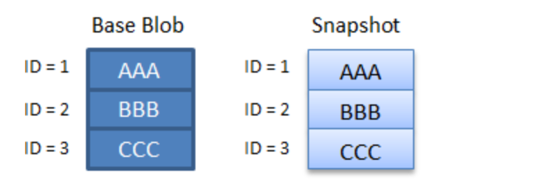

# Blob versions (preview)

Your applications create, update, and delete data in Azure Blob storage continuously. A common requirement is the ability to access and manage both current and previous versions of the data. Blob storage versioning (preview) automatically maintains previous versions of an object.

You can list and access both the current blob and previous versions using version ID timestamps. You can restore previous versions to recover your data when it is erroneously modified or deleted by an application or other users.

Note: Blob storage versioning doesn’t protect your data from accidental deletion of the storage account or of a container. To prevent accidental deletion of the storage account, configure a [CannotDelete lock](https://docs.microsoft.com/en-us/azure/azure-resource-manager/resource-group-lock-resources) on the storage account resource. To protect against accidental deletion of a container, enable the new container soft delete (preview) feature for the container.

## About the preview

### Storage account support

Blob storage versioning is available for general-purpose v2 (GPv2) storage accounts, Blob storage accounts, and premium block blob storage accounts. ADLS Gen2 accounts are not supported. If needed, use the Azure portal to upgrade an existing general-purpose v1 (GPv1) account to a GPv2 account. For more information about storage accounts, see [Azure storage account overview](https://docs.microsoft.com/en-us/azure/storage/common/storage-account-overview). 

## How blob versioning works

If blob versioning is enabled for a storage account, then Azure Storage automatically creates a new version of a blob each time that blob is modified or deleted. Each blob version is identified by its version ID property.

### Versions

A version captures a committed blob state. Versions are immutable. You cannot modify the content or metadata of an existing blob version.

The base blob represents the current version of the blob. Previous versions represent the blob in previous states.

An operation on a blob that omits the version ID acts on the base blob. You can specify a version ID to perform the operation on a specific version.

### Version ID

Each version has a version ID property. The value of the version ID is the timestamp at which the blob was written or updated.

When you create or overwrite a blob using **Put Blob, Put Block List, Copy Blob**, and **Set Blob Metadata**. Azure Storage returns the *x-ms-version-id* header in the response. This header contains the version ID for the version that was just created (e.g. the updated base blob).List Blob & Versions

### Blob creation and modification

When blob versioning is turned on, each write operation (**Put Blob**, **Put Block List, Copy Blob**, and **Set Blob Metadata**) creates a new version.

The base blob is always the current version. A previous version preserves the state of a blob at an earlier point in time. If the write operation creates a new blob, the current version is the base blob. If the write operation modifies an existing base blob, the new data is captured in the updated base blob, and a previous version is created that represents the prior state.

For simplicity, all examples below show the version ID as a simple integer value. In reality, the version ID is a timestamp.


Note: if a blob was created before versioning is turned on, it doesn’t have a version ID. When it is modified, the new data is the new current version. The prior state is transitioned into a previous version with a backfilled version ID which is the same as the prior state’s creation time.

### List blobs and versions

You can get a list of blobs and versions under a specific container by including *versions* option in the query. Below is a sample output. You can find out whether a version is the current version (or a base blob) by checking whether *IsCurrentVersion* is true.

```xml
<?xml version="1.0" encoding="utf-8"?>  
<EnumerationResults ServiceEndpoint="http://myaccount.blob.core.windows.net/"  ContainerName="mycontainer">  
  <Prefix>string-value</Prefix>  
  <Marker>string-value</Marker>  
  <MaxResults>int-value</MaxResults>  
  <Delimiter>string-value</Delimiter>  
  <Blobs>  
    <Blob>  
      <Name>blob-name</name>  
      <VersionId>version-id</VersionId>
      <IsCurrentVersion>true</IsCurrentVersion>
      <Properties>
        …
      </Properties>  
      <Metadata>
        …
      </Metadata>  
    </Blob>  
    <BlobPrefix>  
      <Name>blob-prefix</Name>  
    </BlobPrefix>  
  </Blobs>  
  <NextMarker />  
</EnumerationResults>
```

### Blob deletion

A **Delete Blob** operation acts on the base blob, which is the current version. When you delete a blob that is versioned, the base blob no longer exists. The version that represents the state of the blob before deletion is transitioned to a previous version. All previous versions of the blob are preserved when the base blob is deleted.

You can also delete a specific previous version of the blob by specifying its version ID.

Note: you cannot delete the base blob using its version ID.


Writing new data to the base blob re-creates the base blob. The existing versions are unaffected.


### Blob types

All versions of a blob must be of the same [blob type](https://docs.microsoft.com/en-us/rest/api/storageservices/understanding-block-blobs--append-blobs--and-page-blobs).

When blob versioning is enabled, you cannot overwrite a blob of one type with another type unless you first delete the blob and all its versions.

### Blob & version tiering

Each version including the current version can be moved to a different blob access tier by **Set Blob Tier**. You can take advantage of cooler access tier’s low capacity price by moving older versions to cool or archive tier. You can automate it using blob lifecycle management.

## Authorization

### SAS update

A [shared access signature (SAS)](https://docs.microsoft.com/en-us/azure/storage/common/storage-sas-overview) can be generated for a specific version ID. Use the signed resource type “bv”, representing a version, to create a SAS token for operations on a specific version.

Blob versioning is designed to protect your data from accidental or malicious deletion. To enhance protection, deleting a blob version requires special permissions. Use the signed permission "x" on a SAS token to delete a blob version.

Permissions for a blob version (as part of Blob service)

| **Permission** | **URI symbol** | **Allowed operations** |
|----------------|----------------|------------------------|
| Delete         | X              | Delete a blob version. |

### RBAC update

A new RBAC action is available for managing permissions to delete a blob version. By default, Storage Blob Data Owner has rights to delete blob versions.

| **Blob service operation**                                                           | **RBAC action**                                                                                                                                                                                                                  |
|--------------------------------------------------------------------------------------|----------------------------------------------------------------------------------------------------------------------------------------------------------------------------------------------------------------------------------|
| [Delete Blob](https://docs.microsoft.com/en-us/rest/api/storageservices/delete-blob) | Microsoft.Storage/storageAccounts/blobServices/containers/blobs/edelete/action If the deleted object is a blob version, this Microsoft.Storage/storageAccounts/blobServices/containers/blobs/deleteBlobVersion/action is required |
|                                                                                      |                                                                                                                                                                                                                                  |
|                                                                                      |                                                                                                                                                                                                                                  |
|                                                                                      |                                                                                                                                                                                                                                  |
|                                                                                      |                                                                                                                                                                                                                                  |
|                                                                                      |                                                                                                                                                                                                                                  |
|                                                                                      |                                                                                                                                                                                                                                  |
|                                                                                      |                                                                                                                                                                                                                                  |
|                                                                                      |                                                                                                                                                                                                                                  |
|                                                                                      |                                                                                                                                                                                                                                  |
|                                                                                      |                                                                                                                                                                                                                                  |
|                                                                                      |                                                                                                                                                                                                                                  |
|                                                                                      |                                                                                                                                                                                                                                  |
|                                                                                      |                                                                                                                                                                                                                                  |
|                                                                                      |                                                                                                                                                                                                                                  |

Disable blob versioning
=======================

When you turn off blob versioning, any existing versions remain in your storage account and are accessible. No new versions are subsequently created.

If a base blob is also a current version, overwriting the base blob will preserve the version by transitioning it into a previous version. The new base blob is no longer a version and does not have a version ID. All subsequent overwrites of the base blob will overwrite the data.

You can continue read or delete versions using the version ID after versioning is disabled. All future modification of the blob will overwrite the data in the base blob.


Versioning & soft delete 
=========================

Blob versioning and blob soft delete work together to provide you with optimal data protection. When both blob versioning and [blob soft delete](https://docs.microsoft.com/en-us/azure/storage/blobs/storage-blob-soft-delete) are enabled, modifying or deleting a blob creates a version instead of a soft-deleted snapshot.

In addition, soft delete offers version delete retention. Any deleted version remains in the system and can be undeleted within the soft delete retention period.


The soft deleted version can be recovered by undelete operation during the soft delete retention period. Once the retention is up, the version is hard deleted and can no longer be restored.

Note: when both versioning and soft delete are turned on, deleting base blob turns the blob into a previous version. This previous version is not in the soft deleted state. It doesn’t expire. To expire a previous version, it must be deleted. Once a previous version is deleted, it becomes a soft deleted version. Soft deleted versions expire based on the soft delete retention period.

Version & snapshot 
===================

Similar to a version, a blob snapshot is a read-only copy of a blob that’s taken at a point in time. Different from a version which is created automatically when you enable versioning on your storage account, snapshot is created manually by you or your applications.

If versioning is turned on in your storage account, all block blob changes and deletes are captured and preserved by versions. There is no need for manual snapshots of block blob. We recommend you not taking any snapshots either manually or through your application for your block blobs.

Snapshot a blob when versioning is on 
--------------------------------------

When you snapshot a versioned blob, a snapshot is created to capture the state of the blob. In addition, the state is captured as a previous version, and a new current version is created.


Version & archive tier
======================

[TODO] Decide Should changes in archive tier behavior be here or in the archive access tier doc?

Manage version lifecycle 
=========================

You can set up [lifecycle management policy](https://docs.microsoft.com/en-us/azure/storage/blobs/storage-lifecycle-management-concepts) to delete or tier down old versions to save your total storage spend. [TODO] insert sample rule

Pricing and billing
===================

Versions, like snapshots, are billed at the same rate as active data. You only pay for the additional unique blocks or pages if versions and base blobs share common blocks or pages. For a deeper dive into versions billing, please see [Understanding how snapshots accrue charges](https://docs.microsoft.com/en-us/azure/storage/blobs/storage-blob-snapshots).

Sign up for the preview
=======================

To enroll in the preview, you will need to submit a request to register this feature to your subscription. After your request is approved, you can enable this feature with any existing and new GPv2, Blob, or Premium Block Blob Storage account in West US 2 and West Central US regions. As with most previews, this feature should not be used for production workloads until it reaches GA.

To submit a request, run the following PowerShell or CLI commands.

PowerShell
----------

Register-AzureRmProviderFeature -FeatureName Versioning -ProviderNamespace Microsoft.Storage

Register-AzureRmResourceProvider -ProviderNamespace Microsoft.Storage

You can check the feature registration state with this PowerShell command. You are approved for the preview when the registration state is registered, which should occur within 72 hours.

Get-AzProviderFeature -FeatureName Versioning -ProviderNamespace Microsoft.Storage

CLI 2.0
-------

az feature register –-namespace Microsoft.Storage –-name Versioning

FAQ
===

**Should I take manual snapshots if versioning is enabled?**

Like versions, a snapshot is a read-only state of a blob taken manually at a point in time. A blob can have multiple snapshots and versions. With versioning, each update and delete is captured with a new version. Manual snapshotting does not offer additional protection to your block blob data. We recommend updating your application to stop taking manual snapshots of block blobs once you enable versioning.

For a page blob, a version is not created for a **Put Page** operation. For an append blob, a version is not created for an **Append Block** operation. You can take a manual snapshot to capture changes from those operations.

**Is there any special consideration on enabling versioning?**

Enabling versioning for frequently overwritten data may result in increased storage capacity charges and increased latency when listing blobs. You can mitigate this by storing the frequently overwritten data in a separate storage account with versioning disabled.

API update
==========

Version 2019-10-19 of the Azure Storage REST API supports blob versioning. Insert link to the updated api doc

Related 
========

-   [Creating a snapshot of a     blob](https://docs.microsoft.com/en-us/rest/api/storageservices/creating-a-snapshot-of-a-blob)

-   [Soft delete for Azure Storage     Blobs](https://docs.microsoft.com/en-us/azure/storage/blobs/storage-blob-soft-delete)

Changes required for other docs:
================================

-   https://docs.microsoft.com/en-us/rest/api/storageservices/understanding-how-snapshots-accrue-charges
    Understanding how blob snapshots accrue charges

In this doc, note both snapshots and versions accrue charges the same way. Also update how tiering breaks the block sharing. Quick write up below:



By default, snapshots and versions are created at the same access tier as the base blob. In this example, assume both base blob and snapshot/version are in the hot tier. If snapshot/version is tiered to another access tier (e.g. hot to archive), blocks can no longer be shared by the base blob and snapshot/version. The snapshot is charged full size of 3 at the archive tier price, and the base blob is charged full size of 3 at the hot tier price.

-   https://docs.microsoft.com/en-us/azure/storage/blobs/storage-blob-storage-tiers?tabs=azure-portal\#blob-level-tiering
    Update that setblobtier works on both versions and snapshots.

With the latest API version (exact version TBD depends on the release vehicle), you can change the tier of your versions and snapshots among the hot, cool, or archive tiers.

Note: you can only rehydrate a base blob (current version) from the archive tier to hot/cool tier. An archived previous version or snapshot must be rehydrated to a new blob using copy blob to be accessed.

-   https://docs.microsoft.com/en-us/azure/storage/blobs/storage-blob-storage-tiers?tabs=azure-portal\#archive-access-tier

The exact change is not final yet 