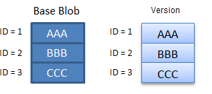
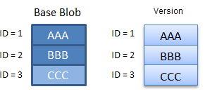
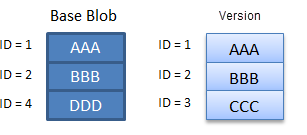
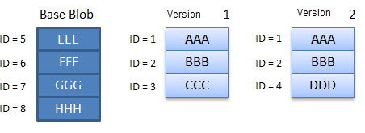

# Blob versioning

You can enable Blob storage versioning to automatically maintain previous versions of an object. When blob versioning is enabled, you can access earlier versions of a blob to recover your data if it's modified or deleted.

## Recommended data protection configuration

Blob versioning is part of a comprehensive data protection strategy for blob data. For optimal protection for your blob data, Microsoft recommends enabling all of the following data protection features:

- Blob versioning, to automatically maintain previous versions of a blob. When blob versioning is enabled, you can restore an earlier version of a blob to recover your data if it's erroneously modified or deleted. To learn how to enable blob versioning, see [Enable and manage blob versioning](versioning-enable.md).
- Container soft delete, to restore a container that has been deleted. To learn how to enable container soft delete, see [Enable and manage soft delete for containers](soft-delete-container-enable.md).
- Blob soft delete, to restore a blob, snapshot, or version that has been deleted. To learn how to enable blob soft delete, see [Enable and manage soft delete for blobs](soft-delete-blob-enable.md).

To learn more about Microsoft's recommendations for data protection, see [Data protection overview](data-protection-overview.md).

> [!CAUTION]
> After you enable blob versioning for a storage account, every write operation to a blob in that account results in the creation of a new version. For this reason, enabling blob versioning may result in additional costs. To minimize costs, use a lifecycle management policy to automatically delete old versions. For more information about lifecycle management, see [Optimize costs by automating Azure Blob Storage access tiers](./lifecycle-management-overview.md).

## How blob versioning works

A version captures the state of a blob at a given point in time. Each version is identified with a version ID. When blob versioning is enabled for a storage account, Azure Storage automatically creates a new version with a unique ID when a blob is first created and each time that the blob is subsequently modified.

A version ID can identify the current version or a previous version. A blob can have only one current version at a time.

When you create a new blob, a single version exists, and that version is the current version. When you modify an existing blob, the current version becomes a previous version. A new version is created to capture the updated state, and that new version is the current version. When you delete a blob, the current version of the blob becomes a previous version, and there's no longer a current version. Any previous versions of the blob persist.

The following diagram shows how versions are created on write operations, and how a previous version may be promoted to be the current version:

:::image type="content" source="media/versioning-overview/blob-versioning-diagram.png" alt-text="Diagram showing how blob versioning works":::

Blob versions are immutable. You can't modify the content or metadata of an existing blob version.

Having a large number of versions per blob can increase the latency for blob listing operations. Microsoft recommends maintaining fewer than 1000 versions per blob. You can use lifecycle management to automatically delete old versions. For more information about lifecycle management, see [Optimize costs by automating Azure Blob Storage access tiers](./lifecycle-management-overview.md).

Blob versioning is available for standard general-purpose v2, premium block blob, and legacy Blob storage accounts. Storage accounts with a hierarchical namespace enabled for use with Azure Data Lake Storage Gen2 aren't currently supported.

Version 2019-10-10 and higher of the Azure Storage REST API supports blob versioning.

> [!IMPORTANT]
> Blob versioning cannot help you to recover from the accidental deletion of a storage account or container. To prevent accidental deletion of the storage account, configure a lock on the storage account resource. For more information on locking a storage account, see [Apply an Azure Resource Manager lock to a storage account](../common/lock-account-resource.md).

### Version ID

Each blob version is identified by a unique version ID. The value of the version ID is the timestamp at which the blob was updated. The version ID is assigned at the time that the version is created.

You can perform read or delete operations on a specific version of a blob by providing its version ID. If you omit the version ID, the operation acts against the current version.

When you call a write operation to create or modify a blob, Azure Storage returns the *x-ms-version-id* header in the response. This header contains the version ID for the current version of the blob that was created by the write operation.

The version ID remains the same for the lifetime of the version.

### Versioning on write operations

When blob versioning is turned on, each write operation to a blob creates a new version. Write operations include [Put Blob](/rest/api/storageservices/put-blob), [Put Block List](/rest/api/storageservices/put-block-list), [Copy Blob](/rest/api/storageservices/copy-blob), and [Set Blob Metadata](/rest/api/storageservices/set-blob-metadata).

If the write operation creates a new blob, then the resulting blob is the current version of the blob. If the write operation modifies an existing blob, then the current version becomes a previous version, and a new current version is created to capture the updated blob.

The following diagram shows how write operations affect blob versions. For simplicity, the diagrams shown in this article display the version ID as a simple integer value. In reality, the version ID is a timestamp. The current version is shown in blue, and previous versions are shown in gray.

:::image type="content" source="media/versioning-overview/write-operations-blob-versions.png" alt-text="Diagram showing how write operations affect versioned blobs.":::

> [!NOTE]
> A blob that was created prior to versioning being enabled for the storage account does not have a version ID. When that blob is modified, the modified blob becomes the current version, and a version is created to save the blob's state before the update. The version is assigned a version ID that is its creation time.

When blob versioning is enabled for a storage account, all write operations on block blobs trigger the creation of a new version, except for the [Put Block](/rest/api/storageservices/put-block) operation.

For page blobs and append blobs, only a subset of write operations triggers the creation of a version. These operations include:

- [Put Blob](/rest/api/storageservices/put-blob)
- [Put Block List](/rest/api/storageservices/put-block-list)
- [Set Blob Metadata](/rest/api/storageservices/set-blob-metadata)
- [Copy Blob](/rest/api/storageservices/copy-blob)

The following operations don't trigger the creation of a new version. To capture changes from those operations, take a manual snapshot:

- [Put Page](/rest/api/storageservices/put-page) (page blob)
- [Append Block](/rest/api/storageservices/append-block) (append blob)

All versions of a blob must be of the same blob type. If a blob has previous versions, you can't overwrite a blob of one type with another type unless you first delete the blob and all of its versions.

### Versioning on delete operations

When you call the [Delete Blob](/rest/api/storageservices/delete-blob) operation without specifying a version ID, the current version becomes a previous version, and there's no longer a current version. All existing previous versions of the blob are preserved.

The following diagram shows the effect of a delete operation on a versioned blob:

:::image type="content" source="media/versioning-overview/delete-versioned-base-blob.png" alt-text="Diagram showing deletion of versioned blob.":::

To delete a specific version of a blob, provide the ID for that version on the delete operation. If blob soft delete is also enabled for the storage account, the version is maintained in the system until the soft delete retention period elapses.

Writing new data to the blob creates a new current version of the blob. Any existing versions are unaffected, as shown in the following diagram.

:::image type="content" source="media/versioning-overview/recreate-deleted-base-blob.png" alt-text="Diagram showing re-creation of versioned blob after deletion.":::

### Access tiers

You can move any version of a block blob, including the current version, to a different blob access tier by calling the [Set Blob Tier](/rest/api/storageservices/set-blob-tier) operation. You can take advantage of lower capacity pricing by moving older versions of a blob to the cool or archive tier. For more information, see [Hot, Cool, and Archive access tiers for blob data](access-tiers-overview.md).

To automate the process of moving block blobs to the appropriate tier, use blob life cycle management. For more information on life cycle management, see [Manage the Azure Blob storage life cycle](./lifecycle-management-overview.md).

## Enable or disable blob versioning

To learn how to enable or disable blob versioning, see [Enable and manage blob versioning](versioning-enable.md).

Disabling blob versioning doesn't delete existing blobs, versions, or snapshots. When you turn off blob versioning, any existing versions remain accessible in your storage account. No new versions are subsequently created.

After versioning is disabled, modifying the current version creates a blob that isn't a version. All subsequent updates to the blob overwrite its data without saving the previous state. All existing versions persist as previous versions.

You can read or delete versions using the version ID after versioning is disabled. You can also list a blob's versions after versioning is disabled.

Object replication relies on blob versioning. Before you can disable blob versioning, you must delete any object replication policies on the account. For more information about object replication, see [Object replication for block blobs](object-replication-overview.md).

The following diagram shows how modifying a blob after versioning is disabled creates a blob that isn't versioned. Any existing versions associated with the blob persist.

:::image type="content" source="media/versioning-overview/modify-base-blob-versioning-disabled.png" alt-text="Diagram showing that modification of a current version after versioning is disabled creates a blob that isn't a version.":::

## Blob versioning and soft delete

Blob versioning and blob soft delete are part of the recommended data protection configuration for storage accounts. For more information about Microsoft's recommendations for data protection, see [Recommended data protection configuration](#recommended-data-protection-configuration) in this article, and [Data protection overview](data-protection-overview.md).

### Overwriting a blob

If blob versioning and blob soft delete are both enabled for a storage account, then overwriting a blob automatically creates a new version. The new version isn't soft-deleted and isn't removed when the soft-delete retention period expires. No soft-deleted snapshots are created.

### Deleting a blob or version

If versioning and soft delete are both enabled for a storage account, then when you delete a blob, the current version of the blob becomes a previous version. No new version is created and no soft-deleted snapshots are created. The soft delete retention period isn't in effect for the deleted blob.

Soft delete offers additional protection for deleting blob versions. When you delete a previous version of the blob, that version is soft-deleted. The soft-deleted version is preserved until the soft delete retention period elapses, at which point it's permanently deleted.

To delete a previous version of a blob, call the **Delete Blob** operation and specify the version ID.

The following diagram shows what happens when you delete a blob or a blob version.

:::image type="content" source="media/versioning-overview/soft-delete-historical-version.png" alt-text="Diagram showing deletion of a version with soft delete enabled.":::

### Restoring a soft-deleted version

You can use the [Undelete Blob](/rest/api/storageservices/undelete-blob) operation to restore soft-deleted versions during the soft delete retention period. The **Undelete Blob** operation always restores all soft-deleted versions of the blob. It isn't possible to restore only a single soft-deleted version.

Restoring soft-deleted versions with the **Undelete Blob** operation doesn't promote any version to be the current version. To restore the current version, first restore all soft-deleted versions, and then use the [Copy Blob](/rest/api/storageservices/copy-blob) operation to copy a previous version to a new current version.

The following diagram shows how to restore soft-deleted blob versions with the **Undelete Blob** operation, and how to restore the current version of the blob with the **Copy Blob** operation.

:::image type="content" source="media/versioning-overview/undelete-version.png" alt-text="Diagram showing how to restore soft-deleted versions.":::

After the soft-delete retention period has elapsed, any soft-deleted blob versions are permanently deleted.

## Blob versioning and blob snapshots

A blob snapshot is a read-only copy of a blob that's taken at a specific point in time. Blob snapshots and blob versions are similar, but a snapshot is created manually by you or your application, while a blob version is created automatically on a write or delete operation when blob versioning is enabled for your storage account.

> [!IMPORTANT]
> Microsoft recommends that after you enable blob versioning, you also update your application to stop taking snapshots of block blobs. If versioning is enabled for your storage account, all block blob updates and deletions are captured and preserved by versions. Taking snapshots does not offer any additional protections to your block blob data if blob versioning is enabled, and may increase costs and application complexity.

### Snapshot a blob when versioning is enabled

Although it isn't recommended, you can take a snapshot of a blob that is also versioned. If you can't update your application to stop taking snapshots of blobs when you enable versioning, your application can support both snapshots and versions.

When you take a snapshot of a versioned blob, a new version is created at the same time that the snapshot is created. A new current version is also created when a snapshot is taken.

The following diagram shows what happens when you take a snapshot of a versioned blob. In the diagram, blob versions and snapshots with version ID 2 and 3 contain identical data.

:::image type="content" source="media/versioning-overview/snapshot-versioned-blob.png" alt-text="Diagram showing snapshots of a versioned blob.":::

## Authorize operations on blob versions

You can authorize access to blob versions using one of the following approaches:

- By using Azure role-based access control (Azure RBAC) to grant permissions to an Azure Active Directory (Azure AD) security principal. Microsoft recommends using Azure AD for superior security and ease of use. For more information about using Azure AD with blob operations, see [Authorize access to data in Azure Storage](../common/authorize-data-access.md).
- By using a shared access signature (SAS) to delegate access to blob versions. Specify the version ID for the signed resource type `bv`, representing a blob version, to create a SAS token for operations on a specific version. For more information about shared access signatures, see [Grant limited access to Azure Storage resources using shared access signatures (SAS)](../common/storage-sas-overview.md).
- By using the account access keys to authorize operations against blob versions with Shared Key. For more information, see [Authorize with Shared Key](/rest/api/storageservices/authorize-with-shared-key).

Blob versioning is designed to protect your data from accidental or malicious deletion. To enhance protection, deleting a blob version requires special permissions. The following sections describe the permissions needed to delete a blob version.

### Azure RBAC action to delete a blob version

The following table shows which Azure RBAC actions support deleting a blob or a blob version.

| Description | Blob service operation | Azure RBAC data action required | Azure built-in role support |
|----------------------------------------------|------------------------|---------------------------------------------------------------------------------------|-------------------------------|
| Deleting the current version | Delete Blob | **Microsoft.Storage/storageAccounts/blobServices/containers/blobs/delete** | Storage Blob Data Contributor |
| Deleting a previous version | Delete Blob | **Microsoft.Storage/storageAccounts/blobServices/containers/blobs/deleteBlobVersion/action** | Storage Blob Data Owner |

### Shared access signature (SAS) parameters

The signed resource for a blob version is `bv`. For more information, see [Create a service SAS](/rest/api/storageservices/create-service-sas) or [Create a user delegation SAS](/rest/api/storageservices/create-user-delegation-sas).

The following table shows the permission required on a SAS to delete a blob version.

| **Permission** | **URI symbol** | **Allowed operations** |
|----------------|----------------|------------------------|
| Delete         | x              | Delete a blob version. |

## Pricing and billing

Enabling blob versioning can result in additional data storage charges to your account. When designing your application, it's important to be aware of how these charges might accrue so that you can minimize costs.

Blob versions, like blob snapshots, are billed at the same rate as active data. How versions are billed depends on whether you have explicitly set the tier for the current or previous versions of a blob (or snapshots). For more information about blob tiers, see [Hot, Cool, and Archive access tiers for blob data](access-tiers-overview.md).

If you haven't changed a blob or version's tier, then you're billed for unique blocks of data across that blob, its versions, and any snapshots it may have. For more information, see [Billing when the blob tier has not been explicitly set](#billing-when-the-blob-tier-has-not-been-explicitly-set).

If you've changed a blob or version's tier, then you're billed for the entire object, regardless of whether the blob and version are eventually in the same tier again. For more information, see [Billing when the blob tier has been explicitly set](#billing-when-the-blob-tier-has-been-explicitly-set).

> [!NOTE]
> Enabling versioning for data that is frequently overwritten may result in increased storage capacity charges and increased latency during listing operations. To mitigate these concerns, store frequently overwritten data in a separate storage account with versioning disabled.

For more information about billing details for blob snapshots, see [Blob snapshots](snapshots-overview.md).

### Billing when the blob tier has not been explicitly set

If you have not explicitly set the blob tier for any versions of a blob, then you're charged for unique blocks or pages across all versions, and any snapshots it may have. Data that is shared across blob versions is charged only once. When a blob is updated, then data in the new current version diverges from the data stored in previous versions, and the unique data is charged per block or page.

When you replace a block within a block blob, that block is subsequently charged as a unique block. This is true even if the block has the same block ID and the same data as it has in the previous version. After the block is committed again, it diverges from its counterpart in the previous version, and you'll be charged for its data. The same holds true for a page in a page blob that's updated with identical data.

Blob storage doesn't have a means to determine whether two blocks contain identical data. Each block that is uploaded and committed is treated as unique, even if it has the same data and the same block ID. Because charges accrue for unique blocks, it's important to keep in mind that updating a blob when versioning is enabled will result in additional unique blocks and additional charges.

When blob versioning is enabled, call update operations on block blobs so that they update the least possible number of blocks. The write operations that permit fine-grained control over blocks are [Put Block](/rest/api/storageservices/put-block) and [Put Block List](/rest/api/storageservices/put-block-list). The [Put Blob](/rest/api/storageservices/put-blob) operation, on the other hand, replaces the entire contents of a blob and so may lead to additional charges.

The following scenarios demonstrate how charges accrue for a block blob and its versions when the blob tier hasn't been explicitly set.

#### Scenario 1

In scenario 1, the blob has a previous version. The blob hasn't been updated since the version was created, so charges are incurred only for unique blocks 1, 2, and 3.

#### Scenario 2

In scenario 2, one block (block 3 in the diagram) in the blob has been updated. Even though the updated block contains the same data and the same ID, it isn't the same as block 3 in the previous version. As a result, the account is charged for four blocks.

#### Scenario 3

In scenario 3, the blob has been updated, but the version hasn't. Block 3 was replaced with block 4 in the current blob, but the previous version still reflects block 3. As a result, the account is charged for four blocks.

#### Scenario 4

In scenario 4, the current version has been completely updated and contains none of its original blocks. As a result, the account is charged for all eight unique blocks—four in the current version, and four combined in the two previous versions. This scenario can occur if you're writing to a blob with the [Put Blob](/rest/api/storageservices/put-blob) operation, because it replaces the entire contents of the blob.

### Billing when the blob tier has been explicitly set

If you have explicitly set the blob tier for a blob or version (or snapshot), then you're charged for the full content length of the object in the new tier, regardless of whether it shares blocks with an object in the original tier. You're also charged for the full content length of the oldest version in the original tier. Any other previous versions or snapshots that remain in the original tier are charged for unique blocks that they may share, as described in [Billing when the blob tier has not been explicitly set](#billing-when-the-blob-tier-has-not-been-explicitly-set).

#### Moving a blob to a new tier

The following table describes the billing behavior for a blob or version when it's moved to a new tier.

| When blob tier is set… | Then you're billed for... |
|-|-|
| Explicitly on a version, whether current or previous | The full content length of that version. Versions that don't have an explicitly set tier are billed only for unique blocks.1 |
| To archive | The full content length of all versions and snapshots.1. |

1If there are other previous versions or snapshots that haven't been moved from their original tier, those versions or snapshots are charged based on the number of unique blocks they contain, as described in [Billing when the blob tier has not been explicitly set](#billing-when-the-blob-tier-has-not-been-explicitly-set).

The following diagram illustrates how objects are billed when a versioned blob is moved to a different tier.

:::image type="content" source="media/versioning-overview/versioning-billing-tiers.png" alt-text="Diagram showing how objects are billed when a versioned blob is explicitly tiered.":::

Explicitly setting the tier for a blob, version, or snapshot can't be undone. If you move a blob to a new tier and then move it back to its original tier, you're charged for the full content length of the object even if it shares blocks with other objects in the original tier.

Operations that explicitly set the tier of a blob, version, or snapshot include:

- [Set Blob Tier](/rest/api/storageservices/set-blob-tier)
- [Put Blob](/rest/api/storageservices/put-blob) with tier specified
- [Put Block List](/rest/api/storageservices/put-block-list) with tier specified
- [Copy Blob](/rest/api/storageservices/copy-blob) with tier specified

#### Deleting a blob when soft delete is enabled

When blob soft delete is enabled, all soft-deleted entities are billed at full content length. If you delete or overwrite a current version that has had its tier explicitly set, then any previous versions of the soft-deleted blob are billed at full content length. For more information about how blob versioning and soft delete work together, see [Blob versioning and soft delete](#blob-versioning-and-soft-delete).

## Feature support

[!INCLUDE [Blob Storage feature support in Azure Storage accounts](../../../includes/azure-storage-feature-support.md)]

## See also

- [Enable and manage blob versioning](versioning-enable.md)
- [Creating a snapshot of a blob](/rest/api/storageservices/creating-a-snapshot-of-a-blob)
- [Soft delete for blobs](./soft-delete-blob-overview.md)
- [Soft delete for containers](soft-delete-container-overview.md)
