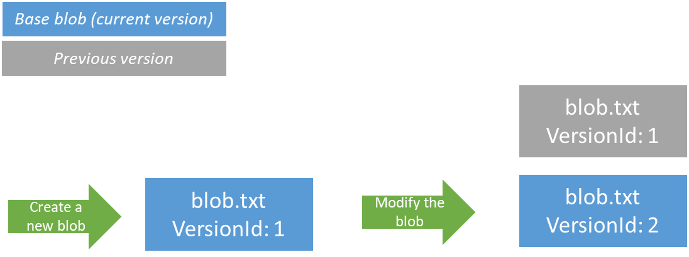
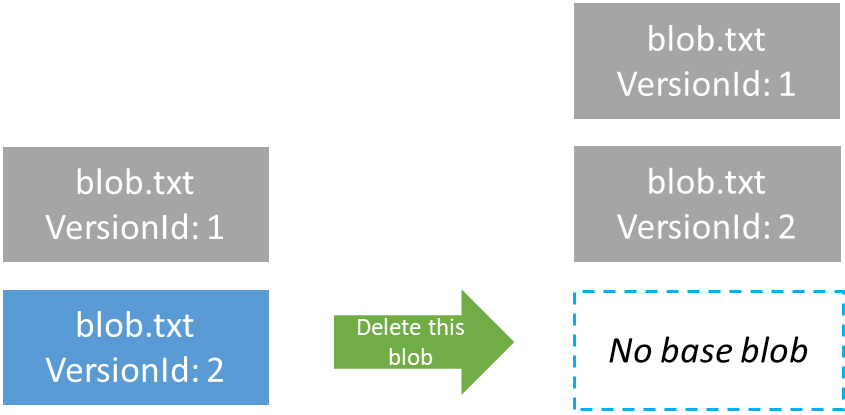
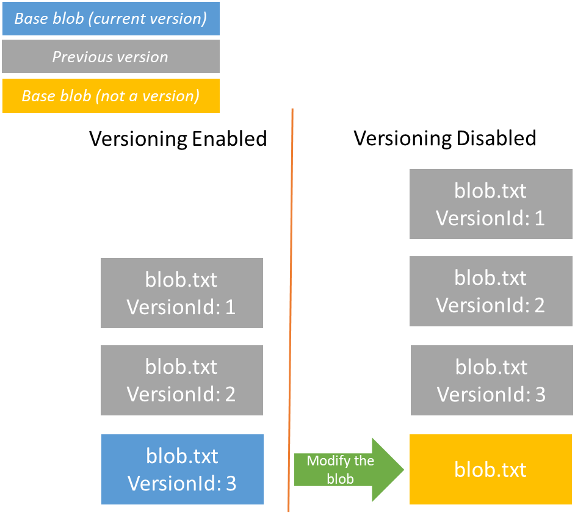

# Blob versions (preview)

Applications may create, update, and delete data in Azure Blob storage continuously. A common requirement is the ability to access and manage both current and previous versions of the data. Blob storage versioning (preview) automatically maintains previous versions of an object.

You can list and access both the current blob and previous versions using version ID timestamps. You can restore previous versions to recover your data when it is erroneously modified or deleted by an application or other users.

> [!IMPORTANT]
> Blob versioning cannot prevent accidental deletion of the storage account or of a container. To prevent accidental deletion of the storage account, configure a **CannotDelete** lock on the storage account resource. For more information on locking Azure resources, see [Lock resources to prevent unexpected changes](../../azure-resource-manager/management/lock-resources.md).
>
> To protect against accidental deletion of a container, enable soft delete for the container (preview). ???

## How blob versioning works

When blob versioning is enabled for a storage account, Azure Storage automatically creates a new historical version of a blob each time that blob is modified or deleted. A version captures a committed blob state at a given point in time.

Blob versions are immutable. You cannot modify the content or metadata of an existing blob version.

The base blob represents the current version of the blob. A historical version preserves the state of a blob at an earlier point in time.

### Version ID

Each blob version is identified by a version ID. The value of the version ID is the timestamp at which the blob was written or updated. You can specify the version ID on read or delete operations to perform the operation on a given version. An operation on a blob that omits the version ID acts on the base blob.

When you call a write operation to create or modify a blob, Azure Storage returns the *x-ms-version-id* header in the response. This header contains the version ID for the current version after the write operation. The current version is the updated base blob.

### Versioning on write operations

When blob versioning is turned on, each write operation creates a new version. Write operations include **Put Blob**, **Put Block List**, **Copy Blob**, or **Set Blob Metadata**.

If the write operation creates a new blob, then that blob, the base blob, is the current version. If the write operation modifies an existing blob, then the new data is captured in the updated blob, which is the base blob, and a historical version is created that represents the blob's previous state.

For simplicity, all examples below show the version ID as a simple integer value. In reality, the version ID is a timestamp.



> [!NOTE]
> A blob that was created prior to blob versioning being enabled does not have a version ID. When that blob is modified, the modified blob becomes the current version, and a historical version is created to represent the blob's state before the update. The historical version is assigned a version ID that is that version's creation time.

### List blobs and blob versions

You can get a list of blobs and versions under a specific container by including the *versions* parameter on the listing operation. To determine whether a given version is the current version (that is, the base blob), check the value of the *IsCurrentVersion* field.

The following XML is a sample response body from a [List Blobs](/rest/api/storageservices/list-blobs) operation that includes the *versions* parameter.

```xml
<?xml version="1.0" encoding="utf-8"?>  
<EnumerationResults ServiceEndpoint="http://myaccount.blob.core.windows.net/"  ContainerName="mycontainer">  
  <Prefix>string-value</Prefix>  
  <Marker>string-value</Marker>  
  <MaxResults>int-value</MaxResults>  
  <Delimiter>string-value</Delimiter>  
  <Blobs>  
    <Blob>  
      <Name>blob-name</name>  
      <VersionId>version-id</VersionId>
      <IsCurrentVersion>true</IsCurrentVersion>
      <Properties>
        …
      </Properties>  
      <Metadata>
        …
      </Metadata>  
    </Blob>  
    <BlobPrefix>  
      <Name>blob-prefix</Name>  
    </BlobPrefix>  
  </Blobs>  
  <NextMarker />  
</EnumerationResults>
```

### Versioning on delete operations

A **Delete Blob** operation acts on the base blob (that is, the current version). When you delete a blob that is versioned, the base blob no longer exists. A historical version is created that represents the state of the base blob prior to deletion. All historical versions of the blob are preserved when the base blob is deleted.

You can also delete a specific historical version of the blob by specifying its version ID. However, you cannot delete the base blob using its version ID.



Writing new data to the base blob re-creates the base blob. The existing versions are unaffected.


### Blob types

All versions of a blob must be of the same blob type. For more information on blob types, see [Understanding block blobs, append blobs, and page blobs](/rest/api/storageservices/understanding-block-blobs--append-blobs--and-page-blobs).

When blob versioning is enabled, you cannot overwrite a blob of one type with another type unless you first delete the blob and all its versions.

### Access tiers

You can move any version of a blob, including the current version, to a different blob access tier by calling the [Set Blob Tier](/rest/api/storageservices/set-blob-tier) operation. You can take advantage of lower capacity pricing by moving older versions of a blob to the cool or archive tier.

To automate the process of moving blobs to the appropriate tier, use blob life cycle management. For more information on life cycle management, see [Manage the Azure Blob storage lifecycle](storage-lifecycle-management-concepts.md).

## Authorize operations on blob versions

You can authorize access to blob versions using one of the following approaches:

- By using role-based access control (RBAC) to grant permissions to an Azure Active Directory (Azure AD) security principal. Microsoft recommends using Azure AD for superior security and ease of use. For more information about using Azure AD with blob operations, see [Authorize access to blobs and queues using Azure Active Directory](../common/storage-auth-aad.md).
- By using a shared access signature (SAS) to delegate access to blob versions. Specify the version ID for the signed resource type `bv`, representing a blob version, to create a SAS token for operations on a specific version. For more information about shared access signatures, see [Grant limited access to Azure Storage resources using shared access signatures (SAS)](../common/storage-sas-overview.md).
- By using the account access keys to authorize operations against blob versions with Shared Key. For more information, see [Authorize with Shared Key](/rest/api/storageservices/authorize-with-shared-key).

Blob versioning is designed to protect your data from accidental or malicious deletion. To enhance protection, deleting a blob version requires special permissions. The following sections describe the permissions needed to delete a blob version.

### RBAC action to delete a blob version

The following table shows which RBAC actions support deleting a base blob or a blob version.

| Description | Blob service operation | RBAC data action required | RBAC built-in role support |
|----------------------------------------------|------------------------|---------------------------------------------------------------------------------------|-------------------------------|
| Deleting the base blob (the current version) | Delete Blob | **Microsoft.Storage/storageAccounts/blobServices/containers/blobs/delete/actionDeleting** | Storage Blob Data Contributor |
| Deleting a historical version | Delete Blob | **Microsoft.Storage/storageAccounts/blobServices/containers/blobs/deleteBlobVersion/** | Storage Blob Data Owner |

### SAS permission to delete a blob version

The following table shows the permission required on a SAS to delete a blob version.

| **Permission** | **URI symbol** | **Allowed operations** |
|----------------|----------------|------------------------|
| Delete         | x              | Delete a blob version. |

## Disable blob versioning

When you turn off blob versioning, any existing versions remain in your storage account and are accessible. No new versions are subsequently created.

If a base blob is also a current version, overwriting the base blob creates a new historical version.??? The updated base blob is no longer a version and does not have a version ID. All subsequent updates to the base blob will overwrite its data.

You can continue read or delete versions using the version ID after versioning is disabled.



## Blob versioning and soft delete

Blob versioning and blob soft delete work together to provide you with optimal data protection. When both blob versioning and blob soft delete are enabled, modifying or deleting a blob creates a version instead of a soft-deleted snapshot. For more information about blob soft delete, see [Soft delete for Azure Storage blobs](storage-blob-soft-delete.md).

When you enable soft delete, you specify the retention period for soft-deleted data. Any deleted version remains in the system and can be undeleted within the soft delete retention period.


You can restore a soft-deleted blob version by calling the [Undelete Blob](/rest/api/storageservices/undelete-blob) operation during the soft delete retention period. Once the retention period has elapsed, the blob version is permanently deleted.

> [!NOTE]
> When both blob versioning and soft delete are enabled, deleting a base blob triggers Azure Storage to save the blob as a historical version. This historical version is not in the soft-deleted state, so it is not subject to the retention period for soft-deleted data and is not deleted permanently when the retention period elapses.
>
> To remove this historical version, you must explicitly delete it (using the version ID???). When a historical version is deleted, it then becomes a soft-deleted version. Soft-deleted versions are permanently deleted after the soft delete retention period has expired.

## Blob versioning and blob snapshots

A blob snapshot is a read-only copy of a blob that's taken at a specific point in time. Blob snapshots and blob versions are similar, but a snapshot is created manually by you or your application, while a blob version is created automatically on a write or delete operation when blob versioning is enabled for your storage account.

If versioning is enabled for your storage account, all block (and append???) blob updates and deletions are captured and preserved by versions. Taking snapshots does not offer any additional protections to your block blob data if blob versioning is enabled. Microsoft recommends that after you enable blob versioning, you also update your application to stop taking snapshots of block blobs.

For a page blob, a version is not created for a **Put Page** operation. For an append blob, a version is not created for an **Append Block** operation. You can take a manual snapshot to capture changes from those operations. ???are only block blobs supported???

### Snapshot a blob when versioning is on

Although it is not recommended, a blob can have multiple snapshots and versions. With versioning, each update and delete is captured with a new version.

If you take a snapshot of a versioned blob, then a snapshot is created to capture the state of the blob. In addition, the state is captured as a previous version, and a new current version is created.???


## About the preview

Blob versioning is available in preview in the following regions:

- West US 2
- West Central US

The preview is intended for non-production use only.

Version 2019-10-19 of the Azure Storage REST API supports blob versioning.

### Storage account support

Blob versioning is available for the following types of storage accounts:

- General-purpose v2 storage accounts
- Blob storage accounts???
- Premium block blob storage accounts???

If your storage account is a general-purpose v1 account, use the Azure portal to upgrade to a general-purpose v2 account. For more information about storage accounts, see [Azure storage account overview](../common/storage-account-overview.md).

Storage accounts with a hierarchical namespace enabled for use with Azure Data Lake Storage Gen2 are not currently supported.

### Register for the preview

To enroll in the blob versioning preview, use PowerShell or Azure CLI to submit a request to register the feature with your subscription. After your request is approved, you can enable blob versioning with any new or existing general-purpose v2, Blob storage, or premium block blob storage accounts.

# [PowerShell](#tab/powershell)

To register with PowerShell, call the [Get-AzProviderFeature](/powershell/module/az.resources/get-azproviderfeature) command.

```powershell
Register-AzProviderFeature -ProviderNamespace Microsoft.Storage `
    -FeatureName Versioning
```

# [Azure CLI](#tab/azure-cli)

To register with Azure CLI, call the [az feature register](/cli/azure/feature#az-feature-register) command.

```azurecli
az feature register --namespace Microsoft.Storage \
    --name Versioning
```

---

### Check the status of your registration

To check the status of your registration, use PowerShell or Azure CLI.

# [PowerShell](#tab/powershell)

To check the status of your registration with PowerShell, call the [Get-AzProviderFeature](/powershell/module/az.resources/get-azproviderfeature) command.

```powershell
Get-AzProviderFeature -ProviderNamespace Microsoft.Storage `
    -FeatureName Versioning
```

# [Azure CLI](#tab/azure-cli)

To check the status of your registration with Azure CLI, call the [az feature](/cli/azure/feature#az-feature-show) command.

```azurecli
az feature show --namespace Microsoft.Storage \
    --name Versioning
```

---

## Pricing and billing

Versions, like snapshots, are billed at the same rate as active data. You only pay for the additional unique blocks or pages if versions and base blobs share common blocks or pages. For more information about how blob versions are billed, see [Understanding how snapshots accrue charges](storage-blob-snapshots.md).

> [!NOTE]
> Enabling versioning for data that is frequently overwritten may result in increased storage capacity charges and increased latency during listing operations. To mitigate these concerns, store frequently overwritten data in a separate storage account with versioning disabled.

## See also

- [Enable blob versioning](versioning-enable.md)
- [Creating a snapshot of a blob](/rest/api/storageservices/creating-a-snapshot-of-a-blob)
- [Soft delete for Azure Storage Blobs](storage-blob-soft-delete.md)
