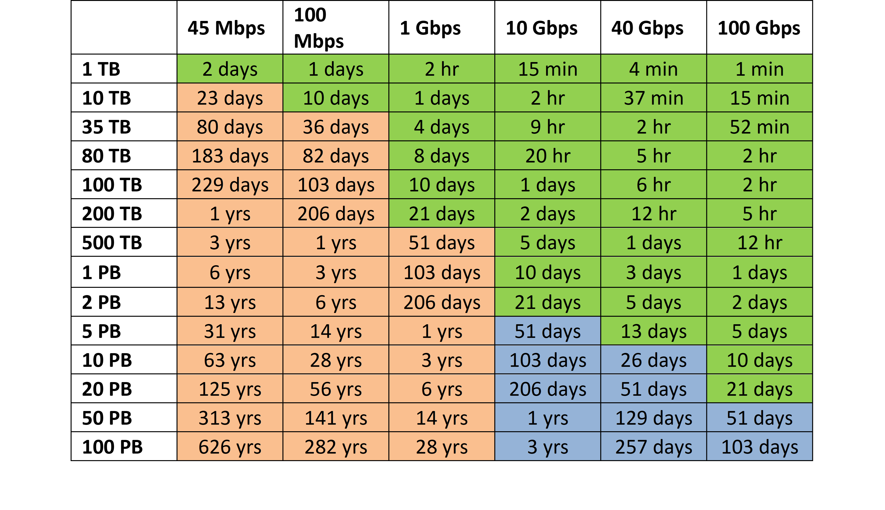

# Plan the migration strategy

Choosing the right migration strategy is critical, as it can significantly impact project timelines, costs, and overall business continuity. With careful planning and a thoughtful approach, you can ensure a smooth and efficient transition for your data assets.

### Determine Online vs. Offline Transfer

- If you have sufficient *network bandwidth*, **online** migration is the simplest for one time and/or recurring delta syncs. If bandwidth is *limited, constrained, unreliable or no network at all* and data is considerably large (multi-TBs - PBs), plan to use **offline** transfer.
- In case the data continues to change, a **hybrid approach** works best (if there are network constraints, else follow online migration). You use offline mode to **seed the bulk** of the data, then do online **delta syncs** for the changes. Alternatively, you can also choose an online only option (in case of no network constraints) leveraging a tool that can continue to sync content until the delta reduces to zero and perform a final cutover at a time convenient for you.
- Considering *Data size, transfer frequency, network bandwidth*, and ***timeline*** you can weigh in suitable migration modes. Below is a simple way to think about this.
- The table below depicts various sizes of data and their corresponding projected time to migrate over the wire given a particular available bandwidth on-premises (up to 90% utilized). You should consider using a physical device (offline mode) or a combination of online and offline if the projected time is too slow for you.
- For example, for a better understanding, the cells in green are best candidates for online transfer (assuming <21-30 days are acceptable for you); the ones in orange are best for offline (in case >21-30 days are too late or costly, network too constraint/limited); and the ones in blue can adopt both or one over the other on a case-to-case basis.

- Reach out to your Microsoft Representative for guidance if you have related questions at any point in time
- Your *migration timeline, network bandwidth and the total data size are* considered as the primary constraint
- The above calculation assumes network bandwidth is 90% consumed. Kindly consider the overall utilization of the network wherein you do not have a dedicated connection for data migration.
- Your unique situation and requirements will be the driving factors for choosing the appropriate transfer mode (online/offline).

> **!Pro Tip:**
> The guiding principle is minimizing downtime and moving most data ahead of time. By the final cutover, Azure should already have an up-to-date copy, so the last sync and switchover is quick.

### Lift & shift data migration

Lift and shift data migration is a strategy where data and applications are moved from one environment (like on-premises infrastructure) to another (such as the cloud) with minimal or no changes to the underlying architecture. It's a fast and straightforward approach, ideal for organizations looking to quickly modernize their infrastructure without redesigning their applications. Whereas most cloud migrations involve this approach, there is also a need to delta sync for the source workloads that change during the data transfer duration. Hence it is important to choose the right tools for both initial migration/seeding and delta synchronization.

You will read more about the tools choices and recommended tools in the upcoming section.

### Data change rate and tiering

- Depending on the data change rate & access frequency and tools capability to perform a catchup/sync iteratively, the appropriate solution should be chosen; If data is accessed or changed frequently use specialized tools such as Azure Data Mover or partner solutions for online transfers.  Similar considerations apply to a high number of files involving 10s of millions; Use the right tool based on source considerations, target capabilities and bandwidth.
- Unmanaged solutions such as robocopy, azCopy, distCP, rsync etc. might encounter scale issues for transfer involving 10s of millions of files in a single job. Review how to [optimize AzCopy tool](/azure/storage/common/storage-use-azcopy-optimize) for transfer jobs. Review the corresponding tools documentation for accurate and latest scale and performance limits.
- Similar considerations apply whether data tiering is required during migration or not. In some cases, data/cloud tiering is maintained as a continuous data management process.

### Data movement & Hybrid storage

- Cloud-only storage vs On-prem cache requirement: While planning your migration, identify if the data set will continue to be used in Azure against the datasets for which an on-premises cache is also required.
- One time movement vs repetitive transfer and Uni or bi- directional sync
- Identify if the moment is one time migration or requires repetitive transfers and in what frequency, the size involved in the frequency. Also, identify whether it will be unidirectional or bi-directional synchronization if on-premises presence is required.

### Replication as a migration strategy

There are cases in which data migration can leverage a replication tool. For example, Azure Migrate can replicate your on-premises physical and virtual machines along with disks (and with data of course inside) to Azure VM. It provides end to end planning, replication health status, cutover and orchestrating entire migration plan. On-premises VM disks are migrated as Azure Disks. Similarly, there are ISV tools such as Carbonite Migrate, Veeam Backup & Replication that can help migrate large amounts of data with underlying replication technologies. Often these tools require separate deployment, management and configurations. However, they provide additional capabilities such as pre-migration testing and reduce downtime.

### Backup and restore as a migration strategy

In some cases, a traditional backup and restore method can also work as an effective migration strategy. This is primarily suitable for the scenarios below:
- Archival or historical data migration
- Source systems do not support modern or other tooling options
- Noncritical or low downtime tolerant systems
- Dev-test environment migrations
- Maintaining a legal hold requirement for point in time migration needs.

#### Additional resources

Please review additional resources for more information on this topic.

1. [Azure Storage Migration Tools Comparison - Unstructured data | Microsoft Learn](/azure/storage/solution-integration/validated-partners/data-management/migration-tools-comparison)
2. [Microsoft Azure Data Box overview ](/azure/databox/data-box-overview)
3. [Introduction to Azure Storage Mover ](/azure/storage-mover/service-overview)
4. [Combine Azure Storage Mover and Azure Data Box](https://techcommunity.microsoft.com/blog/azurestorageblog/storage-migration-combine-azure-storage-mover-and-azure-data-box/4143354)
5. [Copy or move data to Azure Storage by using AzCopy v10 ](/azure/storage/common/storage-use-azcopy-v10)
6. [Migration and modernization tool - Azure Migrate ](/azure/migrate/tutorial-migrate-vmware)
7. [Azure Storage Migration Program Details](/azure/storage/solution-integration/validated-partners/data-management/azure-file-migration-program-solutions)
8. [Introduction to Azure File Sync ](/azure/storage/file-sync/file-sync-introduction)
9. [Azure Data Factory ](/azure/data-factory/quickstart-get-started)
