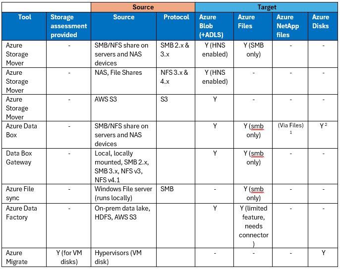
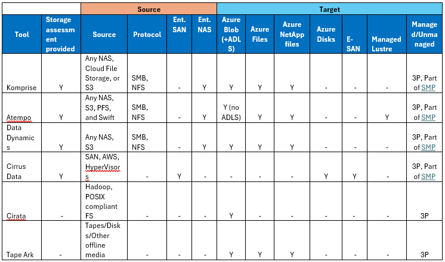
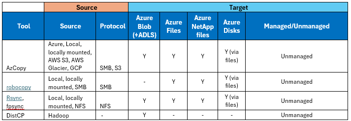

# Select migration Tools 

In this section, you will learn various categories of solutions that migrate data over the network and offline. There are other solutions that provide for repeatable sync, merge and hybrid deployment capabilities. Often, these tools bring overlapping technical capabilities and enable similar use cases. Hence the first section outlines in which scenarios you should prefer each one of them and in the second section it aims to provide a broad perspective and compare/contrasting views.

## Online tools

**Network Transfer (Online)**

You transfer your data to Azure over the Internet or your network connection. This transfer can be done in many ways using various tools.

**Azure Storage Mover**

Azure Storage Mover is a fully managed migration service that helps you to migrate terabyte to petabyte scale data to Azure storage **over the network (online)**. Azure Storage Mover is a hybrid cloud service consisting of a cloud service component and an on-premises migration agent virtual machine (VM). Storage Mover is used for migration scenarios such as *lift-and-shift*, and for cloud migrations that you repeat occasionally, periodically.

Here are the key scenarios and capabilities for which Azure Storage Mover is the recommended tool over other options.

* You want a fully managed, automated, resilient tool in Azure
* Have a greater visibility of all migrations ongoing from a single place. One Azure Storage Mover resource can manage/orchestrate multiple agents globally.
* Whether you have a relatively small data size (up to few TBs) of files to large petabyte scale files, folders, and file shares, you can use Storage Mover. For very smaller data sets < 1TB and one-off data transfer, use AzCopy instead.
* Whether it is a one-off transfer such as a lift-and-shift or a repeated, periodic syncs/transfer.
* You want a simple, reliable process and don't require advanced customizations—default configurations are often sufficient.
* You need to preserve file metadata.
* Migration parameters include
  * Source SMB/NFS to Azure Blob
  * Source SMB to Azure Files
  * S3 to Azure Blob
  * "Metadata-only" copy functionality wherein you need to copy only file metadata or structure without the file contents.  (e.g., seeding permission or doing dry-run migrations).

You can read more about Azure Storage Mover [here](/azure/storage-mover/service-overview). Also, the below articles can help you utilize Azure Storage Mover for your cloud migration:

- [Become familiar with the Storage Mover resource hierarchy](/azure/storage-mover/resource-hierarchy)
- [Learn how to deploy a Storage Mover in your Azure subscription](/azure/storage-mover/storage-mover-create)
- [Learn how to deploy a Storage Mover agent in your environment](/azure/storage-mover/agent-deploy)

### Sync and tiering tools

**Azure File Sync**

Azure File Sync enables near-zero downtime **migrations of Windows file server and provides a hybrid storage solution**. Azure File Sync enables you to centralize your organization's file shares in Azure Files, while keeping the flexibility, performance, and compatibility of a Windows file server. 

* Choose Azure** File Sync** for *traditional file server extension and multi-site synchronization* with Azure File shares (with active directory integration and two-way sync). Note that File sync is primarily a sync and tiering tool, as compared to Storage mover which works primarily as a migration service.
* It preserves NTFS permissions and attributes automatically. This is ideal if you want to keep an on-prem cache & leverage [cloud tiering](/azure/storage/file-sync/file-sync-cloud-tiering-overview) or if the server must continue serving during the migration. 
* You can use any protocol that's available on Windows Server to access your data locally, including SMB, NFS, and FTPS. 
* You can have as many caches as you need across the world. You will find all the supported migration scenarios for File Sync [here](/azure/storage/files/storage-files-migration-overview).

Learn more about [Azure File Sync](/azure/storage/file-sync/file-sync-introduction) and various [migration scenarios here](/azure/storage/files/storage-files-migration-overview).

**Data Box Gateway**

This is a is a cloud storage solution that **acts as a virtual device, enabling seamless data transfer between your on-premises infrastructure and Azure (one way).** It is deployed as a virtual machine (VM) in your local environment and connects to Azure via standard protocols like SMB or NFS. 

* The gateway caches and uploads data to Azure Storage (Blob, Files) efficiently and securely. *Data Box Gateway* is a **permanent, streaming gateway** ideal for hybrid cloud workflows (continual feed). 
* Choose **Data Box Gateway** for *one-way, high-volume data funneling* to Azure (especially for NFS data or continuous feeds), and when you don't need multiple on-prem copies of that data kept in sync. Data Box Gateway is more about getting data offsite and available in Azure quickly for processing or archive. It also supports a manual sync option to refresh the on-premises share with the content from the Azure.

Additional details on Azure Data Box gateway is [available here.](/azure/databox-gateway/data-box-gateway-use-cases)

**Azure Data Factory (ADF)**

[Data Factory](/fabric/data-factory/data-factory-overview) helps to prepare and transform data from a rich set of data sources (for example, databases, data warehouse, Lakehouse, real-time data, and more) and ingest it **over the network (online).** Consider ADF if you need custom workflows or transform data while migrating, a repeatable or a complex pipeline, migrate big data workloads, data lake or enterprise data warehouse (EDW) to Microsoft Azure. Run a POC to ensure the service meets your requirements first owing to the number of complexities involved.

Various supported scenarios are available in this [documentation](/azure/data-factory/data-migration-guidance-overview).

### Unmanaged tools

**AzCopy**

[AzCopy](/azure/storage/common/storage-use-azcopy-v10) is best suited for fast, **scriptable**, **one-time** transfers, particularly for object data or **smaller file sets**. 

* If you require fine-grained control over your transfers, need to automate via scripts, or are transferring data that can be moved within a short timeframe (a few hours), AzCopy is an excellent choice. However, it's an unmanaged tool—meaning it doesn't automatically sync changes or keep track of transfer state. 
* Error handling is manual: you'll need to review logs and retry any permanent errors yourself. For large-scale migrations involving billions of objects, AzCopy may not be ideal due to performance limitations in listing and scanning. 
* For one-off small-scale (a few TBs) cloud-to-cloud migrations (such as other cloud storage to Azure Blob), AzCopy is a handy tool and is simple to use. However, for large object stores with billions of items, it may hit performance issues.

**NOTE:** AzCopy **does not** support "Metadata-only" copy functionality wherein you need to copy only file metadata or structure without the file contents (e.g., seeding permission or doing dry-run migrations). For such scenarios, use Storage Mover instead.

You can read more details on - [getting started with AzCopy](https://docs.azure.cn/en-us/storage/common/storage-use-azcopy-v10). 

### 3P solutions for specialized capabilities

**Partner/ISV tools:**

If you need advanced features such as alerting, per-file handling, deep assessments, specialized source file systems, policy-based moves, delta sync with minimal cutover, or support for sources & capabilities etc. that native Azure tools don't cover, consider [Partner or ISV (Independent Software Vendor) tools](/azure/storage/solution-integration/validated-partners/data-management/azure-file-migration-program-solutions). 

* For more details to support your decision, please review [Broad comparisons and capability matrix](#) section below.

## Offline tools
(**Offline transfer using shippable devices**)

Use physical shippable devices when you want to do offline one-time bulk data transfer. This use case involves copying data to either a disk or specialized device and then shipping it to a secure Microsoft facility where the data is uploaded. You can purchase and ship your own disks, or you order a Microsoft-supplied disk or device. Microsoft-supplied solutions for offline transfer include Azure [Data Box Next-Gen](/azure/databox/data-box-overview) and [Data Box Disk](/azure/databox/data-box-disk-overview).

**Azure Data Box and Data Box disk**

This service enables you to **migrate data offline** to your preferred Azure storage service. Here are the key considerations for migrating with Azure Data Box.

* Choose Azure Data Box when data copy over the network is not an option, it is constrained, too slow, doesn't exist or costly.
  
* Azure Data Box supports direct cross region data import. It means your region of storage account can be entirely different than the region of your data source. By leveraging this you can migrate data to let's say to the UK from your source location that could be somewhere in the US. It helps manage large migrations involving many geographies while avoiding costs for inter region network charges.

* You are already migrating your compute infrastructure using Azure Migrate and plan to migrate the unstructured data using offline mode to reduce time, cost and network bandwidth. This parallel execution can accelerate the overall migration process and reduce load on the network.

* You would like to migrate an initial data set (offline seeding) using Azure Data Box and then switch to online tools to sync the recent changes. Data Box integrates really well with other online services including partner/ISV tools too.

* You have data on Azure storage, or files and you would like to export and bring the data to on-premises using offline transfer.

* Data Box can handle tens to hundreds of TB per device, and multiple devices can be used in parallel. It's especially useful for remote sites with limited connectivity or a one-time bulk migration. 

* Migration use cases include 
  * Source SMB/NFS to Azure Blob, Files, ADLS
  * Source on-premises VM disks to managed disks
  * Move data directly to one or more specific access tier (hot, cold, cool, archive)

You will find more details about Azure Data Box in [Microsoft learn documentation](/azure/databox/data-box-overview).

**Azure Import/Export**

Use [Azure Import/Export service](/azure/import-export/storage-import-export-service) by shipping your own disk drives to securely import large amounts of data to Azure Blob storage and Azure Files. This service can also be used to transfer data from Azure Blob storage to disk drives and ship to your on-premises sites.

### Other miscellaneous tools

**Graphical interface** - If you occasionally transfer just a few files and don't need to automate the data transfer, you can choose a graphical interface tool such as [Azure Storage Explorer](https://azure.microsoft.com/en-us/products/storage/storage-explorer) or a [web-based exploration tool](/azure/storage/blobs/storage-quickstart-blobs-portal) in Azure portal.

**Scripted or programmatic transfer** - You can use optimized software tools that we provide or call our REST APIs/SDKs directly. The available scriptable tools are AzCopy, Azure PowerShell, and Azure CLI. For programmatic interface, use one of the SDKs for .NET, Java, Python, Node/JS, C++, Go, PHP or Ruby.

## Broad recommendations & capability matrix

Selecting appropriate tools for data migration is vital for seamless and reliable transfers. Tailored approaches based on scenarios, like file share migrations or service-to-service transfers, help optimize processes while reducing risks and disruptions. Review the **key** **scenarios and the most suitable & preferred migration tool** for your use cases. Although there are alternatives possible on a case-to-case basis, the table intends to provide tailored guidance for the most preferred tool as per the scenario.

In the following section we will explore more detailed capabilities and supported features so that you are able to compare-contrast and make an informed decision for the next steps of data migration.

### Migration tools for Azure storage provided by Microsoft (1P)

When planning your data migration to Azure, it's important to select the right tool based on your specific needs, data volume, and migration complexity. Please read more about their corresponding capabilities in documentation before finalizing the tool.

The table mentioned below provides source, target-based supportability matrix for key Microsoft provided migration tools. All tools mentioned below:

* Provide varied capabilities and source and target services, protocol support
* Only Azure Data Box supports offline data transfer to Azure Storage, others are all online solutions

 *1. Involves a two-step process. First migrate to Azure Files using Data Box and then move intra Azure from Files to ANF.* *2. You can migrate as page blobs to managed disks. Supported max size 8TB. PV2 and Ultra disks are not currently supported.* *3. NFS support for Azure Blob and Azure Files is only NFS v3 and NFS 4.1 respectively. Hence it is important to consider corresponding application/user functionality and accessibility post migration.*

### Some key migration tools for Azure storage provided by ISV partners (3P)

All tools mentioned below:

* Provide varied capabilities and source and target services, protocol support
* Read more about their corresponding capabilities in documentation before finalizing the tool.
* Only TapeArk supports offline transfer, others are all online solutions

### Other command line, unmanaged tools

All tools mentioned below:

* Transfer files online
* Do not provide Storage assessments
* Do not support Enterprise NAS, SAN as a source or Azure E-SAN and managed Lustre as destination.

*Unmanaged command line tools such as azcopy, robocopy, rsync, DistCP provide varied degrees of capabilities to transfer data to Azure storage. Scanning for several million files, changed files at source, size of total data, error detection and running several copy jobs at a time could become tedious, erroneous and very challenging.*
