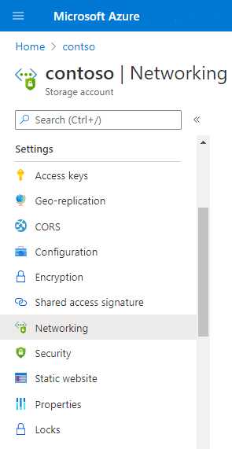
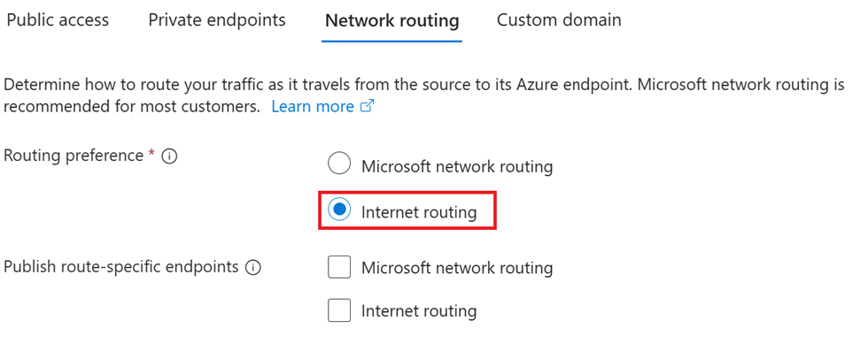
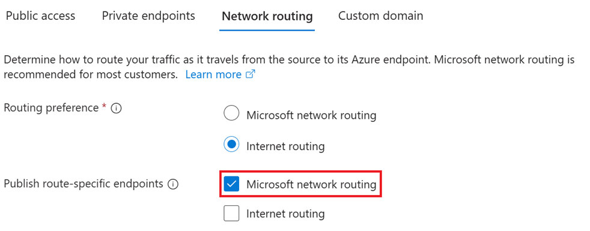
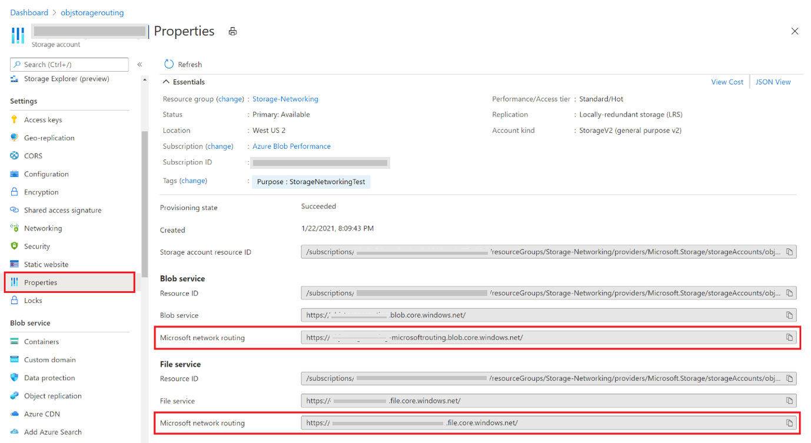
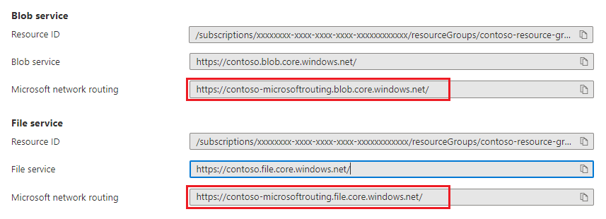

# Configure network routing preference for Azure Storage

This article describes how you can configure the network routing preference and route-specific endpoints for your storage account. 

The network routing preference specifies how network traffic is routed to your account from clients over the internet. Route-specific endpoints are new endpoints that Azure Storage creates for your storage account. These endpoints route traffic over a desired path without changing your default routing preference. To learn more, see [Network routing preference for Azure Storage](network-routing-preference.md).

## Configure the routing preference for the default public endpoint

By default, the routing preference for the public endpoint of the storage account is set to Microsoft global network. You can choose between the Microsoft global network and Internet routing as the default routing preference for the public endpoint of your storage account. To learn more about the difference between these two types of routing, see [Network routing preference for Azure Storage](network-routing-preference.md). 

### [Portal](#tab/azure-portal)

To change your routing preference to Internet routing:

1. Sign in to the [Azure portal](https://portal.azure.com).

2. Navigate to your storage account in the portal.

3. Under **Settings**, choose **Networking**.

    > [!div class="mx-imgBorder"]
    > 

4.	In the **Firewalls and virtual networks** tab, under **Network Routing**, change the **Routing preference** setting to **Internet routing**.

5.	Click **Save**.

    > [!div class="mx-imgBorder"]
    > 

### [PowerShell](#tab/azure-powershell)

1. Sign in to your Azure subscription with the `Connect-AzAccount` command and follow the on-screen directions to authenticate.

   ```powershell
   Connect-AzAccount
   ```

2. If your identity is associated with more than one subscription, then set your active subscription to subscription of the storage account that will host your static website.

   ```powershell
   $context = Get-AzSubscription -SubscriptionId <subscription-id>
   Set-AzContext $context
   ```

   Replace the `<subscription-id>` placeholder value with the ID of your subscription.

3. To change your routing preference to Internet routing, use the [Set-AzStorageAccount](/powershell/module/az.storage/set-azstorageaccount) command and set the `--routing-choice` parameter to `InternetRouting`.

   ```powershell
   Set-AzStorageAccount -ResourceGroupName <resource-group-name> `
    -AccountName <storage-account-name> `
    -RoutingChoice InternetRouting
   ```

   Replace the `<resource-group-name>` placeholder value with the name of the resource group that contains the storage account.

   Replace the `<storage-account-name>` placeholder value with the name of the storage account.

### [Azure CLI](#tab/azure-cli)

1. Sign in to your Azure subscription.

   - To launch Azure Cloud Shell, sign in to the [Azure portal](https://portal.azure.com).

   - To log into your local installation of the CLI, run the [az login](/cli/azure/reference-index#az_login) command:

     ```azurecli
     az login
     ```
2. If your identity is associated with more than one subscription, then set your active subscription to subscription of the storage account that will host your static website.

   ```azurecli
   az account set --subscription <subscription-id>
   ```

   Replace the `<subscription-id>` placeholder value with the ID of your subscription.

3. To change your routing preference to Internet routing, use the [az storage account update](/cli/azure/storage/account#az_storage_account_update) command and set the `--routing-choice` parameter to `InternetRouting`.

   ```azurecli
   az storage account update --name <storage-account-name> --routing-choice InternetRouting
   ```

   Replace the `<storage-account-name>` placeholder value with the name of your storage account.

---

## Configure a route-specific endpoint

You can also configure a route-specific endpoint. For example, you can set the routing preference for the default endpoint to *Internet routing*, and then publish a route-specific endpoint that enables traffic between clients on the internet and your storage account to be routed via the Microsoft global network.

This preference affects only the route-specific endpoint. This preference doesn't affect your default routing preference.  

### [Portal](#tab/azure-portal)

1.	Navigate to your storage account in the portal.

2.	Under **Settings**, choose **Networking**.

3.	In the **Firewalls and virtual networks** tab, under **Publish route-specific endpoints**, choose the routing preference of your route-specific endpoint, and then click **Save**.

    The following image shows the **Microsoft network routing** option selected.

    > [!div class="mx-imgBorder"]
    > 

### [PowerShell](#tab/azure-powershell)

1. To configure a route-specific endpoint, use the [Set-AzStorageAccount](/powershell/module/az.storage/set-azstorageaccount) command. 

   - To create a route-specific endpoint that uses the Microsoft network routing preference, set the `-PublishMicrosoftEndpoint` parameter to `true`. 

   - To create a route-specific endpoint that uses the Internet routing preference, set the `-PublishInternetEndpointTo` parameter to `true`.  

   The following example creates a route-specific endpoint that uses the Microsoft network routing preference.

   ```powershell
   Set-AzStorageAccount -ResourceGroupName <resource-group-name> `
    -AccountName <storage-account-name> `
    -PublishMicrosoftEndpoint $true
   ```

   Replace the `<resource-group-name>` placeholder value with the name of the resource group that contains the storage account.

   Replace the `<storage-account-name>` placeholder value with the name of the storage account.

### [Azure CLI](#tab/azure-cli)

1. To configure a route-specific endpoint, use the [az storage account update](/azure/storage/account#az_storage_account_update) command. 

   - To create a route-specific endpoint that uses the Microsoft network routing preference, set the `--publish-microsoft-endpoints` parameter to `true`. 

   - To create a route-specific endpoint that uses the Internet routing preference, set the `--publish-internet-endpoints` parameter to `true`.  

   The following example creates a route-specific endpoint that uses the Microsoft network routing preference.

   ```azurecli
   az storage account update --name <storage-account-name> --publish-microsoft-endpoints true
   ```

   Replace the `<storage-account-name>` placeholder value with the name of the storage account.

---

## Find the endpoint name for a route-specific endpoint

If you configured a route-specific endpoint, you can find the endpoint in the properties of you storage account.

### [Portal](#tab/azure-portal)

1.	Under **Settings**, choose **Properties**.

    > [!div class="mx-imgBorder"]
    > 

2.	The **Microsoft network routing** endpoint is shown for each service that supports routing preferences. This image shows the endpoint for the blob and file services.

    > [!div class="mx-imgBorder"]
    > 

### [PowerShell](#tab/azure-powershell)

1. To print the endpoints to the console, use the `PrimaryEndpoints` property of the storage account object.

   ```powershell
   Get-AzStorageAccount -ResourceGroupName <resource-group-name> -Name <storage-account-name>
   write-Output $StorageAccount.PrimaryEndpoints
   ```

   Replace the `<resource-group-name>` placeholder value with the name of the resource group that contains the storage account.

   Replace the `<storage-account-name>` placeholder value with the name of the storage account.

### [Azure CLI](#tab/azure-cli)

1. To print the endpoints to the console, use the [az storage account show](/cli/azure/storage/account#az_storage_account_show) property of the storage account object.

   ```azurecli
   az storage account show -g <resource-group-name> -n <storage-account-name>
   ```

   Replace the `<resource-group-name>` placeholder value with the name of the resource group that contains the storage account.

   Replace the `<storage-account-name>` placeholder value with the name of the storage account.

---

## See also

- [Network routing preference](network-routing-preference.md)
- [Configure Azure Storage firewalls and virtual networks](storage-network-security.md)
- [Security recommendations for Blob storage](../blobs/security-recommendations.md)
