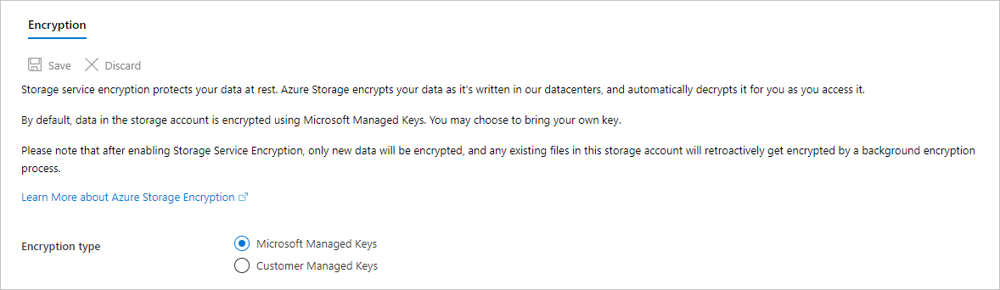
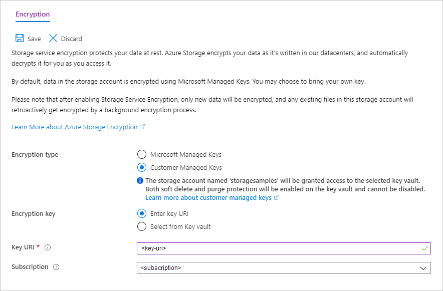

# Configure encryption with customer-managed keys stored in Azure Key Vault

Azure Storage encrypts all data in a storage account at rest. By default, data is encrypted with Microsoft-managed keys. For additional control over encryption keys, you can manage your own keys. Customer-managed keys must be stored in Azure Key Vault or Key Vault Managed Hardware Security Model (HSM) (preview).

This article shows how to configure encryption with customer-managed keys stored in a key vault by using the Azure portal, PowerShell, or Azure CLI. To learn how to configure encryption with customer-managed keys stored in a managed HSM, see [Configure encryption with customer-managed keys stored in Azure Key Vault Managed HSM (preview)](customer-managed-keys-configure-key-vault-hsm.md).

> [!NOTE]
> Azure Key Vault and Azure Key Vault Managed HSM support the same APIs and management interfaces for configuration.

## Configure a key vault

You can use a new or existing key vault to store customer-managed keys. The storage account and the key vault must be in the same region, but they can be in different subscriptions.

Using customer-managed keys with Azure Storage encryption requires that both soft delete and purge protection be enabled for the key vault. Soft delete is enabled by default when you create a new key vault and cannot be disabled. You can enable purge protection either when you create the key vault or after it is created.

# [Azure portal](#tab/portal)

To learn how to create a key vault with the Azure portal, see [Quickstart: Create a key vault using the Azure portal](../../key-vault/general/quick-create-portal.md). When you create the key vault, select **Enable purge protection**, as shown in the following image.

:::image type="content" source="media/customer-managed-keys-configure-key-vault/configure-key-vault-portal.png" alt-text="Screenshot showing how to enable purge protection when creating a key vault":::

To enable purge protection on an existing key vault, follow these steps:

1. Navigate to your key vault in the Azure portal.
1. Under **Settings**, choose **Properties**.
1. In the **Purge protection** section, choose **Enable purge protection**.

# [PowerShell](#tab/powershell)

To create a new key vault with PowerShell, install version 2.0.0 or later of the [Az.KeyVault](https://www.powershellgallery.com/packages/Az.KeyVault/2.0.0) PowerShell module. Then call [New-AzKeyVault](/powershell/module/az.keyvault/new-azkeyvault) to create a new key vault. With version 2.0.0 and later of the Az.KeyVault module, soft delete is enabled by default when you create a new key vault.

The following example creates a new key vault with both soft delete and purge protection enabled. Remember to replace the placeholder values in brackets with your own values.

```powershell
$keyVault = New-AzKeyVault -Name <key-vault> `
    -ResourceGroupName <resource_group> `
    -Location <location> `
    -EnablePurgeProtection
```

To learn how to enable purge protection on an existing key vault with PowerShell, see [How to use soft-delete with PowerShell](../../key-vault/general/key-vault-recovery.md).

Next, assign a system-assigned managed identity to your storage account. You'll use this managed identity to grant the storage account permissions to access the key vault. For more information about system-assigned managed identities, see [What are managed identities for Azure resources?](../../active-directory/managed-identities-azure-resources/overview.md).

To assign a managed identity using PowerShell, call [Set-AzStorageAccount](/powershell/module/az.storage/set-azstorageaccount):

```powershell
$storageAccount = Set-AzStorageAccount -ResourceGroupName <resource_group> `
    -Name <storage-account> `
    -AssignIdentity
```

Finally, configure the access policy for the key vault so that the storage account has permissions to access it. In this step, you'll use the managed identity that you previously assigned to the storage account.

To set the access policy for the key vault, call [Set-AzKeyVaultAccessPolicy](/powershell/module/az.keyvault/set-azkeyvaultaccesspolicy):

```powershell
Set-AzKeyVaultAccessPolicy `
    -VaultName $keyVault.VaultName `
    -ObjectId $storageAccount.Identity.PrincipalId `
    -PermissionsToKeys wrapkey,unwrapkey,get
```

# [Azure CLI](#tab/azure-cli)

To create a new key vault using Azure CLI, call [az keyvault create](/cli/azure/keyvault#az_keyvault_create). Remember to replace the placeholder values in brackets with your own values:

```azurecli-interactive
az keyvault create \
    --name <key-vault> \
    --resource-group <resource_group> \
    --location <region> \
    --enable-purge-protection
```

To learn how to enable purge protection on an existing key vault with Azure CLI, see [How to use soft-delete with CLI](../../key-vault/general/key-vault-recovery.md).

Next, assign a system-assigned managed identity to the storage account. You'll use this managed identity to grant the storage account permissions to access the key vault. For more information about system-assigned managed identities, see [What are managed identities for Azure resources?](../../active-directory/managed-identities-azure-resources/overview.md).

To assign a managed identity using Azure CLI, call [az storage account update](/cli/azure/storage/account#az_storage_account_update):

```azurecli-interactive
az storage account update \
    --name <storage-account> \
    --resource-group <resource_group> \
    --assign-identity
```

Finally, configure the access policy for the key vault so that the storage account has permissions to access it. In this step, you'll use the managed identity that you previously assigned to the storage account.

To set the access policy for the key vault, call [az keyvault set-policy](/cli/azure/keyvault#az_keyvault_set_policy):

```azurecli-interactive
storage_account_principal=$(az storage account show \
    --name <storage-account> \
    --resource-group <resource-group> \
    --query identity.principalId \
    --output tsv)
az keyvault set-policy \
    --name <key-vault> \
    --resource-group <resource_group>
    --object-id $storage_account_principal \
    --key-permissions get unwrapKey wrapKey
```

---

## Add a key

Next, add a key in the key vault.

Azure Storage encryption supports RSA and RSA-HSM keys of sizes 2048, 3072 and 4096. For more information about keys, see [About keys](../../key-vault/keys/about-keys.md).

# [Azure portal](#tab/portal)

To learn how to add a key with the Azure portal, see [Quickstart: Set and retrieve a key from Azure Key Vault using the Azure portal](../../key-vault/keys/quick-create-portal.md).

# [PowerShell](#tab/powershell)

To add a key with PowerShell, call [Add-AzKeyVaultKey](/powershell/module/az.keyvault/add-azkeyvaultkey). Remember to replace the placeholder values in brackets with your own values and to use the variables defined in the previous examples.

```powershell
$key = Add-AzKeyVaultKey -VaultName $keyVault.VaultName `
    -Name <key> `
    -Destination 'Software'
```

# [Azure CLI](#tab/azure-cli)

To add a key with Azure CLI, call [az keyvault key create](/cli/azure/keyvault/key#az_keyvault_key_create). Remember to replace the placeholder values in brackets with your own values.

```azurecli-interactive
az keyvault key create \
    --name <key> \
    --vault-name <key-vault>
```

---

## Configure encryption with customer-managed keys

Next, configure your Azure Storage account to use customer-managed keys with Azure Key Vault, then specify the key to associate with the storage account.

When you configure encryption with customer-managed keys, you can choose to automatically update the key version used for Azure Storage encryption whenever a new version is available in the associated key vault. Alternately, you can explicitly specify a key version to be used for encryption until the key version is manually updated.

> [!NOTE]
> To rotate a key, create a new version of the key in Azure Key Vault. Azure Storage does not handle the rotation of the key in Azure Key Vault, so you will need to rotate your key manually or create a function to rotate it on a schedule.

### Configure encryption for automatic updating of key versions

Azure Storage can automatically update the customer-managed key that is used for encryption to use the latest key version. When the customer-managed key is rotated in Azure Key Vault, Azure Storage will automatically begin using the latest version of the key for encryption.

# [Azure portal](#tab/portal)

To configure customer-managed keys with automatic updating of the key version in the Azure portal, follow these steps:

1. Navigate to your storage account.
1. On the **Settings** blade for the storage account, click **Encryption**. By default, key management is set to **Microsoft Managed Keys**, as shown in the following image.

    

1. Select the **Customer Managed Keys** option.
1. Choose the **Select from Key Vault** option.
1. Select **Select a key vault and key**.
1. Select the key vault containing the key you want to use.
1. Select the key from the key vault.

   

1. Save your changes.

After you've specified the key, the Azure portal indicates that automatic updating of the key version is enabled and displays the key version currently in use for encryption.

:::image type="content" source="media/customer-managed-keys-configure-key-vault/portal-auto-rotation-enabled.png" alt-text="Screenshot showing automatic updating of the key version enabled":::

# [PowerShell](#tab/powershell)

To configure customer-managed keys with automatic updating of the key version with PowerShell, install the [Az.Storage](https://www.powershellgallery.com/packages/Az.Storage) module, version 2.0.0 or later.

To automatically update the key version for a customer-managed key, omit the key version when you configure encryption with customer-managed keys for the storage account. Call [Set-AzStorageAccount](/powershell/module/az.storage/set-azstorageaccount) to update the storage account's encryption settings, as shown in the following example, and include the **-KeyvaultEncryption** option to enable customer-managed keys for the storage account.

Remember to replace the placeholder values in brackets with your own values and to use the variables defined in the previous examples.

```powershell
Set-AzStorageAccount -ResourceGroupName $storageAccount.ResourceGroupName `
    -AccountName $storageAccount.StorageAccountName `
    -KeyvaultEncryption `
    -KeyName $key.Name `
    -KeyVaultUri $keyVault.VaultUri
```

# [Azure CLI](#tab/azure-cli)

To configure customer-managed keys with automatic updating of the key version with Azure CLI, install [Azure CLI version 2.4.0](/cli/azure/release-notes-azure-cli#april-21-2020) or later. For more information, see [Install the Azure CLI](/cli/azure/install-azure-cli).

To automatically update the key version for a customer-managed key, omit the key version when you configure encryption with customer-managed keys for the storage account. Call [az storage account update](/cli/azure/storage/account#az_storage_account_update) to update the storage account's encryption settings, as shown in the following example. Include the `--encryption-key-source` parameter and set it to `Microsoft.Keyvault` to enable customer-managed keys for the account.

Remember to replace the placeholder values in brackets with your own values.

```azurecli-interactive
key_vault_uri=$(az keyvault show \
    --name <key-vault> \
    --resource-group <resource_group> \
    --query properties.vaultUri \
    --output tsv)
az storage account update
    --name <storage-account> \
    --resource-group <resource_group> \
    --encryption-key-name <key> \
    --encryption-key-source Microsoft.Keyvault \
    --encryption-key-vault $key_vault_uri
```

---

### Configure encryption for manual updating of key versions

If you prefer to manually update the key version, then explicitly specify the version at the time that you configure encryption with customer-managed keys. In this case, Azure Storage will not automatically update the key version when a new version is created in the key vault.To use a new key version, you must manually update the version used for Azure Storage encryption.

# [Azure portal](#tab/portal)

To configure customer-managed keys with manual updating of the key version in the Azure portal, specify the key URI, including the version. To specify a key as a URI, follow these steps:

1. To locate the key URI in the Azure portal, navigate to your key vault, and select the **Keys** setting. Select the desired key, then click the key to view its versions. Select a key version to view the settings for that version.
1. Copy the value of the **Key Identifier** field, which provides the URI.

    

1. In the **Encryption key** settings for your storage account, choose the **Enter key URI** option.
1. Paste the URI that you copied into the **Key URI** field. Omit the key version from the URI to enable automatic updating of the key version.

   

1. Specify the subscription that contains the key vault.
1. Save your changes.

# [PowerShell](#tab/powershell)

To configure customer-managed keys with manual updating of the key version, explicitly provide the key version when you configure encryption for the storage account. Call [Set-AzStorageAccount](/powershell/module/az.storage/set-azstorageaccount) to update the storage account's encryption settings, as shown in the following example, and include the **-KeyvaultEncryption** option to enable customer-managed keys for the storage account.

Remember to replace the placeholder values in brackets with your own values and to use the variables defined in the previous examples.

```powershell
Set-AzStorageAccount -ResourceGroupName $storageAccount.ResourceGroupName `
    -AccountName $storageAccount.StorageAccountName `
    -KeyvaultEncryption `
    -KeyName $key.Name `
    -KeyVersion $key.Version `
    -KeyVaultUri $keyVault.VaultUri
```

When you manually update the key version, you'll need to update the storage account's encryption settings to use the new version. First, call [Get-AzKeyVaultKey](/powershell/module/az.keyvault/get-azkeyvaultkey) to get the latest version of the key. Then call [Set-AzStorageAccount](/powershell/module/az.storage/set-azstorageaccount) to update the storage account's encryption settings to use the new version of the key, as shown in the previous example.

# [Azure CLI](#tab/azure-cli)

To configure customer-managed keys with manual updating of the key version, explicitly provide the key version when you configure encryption for the storage account. Call [az storage account update](/cli/azure/storage/account#az_storage_account_update) to update the storage account's encryption settings, as shown in the following example. Include the `--encryption-key-source` parameter and set it to `Microsoft.Keyvault` to enable customer-managed keys for the account.

Remember to replace the placeholder values in brackets with your own values.

```azurecli-interactive
key_vault_uri=$(az keyvault show \
    --name <key-vault> \
    --resource-group <resource_group> \
    --query properties.vaultUri \
    --output tsv)
key_version=$(az keyvault key list-versions \
    --name <key> \
    --vault-name <key-vault> \
    --query [-1].kid \
    --output tsv | cut -d '/' -f 6)
az storage account update
    --name <storage-account> \
    --resource-group <resource_group> \
    --encryption-key-name <key> \
    --encryption-key-version $key_version \
    --encryption-key-source Microsoft.Keyvault \
    --encryption-key-vault $key_vault_uri
```

When you manually update the key version, you'll need to update the storage account's encryption settings to use the new version. First, query for the key vault URI by calling [az keyvault show](/cli/azure/keyvault#az_keyvault_show), and for the key version by calling [az keyvault key list-versions](/cli/azure/keyvault/key#az_keyvault_key_list-versions). Then call [az storage account update](/cli/azure/storage/account#az_storage_account_update) to update the storage account's encryption settings to use the new version of the key, as shown in the previous example.

---

## Change the key

You can change the key that you are using for Azure Storage encryption at any time.

# [Azure portal](#tab/portal)

To change the key with the Azure portal, follow these steps:

1. Navigate to your storage account and display the **Encryption** settings.
1. Select the key vault and choose a new key.
1. Save your changes.

# [PowerShell](#tab/powershell)

To change the key with PowerShell, call [Set-AzStorageAccount](/powershell/module/az.storage/set-azstorageaccount) as shown in [Configure encryption with customer-managed keys](#configure-encryption-with-customer-managed-keys) and provide the new key name and version. If the new key is in a different key vault, then you must also update the key vault URI.

# [Azure CLI](#tab/azure-cli)

To change the key with Azure CLI, call [az storage account update](/cli/azure/storage/account#az_storage_account_update) as shown in [Configure encryption with customer-managed keys](#configure-encryption-with-customer-managed-keys) and provide the new key name and version. If the new key is in a different key vault, then you must also update the key vault URI.

---

## Revoke customer-managed keys

Revoking a customer-managed key removes the association between the storage account and the key vault.

# [Azure portal](#tab/portal)

To revoke customer-managed keys with the Azure portal, disable the key as described in [Disable customer-managed keys](#disable-customer-managed-keys).

# [PowerShell](#tab/powershell)

You can revoke customer-managed keys by removing the key vault access policy. To revoke a customer-managed key with PowerShell, call the [Remove-AzKeyVaultAccessPolicy](/powershell/module/az.keyvault/remove-azkeyvaultaccesspolicy) command, as shown in the following example. Remember to replace the placeholder values in brackets with your own values and to use the variables defined in the previous examples.

```powershell
Remove-AzKeyVaultAccessPolicy -VaultName $keyVault.VaultName `
    -ObjectId $storageAccount.Identity.PrincipalId `
```

# [Azure CLI](#tab/azure-cli)

You can revoke customer-managed keys by removing the key vault access policy. To revoke a customer-managed key with Azure CLI, call the [az keyvault delete-policy](/cli/azure/keyvault#az_keyvault_delete_policy) command, as shown in the following example. Remember to replace the placeholder values in brackets with your own values and to use the variables defined in the previous examples.

```azurecli-interactive
az keyvault delete-policy \
    --name <key-vault> \
    --object-id $storage_account_principal
```

---

## Disable customer-managed keys

When you disable customer-managed keys, your storage account is once again encrypted with Microsoft-managed keys.

# [Azure portal](#tab/portal)

To disable customer-managed keys in the Azure portal, follow these steps:

1. Navigate to your storage account and display the **Encryption** settings.
1. Deselect the checkbox next to the **Use your own key** setting.

# [PowerShell](#tab/powershell)

To disable customer-managed keys with PowerShell, call [Set-AzStorageAccount](/powershell/module/az.storage/set-azstorageaccount) with the `-StorageEncryption` option, as shown in the following example. Remember to replace the placeholder values in brackets with your own values and to use the variables defined in the previous examples.

```powershell
Set-AzStorageAccount -ResourceGroupName $storageAccount.ResourceGroupName `
    -AccountName $storageAccount.StorageAccountName `
    -StorageEncryption  
```

# [Azure CLI](#tab/azure-cli)

To disable customer-managed keys with Azure CLI, call [az storage account update](/cli/azure/storage/account#az_storage_account_update) and set the `--encryption-key-source parameter` to `Microsoft.Storage`, as shown in the following example. Remember to replace the placeholder values in brackets with your own values and to use the variables defined in the previous examples.

```azurecli-interactive
az storage account update
    --name <storage-account> \
    --resource-group <resource_group> \
    --encryption-key-source Microsoft.Storage
```

---

## Next steps

- [Azure Storage encryption for data at rest](storage-service-encryption.md)
- [Customer-managed keys for Azure Storage encryption](customer-managed-keys-overview.md)
- [Configure encryption with customer-managed keys stored in Azure Key Vault Managed HSM (preview)](customer-managed-keys-configure-key-vault-hsm.md)
