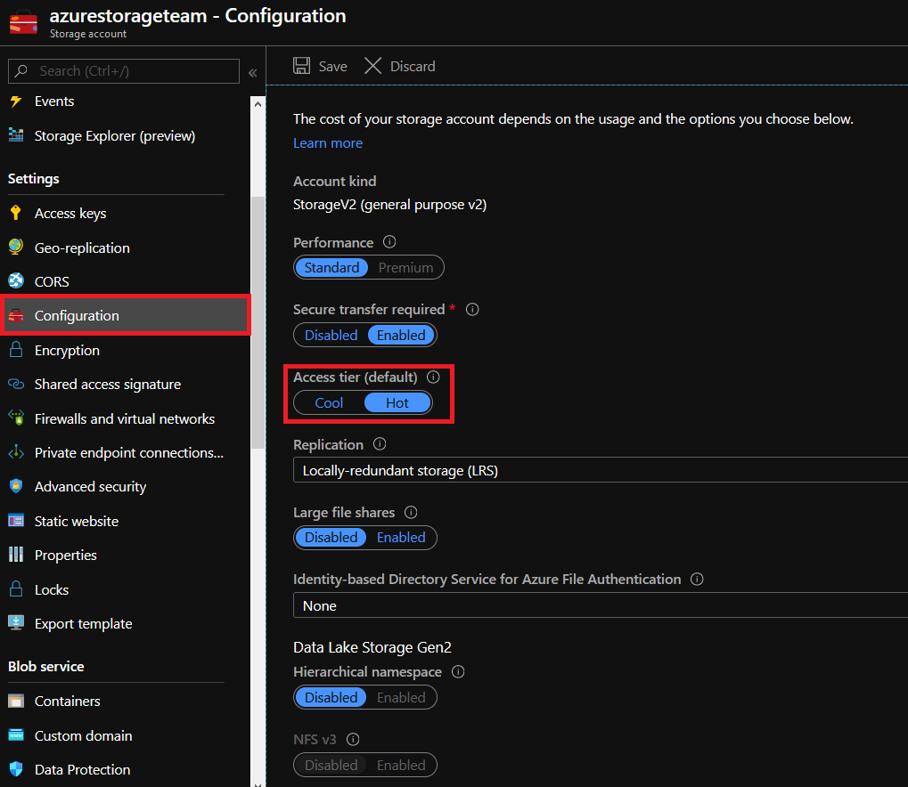

# Manage the default access tier of an Azure Storage account

Each Azure Storage account has a default access tier, either hot or cool. You assign the access tier when you create a storage account. The default access tier is hot.

You can change the default account tier by setting the **Access tier** attribute on the storage account. Changing the account tier applies to all objects stored in the account that don't have an explicit tier set. Toggling the account tier from hot to cool incurs write operations (per 10,000) for all blobs without a set tier in GPv2 accounts only and toggling from cool to hot incurs both read operations (per 10,000) and data retrieval (per GB) charges for all blobs in Blob Storage and GPv2 accounts.

For blobs with the tier set at the object level, the account tier doesn't apply. The archive tier can only be applied at the object level. You can switch between access tiers at any time.

You can change the default access tier after a storage account has been created by following the steps below.

## Change the default account access tier of a GPv2 or Blob Storage account

The following scenarios use the Azure portal or PowerShell:

# [Portal](#tab/portal)

1. Sign in to the [Azure portal](https://portal.azure.com).

1. In the Azure portal, search for and select **All Resources**.

1. Select your storage account.

1. In **Settings**, select **Configuration** to view and change the account configuration.

1. Select the right access tier for your needs: Set the **Access tier** to either **Cool** or **Hot**.

1. Click **Save** at the top.



# [PowerShell](#tab/powershell)

The following PowerShell script can be used to change the account tier. The `$rgName` variable must be initialized with your resource group name. The `$accountName` variable must be initialized with your storage account name.

```powershell
#Initialize the following with your resource group and storage account names
$rgName = ""
$accountName = ""

#Change the storage account tier to hot
Set-AzStorageAccount -ResourceGroupName $rgName -Name $accountName -AccessTier Hot
```

# [Azure CLI](#tab/azurecli)

The following Azure CLI script can be used to change the account tier. The `$rgName` variable must be initialized with your resource group name. The `$accountName` variable must be initialized with your storage account name.

```azurecli
#Initialize the following with your resource group and storage account names
$rgName = ""
$accountName = ""

#Change the storage account tier to hot
az storage account update --resource-group $rgName --name $accountName --access-tier Hot
```

---

## Next steps

- [How to manage the tier of a blob in an Azure Storage account](../blobs/manage-access-tier.md)
- [Determine if premium performance would benefit your app](../blobs/storage-blob-performance-tiers.md)
- [Evaluate usage of your current storage accounts by enabling Azure Storage metrics](../blobs/monitor-blob-storage.md)
