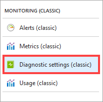
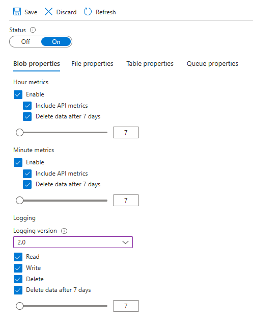
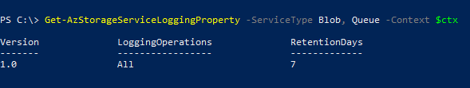
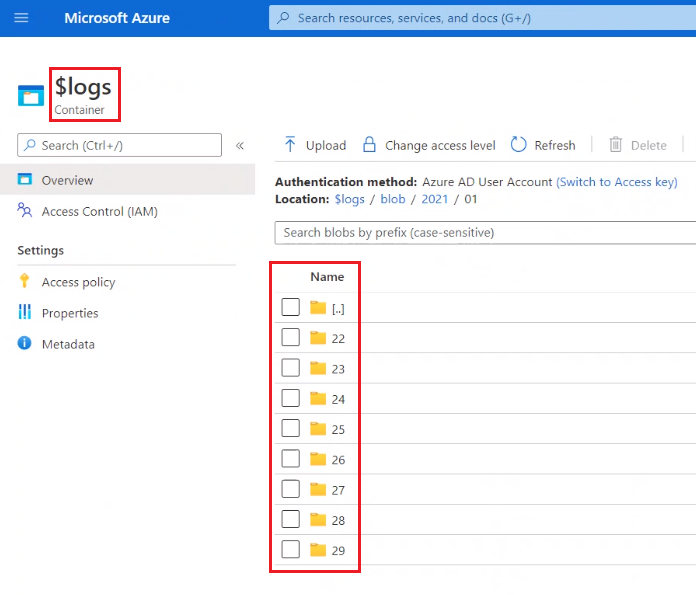

# Enable and manage Azure Storage Analytics logs (classic)

[Azure Storage Analytics](storage-analytics.md) provides logs for blobs, queues, and tables. You can use the [Azure portal](https://portal.azure.com) to configure logs are recorded for your account. This article shows you how to enable and manage logs. To learn how to enable metrics, see [Enable and manage Azure Storage Analytics metrics (classic)]().  There are costs associated with examining and storing monitoring data in the Azure portal. For more information, see [Storage Analytics](storage-analytics.md).

> [!NOTE]
> We recommend that you use Azure Storage logs in Azure Monitor instead of Storage Analytics logs. See any of the following articles:
>
> - [Monitoring Azure Blob Storage](../blobs/monitor-blob-storage.md)
> - [Monitoring Azure Files](../files/storage-files-monitoring.md)
> - [Monitoring Azure Queue Storage](../queues/monitor-queue-storage.md)
> - [Monitoring Azure Table storage](../tables/monitor-table-storage.md)

<a id="configure-logging"></a>

## Enable logs

You can instruct Azure Storage to save diagnostics logs for read, write, and delete requests for the blob, table, and queue services. The data retention policy you set also applies to these logs.

> [!NOTE]
> Azure Files currently supports Storage Analytics metrics, but does not support Storage Analytics logging.

### [Portal](#tab/azure-portal)

1. In the [Azure portal](https://portal.azure.com), select **Storage accounts**, then the name of the storage account to open the storage account blade.

2. Select **Diagnostic settings (classic)** in the **Monitoring (classic)** section of the menu blade.

    

3. Ensure **Status** is set to **On**, and select the **services** for which you'd like to enable logging.

   > [!div class="mx-imgBorder"]
   > 

4. To retain logs, ensure that the **Delete data** check box is selected.  Then, set the number of days that you would like log data to be retained by moving the slider control beneath the check box, or by directly modifying the value that appears in the text box next to the slider control. The default for new storage accounts is seven days.  If you do not want to set a retention policy, leave the **Delete data** checkbox unchecked. If there is no retention policy, it is up to you to delete the log data.

   > [!WARNING]
   > Logs are stored as data in your account. Log data can accumulate in your account over time which can increase the cost of storage. If you need log data for only a small period of time, you can reduce your costs by modifying the data retention policy. Stale log data (data older than your retention policy) is deleted by the system. We recommend setting a retention policy based on how long you want to retain the log data for your account. See [Billing on storage metrics](storage-analytics-metrics.md#billing-on-storage-metrics) for more information.

4. Click **Save**.

   The diagnostics logs are saved in a blob container named *$logs* in your storage account. You can view the log data using a storage explorer like the [Microsoft Azure Storage Explorer](https://storageexplorer.com), or programmatically using the storage client library or PowerShell.

   For information about accessing the $logs container, see [Storage analytics logging](storage-analytics-logging.md).
   
   > [!NOTE]
   > For classic storage accounts, the $logs container appears only in Azure Storage Explorer. The $logs container isn't visible from storage browser or the container view that is available in the Azure portal.

### [PowerShell](#tab/azure-powershell)

1. Open a Windows PowerShell command window.

2. Sign in to your Azure subscription with the `Connect-AzAccount` command and follow the on-screen directions.

   ```powershell
   Connect-AzAccount
   ```

3. If your identity is associated with more than one subscription, then set your active subscription.

   ```powershell
   $context = Get-AzSubscription -SubscriptionId <subscription-id>
   Set-AzContext $context
   ```

   Replace the `<subscription-id>` placeholder value with the ID of your subscription.

5. Get the storage account context that defines the storage account you want to use.

   ```powershell
   $storageAccount = Get-AzStorageAccount -ResourceGroupName "<resource-group-name>" -AccountName "<storage-account-name>"
   $ctx = $storageAccount.Context
   ```

   - Replace the `<resource-group-name>` placeholder value with the name of your resource group.

   - Replace the `<storage-account-name>` placeholder value with the name of your storage account.

6. Use the **Set-AzStorageServiceLoggingProperty** to change the current log settings. The cmdlets that control Storage Logging use a **LoggingOperations** parameter that is a string containing a comma-separated list of request types to log. The three possible request types are **read**, **write**, and **delete**. To switch off logging, use the value **none** for the **LoggingOperations** parameter.

   The following command switches on logging for read, write, and delete requests in the Queue service in your default storage account with retention set to five days:

   ```powershell
   Set-AzStorageServiceLoggingProperty -ServiceType Queue -LoggingOperations read,write,delete -RetentionDays 5 -Context $ctx
   ```

   > [!WARNING]
   > Logs are stored as data in your account. log data can accumulate in your account over time which can increase the cost of storage. If you need log data for only a small period of time, you can reduce your costs by modifying the data retention policy. Stale log data (data older than your retention policy) is deleted by the system. We recommend setting a retention policy based on how long you want to retain the log data for your account. See [Billing on storage metrics](storage-analytics-metrics.md#billing-on-storage-metrics) for more information.

   The following command switches off logging for the table service in your default storage account:

   ```powershell
   Set-AzStorageServiceLoggingProperty -ServiceType Table -LoggingOperations none -Context $ctx 
   ```

   For information about how to configure the Azure PowerShell cmdlets to work with your Azure subscription and how to select the default storage account to use, see: [How to install and configure Azure PowerShell](/powershell/azure/).

### [.NET](#tab/dotnet)

:::code language="csharp" source="~/azure-storage-snippets/queues/howto/dotnet/dotnet-v12/Monitoring.cs" id="snippet_EnableDiagnosticLogs":::

---

<a id="modify-retention-policy"></a>

## Modify log data retention period

Log data can accumulate in your account over time which can increase the cost of storage. If you need log data for only a small period of time, you can reduce your costs by modifying the log data retention period. For example, if you need logs for only three days, set your log data retention period to a value of `3`. That way logs will be automatically deleted from your account after 3 days. This section shows you how to view your current log data retention period, and then update that period if that's what you want to do.

### [Portal](#tab/azure-portal)

1. In the [Azure portal](https://portal.azure.com), select **Storage accounts**, then the name of the storage account to open the storage account blade.
2. Select **Diagnostic settings (classic)** in the **Monitoring (classic)** section of the menu blade.

    

3. Ensure that the **Delete data** check box is selected.  Then, set the number of days that you would like log data to be retained by moving the slider control beneath the check box, or by directly modifying the value that appears in the text box next to the slider control.

   > [!div class="mx-imgBorder"]
   > 

   The default number of days for new storage accounts is seven days. If you do not want to set a retention policy, leave the **Delete data** checkbox unchecked. If there is no retention policy, it is up to you to delete the monitoring data.

4. Click **Save**.

   The diagnostics logs are saved in a blob container named *$logs* in your storage account. You can view the log data using a storage explorer like the [Microsoft Azure Storage Explorer](https://storageexplorer.com), or programmatically using the storage client library or PowerShell.

   For information about accessing the $logs container, see [Storage analytics logging](storage-analytics-logging.md).

### [PowerShell](#tab/azure-powershell)

1. Open a Windows PowerShell command window.

2. Sign in to your Azure subscription with the `Connect-AzAccount` command and follow the on-screen directions.

   ```powershell
   Connect-AzAccount
   ```

3. If your identity is associated with more than one subscription, then set your active subscription.

   ```powershell
   $context = Get-AzSubscription -SubscriptionId <subscription-id>
   Set-AzContext $context
   ```

   Replace the `<subscription-id>` placeholder value with the ID of your subscription.

5. Get the storage account context that defines the storage account.

   ```powershell
   $storageAccount = Get-AzStorageAccount -ResourceGroupName "<resource-group-name>" -AccountName "<storage-account-name>"
   $ctx = $storageAccount.Context
   ```

   - Replace the `<resource-group-name>` placeholder value with the name of your resource group.

   - Replace the `<storage-account-name>` placeholder value with the name of your storage account.

6. Use the [Get-AzStorageServiceLoggingProperty](/powershell/module/az.storage/get-azstorageserviceloggingproperty) to view the current log retention policy. The following example prints to the console the retention period for blob and queue storage services.

   ```powershell
   Get-AzStorageServiceLoggingProperty -ServiceType Blob, Queue -Context $ctx
   ```

   In the console output, the retention period appears beneath the `RetentionDays` column heading.

   > [!div class="mx-imgBorder"]
   > 

7. Use the [Set-AzStorageServiceLoggingProperty](/powershell/module/az.storage/set-azstorageserviceloggingproperty) to change the retention period. The following example changes the retention period to 4 days.

   ```powershell
   Set-AzStorageServiceLoggingProperty -ServiceType Blob, Queue -RetentionDays 4 -Context $ctx
   ```

   For information about how to configure the Azure PowerShell cmdlets to work with your Azure subscription and how to select the default storage account to use, see: [How to install and configure Azure PowerShell](/powershell/azure/).

### [.NET](#tab/dotnet)

The following example prints to the console the retention period for blob and queue storage services.

:::code language="csharp" source="~/azure-storage-snippets/queues/howto/dotnet/dotnet-v12/Monitoring.cs" id="snippet_ViewRetentionPeriod":::

The following example changes the retention period to 4 days.

:::code language="csharp" source="~/azure-storage-snippets/queues/howto/dotnet/dotnet-v12/Monitoring.cs" id="snippet_ModifyRetentionPeriod":::

---

### Verify that log data is being deleted

You can verify that logs are being deleted by viewing the contents of the `$logs` container of your storage account. The following image shows the contents of a folder in the `$logs` container. The folder corresponds to January 2021 and each folder contains logs for one day. If the day today was January 29th 2021, and your retention policy is set to only one day, then this folder should contain logs for only one day.

> [!div class="mx-imgBorder"]
> 

<a id="download-storage-logging-log-data"></a>

## View log data

 To view and analyze your log data, you should download the blobs that contain the log data you are interested in to a local machine. Many storage-browsing tools enable you to download blobs from your storage account; you can also use the Azure Storage team provided command-line Azure Copy Tool [AzCopy](storage-use-azcopy-v10.md) to download your log data.

> [!NOTE]
> The `$logs` container isn't integrated with Event Grid, so you won't receive notifications when log files are written.

 To make sure you download the log data you are interested in and to avoid downloading the same log data more than once:

-   Use the date and time naming convention for blobs containing log data to track which blobs you have already downloaded for analysis to avoid re-downloading the same data more than once.

-   Use the metadata on the blobs containing log data to identify the specific period for which the blob holds log data to identify the exact blob you need to download.

To get started with AzCopy, see [Get started with AzCopy](storage-use-azcopy-v10.md)

The following example shows how you can download the log data for the queue service for the hours starting at 09 AM, 10 AM, and 11 AM on 20th May, 2014.

```
azcopy copy 'https://mystorageaccount.blob.core.windows.net/$logs/queue' 'C:\Logs\Storage' --include-path '2014/05/20/09;2014/05/20/10;2014/05/20/11' --recursive
```

To learn more about how to download specific files, see [Download blobs from Azure Blob storage by using AzCopy v10](./storage-use-azcopy-blobs-download.md?toc=/azure/storage/blobs/toc.json).

When you have downloaded your log data, you can view the log entries in the files. These log files use a delimited text format that many log reading tools are able to parse (for more information, see the guide [Monitoring, Diagnosing, and Troubleshooting Microsoft Azure Storage](storage-monitoring-diagnosing-troubleshooting.md)). Different tools have different facilities for formatting, filtering, sorting, ad searching the contents of your log files. For more information about the Storage Logging log file format and content, see [Storage Analytics Log Format](/rest/api/storageservices/storage-analytics-log-format) and [Storage Analytics Logged Operations and Status Messages](/rest/api/storageservices/storage-analytics-logged-operations-and-status-messages).

## Next steps

- To learn more about Storage Analytics, see [Storage Analytics](storage-analytics.md) for Storage Analytics.
- For more information about using a .NET language to configure Storage Logging, see [Storage Client Library Reference](/previous-versions/azure/dn261237(v=azure.100)).
- For general information about configuring Storage Logging using the REST API, see [Enabling and Configuring Storage Analytics](/rest/api/storageservices/Enabling-and-Configuring-Storage-Analytics).
- Learn more about the format of Storage Analytics logs. See [Storage Analytics Log Format](/rest/api/storageservices/storage-analytics-log-format).
