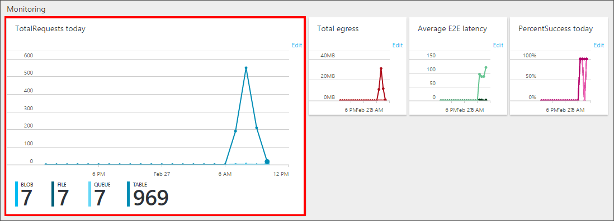
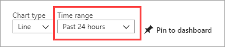
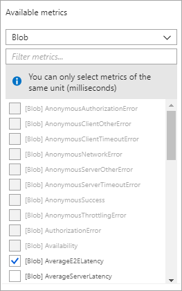
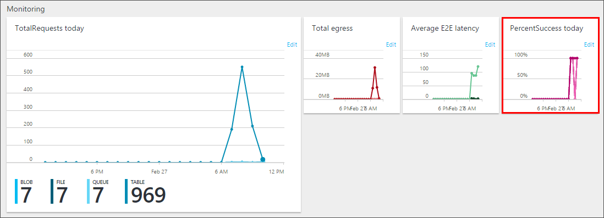

# Enable and manage Azure Storage Analytics metrics (classic)

[Azure Storage Analytics](storage-analytics.md) provides metrics for all storage services for blobs, queues, and tables. You can use the [Azure portal](https://portal.azure.com) to configure which metrics are recorded for your account, and configure charts that provide visual representations of your metrics data. This article shows you how to enable and manage metrics. To learn how to enable logs, see [Enable and manage Azure Storage Analytics logs (classic)](manage-storage-analytics-logs.md).

We recommend you review [Azure Monitor for Storage](./storage-insights-overview.md?toc=/azure/azure-monitor/toc.json). It is a feature of Azure Monitor that offers comprehensive monitoring of your Azure Storage accounts by delivering a unified view of your Azure Storage services performance, capacity, and availability. It does not require you to enable or configure anything, and you can immediately view these metrics from the pre-defined interactive charts and other visualizations included.

> [!NOTE]
> There are costs associated with examining monitoring data in the Azure portal. For more information, see [Storage Analytics](storage-analytics.md).
>
> Premium performance block blob storage accounts don't support Storage Analytics metrics. If you want to view metrics with premium performance block blob storage accounts, consider using [Azure Storage Metrics in Azure Monitor](../blobs/monitor-blob-storage.md).
>
> For an in-depth guide on using Storage Analytics and other tools to identify, diagnose, and troubleshoot Azure Storage-related issues, see [Monitor, diagnose, and troubleshoot Microsoft Azure Storage](storage-monitoring-diagnosing-troubleshooting.md).
>

<a id="Enable-metrics"></a>

## Enable metrics

### [Portal](#tab/azure-portal)

1. In the [Azure portal](https://portal.azure.com), select **Storage accounts**, then the storage account name to open the account dashboard.

2. Select **Diagnostic settings (classic)** in the **Monitoring (classic)** section of the menu blade.

   

3. Select the **type** of metrics data for each **service** you wish to monitor, and the **retention policy** for the data. You can also disable monitoring by setting **Status** to **Off**.

   > [!div class="mx-imgBorder"]
   > 

   To set the data retention policy, move the **Retention (days)** slider or enter the number of days of data to retain, from 1 to 365. The default for new storage accounts is seven days. If you do not want to set a retention policy, leave the **Delete data** checkbox unchecked. If there is no retention policy, it is up to you to delete the log data.

   > [!WARNING]
   > Metics are stored as data in your account. Metric data can accumulate in your account over time which can increase the cost of storage. If you need metric data for only a small period of time, you can reduce your costs by modifying the data retention policy. Stale metrics data (data older than your retention policy) is deleted by the system. We recommend setting a retention policy based on how long you want to retain the metrics data for your account. See [Billing on storage metrics](storage-analytics-metrics.md#billing-on-storage-metrics) for more information.
   >

4. When you finish the monitoring configuration, select **Save**.

A default set of metrics is displayed in charts on the **Overview** blade, as well as the **Metrics (classic)** blade. 
Once you've enabled metrics for a service, it may take up to an hour for data to appear in its charts. You can select **Edit** on any metric chart to configure which metrics are displayed in the chart.

You can disable metrics collection and logging by setting **Status** to **Off**.

> [!NOTE]
> Azure Storage uses [table storage](storage-introduction.md#table-storage) to store the metrics for your storage account, and stores the metrics in tables in your account. For more information, see. [How metrics are stored](storage-analytics-metrics.md#how-metrics-are-stored).

### [PowerShell](#tab/azure-powershell)

1. Open a Windows PowerShell command window.

2. Sign in to your Azure subscription with the `Connect-AzAccount` command and follow the on-screen directions.

   ```powershell
   Connect-AzAccount
   ```

3. If your identity is associated with more than one subscription, then set your active subscription.

   ```powershell
   $context = Get-AzSubscription -SubscriptionId <subscription-id>
   Set-AzContext $context
   ```

   Replace the `<subscription-id>` placeholder value with the ID of your subscription.

5. Get the storage account context that defines the storage account you want to use.

   ```powershell
   $storageAccount = Get-AzStorageAccount -ResourceGroupName "<resource-group-name>" -AccountName "<storage-account-name>"
   $ctx = $storageAccount.Context
   ```

   - Replace the `<resource-group-name>` placeholder value with the name of your resource group.

   - Replace the `<storage-account-name>` placeholder value with the name of your storage account.

6. You can use PowerShell on your local machine to configure storage metrics in your storage account. Use the Azure PowerShell cmdlet **Set-AzStorageServiceMetricsProperty** to change the current settings.

   The following command switches on minute metrics for the blob service in your storage account with the retention period set to five days.

   ```powershell
   Set-AzStorageServiceMetricsProperty -MetricsType Minute -ServiceType Blob -MetricsLevel ServiceAndApi  -RetentionDays 5 -Context $ctx
   ```

   This cmdlet uses the following parameters:

   - **ServiceType**: Possible values are **Blob**, **Queue**, **Table**, and **File**.
   - **MetricsType**: Possible values are **Hour** and **Minute**.
   - **MetricsLevel**: Possible values are:
      - **None**: Turns off monitoring.
      - **Service**: Collects metrics such as ingress and egress, availability, latency, and success percentages, which are aggregated for the blob, queue, table, and file services.
      - **ServiceAndApi**: In addition to the service metrics, collects the same set of metrics for each storage operation in the Azure Storage service API.

   The following command retrieves the current hourly metrics level and retention days for the blob service in your default storage account:

   ```powershell
   Get-AzStorageServiceMetricsProperty -MetricsType Hour -ServiceType Blob -Context $storagecontext.Context
   ```

   For information about how to configure the Azure PowerShell cmdlets to work with your Azure subscription and how to select the default storage account to use, see [Install and configure Azure PowerShell](/powershell/azure/).

### [.NET](#tab/dotnet)

:::code language="csharp" source="~/azure-storage-snippets/queues/howto/dotnet/dotnet-v12/Monitoring.cs" id="snippet_EnableDiagnosticLogs":::

For more information about using a .NET language to configure storage metrics, see [Azure Storage client libraries for .NET](/dotnet/api/overview/azure/storage).

For general information about configuring storage metrics by using the REST API, see [Enabling and configuring Storage Analytics](/rest/api/storageservices/Enabling-and-Configuring-Storage-Analytics).

---

<a id="view-metrics"></a>

## View metrics in a chart

After you configure Storage Analytics metrics to monitor your storage account, Storage Analytics records the metrics in a set of well-known tables in your storage account. You can configure charts to view hourly metrics in the [Azure portal](https://portal.azure.com).

Use the following procedure to choose which storage metrics to view in a metrics chart.

1. Start by displaying a storage metric chart in the Azure portal. You can find charts on the **storage account blade** and in the **Metrics (classic)** blade.

   In this example, uses the following chart that appears on the **storage account blade**:

   

2. Click anywhere within the chart to edit the chart.

3. Next, select the **Time Range** of the metrics to display in the chart, and the **service** (blob, queue, table, file) whose metrics you wish to display. Here, the past week's metrics are selected to display for the blob service:

   

4. Select the individual **metrics** you'd like displayed in the chart, then click **OK**.

   

Your chart settings do not affect the collection, aggregation, or storage of monitoring data in the storage account.

#### Metrics availability in charts

The list of available metrics changes based on which service you've chosen in the drop-down, and the unit type of the chart you're editing. For example, you can select percentage metrics like *PercentNetworkError* and *PercentThrottlingError* only if you're editing a chart that displays units in percentage:



#### Metrics resolution

The metrics you selected in **Diagnostics** determines the resolution of the metrics that are available for your account:

- **Aggregate** monitoring provides metrics such as ingress/egress, availability, latency, and success percentages. These metrics are aggregated from the blob, table, file, and queue services.
- **Per API** provides finer resolution, with metrics available for individual storage operations, in addition to the service-level aggregates.

## Download metrics to archive or analyze locally

If you want to download the metrics for long-term storage or to analyze them locally, you must use a tool or write some code to read the tables. The tables don't appear if you list all the tables in your storage account, but you can access them directly by name. Many storage-browsing tools are aware of these tables and enable you to view them directly. For a list of available tools, see [Azure Storage client tools](./storage-explorers.md).

|Metrics|Table names|Notes|
|-|-|-|
|Hourly metrics|$MetricsHourPrimaryTransactionsBlob<br /><br /> $MetricsHourPrimaryTransactionsTable<br /><br /> $MetricsHourPrimaryTransactionsQueue<br /><br /> $MetricsHourPrimaryTransactionsFile|In versions prior to August 15, 2013, these tables were known as:<br /><br /> $MetricsTransactionsBlob<br /><br /> $MetricsTransactionsTable<br /><br /> $MetricsTransactionsQueue<br /><br /> Metrics for the file service are available beginning with version April 5, 2015.|
|Minute metrics|$MetricsMinutePrimaryTransactionsBlob<br /><br /> $MetricsMinutePrimaryTransactionsTable<br /><br /> $MetricsMinutePrimaryTransactionsQueue<br /><br /> $MetricsMinutePrimaryTransactionsFile|Can only be enabled by using PowerShell or programmatically.<br /><br /> Metrics for the file service are available beginning with version April 5, 2015.|
|Capacity|$MetricsCapacityBlob|Blob service only.|

For full details of the schemas for these tables, see [Storage Analytics metrics table schema](/rest/api/storageservices/storage-analytics-metrics-table-schema). The following sample rows show only a subset of the columns available, but they illustrate some important features of the way storage metrics saves these metrics:

|PartitionKey|RowKey|Timestamp|TotalRequests|TotalBillableRequests|TotalIngress|TotalEgress|Availability|AverageE2ELatency|AverageServerLatency|PercentSuccess|
|-|-|-|-|-|-|-|-|-|-|-|
|20140522T1100|user;All|2014-05-22T11:01:16.7650250Z|7|7|4003|46801|100|104.4286|6.857143|100|
|20140522T1100|user;QueryEntities|2014-05-22T11:01:16.7640250Z|5|5|2694|45951|100|143.8|7.8|100|
|20140522T1100|user;QueryEntity|2014-05-22T11:01:16.7650250Z|1|1|538|633|100|3|3|100|
|20140522T1100|user;UpdateEntity|2014-05-22T11:01:16.7650250Z|1|1|771|217|100|9|6|100|

In this example of minute metrics data, the partition key uses the time at minute resolution. The row key identifies the type of information that's stored in the row. The information is composed of the access type and the request type:

-   The access type is either **user** or **system**, where **user** refers to all user requests to the storage service and **system** refers to requests made by Storage Analytics.
-   The request type is either **all**, in which case it's a summary line, or it identifies the specific API such as **QueryEntity** or **UpdateEntity**.

This sample data shows all the records for a single minute (starting at 11:00AM), so the number of **QueryEntities** requests plus the number of **QueryEntity** requests plus the number of **UpdateEntity** requests adds up to seven. This total is shown in the **user:All** row. Similarly, you can derive the average end-to-end latency 104.4286 on the **user:All** row by calculating ((143.8 * 5) + 3 + 9)/7.

## View metrics data programmatically

The following listing shows sample C# code that accesses the minute metrics for a range of minutes and displays the results in a console window. The code sample uses the Azure Storage client library version 4.x or later, which includes the **CloudAnalyticsClient** class that simplifies accessing the metrics tables in storage.

> [!NOTE]
> The **CloudAnalyticsClient** class is not included in the Azure Blob storage client library v12 for .NET. On **August 31, 2023** Storage Analytics metrics, also referred to as *classic metrics* will be retired. For more information, see the [official announcement](https://azure.microsoft.com/updates/azure-storage-classic-metrics-will-be-retired-on-31-august-2023/). If you use classic metrics, we recommend that you transition to metrics in Azure Monitor prior to that date.

```csharp
private static void PrintMinuteMetrics(CloudAnalyticsClient analyticsClient, DateTimeOffset startDateTime, DateTimeOffset endDateTime)  
{  
 // Convert the dates to the format used in the PartitionKey.  
 var start = startDateTime.ToUniversalTime().ToString("yyyyMMdd'T'HHmm");  
 var end = endDateTime.ToUniversalTime().ToString("yyyyMMdd'T'HHmm");

 var services = Enum.GetValues(typeof(StorageService));  
 foreach (StorageService service in services)  
 {  
     Console.WriteLine("Minute Metrics for Service {0} from {1} to {2} UTC", service, start, end);  
     var metricsQuery = analyticsClient.CreateMinuteMetricsQuery(service, StorageLocation.Primary);  
     var t = analyticsClient.GetMinuteMetricsTable(service);  
     var opContext = new OperationContext();  
     var query =  
             from entity in metricsQuery  
             // Note, you can't filter using the entity properties Time, AccessType, or TransactionType  
             // because they are calculated fields in the MetricsEntity class.  
             // The PartitionKey identifies the DataTime of the metrics.  
             where entity.PartitionKey.CompareTo(start) >= 0 && entity.PartitionKey.CompareTo(end) <= 0   
             select entity;

     // Filter on "user" transactions after fetching the metrics from Azure Table storage.  
     // (StartsWith is not supported using LINQ with Azure Table storage.)  
     var results = query.ToList().Where(m => m.RowKey.StartsWith("user"));  
     var resultString = results.Aggregate(new StringBuilder(), (builder, metrics) => builder.AppendLine(MetricsString(metrics, opContext))).ToString();  
     Console.WriteLine(resultString);  
 }  
}

private static string MetricsString(MetricsEntity entity, OperationContext opContext)  
{  
 var entityProperties = entity.WriteEntity(opContext);  
 var entityString =  
         string.Format("Time: {0}, ", entity.Time) +  
         string.Format("AccessType: {0}, ", entity.AccessType) +  
         string.Format("TransactionType: {0}, ", entity.TransactionType) +  
         string.Join(",", entityProperties.Select(e => new KeyValuePair<string, string>(e.Key.ToString(), e.Value.PropertyAsObject.ToString())));  
 return entityString;  
}  
```

<a id="add-metrics-to-dashboard"></a>

## Add metrics charts to the portal dashboard

You can add Azure Storage metrics charts for any of your storage accounts to your portal dashboard.

1. Select click **Edit dashboard** while viewing your dashboard in the [Azure portal](https://portal.azure.com).
1. In the **Tile Gallery**, select **Find tiles by** > **Type**.
1. Select **Type** > **Storage accounts**.
1. In **Resources**, select the storage account whose metrics you wish to add to the dashboard.
1. Select **Categories** > **Monitoring**.
1. Drag-and-drop the chart tile onto your dashboard for the metric you'd like displayed. Repeat for all metrics you'd like displayed on the dashboard. In the following image, the "Blobs - Total requests" chart is highlighted as an example, but all the charts are available for placement on your dashboard.

   
1. Select **Done customizing** near the top of the dashboard when you're done adding charts.

Once you've added charts to your dashboard, you can further customize them as described in Customize metrics charts.

## Next steps

- To learn more about Storage Analytics, see [Storage Analytics](storage-analytics.md) for Storage Analytics.
- [Configure Storage Analytics logs](manage-storage-analytics-logs.md).
- Learn more about the metrics schema. See [Storage Analytics metrics table schema](/rest/api/storageservices/storage-analytics-metrics-table-schema).
