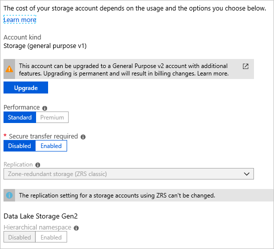

# Change how a storage account is replicated

Azure Storage always stores multiple copies of your data so that it is protected from planned and unplanned events. This including transient hardware failures, network or power outages, and massive natural disasters. Redundancy ensures that your storage account meets the [Service-Level Agreement (SLA) for Azure Storage](https://azure.microsoft.com/support/legal/sla/storage/) even in the face of failures.

In this article, you will learn how to change the replication setting(s) for an existing storage account.

## Options for changing the replication type

Four aspects of the redundancy configuration of a storage account determine how your data is replicated and accessible:

- **Local redundancy** - your data is always replicated three times within the local or primary region (LRS)
- **Zone redundancy** - whether your data is replicated between different zones within the primary region (LRS vs. ZRS)
- **Geo-redundancy** - replication within a single "local" region or between a primary and a secondary region (LRS vs. GRS)
- **Read access (RA)** - read access to the secondary region when geo-redundancy is used (GRS vs. RA-GRS)

For an overview of all of the redundancy options, see [Azure Storage redundancy](storage-redundancy.md).

You can change how your storage account is replicated from any redundancy configuration to any other with some limitations. Before making any changes, review those [limitations](#limitations-for-changing-replication-types) along with the [downtime requirements](#downtime-requirements) to ensure you have a plan that will produce the best end result within a time frame that suits your needs, and that satisfies your uptime requirements.

There are three ways to change the replication settings:

- [Use the Azure portal, Azure PowerShell, or the Azure CLI](#change-the-replication-setting-using-the-portal-powershell-or-the-cli) to add or remove geo-replication or read access to the secondary region.
- [Perform a conversion](#perform-a-conversion) to add or remove zone-redundancy.
- [Perform a manual migration](#manual-migration) in scenarios where the first two options are not supported, or to ensure the change is completed by a specific time.

If you want to change both zone-redundancy and either geo-replication or read-access, a two-step process is required. Geo-redundancy and read-access can be changed at the same time, but the zone-redundancy conversion must be performed separately. These steps can be performed in any order.

### Replication change table

The following table provides an overview of how to switch from each type of replication to another.

> [!NOTE]
> Manual migration is an option for any scenario in which you want to change the replication setting within the [limitations for changing replication types](#limitations-for-changing-replication-types). The manual migration option has been omitted from the table below to simplify it.

| Switching | …to LRS | …to GRS/RA-GRS <sup>6</sup> | …to ZRS | …to GZRS/RA-GZRS <sup>2,6</sup> |
|--------------------|----------------------------------------------------|---------------------------------------------------------------------|----------------------------------------------------|---------------------------------------------------------------------|
| **…from LRS** | **N/A** | [Use Azure portal, PowerShell, or CLI](#change-the-replication-setting-using-the-portal-powershell-or-the-cli) <sup>1,2</sup> | [Perform a conversion](#perform-a-conversion)<sup>2,3,4,5</sup> | [Switch to GRS/RA-GRS first](#change-the-replication-setting-using-the-portal-powershell-or-the-cli) <sup>1</sup>, then [perform a conversion](#perform-a-conversion) to GZRS/RA-GZRS <sup>3,4,5</sup> |
| **…from GRS/RA-GRS** | [Use Azure portal, PowerShell, or CLI](#change-the-replication-setting-using-the-portal-powershell-or-the-cli) | **N/A** | [Switch to LRS first](#change-the-replication-setting-using-the-portal-powershell-or-the-cli), then [perform a conversion](#perform-a-conversion) to ZRS <sup>3,5</sup> | [Perform a conversion](#perform-a-conversion)<sup>3,5</sup> |
| **…from ZRS** | [Perform a conversion](#perform-a-conversion)<sup>3</sup> | [Switch to GZRS/RA-GZRS first](#change-the-replication-setting-using-the-portal-powershell-or-the-cli)<sup>1</sup>, then [perform a conversion](#perform-a-conversion) to GRS/RA-GRS<sup>3</sup> | **N/A** | [Use Azure portal, PowerShell, or CLI](#change-the-replication-setting-using-the-portal-powershell-or-the-cli) <sup>1</sup> |
| **…from GZRS/RA-GZRS** | [Switch to ZRS first](#change-the-replication-setting-using-the-portal-powershell-or-the-cli), then [perform a conversion](#perform-a-conversion) to LRS <sup>3</sup> | [Perform a conversion](#perform-a-conversion)<sup>3</sup> | [Use Azure portal, PowerShell, or CLI](#change-the-replication-setting-using-the-portal-powershell-or-the-cli)| **N/A** |

<sup>1</sup> [Adding geo-redundancy incurs a one-time egress charge](#costs-associated-with-changing-how-data-is-replicated).<br />
<sup>2</sup> If your storage account contains blobs in the archive tier, review the [access tier limitations](#access-tier) before changing the redundancy type to geo- or zone-redundant.<br />
<sup>3</sup> The type of conversion supported depends on the storage account type. See [the storage account table](#storage-account-type) for more details.<br />
<sup>4</sup> Conversion to ZRS or GZRS for an LRS account resulting from a failover is not supported. For more details see [Failover and failback](#failover-and-failback).<br />
<sup>5</sup> Converting from LRS to ZRS is [not supported if the NFSv3 protocol support is enabled for Azure Blob Storage or if the storage account contains Azure Files NFSv4.1 shares](#protocol-support). <br />
<sup>6</sup> Even though enabling geo-redundancy appears to occur instantaneously, failover to the secondary region cannot be initiated until data synchronization between the two regions has completed.<br />

## Change the replication setting

Depending on your scenario from the [replication change table](#replication-change-table), use one of the methods below to change your replication settings.

### Change the replication setting using the portal, PowerShell, or the CLI

In most cases you can use the Azure portal, PowerShell, or the Azure CLI to change the geo-redundant or read access (RA) replication setting for a storage account. If you are initiating a zone redundancy conversion, you can change the setting from within the Azure portal, but not from PowerShell or the Azure CLI.

Changing how your storage account is replicated in the Azure portal does not result in down time for your applications, including changes that require a conversion.

# [Portal](#tab/portal)

To change the redundancy option for your storage account in the Azure portal, follow these steps:

1. Navigate to your storage account in the Azure portal.
1. Under **Data management** select **Redundancy**.
1. Update the **Redundancy** setting.
1. Select **Save**.

    :::image type="content" source="media/redundancy-migration/change-replication-option.png" alt-text="Screenshot showing how to change replication option in portal." lightbox="media/redundancy-migration/change-replication-option.png":::

# [PowerShell](#tab/powershell)

To change the redundancy option for your storage account with PowerShell, call the [Set-AzStorageAccount](/powershell/module/az.storage/set-azstorageaccount) command and specify the `-SkuName` parameter:

```powershell
Set-AzStorageAccount -ResourceGroupName <resource_group> `
    -Name <storage_account> `
    -SkuName <sku>
```

# [Azure CLI](#tab/azure-cli)

To change the redundancy option for your storage account with Azure CLI, call the [az storage account update](/cli/azure/storage/account#az-storage-account-update) command and specify the `--sku` parameter:

```azurecli-interactive
az storage account update \
    --name <storage-account>
    --resource-group <resource_group> \
    --sku <sku>
```

---

### Perform a conversion

A redundancy "conversion" is the process of changing the zone-redundancy aspect of a storage account.

During a conversion, [there is no data loss or application downtime required](#downtime-requirements).

There are two ways to initiate a conversion:

- [Customer-initiated](#customer-initiated-conversion)
- [Support-requested](#support-requested-conversion)

> [!TIP]
> Microsoft recommends you use customer-initiated conversion instead of support-requested conversion when possible. With customer-initiated conversion you can start and monitor the progress of the conversion request directly from the Azure portal, and there is no need to open and manage a support request.

#### Customer-initiated conversion

Customer-initiated conversion adds a new option for customers to start a conversion. Now, instead of needing to open a support request, customers can start and monitor the progress of the conversion directly from the Azure portal. Once initiated, the conversion could still take up to 72 hours to actually **begin**, but potential delays related to opening and managing a support request are eliminated.

> [!IMPORTANT]
> A customer-initiated conversion could take up to 72 hours to actually **begin** after you initiate it.
>
> There is no SLA for completion of a customer-initiated conversion.
>
> For more details about the timing of a customer-initiated conversion, see [Timing and frequency](#timing-and-frequency).

Customer-initiated conversion is only available from the Azure portal, not from PowerShell or the Azure CLI. To initiate the conversion, perform the same steps used for changing other replication settings in the Azure portal as described in [Change the replication setting using the portal, PowerShell, or the CLI](#change-the-replication-setting-using-the-portal-powershell-or-the-cli).

Customer-initiated conversion is not available in all regions. See the [region limitations](#region) for more details.

##### Monitoring customer-initiated conversion progress

The status of your customer-initiated conversion is displayed on the **Redundancy** page of the storage account:

:::image type="content" source="media/redundancy-migration/change-replication-status.png" alt-text="Screenshot showing the status of the conversion request on the Redundancy page of the Azure portal." lightbox="media/redundancy-migration/change-replication-status.png":::

As the conversion request is evaluated and processed, the status should progress through the list shown in the table below:

| Status                                         | Explanation                                                                          |
|------------------------------------------------|--------------------------------------------------------------------------------------|
| Submitted for conversion                       | The conversion request was successfully submitted for processing.                    |
| In Progress<sup>1</sup>                        | The actual conversion has begun.                                                     |
| Completed<br>**- or -**</br>Failed<sup>2</sup> | The conversion has successfully completed.<br>**- or -**</br>The conversion failed.  |

<sup>1</sup> Once initiated, the conversion could take up to 72 hours to actually **begin**. If the conversion does not enter the "In Progress" status within 96 hours of initiating the request, submit a support request to Microsoft to determine why. For more details about the timing of a customer-initiated conversion, see [Timing and frequency](#timing-and-frequency).<br />
<sup>2</sup> If the conversion fails, submit a support request to Microsoft to determine the reason for the failure.<br />

> [!NOTE]
> While Microsoft handles your request for a conversion promptly, there's no guarantee as to when it will complete. If you need your data converted by a certain date, Microsoft recommends that you perform a manual migration instead.
>
> Generally, the more data you have in your account, the longer it takes to replicate that data to other zones in the region.

#### Support-requested conversion

Customers can still request a conversion by opening a support request with Microsoft.

> [!TIP]
> If you need to convert more than one storage account, create a single support ticket and specify the names of the accounts to convert on the **Additional details** tab.

Follow these steps to request a conversion from Microsoft:

1. In the Azure portal, navigate to a storage account that you want to convert.
1. Under **Support + troubleshooting**, select **New Support Request**.
1. Complete the **Problem description** tab based on your account information:
    - **Summary**: (some descriptive text).
    - **Issue type**: Select **Technical**.
    - **Subscription**: Select your subscription from the drop-down.
    - **Service**: Select **My Services**, then **Storage Account Management** for the **Service type**.
    - **Resource**: Select a storage account to convert. If you need to specify multiple storage accounts, you can do so on the **Additional details** tab.
    - **Problem type**: Choose **Data Migration**.
    - **Problem subtype**: Choose **Migrate to ZRS, GZRS, or RA-GZRS**.

    :::image type="content" source="media/redundancy-migration/request-live-migration-problem-desc-portal.png" alt-text="Screenshot showing how to request a conversion - Problem description tab." lightbox="media/redundancy-migration/request-live-migration-problem-desc-portal.png":::

1. Select **Next**. The **Recommended solution** tab might be displayed briefly before it switches to the **Solutions** page. On the **Solutions** page, you can check the eligibility of your storage account(s) for conversion:
    - **Target replication type**: (choose the desired option from the drop-down)
    - **Storage accounts from**: (enter a single storage account name or a list of accounts separated by semicolons)
    - Select **Submit**.

    :::image type="content" source="media/redundancy-migration/request-live-migration-solutions-portal.png" alt-text="Screenshot showing how to check the eligibility of your storage account(s) for conversion - Solutions page." lightbox="media/redundancy-migration/request-live-migration-solutions-portal.png":::

1. Take the appropriate action if the results indicate your storage account is not eligible for conversion. If it is eligible, select **Return to support request**.

1. Select **Next**. If you have more than one storage account to migrate, on the **Details** tab, specify the name for each account, separated by a semicolon.

    :::image type="content" source="media/redundancy-migration/request-live-migration-details-portal.png" alt-text="Screenshot showing how to request a conversion - Additional details tab." lightbox="media/redundancy-migration/request-live-migration-details-portal.png":::

1. Fill out the additional required information on the **Additional details** tab, then select **Review + create** to review and submit your support ticket. A support person will contact you to provide any assistance you may need.

### Manual migration

A manual migration provides more flexibility and control than a conversion. You can use this option if you need your data moved by a certain date, or if conversion is [not supported for your scenario](#limitations-for-changing-replication-types). Manual migration is also useful when moving a storage account to another region. See [Move an Azure Storage account to another region](storage-account-move.md) for more details.

You must perform a manual migration if:

- You want to migrate your storage account to a different region.
- Your storage account is a block blob account.
- Your storage account includes data in the archive tier and rehydrating the data is not desired.

> [!IMPORTANT]
> A manual migration can result in application downtime. If your application requires high availability, Microsoft also provides a [conversion](#perform-a-conversion) option. A conversion is an in-place migration with no downtime.

With a manual migration, you copy the data from your existing storage account to a new storage account. To perform a manual migration, you can use one of the following options:

- Copy data by using an existing tool such as AzCopy, one of the Azure Storage client libraries, or a reliable third-party tool.
- If you're familiar with Hadoop or HDInsight, you can attach both the source storage account and destination storage account to your cluster. Then, parallelize the data copy process with a tool like DistCp.

For more detailed guidance on how to perform a manual migration, see [Move an Azure Storage account to another region](storage-account-move.md).

## Limitations for changing replication types

Limitations apply to some replication change scenarios depending on:

- [Region](#region)
- [Feature conflicts](#feature-conflicts)
- [Storage account type](#storage-account-type)
- [Access tier](#access-tier)
- [Protocol support](#protocol-support)
- [Failover and failback](#failover-and-failback)

### Region

Make sure the region where your storage account is located supports all of the desired replication settings. For example, if you are converting your account to zone-redundant (ZRS, GZRS, or RA-GZRS), make sure your storage account is in a region that supports it. See the lists of supported regions for [Zone-redundant storage](storage-redundancy.md#zone-redundant-storage) and [Geo-zone-redundant storage](storage-redundancy.md#geo-zone-redundant-storage).

> [!IMPORTANT]
> [Customer-initiated conversion](#customer-initiated-conversion) from LRS to ZRS is available in all public regions that support ZRS except for the following:
>
> - (Europe) West Europe
> - (Europe) UK South
> - (North America) Canada Central
> - (North America) East US
> - (North America) East US 2
>
> [Customer-initiated conversion](#customer-initiated-conversion) from existing ZRS accounts to LRS is available in all public regions.

### Feature conflicts

Some storage account features are not compatible with other features or operations. For example, the ability to failover to the secondary region is the key feature of geo-redundancy, but other features are not compatible with failover. For more information about features and services not supported with failover, see [Unsupported features and services](storage-disaster-recovery-guidance.md#unsupported-features-and-services). Converting an account to GRS, GZRS, or RA-GZRS might be blocked if a conflicting feature is enabled, or it might be necessary to disable the feature later before initiating a failover.

### Storage account type

When planning to change your replication settings, consider the following limitations related to the storage account type.

Some storage account types only support certain redundancy configurations, which affects whether they can be converted or migrated and, if so, how. For more details on Azure storage account types and the supported redundancy options, see [the storage account overview](storage-account-overview.md#types-of-storage-accounts).

The following table provides an overview of redundancy options available for storage account types and whether conversion and manual migration are supported:

| Storage account type        | Supports LRS | Supports ZRS | Supports conversion<br>(from the portal) | Supports conversion<br>(by support request) | Supports manual migration |
|:----------------------------|:------------:|:------------:|:-----------------------:|:-------------------------:|:-------------------------:|
| Standard general purpose v2 | &#x2705;     | &#x2705;     | &#x2705;                | &#x2705;                  | &#x2705;                  |
| Premium file shares         | &#x2705;     | &#x2705;     |                         | &#x2705; <sup>1</sup>     | &#x2705;                  |
| Premium block blob          | &#x2705;     | &#x2705;     |                         |                           | &#x2705;                  |
| Premium page blob           | &#x2705;     |              |                         |                           |                           |
| Managed disks<sup>2</sup>   | &#x2705;     | &#x2705;     | &#x2705;                |                           | &#x2705;                  |
| Standard general purpose v1 | &#x2705;     |              |    <sup>3</sup>         |                           | &#x2705;                  |
| ZRS Classic<sup>4</sup><br /><sub>(available in standard general purpose v1 accounts)</sub> | &#x2705; |  |  |  |

<sup>1</sup> Conversion for premium file shares is only available by [opening a support request](#support-requested-conversion); [Customer-initiated conversion](#customer-initiated-conversion) is not currently supported.<br />
<sup>2</sup> Managed disks are available for LRS and ZRS, though ZRS disks have some [limitations](../../virtual-machines/disks-redundancy.md#limitations). If a LRS disk is regional (no zone specified) it may be converted by [changing the SKU](../../virtual-machines/disks-convert-types.md). If a LRS disk is zonal, then it can only be manually migrated by following the process in [Migrate your managed disks](../../reliability/migrate-vm.md#migrate-your-managed-disks). You can store snapshots and images for standard SSD managed disks on standard HDD storage and [choose between LRS and ZRS options](https://azure.microsoft.com/pricing/details/managed-disks/). For information about integration with availability sets, see [Introduction to Azure managed disks](../../virtual-machines/managed-disks-overview.md#integration-with-availability-sets).<br />
<sup>3</sup> If your storage account is v1, you'll need to upgrade it to v2 before performing a conversion. To learn how to upgrade your v1 account, see [Upgrade to a general-purpose v2 storage account](storage-account-upgrade.md).<br />
<sup>4</sup> ZRS Classic storage accounts have been deprecated. For information about converting ZRS Classic accounts, see [Converting ZRS Classic accounts](#converting-zrs-classic-accounts).<br />

#### Converting ZRS Classic accounts

> [!IMPORTANT]
> ZRS Classic accounts were deprecated on March 31, 2021. Customers can no longer create ZRS Classic accounts. If you still have some, you should upgrade them to general purpose v2 accounts.

ZRS Classic was available only for **block blobs** in general-purpose V1 (GPv1) storage accounts. For more information about storage accounts, see [Azure storage account overview](storage-account-overview.md).

ZRS Classic accounts asynchronously replicated data across data centers within one to two regions. Replicated data was not available unless Microsoft initiated a failover to the secondary. A ZRS Classic account can't be converted to or from LRS, GRS, or RA-GRS. ZRS Classic accounts also don't support metrics or logging.

To change ZRS Classic to another replication type, use one of the following methods:

- Upgrade it to ZRS first
- [Manually migrate the data directly to another replication type](#manual-migration)

To upgrade your ZRS Classic storage account to ZRS, use the Azure portal, PowerShell, or Azure CLI in regions where ZRS is available:

# [Portal](#tab/portal)

To upgrade to ZRS in the Azure portal, navigate to the **Configuration** settings of the account and choose **Upgrade**:



# [PowerShell](#tab/powershell)

To upgrade to ZRS using PowerShell, call the following command:

```powershell
Set-AzStorageAccount -ResourceGroupName <resource_group> -AccountName <storage_account> -UpgradeToStorageV2
```

# [Azure CLI](#tab/azure-cli)

To upgrade to ZRS using Azure CLI, call the following command:

```cli
az storage account update -g <resource_group> -n <storage_account> --set kind=StorageV2
```

---

To manually migrate your ZRS Classic account data to another type of replication, follow the steps to [perform a manual migration](#manual-migration).

If you want to migrate your data into a zone-redundant storage account located in a region different from the source account, you must perform a manual migration. For more details, see [Move an Azure Storage account to another region](storage-account-move.md).

### Access tier

Make sure the desired redundancy option supports the access tiers currently used in the storage account. For example, ZRS, GZRS and RA-GZRS storage accounts do not support the archive tier. See [Hot, Cool, and Archive access tiers for blob data](../blobs/access-tiers-overview.md) for more details. To convert an LRS, GRS or RA-GRS account to one that supports zone-redundancy, first move the archived blobs to a storage account that supports blobs in the archive tier. Then convert the source account to ZRS, GZRS and RA-GZRS.

To switch an LRS storage account that contains blobs in the archive tier to GRS or RA-GRS, you must first rehydrate all archived blobs to the Hot or Cool tier or perform a [manual migration](#manual-migration).

> [!TIP]
> Microsoft recommends that you avoid changing the redundancy configuration for a storage account that contains archived blobs if at all possible, because rehydration operations can be costly and time-consuming. But if you must change it, a [manual migration](#manual-migration) can save you the expense of rehydration.

### Protocol support

Converting your storage account to zone-redundancy (ZRS, GZRS or RA-GZRS) is not supported if either of the following is true:

- NFSv3 protocol support is enabled for Azure Blob Storage
- The storage account contains Azure Files NFSv4.1 shares

### Failover and failback

After an account failover to the secondary region, it's possible to initiate a failback from the new primary back to the new secondary with PowerShell or Azure CLI (version 2.30.0 or later). For more information, see [How customer-managed storage account failover works](storage-failover-customer-managed-unplanned.md).

If you performed an account failover for your GRS or RA-GRS account, the account is locally redundant (LRS) in the new primary region after the failover. Conversion to ZRS or GZRS for an LRS account resulting from a failover is not supported. This is true even in the case of so-called failback operations. For example, if you perform an account failover from RA-GRS to LRS in the secondary region, and then configure it again as RA-GRS, it will be LRS in the new secondary region (the original primary). If you then perform another account failover to failback to the original primary region, it will be LRS again in the original primary. In this case, you can't perform a conversion to ZRS, GZRS or RA-GZRS in the primary region. Instead, you'll need to perform a manual migration to add zone-redundancy.

## Downtime requirements

During a [conversion](#perform-a-conversion), you can access data in your storage account with no loss of durability or availability. [The Azure Storage SLA](https://azure.microsoft.com/support/legal/sla/storage/) is maintained during the migration process and there is no data loss associated with a conversion. Service endpoints, access keys, shared access signatures, and other account options remain unchanged after the migration.

If you choose to perform a manual migration, downtime is required but you have more control over the timing of the migration process.

## Timing and frequency

If you initiate a zone-redundancy [conversion](#customer-initiated-conversion) from the Azure portal, the conversion process could take up to 72 hours to actually **begin**. It could take longer to start if you [request a conversion by opening a support request](#support-requested-conversion). If a customer-initiated conversion does not enter the "In Progress" status within 96 hours of initiating the request, submit a support request to Microsoft to determine why. To monitor the progress of a customer-initiated conversion, see [Monitoring customer-initiated conversion progress](#monitoring-customer-initiated-conversion-progress).

> [!IMPORTANT]
> There is no SLA for completion of a conversion. If you need more control over when a conversion begins and finishes, consider a [Manual migration](#manual-migration). Generally, the more data you have in your account, the longer it takes to replicate that data to other zones or regions.

After a zone-redundancy conversion, you must wait at least 72 hours before changing the redundancy setting of the storage account again. The temporary hold allows background processes to complete before making another change, ensuring the consistency and integrity of the account. For example, going from LRS to GZRS is a 2-step process. You must add zone redundancy in one operation, then add geo-redundancy in a second. After going from LRS to ZRS, you must wait at least 72 hours before going from ZRS to GZRS.

## Costs associated with changing how data is replicated

Ordering from the least to the most expensive, Azure Storage redundancy offerings include LRS, ZRS, GRS, RA-GRS, GZRS, and RA-GZRS.

The costs associated with changing how data is replicated in your storage account depend on which [aspects of your redundancy configuration](#options-for-changing-the-replication-type) you change. A combination of data storage and egress bandwidth pricing determine the cost of making a change. For details on pricing, see [Azure Storage Pricing page](https://azure.microsoft.com/pricing/details/storage/blobs/).

If you add zone-redundancy in the primary region, there is no initial cost associated with making that conversion, but the ongoing data storage cost will be higher due to the additional replication and storage space required.

If you add geo-redundancy, you will incur an egress bandwidth charge at the time of the change because your entire storage account is being replicated to the secondary region. All subsequent writes to the primary region also incur egress bandwidth charges to replicate the write to the secondary region.

If you remove geo-redundancy (change from GRS to LRS), there is no cost for making the change, but your replicated data is deleted from the secondary location.

> [!IMPORTANT]
> If you remove read access to the secondary region (RA) (change from RA-GRS to GRS or LRS), that account is billed as RA-GRS for an additional 30 days beyond the date that it was converted.

## See also

- [Azure Storage redundancy](storage-redundancy.md)
- [Use geo-redundancy to design highly available applications](geo-redundant-design.md)
- [Move an Azure Storage account to another region](storage-account-move.md)
- [Check the Last Sync Time property for a storage account](last-sync-time-get.md)
