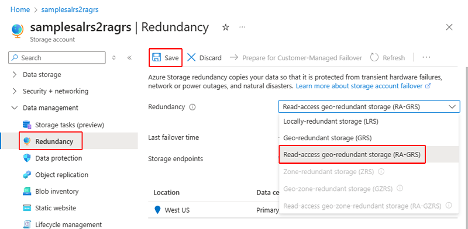

# Change how a storage account is replicated

Azure Storage always stores multiple copies of your data so that it is protected from planned and unplanned events, including transient hardware failures, network or power outages, and massive natural disasters. Redundancy ensures that your storage account meets the [Service-Level Agreement (SLA) for Azure Storage](https://azure.microsoft.com/support/legal/sla/storage/) even in the face of failures.

Azure Storage offers the following types of replication:

- Locally redundant storage (LRS)
- Zone-redundant storage (ZRS)
- Geo-redundant storage (GRS) or read-access geo-redundant storage (RA-GRS)
- Geo-zone-redundant storage (GZRS) or read-access geo-zone-redundant storage (RA-GZRS)

For an overview of each of these options, see [Azure Storage redundancy](storage-redundancy.md).

## Switch between types of replication

You can switch a storage account from one type of replication to any other type, but some scenarios are more straightforward than others. If you want to add or remove geo-replication or read access to the secondary region, you can use the Azure portal, PowerShell, or Azure CLI to update the replication setting. However, if you want to change how data is replicated in the primary region, by moving from LRS to ZRS or vice versa, then you must perform a manual migration.

The following table provides an overview of how to switch from each type of replication to another:

| Switching | …to LRS | …to GRS/RA-GRS | …to ZRS | …to GZRS/RA-GZRS |
|--------------------|----------------------------------------------------|---------------------------------------------------------------------|----------------------------------------------------|---------------------------------------------------------------------|
| <b>…from LRS</b> | N/A | Use Azure portal, PowerShell, or CLI to change the replication setting<sup>1</sup> | Perform a manual migration <br /><br />Request a live migration | Perform a manual migration <br /><br /> OR <br /><br /> Switch to GRS/RA-GRS first and then request a live migration<sup>1</sup> |
| <b>…from GRS/RA-GRS</b> | Use Azure portal, PowerShell, or CLI to change the replication setting | N/A | Perform a manual migration <br /><br /> OR <br /><br /> Switch to LRS first and then request a live migration | Perform a manual migration <br /><br /> Request a live migration |
| <b>…from ZRS</b> | Perform a manual migration | Perform a manual migration | N/A | Use Azure portal, PowerShell, or CLI to change the replication setting<sup>1,2</sup> |
| <b>…from GZRS/RA-GZRS</b> | Perform a manual migration | Perform a manual migration | Use Azure portal, PowerShell, or CLI to change the replication setting | N/A |

<sup>1</sup> Incurs a one-time egress charge.<br />
<sup>2</sup> Conversion from ZRS to GZRS/RA-GZRS or vice versa is not supported in the following regions: US East 2, US East, Europe West.

> [!CAUTION]
> If you performed an [account failover](storage-disaster-recovery-guidance.md) for your (RA-)GRS or (RA-)GZRS account, the account is locally redundant in the new primary region after the failover. Live migration to ZRS or GZRS for an LRS account resulting from a failover is not supported. You will need to perform a [manual migration](#perform-a-manual-migration-to-zrs) to ZRS or GZRS.

## Change the replication setting

You can use the Azure portal, PowerShell, or Azure CLI to change the replication setting for a storage account, as long as you are not changing how data is replicated in the primary region. If you are migrating from LRS in the primary region to ZRS in the primary region or vice versa, then you must perform either a [manual migration](#perform-a-manual-migration-to-zrs) or a [live migration](#request-a-live-migration-to-zrs).

Changing how your storage account is replicated does not result in down time for your applications.

# [Portal](#tab/portal)

To change the redundancy option for your storage account in the Azure portal, follow these steps:

1. Navigate to your storage account in the Azure portal.
1. Select the **Configuration** setting.
1. Update the **Replication** setting.



# [PowerShell](#tab/powershell)

To change the redundancy option for your storage account with PowerShell, call the [Set-AzStorageAccount](/powershell/module/az.storage/set-azstorageaccount) command and specify the `-SkuName` parameter:

```powershell
Set-AzStorageAccount -ResourceGroupName <resource_group> `
    -AccountName <storage_account> `
    -SkuName <sku>
```

# [Azure CLI](#tab/azure-cli)

To change the redundancy option for your storage account with Azure CLI, call the [az storage account update](/cli/azure/storage/account#az-storage-account-update) command and specify the `--sku` parameter:

```azurecli-interactive
az storage account update \
    --name <storage-account>
    --resource-group <resource_group> \
    --sku <sku>
```

---

## Perform a manual migration to ZRS

If you want to change how data in your storage account is replicated in the primary region, by moving from LRS to ZRS or vice versa, then you may opt to perform a manual migration. A manual migration provides more flexibility than a live migration. You control the timing of a manual migration, so use this option if you need the migration to complete by a certain date.

When you perform a manual migration from LRS to ZRS in the primary region or vice versa, the destination storage account can be geo-redundant and can also be configured for read access to the secondary region. For example, you can migrate an LRS account to a GZRS or RA-GZRS account in one step.

A manual migration can result in application downtime. If your application requires high availability, Microsoft also provides a live migration option. A live migration is an in-place migration with no downtime.

With a manual migration, you copy the data from your existing storage account to a new storage account that uses ZRS in the primary region. To perform a manual migration, you can use one of the following options:

- Copy data by using an existing tool such as AzCopy, one of the Azure Storage client libraries, or a reliable third-party tool.
- If you're familiar with Hadoop or HDInsight, you can attach both the source storage account and destination storage account account to your cluster. Then, parallelize the data copy process with a tool like DistCp.

## Request a live migration to ZRS

If you need to migrate your storage account from LRS or GRS to ZRS in the primary region with no application downtime, you can request a live migration from Microsoft. During a live migration, you can access data in your storage account, and with no loss of durability or availability. The Azure Storage SLA is maintained during the migration process. There is no data loss associated with a live migration. Service endpoints, access keys, shared access signatures, and other account options remain unchanged after the migration.

ZRS supports general-purpose v2 accounts only, so make sure to upgrade your storage account before you submit a request for a live migration to ZRS. For more information, see [Upgrade to a general-purpose v2 storage account](storage-account-upgrade.md). A storage account must contain data to be migrated via live migration.

Live migration is supported only for storage accounts that use LRS or GRS replication. If your account uses RA-GRS, then you need to first change your account's replication type to either LRS or GRS before proceeding. This intermediary step removes the secondary read-only endpoint provided by RA-GRS before migration.

While Microsoft handles your request for live migration promptly, there's no guarantee as to when a live migration will complete. If you need your data migrated to ZRS by a certain date, then Microsoft recommends that you perform a manual migration instead. Generally, the more data you have in your account, the longer it takes to migrate that data.

You must perform a manual migration if:

- You want to migrate your data into a ZRS storage account that is located in a region different than the source account.
- Your storage account is a premium page blob or block blob account.
- You want to migrate data from ZRS to LRS, GRS or RA-GRS.
- Your storage account includes data in the archive tier.

You can request live migration through the [Azure Support portal](https://ms.portal.azure.com/#blade/Microsoft_Azure_Support/HelpAndSupportBlade/overview). From the portal, select the storage account you want to convert to ZRS.

1. Select **New Support Request**
2. Complete the **Basics** based on your account information. In the **Service** section, select **Storage Account Management** and the resource you want to convert to ZRS.
3. Select **Next**.
4. Specify the following values the **Problem** section:
    - **Severity**: Leave the default value as-is.
    - **Problem Type**: Select **Data Migration**.
    - **Category**: Select **Migrate to ZRS**.
    - **Title**: Type a descriptive title, for example, **ZRS account migration**.
    - **Details**: Type additional details in the **Details** box, for example, I would like to migrate to ZRS from [LRS, GRS] in the \_\_ region.
5. Select **Next**.
6. Verify that the contact information is correct on the **Contact information** blade.
7. Select **Create**.

A support person will contact you and provide any assistance you need.

> [!NOTE]
> Live migration is not currently supported for premium file shares. Only manually copying or moving data is currently supported.
>
> GZRS storage accounts do not currently support the archive tier. See [Azure Blob storage: hot, cool, and archive access tiers](https://docs.microsoft.com/azure/storage/blobs/storage-blob-storage-tiers) for more details.
>
> Managed disks are only available for LRS and cannot be migrated to ZRS. You can store snapshots and images for standard SSD managed disks on standard HDD storage and [choose between LRS and ZRS options](https://azure.microsoft.com/pricing/details/managed-disks/). For information about integration with availability sets, see [Introduction to Azure managed disks](https://docs.microsoft.com/azure/virtual-machines/windows/managed-disks-overview#integration-with-availability-sets).

## Switch from ZRS Classic

> [!IMPORTANT]
> Microsoft will deprecate and migrate ZRS Classic accounts on March 31, 2021. More details will be provided to ZRS Classic customers before deprecation.
>
> After ZRS becomes generally available in a given region, customers will no longer be able to create ZRS Classic accounts from the Azure portal in that region. Using Microsoft PowerShell and Azure CLI to create ZRS Classic accounts is an option until ZRS Classic is deprecated. For information about where ZRS is available, see [Azure Storage redundancy](storage-redundancy.md).

ZRS Classic asynchronously replicates data across data centers within one to two regions. Replicated data may not be available unless Microsoft initiates failover to the secondary. A ZRS Classic account can't be converted to or from LRS, GRS, or RA-GRS. ZRS Classic accounts also don't support metrics or logging.

ZRS Classic is available only for **block blobs** in general-purpose V1 (GPv1) storage accounts. For more information about storage accounts, see [Azure storage account overview](storage-account-overview.md).

To manually migrate ZRS account data to or from an LRS, GRS, RA-GRS, or ZRS Classic account, use one of the following tools: AzCopy, Azure Storage Explorer, PowerShell, or Azure CLI. You can also build your own migration solution with one of the Azure Storage client libraries.

You can also upgrade your ZRS Classic storage account to ZRS by using the Azure portal, PowerShell, or Azure CLI in regions where ZRS is available.

# [Portal](#tab/portal)

To upgrade to ZRS in the Azure portal, navigate to the **Configuration** settings of the account and choose **Upgrade**:


# [PowerShell](#tab/powershell)

To upgrade to ZRS using PowerShell, call the following command:

```powershell
Set-AzStorageAccount -ResourceGroupName <resource_group> -AccountName <storage_account> -UpgradeToStorageV2
```

# [Azure CLI](#tab/azure-cli)

To upgrade to ZRS using Azure CLI, call the following command:

```cli
az storage account update -g <resource_group> -n <storage_account> --set kind=StorageV2
```

---

## Costs associated with changing how data is replicated

The costs associated with changing how data is replicated depend on your conversion path. Ordering from least to the most expensive, Azure Storage redundancy offerings include LRS, ZRS, GRS, RA-GRS, GZRS, and RA-GZRS.

For example, going *from* LRS to any other type of replication will incur additional charges because you are moving to a more sophisticated redundancy level. Migrating *to* GRS or RA-GRS will incur an egress bandwidth charge because your data (in your primary region) is being replicated to your remote secondary region. This charge is a one-time cost at initial setup. After the data is copied, there are no further migration charges. For details on bandwidth charges, see [Azure Storage Pricing page](https://azure.microsoft.com/pricing/details/storage/blobs/).

If you migrate your storage account from GRS to LRS, there is no additional cost, but your replicated data is deleted from the secondary location.

> [!IMPORTANT]
> If you migrate your storage account from RA-GRS to GRS or LRS, that account is billed as RA-GRS for an additional 30 days beyond the date that it was converted.

## See also

- [Azure Storage redundancy](storage-redundancy.md)
- [Check the Last Sync Time property for a storage account](last-sync-time-get.md)
- [Use geo-redundancy to design highly available applications](geo-redundant-design.md)
