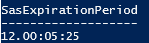

# Configure an expiration policy for shared access signatures

You can use a shared access signature (SAS) to delegate access to resources in your Azure Storage account. A SAS token includes the targeted resource, the permissions granted, and the interval over which access is permitted. Best practices recommend that you limit the interval for a SAS in case it is compromised. By setting a SAS expiration policy for your storage accounts, you can provide a recommended upper expiration limit when a user creates a service SAS or an account SAS.

For more information about shared access signatures, see [Grant limited access to Azure Storage resources using shared access signatures (SAS)](storage-sas-overview.md).

## About SAS expiration policies

You can configure a SAS expiration policy on the storage account. The SAS expiration policy specifies the recommended upper limit for the signed expiry field on a service SAS or an account SAS. The recommended upper limit is specified as a date/time value that is a combined number of days, hours, minutes, and seconds.

The validity interval for the SAS is calculated by subtracting the date/time value of the signed start field from the date/time value of the signed expiry field. If the resulting value is less than or equal to the recommended upper limit, then the SAS is in compliance with the SAS expiration policy.

After you configure the SAS expiration policy, then a user who creates a SAS with an interval that exceeds the recommended upper limit will see a warning.

A SAS expiration policy does not prevent a user from creating a SAS with an expiration that exceeds the limit recommended by the policy. When a user creates a SAS that violates the policy, they'll see a warning, together with the recommended maximum interval. If you have configured a diagnostic setting for logging with Azure Monitor, then Azure Storage writes a message to the **SasExpiryStatus** property in the logs whenever a user creates or uses a SAS that expires after the recommended interval. The message indicates that the validity interval of the SAS exceeds the recommended interval.

When a SAS expiration policy is in effect for the storage account, the signed start field is required for every SAS. If the signed start field is not included on the SAS, and you have configured a diagnostic setting for logging with Azure Monitor, then Azure Storage writes a message to the **SasExpiryStatus** property in the logs whenever a user creates or uses a SAS without a value for the signed start field.

## Configure a SAS expiration policy

When you configure a SAS expiration policy on a storage account, the policy applies to each type of SAS that is signed with the account key. The types of shared access signatures that are signed with the account key are the service SAS and the account SAS.

### Do I need to rotate the account access keys first?

Before you can configure a SAS expiration policy, you might need to rotate each of your account access keys at least once. If the **keyCreationTime** property of the storage account has a null value for either of the account access keys (key1 and key2), you will need to rotate them. To determine whether the **keyCreationTime** property is null, see [Get the creation time of the account access keys for a storage account](storage-account-get-info.md#get-the-creation-time-of-the-account-access-keys-for-a-storage-account). If you attempt to configure a SAS expiration policy and the keys need to be rotated first, the operation will fail.

### How to configure a SAS expiration policy

You can configure a SAS expiration policy using the Azure portal, PowerShell, or Azure CLI.

#### [Azure portal](#tab/azure-portal)

To configure a SAS expiration policy in the Azure portal, follow these steps:

1. Navigate to your storage account in the Azure portal.
1. Under **Settings**, select **Configuration**.
1. Locate the setting for **Allow recommended upper limit for shared access signature (SAS) expiry interval**, and set it to **Enabled**.

    > [!NOTE]
    > If the setting is grayed out and you see the message shown in the image below, then [you will need to rotate both account access keys](#do-i-need-to-rotate-the-account-access-keys-first) before you can set the **Recommended upper limit for SAS expiry interval** values:
    >
    > :::image type="content" source="media/sas-expiration-policy/configure-sas-expiration-policy-portal-grayed-out.png" alt-text="Screenshot showing the option to configure a SAS expiration policy is grayed out in the Azure portal." lightbox="media/sas-expiration-policy/configure-sas-expiration-policy-portal-grayed-out.png":::

1. Specify the time values under **Recommended upper limit for SAS expiry interval** for the recommended interval for any new shared access signatures that are created on resources in this storage account.

    :::image type="content" source="media/sas-expiration-policy/configure-sas-expiration-policy-portal.png" alt-text="Screenshot showing how to configure a SAS expiration policy in the Azure portal." lightbox="media/sas-expiration-policy/configure-sas-expiration-policy-portal.png":::

1. Select **Save** to save your changes.

#### [PowerShell](#tab/azure-powershell)

To configure a SAS expiration policy, use the [Set-AzStorageAccount](/powershell/module/az.storage/set-azstorageaccount) command, and then set the `-SasExpirationPeriod` parameter to the number of days, hours, minutes, and seconds that a SAS token can be active from the time that a SAS is signed. The string that you provide the `-SasExpirationPeriod` parameter uses the following format: `<days>.<hours>:<minutes>:<seconds>`. For example, if you wanted the SAS to expire 1 day, 12 hours, 5 minutes, and 6 seconds after it is signed, then you would use the string `1.12:05:06`.

```powershell
$account = Set-AzStorageAccount -ResourceGroupName <resource-group> `
    -Name <storage-account-name> `
    -SasExpirationPeriod <days>.<hours>:<minutes>:<seconds>
```

> [!TIP]
> You can also set the SAS expiration policy as you create a storage account by setting the `-SasExpirationPeriod` parameter of the [New-AzStorageAccount](/powershell/module/az.storage/new-azstorageaccount) command.

> [!NOTE]
> If you get an error message indicating that the creation time for a key has not been set, [rotate the account access keys](#do-i-need-to-rotate-the-account-access-keys-first) and try again.

To verify that the policy has been applied, check the storage account's SasPolicy property.
  
```powershell
$account.SasPolicy
```

The SAS expiration period appears in the console output.

> [!div class="mx-imgBorder"]
> 

#### [Azure CLI](#tab/azure-cli)

To configure a SAS expiration policy, use the [az storage account update](/cli/azure/storage/account#az-storage-account-update) command, and then set the `--key-exp-days` parameter to the number of days, hours, minutes, and seconds that a SAS token can be active from the time that a SAS is signed. The string that you provide the `--key-exp-days` parameter uses the following format: `<days>.<hours>:<minutes>:<seconds>`. For example, if you wanted the SAS to expire 1 day, 12 hours, 5 minutes, and 6 seconds after it is signed, then you would use the string `1.12:05:06`.

```azurecli-interactive
az storage account update \
  --name <storage-account> \
  --resource-group <resource-group> \
  --sas-exp <days>.<hours>:<minutes>:<seconds>
```

> [!TIP]
> You can also set the SAS expiration policy as you create a storage account by setting the `--key-exp-days` parameter of the [az storage account create](/cli/azure/storage/account#az-storage-account-create) command.

> [!NOTE]
> If you get an error message indicating that the creation time for a key has not been set, [rotate the account access keys](#do-i-need-to-rotate-the-account-access-keys-first) and try again.

To verify that the policy has been applied, call the [az storage account show](/cli/azure/storage/account#az-storage-account-show) command, and use the string `{SasPolicy:sasPolicy}` for the `-query` parameter.
  
```azurecli-interactive
az storage account show \
  --name <storage-account> \
  --resource-group <resource-group> \
  --query "{SasPolicy:sasPolicy}"
```

The SAS expiration period appears in the console output.

```json
{
  "SasPolicy": {
    "expirationAction": "Log",
    "sasExpirationPeriod": "1.12:05:06"
  }
}
```

---

## Query logs for policy violations

To log the creation of a SAS that is valid over a longer interval than the SAS expiration policy recommends, first create a diagnostic setting that sends logs to an Azure Log Analytics workspace. For more information, see [Send logs to Azure Log Analytics](../../azure-monitor/platform/diagnostic-settings.md).

Next, use an Azure Monitor log query to monitor whether policy has been violated. Create a new query in your Log Analytics workspace, add the following query text, and press **Run**.

```kusto
StorageBlobLogs 
| where SasExpiryStatus startswith "Policy violated"
| summarize count() by AccountName, SasExpiryStatus
```

## Use a built-in policy to monitor compliance

You can monitor your storage accounts with Azure Policy to ensure that storage accounts in your subscription have configured SAS expiration policies. Azure Storage provides a built-in policy for ensuring that accounts have this setting configured. For more information about the built-in policy, see **Storage accounts should have shared access signature (SAS) policies configured** in [List of built-in policy definitions](../../governance/policy/samples/built-in-policies.md#storage).

### Assign the built-in policy for a resource scope

Follow these steps to assign the built-in policy to the appropriate scope in the Azure portal:

1. In the Azure portal, search for *Policy* to display the Azure Policy dashboard.
1. In the **Authoring** section, select **Assignments**.
1. Choose **Assign policy**.
1. On the **Basics** tab of the **Assign policy** page, in the **Scope** section, specify the scope for the policy assignment. Select the **More** button to choose the subscription and optional resource group.
1. For the **Policy definition** field, select the **More** button, and enter *storage account keys* in the **Search** field. Select the policy definition named **Storage account keys should not be expired**.

    :::image type="content" source="media/sas-expiration-policy/policy-definition-select-portal.png" alt-text="Screenshot showing how to select the built-in policy to monitor validity intervals for shared access signatures for your storage accounts":::

1. Select **Review + create** to assign the policy definition to the specified scope.

    :::image type="content" source="media/sas-expiration-policy/policy-assignment-create.png" alt-text="Screenshot showing how to create the policy assignment":::

### Monitor compliance with the key expiration policy

To monitor your storage accounts for compliance with the key expiration policy, follow these steps:

1. On the Azure Policy dashboard, locate the built-in policy definition for the scope that you specified in the policy assignment. You can search for `Storage accounts should have shared access signature (SAS) policies configured` in the **Search** box to filter for the built-in policy.
1. Select the policy name with the desired scope.
1. On the **Policy assignment** page for the built-in policy, select **View compliance**. Any storage accounts in the specified subscription and resource group that do not meet the policy requirements appear in the compliance report.

    :::image type="content" source="media/sas-expiration-policy/policy-compliance-report-portal-inline.png" alt-text="Screenshot showing how to view the compliance report for the SAS expiration built-in policy" lightbox="media/sas-expiration-policy/policy-compliance-report-portal-expanded.png":::

To bring a storage account into compliance, configure a SAS expiration policy for that account, as described in [Configure a SAS expiration policy](#configure-a-sas-expiration-policy).

## See also

- [Grant limited access to Azure Storage resources using shared access signatures (SAS)](storage-sas-overview.md)
- [Create a service SAS](/rest/api/storageservices/create-service-sas)
- [Create an account SAS](/rest/api/storageservices/create-account-sas)
