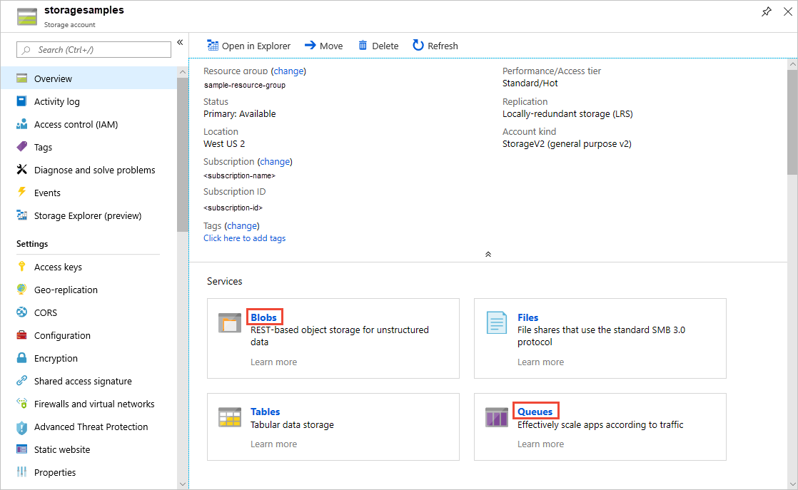
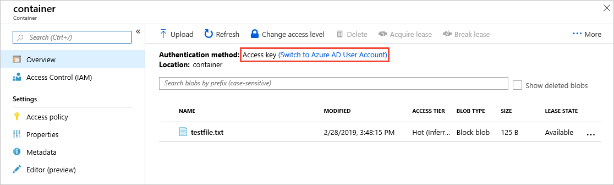
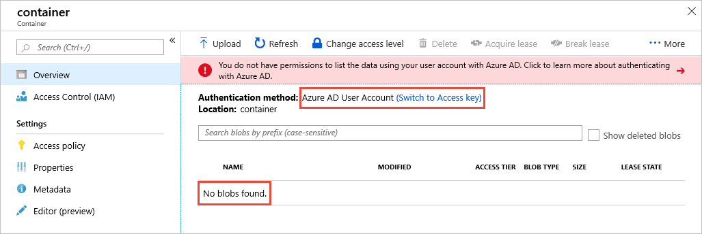
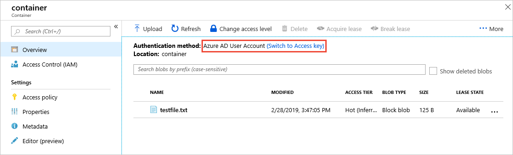

# Use the Azure portal to access blob or queue data

When you access blob or queue data using the [Azure portal](https://portal.azure.com), the portal makes requests to Azure Storage under the covers. These requests to Azure Storage can be authenticated and authorized using either your Azure AD account or the storage account access key. The portal indicates which authentication method you are using, and enables you to switch between the two if you have the appropriate permissions.  

## Permissions needed to access blob or queue data

Depending on how you want to authenticate access blob or queue data in the Azure portal, you'll need specific permissions. In most cases, these permissions are provided via role-based access control (RBAC). For more information about RBAC, see [What is role-based access control (RBAC)?](../../role-based-access-control/overview.md).

### Account access key

To access blob and queue data with the account access key, you must have an RBAC role assigned to you that includes the RBAC action **Microsoft.Storage/storageAccounts/listkeys/action**. This RBAC role may be a built-in or a custom role. Built-in roles that support **Microsoft.Storage/storageAccounts/listkeys/action** include:

- The Azure Resource Manager [Owner](../../role-based-access-control/built-in-roles.md#owner) role
- The Azure Resource Manager [Contributor](../../role-based-access-control/built-in-roles.md#contributor) role
- The [Storage Account Contributor](../../role-based-access-control/built-in-roles.md#storage-account-contributor) role

When you attempt to access blob or queue data in the Azure portal, the portal first checks whether you have been assigned a role with **Microsoft.Storage/storageAccounts/listkeys/action**. If you have been assigned a role with this action, then the portal uses the account key for accessing blob and queue data. If you have not been assigned a role with this action, then the portal attempts to access data using your Azure AD account.

> [!NOTE]
> The classic subscription administrator roles Service Administrator and Co-Administrator include the equivalent of the Azure Resource Manager [Owner](../../role-based-access-control/built-in-roles.md#owner) role. The **Owner** role includes all actions, including the **Microsoft.Storage/storageAccounts/listkeys/action**, so a user with one of these administrative roles can also access blob and queue data with the account key. For more information, see [Classic subscription administrator roles](../../role-based-access-control/rbac-and-directory-admin-roles.md#classic-subscription-administrator-roles).

### Azure AD account

To access blob or queue data from the Azure portal using your Azure AD account, both of the following statements must be true for you:

- You have been assigned the Azure Resource Manager [Reader](../../role-based-access-control/built-in-roles.md#reader) role, at a minimum, scoped to the level of the storage account or higher. The **Reader** role grants the most restricted permissions, but another Azure Resource Manager role that grants access to storage account management resources is also acceptable.
- You have been assigned either a built-in or custom role that provides access to blob or queue data.

The **Reader** role assignment or another Azure Resource Manager role assignment is necessary so that the user can view and navigate storage account management resources in the Azure portal. The RBAC roles that grant access to blob or queue data do not grant access to storage account management resources. To access blob or queue data in the portal, the user needs permissions to navigate storage account resources. For more information about this requirement, see [Assign the Reader role for portal access](../common/storage-auth-aad-rbac-portal.md#assign-the-reader-role-for-portal-access).

The built-in roles that support access to your blob or queue data include:

- [Storage Blob Data Owner](../../role-based-access-control/built-in-roles.md#storage-blob-data-owner): For POSIX access control for Azure Data Lake Storage Gen2.
- [Storage Blob Data Contributor](../../role-based-access-control/built-in-roles.md#storage-blob-data-contributor): Read/write/delete permissions for blobs.
- [Storage Blob Data Reader](../../role-based-access-control/built-in-roles.md#storage-blob-data-reader): Read-only permissions for blobs.
- [Storage Queue Data Contributor](../../role-based-access-control/built-in-roles.md#storage-queue-data-contributor): Read/write/delete permissions for queues.
- [Storage Queue Data Reader](../../role-based-access-control/built-in-roles.md#storage-queue-data-reader): Read-only permissions for queues.
    
Custom roles can support different combinations of the same permissions provided by the built-in roles. For more information about creating custom RBAC roles, see [Custom roles for Azure resources](../../role-based-access-control/custom-roles.md) and [Understand role definitions for Azure resources](../../role-based-access-control/role-definitions.md).

> [!NOTE]
> Listing queues with a classic subscription administrator role is not supported. To list queues, a user must have assigned to them the Azure Resource Manager **Reader** role, the **Storage Queue Data Reader** role, or the **Storage Queue Data Contributor** role.

## Navigate to blobs or queues in the portal

To view blob or queue data in the portal, navigate to the **Overview** for your storage account, and click on the links for **Blobs** or **Queues**. Alternatively you can navigate to the **Blob service** and **Queue service** sections in the menu. 

## Determine the current authentication method

When you navigate to a container or a queue, the Azure portal indicates whether you are currently using the account access key or your Azure AD account to authenticate.

The examples in this section show accessing a container and its blobs, but the portal displays the same message when you are accessing a queue and its messages, or listing queues.

### Account access key

If you are authenticating using the account access key, you'll see **Access Key** specified as the authentication method in the portal:

To switch to using Azure AD account, click the link highlighted in the image. If you have the appropriate permissions via the RBAC roles that are assigned to you, you'll be able to proceed. However, if you lack the right permissions, you'll see an error message like the following one:

Notice that no blobs appear in the list if your Azure AD account lacks permissions to view them. Click on the **Switch to access key** link to use the access key for authentication again.

### Azure AD account

If you are authenticating using your Azure AD account, you'll see **Azure AD User Account** specified as the authentication method in the portal:

To switch to using the account access key, click the link highlighted in the image. If you have access to the account key, then you'll be able to proceed. However, if you lack access to the account key, you'll see an error message like the following one:

Notice that no blobs appear in the list if you do not have access to the account keys. Click on the **Switch to Azure AD User Account** link to use your Azure AD account for authentication again.

## Next steps

- [Authenticate access to Azure blobs and queues using Azure Active Directory](storage-auth-aad.md)
- [Grant access to Azure containers and queues with RBAC in the Azure portal](storage-auth-aad-rbac-portal.md)
- [Grant access to Azure blob and queue data with RBAC using Azure CLI](storage-auth-aad-rbac-cli.md)
- [Grant access to Azure blob and queue data with RBAC using PowerShell](storage-auth-aad-rbac-powershell.md)
