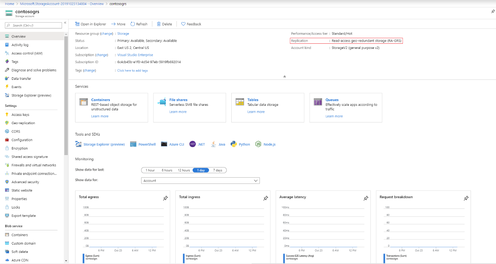

# Storage Account container recovery

Azure Storage provides data resiliency through automated replicas. However, this does not prevent application code or users from corrupting data, whether accidentally or maliciously. Maintaining data fidelity in the face of application or user error requires more advanced techniques, such as copying the data to a secondary storage location with an audit log.

## Checking Azure Storage account type

1. Navigate to the [Azure portal](https://portal.azure.com/).

2. Locate your storage account.

3. In the **Overview** section, check for **Replication**.

   

4. If the Replication Type is **GRS/RA-GRS**, account container recovery is possible without guarantee. For all other replication types, it is not possible.

5. Gather the following information and file a support request with Microsoft Support.

   * Storage Account Name:
   * Container Name:
   * Time of Deletion:

   The following table provides overview of the scope of Storage Account Container Recovery depending on the replication strategy.

   |Type of Content|LRS|ZRS|GRS|RA - GRS| 
   |---|---|---|---|---|
   |Storage Container|No|No|Yes|Yes| 

   * We can attempt to restore the storage account container but without any guarantee. 

## Things not to do for recover to be successful

* Please do not recreate the container (with the same name).  
* If you have already recreated the container, you need to delete the container before filing a support request for recovery.

## Steps to prevent this in the future

1. To avoid this in the future, the most recommended feature to use is [Soft Delete](https://docs.microsoft.com/azure/storage/blobs/storage-blob-soft-delete).

2. We also recommend the [Snapshot](https://docs.microsoft.com/rest/api/storageservices/Creating-a-Snapshot-of-a-Blob) feature.
 
## Next steps

Here are two sample codes on the feature:

  * [Create and manage a blob snapshot in .NET](https://docs.microsoft.com/azure/storage/storage-blob-snapshots)
  * [Using blob snapshots with PowerShell](https://blogs.msdn.microsoft.com/cie/2016/05/17/using-blob-snapshots-with-powershell/)
  

