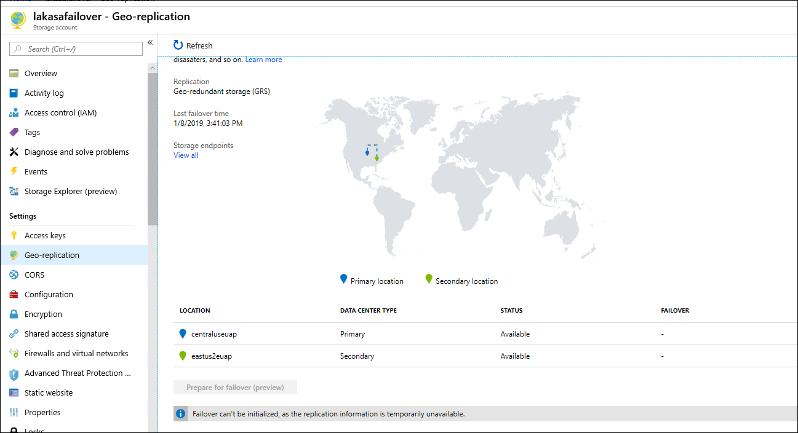
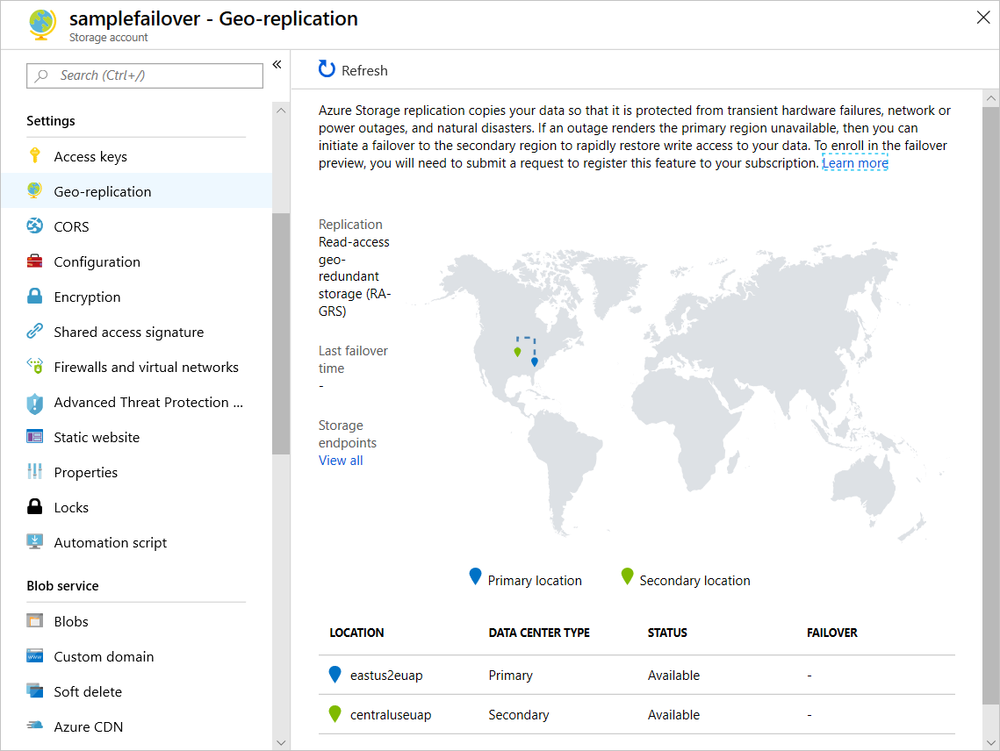

Storage accounts replicated with [geo-redundant storage (GRS)](storage-redundancy-grs.md) or read-access geo-redundant storage (RA-GRS) support forced failover (preview). In the event that the primary region for your storage account becomes unavailable, forced failover enables you to control when you fail over to the secondary region. When you force a failover to the secondary region, clients can immediately begin writing data to the secondary endpoint. Forced failover helps you to maintain high availability for your customers. 

Forced failover is enabled for all new and existing storage accounts configured for geo-redundant storage (GRS) or read-access geo-redundant storage (RA-GRS). Microsoft recommends using RA-GRS for applications requiring high availability. 
    
Once you initiate a forced failover, all data in the storage account, including blob, disk, file, queue, and table data, is failed over. Forced failover is available only to Azure Resource Manager deployments. General-purpose v1, General-purpose v2, and Blob storage account types are supported.

> [!WARNING]
> Forcing a failover results in the loss of any data written to the primary region after the time indicated by the **Last Sync Time** property. Before you force a failover, make sure that you understand the implications for your data.

## About the preview

Forced failover is currently available in preview in these regions:

- US-West 2
- US West Central

The preview is intended for non-production use only. Production service-level agreements (SLAs) are not currently available.

## How it works 

Azure Storage accounts configured for GRS or RA-GRS are replicated in two geographically separate regions. In the event that data in the primary region becomes temporarily unavailable, the data maintained in the secondary region can serve to keep your applications running with limited impact to customers.

By default, if the primary region becomes unavailable, Microsoft fails over to the secondary region. The secondary region then becomes the new primary region. 

Account failover is available for both [Geo-redundant storage (GRS)](https://docs.microsoft.com/en-us/azure/storage/common/storage-redundancy-grs) or [Read-access geo-redundant storage (RA-GRS)](https://docs.microsoft.com/en-us/azure/storage/common/storage-redundancy-grs#read-access-geo-redundant-storage) accounts. To achieve high availability, we recommend using RA-GRS accounts. With these options of redundancy, Azure Storage will keep your data durable in two regions (primary and secondary). In both regions, Azure Storage constantly maintains multiple replicas of your data.

In the event of a regional disaster or primary unavailability, you can initiate account failover that will failover your entire account to the secondary region. Cross-region data replication is an asynchronous process that involves a delay, so it is possible that changes which have not yet been replicated to the secondary region may be lost.

**Please read below to fully understand what to expect and the implications of account failover**

-   Account failover can only be triggered on both Azure Resource Manager GP v1, GP v2 accounts and Blob storage accounts. It is not available for Classic storage accounts.

-   Account failover can be triggered only on RAGRS and GRS accounts. It is not available for ZRS account yet.

-   Before triggering account failover, you can check the status of secondary end point on how far the replication by using Last Sync Time. This will provide an estimate on the amount of data you will lose as part of the failover.

-   Your existing storage service endpoints for blobs, tables, queues, and files will remain the same after the failover; the Microsoft-supplied DNS entry will be automatically updated as part of the account failover process.

-   During account failover, you won't have read and write access to your storage account

-   When the account failover has been completed and the DNS changes propagated, read and write access to your storage account are restored if you have GRS or RA-GRS. The endpoint that was previously your secondary endpoint becomes your primary endpoint.

-   After account failover is completed your storage account will be fully functioning but in a “degraded” state and converted to LRS. You can re-enable your storage account to GRS or RA-GRS. Your data will be geo-replicated from your new primary to secondary region.

-   You can check the status of the primary location and query the last geo-failover time for your storage account.

Supported Scenarios
===================

These scenarios support forced failover of an Azure storage account

VM Scenarios

1.  Shutdown the VM

2.  Conduct failover

3.  After failover is completed, vhds are only copied so you will need to reattach the vhds and restart the VMs in the new primary region

4.  Any data in the temp disk will be lost

5.  Check on how user can query LST for page blobs

VNET – supported. No action required 
 
ADLS gen 2 – supported

Data used by the following features or services does not is not failed over. 

Azure Files Sync - not blocked, but need to reconfigure all settings after failover.
Large File Shares - blocked - keep LFS data in separate accounts - use a different account - maintain their own DR - whole account cannot be failed over (for preview)
Managed Disks – is not a supported scenario because Microsoft manages the storage account
Archive scenarios - use different account for archive 
Premium Block Blobs - GRS is not supported

Best Practices
==============

Leasing 

## Enable failover for your Azure Storage account

### Azure portal

1.  From your Azure Storage account, open the Geo Replication pane

    

2.  Verify that your storage account is configured for GRS or RA-GRS. If it is not, you can upgrade the account to use GRS or RA-GRS using the **Configuration** settings.

3.  Last Sync Time indicates how far behind the secondary is behind from the primary. This provides an estimate of the data loss that you will experience after the failover is completed

4.  Click on Prepare for failover (preview) to understand implications of failover and confirm failover.

    

5.  After you type in ‘yes’ failover will start. The status of end point and failover is indicated as shown below.
6. 
    

6.  Primary and Secondary endpoints will be swapped after failover.

7.  After failover is completed your storage account will be converted to LRS.

8.  You can convert it to RA-GRS or GRS after geo is stabilized. This will take around 15 minutes.

### Azure PowerShell

Invoke-AzureRmStorageAccountFailover -ResourceGroupName \$RGName -Name \$AccountName

Version of powershell – mention this.

FAQ for Account Failover
========================

**Is Account failover available for Classic storage account?**

No, Account failover is only available for ARM GP v1 and v2 accounts

Is Account failover supported for Azure File Sync?

How can I enable account failover for VM?

Do I need to arrange for failover for manage disk scenarios?

How can I participate in the preview?

When will my subscription get approved?

What regions is the preview available?

Whom to contact for preview questions?

Is there a way to understand how much data I will lose during account failover?

Can I perform a failback after primary region is up?

Next Steps
==========

-   [Locally-redundant storage (LRS): Low-cost data redundancy for Azure
    Storage](https://docs.microsoft.com/en-us/azure/storage/common/storage-redundancy-lrs)

-   [Zone-redundant storage (ZRS): Highly available Azure Storage
    applications](https://docs.microsoft.com/en-us/azure/storage/common/storage-redundancy-zrs)

-   [Geo-redundant storage (GRS): Cross-regional replication for Azure
    Storage](https://docs.microsoft.com/en-us/azure/storage/common/storage-redundancy-grs)

-   [Designing Highly Available Applications using RA-GRS
    Storage](https://docs.microsoft.com/en-us/azure/storage/storage-designing-ha-apps-with-ragrs)

-   [Azure Storage scalability and performance
    targets](https://docs.microsoft.com/en-us/azure/storage/common/storage-scalability-targets)

-   [Microsoft Azure Storage redundancy options and read access geo redundant
    storage
    ](https://blogs.msdn.com/b/windowsazurestorage/archive/2013/12/11/introducing-read-access-geo-replicated-storage-ra-grs-for-windows-azure-storage.aspx)
