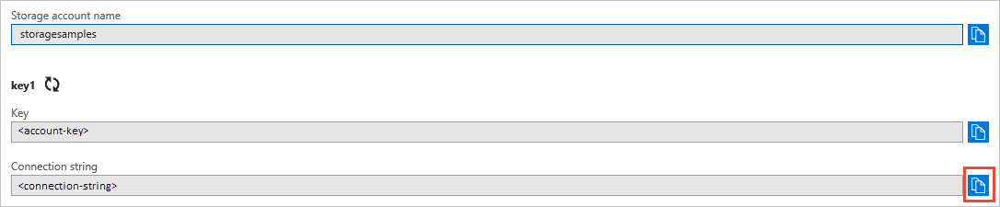

# Manage storage account settings in the Azure portal

A variety of settings for your storage account are available in the [Azure portal](https://portal.azure.com). This article describes some of these settings and how to use them.

## Access control

Azure Storage supports authentication with Azure Active Directory for Blob storage and Queue storage (preview) via role-based access control (RBAC). For more information about authentication with Azure AD, see [Authenticate access to Azure blobs and queues using Azure Active Directory (Preview)](storage-auth-aad.md).

The **Access control** settings in the Azure portal offer a simple way to assign RBAC roles to users, groups, service principals, and managed identities. For more information about assigning RBAC roles, see [Manage access rights to blob and queue data with RBAC (Preview)](storage-auth-aad-rbac.md).

> [!NOTE]
> Authenticating users or applications using Azure AD credentials provides superior security and ease of use over other means of authorization. While you can continue to use Shared Key authorization with your applications, using Azure AD circumvents the need to store your account access key with your code. You can also continue to use shared access signatures (SAS) to grant fine-grained access to resources in your storage account, but Azure AD offers similar capabilities without the need to manage SAS tokens or worry about revoking a compromised SAS. 

## Tags

Azure Storage supports Azure Resource Manager tags for organizing your Azure resources with a customized taxonomy. You can apply tags to your storage accounts so that you can group them within your subscription in a logical manner. 

For storage accounts, a tag name is limited to 128 characters, and a tag value is limited to 256 characters.

For more information, see [Use tags to organize your Azure resources](../../azure-resource-manager/resource-group-using-tags.md).

## Access keys

When you create a storage account, Azure generates two 512-bit storage account access keys. These keys can be used to authorize access to your storage account via Shared Key. You can rotate and regenerate the keys without interruption to your applications, and Microsoft recommends that you do so regularly.

[!INCLUDE [storage-account-key-note-include](../../../includes/storage-account-key-note-include.md)]

### View and copy access keys

To view your storage account credentials:

1. Navigate to the [Azure portal](https://portal.azure.com).
2. Locate your storage account.
3. In the **Settings** section of the storage account overview, select **Access keys**. Your account access keys appear, as well as the complete connection string for each key.
4. Find the **Key** value under **key1**, and click the **Copy** button to copy the account key.
5. Alternately, you can copy the entire connection string. Find the **Connection string** value under **key1**, and click the **Copy** button to copy the connection string.

    

### Regenerate access keys

Microsoft recommends that you regenerate your access keys periodically to help keep your storage account secure. Two access keys are assigned so that you can rotate your keys. When you rotate your keys, you ensure that your application maintains access to Azure Storage throughout the process. 

> [!WARNING]
> Regenerating your access keys can affect any applications or Azure services that are dependent on the storage account key. Any clients that use the account key to access the storage account must be updated to use the new key, including media services, cloud, desktop and mobile applications, and graphical user interface applications for Azure Storage, such as [Azure Storage Explorer](https://azure.microsoft.com/features/storage-explorer/). 

Follow this process to rotate your storage account keys:

1. Update the connection strings in your application code to use the secondary key.
2. Regenerate the primary access key for your storage account. On the **Access Keys** blade in the Azure portal, click **Regenerate Key1**, and then click **Yes** to confirm that you want to generate a new key.
3. Update the connection strings in your code to reference the new primary access key.
4. Regenerate the secondary access key in the same manner.

## Account configuration

After you create a storage account, you can modify its configuration. For example, you can change how your data is replicated, or change the account's access tier from Hot to Cool. In the [Azure portal](https://portal.azure.com), navigate to your storage account, then find and click **Configuration** under **Settings** to view and/or change the account configuration.

Changing the storage account configuration may result in added costs. For more details, see the [Azure Storage Pricing](https://azure.microsoft.com/pricing/details/storage/) page.

## Delete a storage account
To remove a storage account that you are no longer using, navigate to the storage account in the [Azure portal](https://portal.azure.com), and click **Delete**. Deleting a storage account deletes the entire account, including all data in the account.

> [!WARNING]
> It's not possible to restore a deleted storage account or retrieve any of the content that it contained before deletion. Be sure to back up anything you want to save before you delete the account. This also holds true for any resources in the account—once you delete a blob, table, queue, or file, it is permanently deleted.
> 

If you try to delete a storage account associated with an Azure virtual machine, you may get an error about the storage account still being in use. For help troubleshooting this error, please see [Troubleshoot errors when you delete storage accounts](../common/storage-resource-manager-cannot-delete-storage-account-container-vhd.md).

## Next steps

- [Azure storage account overview](storage-account-overview.md)
- [Create a storage account](storage-quickstart-create-account.md)
