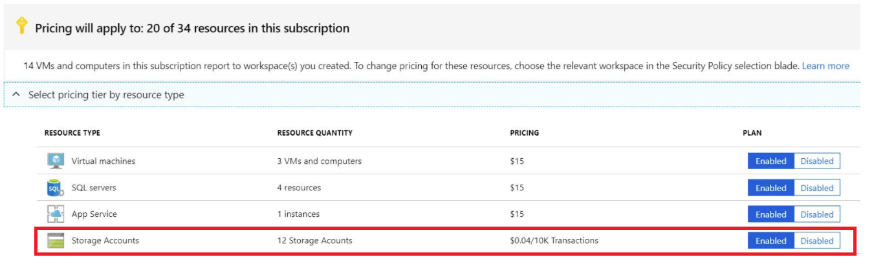

# Advanced Threat Protection for Azure Storage

Advanced Threat Protection for Azure Storage provides an additional layer of security intelligence that detects unusual and potentially harmful attempts to access or exploit storage accounts. This layer of protection allows you to address threats without the need to be a security expert or manage security monitoring systems. 

Security alerts are triggered when anomalies in activity occur.  These security alerts are integrated with [Azure Security Center](https://azure.microsoft.com/services/security-center/), and are also sent via email to subscription administrators, with details of suspicious activity and recommendations on how to investigate and remediate threats.

> [!NOTE]
> Advanced Threat Protection for Azure Storage  is currently available only for the Blob service. Complete details about the new pricing is available in Azure Security Center pricing page. We invite you to a trial period for the first 30 days, without charge

Advanced Threat Protection for Azure Storage ingests diagnostic logs of read, write, and delete requests to Blob service for threat detection. To investigate the alerts from Advanced Threat Protection, you can view related storage activity using Storage Analytics Logging. See how to [configure Storage Analytics](storage-monitor-storage-account.md#configure-logging) logging and more information.

## Set up Advanced Threat Protection in the portal

1. Launch the Azure portal at [https://portal.azure.com](https://portal.azure.com/).

2. Navigate to the configuration page of the Azure Storage account you want to protect. In the **Settings** page, select **Advanced Threat Protection**.

3. In the **Advanced Threat Protection** configuration blade
	* Turn **ON** Advanced *Threat Protection*
	* Click **Save** to save the new or updated Advanced Threat Protection policy.

## Set up Advanced Threat Protection for storage accounts using Azure Security Center
When you subscribe to the Standard tier in Azure Security Center, ATP is set up on your storage accounts. for more information see  [Upgrade to Security Center's Standard tier for enhanced security](../../../security-center/security-center-pricing).
<!-- can I say ATP is automatically set up-->

## Set up Advanced Threat Protection for a storage account using ARM templates

Use an Azure Resource Manager template to to deploy an Azure Storage account with Advanced Threat Protection enabled.
For more information, see
[Storage account with Advanced Threat Protection](https://azure.microsoft.com/en-us/resources/templates/201-storage-advanced-threat-protection-create/).

## Set up Advanced Threat Protection for a storage account using REST API
Use Rest API commands to create, update, or get  Advanced Threat Protection setting for a specific storage account.

* [Advanced Threat Protection - Create](rest/api/securitycenter/advancedthreatprotection/create)
* [Advanced Threat Protection - Get](rest/api/securitycenter/advancedthreatprotection/get)

## Explore anomalies

When storage activity anomalies occur, you receive an email notification with information about the suspicious security event. Details of the event include:

* nature of the anomaly
* storage account name
* event time
* storage type
* potential causes 
* investigation steps
* remediation steps

The email also includes details on possible causes and recommended actions to investigate and mitigate the potential threat.

You can review and manage your current security alerts from Azure Security Center’s [Security alerts tile](../../security-center/security-center-managing-and-responding-alerts.md#managing-security-alerts). Clicking on a specific alert provides details and actions for investigating the current threat and addressing future threats.

## Protection alerts

Alerts are generated by unusual and potentially harmful attempts to access or exploit storage accounts. These events can trigger the following alerts:

* **Access from unusual location**: This alert is triggered when there's a change in the access pattern to a storage account. For instance, when someone has accessed a storage account from an unusual geographical location. In some cases, the alert detects a legitimate action (a new application or developer’s maintenance operation). In other cases, the alert detects a malicious action (former employee, external attacker, etc.).

* **Unusual data extraction**: This alert is triggered when there's a change in the data extraction pattern from a storage account. For instance, if someone has accessed an unusual amount of data in a storage account. In some cases, the alert detects a legitimate action (maintenance activity). In other cases, the alert detects a malicious action (data exfiltration/breach, unauthorized transfer of data).

* **Unusual anonymous access:** This alert is triggered when there's a change in the access pattern to a storage account. For instance, suppose someone has anonymously accessed a storage account. In some cases, the alert detects a legitimate access using public read access. In other cases, the alert detects unauthorized access that exploits public read access to a container and its blobs.

* **Unexpected delete:** This alert is triggered when one or more unexpected delete operations occur in a storage account, based on historical analysis of the storage account. For instance, suppose someone performed a *DeleteBlob* operation using a new application and from a new IP address. In some cases, the alert detects a legitimate action (the administrator used a different browser while traveling on business). In other cases, the alert detects a malicious action (an attacker deleting data). 
 
* **Access permission change:** This alert is triggered when there’s an unexpected change of access permission to a storage account. For instance, suppose someone changed the access permission to a storage account using a new application and from a new IP address. In some cases, the alert detects a legitimate action (the administrator used a different browser while traveling on business). In other cases, the alert detects a malicious action (e.g., an attacker increasing the privileges of an account they have gained access to). 

* **Upload Azure Cloud Service package:** This alert is triggered when there is an unexpected upload of an Azure Cloud Service package (*.cspkg* file) to a storage account. For instance, suppose a *.cspkg* file was uploaded from a new IP address. In some case, the alert detects a legitimate action. In other cases, the alert detects a malicious action (e.g., a Cloud Service package was uploaded in preparation for a deployment of a malicious service).

* **Geo-anomaly**  This alert indicates that this account has been accessed successfully from an IP address that is unfamiliar and unexpected compared to recent access pattern on this account. Potential causes:

    * An attacker has accessed your storage account.
    * A legitimate user has accessed your storage account from a new location. 

* **Anonymous access** This alert indicates that this account has been accessed anonymously (i.e. without any authentication), which is unexpected compared to recent access pattern on this account. Potential causes:

   * An attacker has exploited public read access to a container.
   * A legitimate user or application has used public read access to a container.

* **Data Exfiltration** This alert indicates that an unusually large amount of data has been extracted compared to recent activity on this storage container. Potential causes:

   * An attacker has extracted a large amount of data from a container. 

   * A legitimate user or application has extracted an unusual amount of data from a container.

* **Access permission change** This alert indicates that the access permissions of this storage container have been changed in an unusual way. Potential causes: 

   * An attacker has changed container permissions to weaken its security. 

   * A legitimate user has changed container permissions. 

* **Unexpected delete** This alert indicates that one or more unexpected delete operations has occurred in a storage account, compared to recent activity on this account. Potential causes:

   * An attacker has deleted data from your storage account.

   * A legitimate user has performed an unusual deletion.

* **Upload Azure Cloud Service package** 
This alert indicates that an Azure Cloud Service package (.cspkg file) has been uploaded to a storage account in an unusual way, compared to recent activity on this account. Potential causes: 

   * An attacker has been preparing to deploy malicious code from your storage account to an Azure cloud service.

   * A legitimate user has been preparing for a legitimate service deployment. 

**Data Exploration** This alert indicates that blobs or containers in a storage account have been enumerated in an unusual way, compared to recent activity on this account. Potential causes: 

   * An attacker has performed reconnaissance for a future attack. 

   * A legitimate user or application logic has explored data within the storage account. 

**Access Inspection** This alert indicates that the access permissions of a storage account have been inspected in an unusual way, compared to recent activity on this account. Potential causes: 

   * An attacker has performed reconnaissance for a future attack. 

   * A legitimate user has performed maintenance on the storage account. 

**Application Anomaly** This alert indicates that an unusual application has accessed this storage account. Potential causes:

   * An attacker has accessed your storage account using a new application.

   * A legitimate user has used a new application/browser to access your storage account.

## Next steps

* Learn more about [Logs in Azure Storage accounts ](/rest/api/storageservices/About-Storage-Analytics-Logging)

* Learn more about [Azure Security Center](../../security-center/security-center-intro.md)