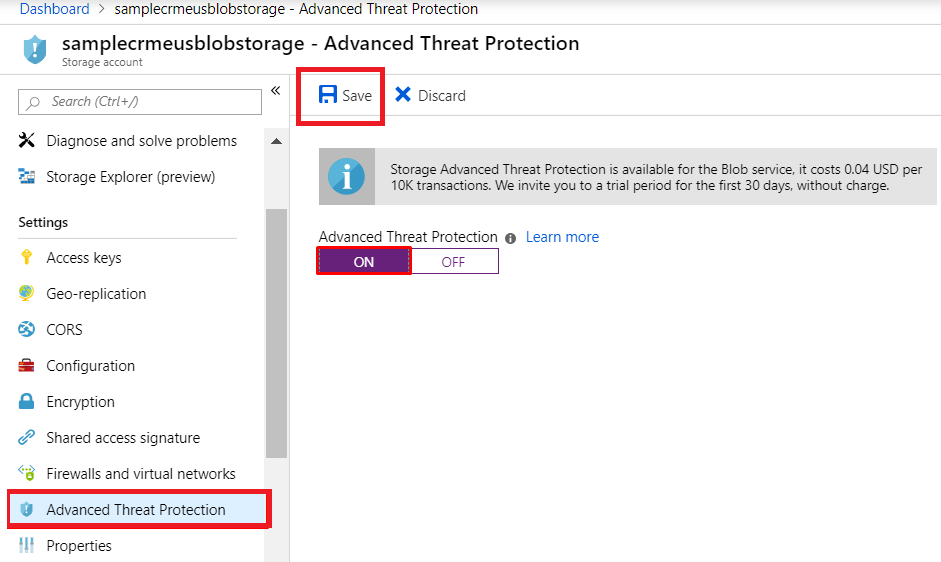
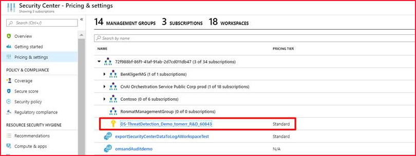
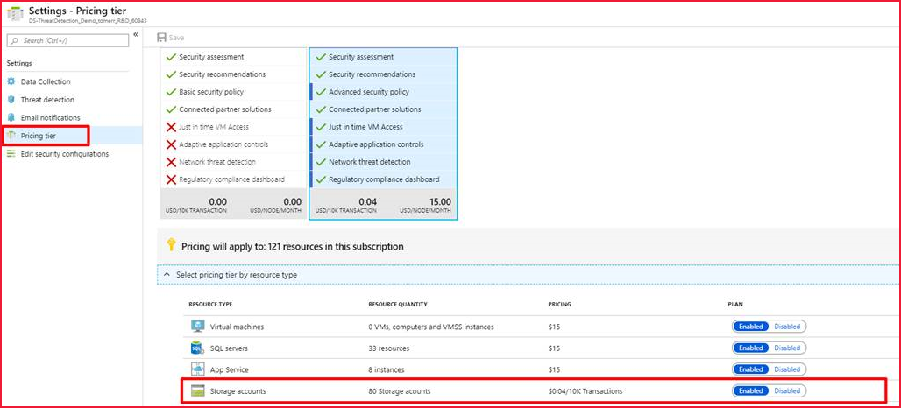
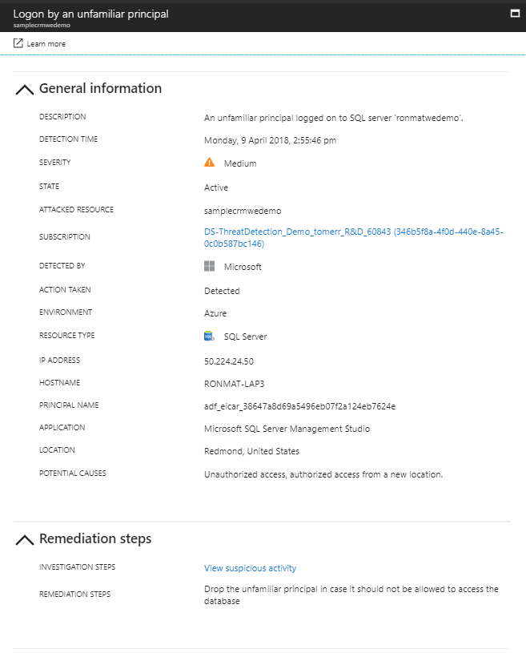

# Configure advanced threat protection for Azure Storage

Advanced threat protection for Azure Storage provides an additional layer of security intelligence that detects unusual and potentially harmful attempts to access or exploit storage accounts. This layer of protection allows you to address threats without being a security expert or managing security monitoring systems.

Security alerts are triggered when anomalies in activity occur. These security alerts are integrated with [Azure Security Center](https://azure.microsoft.com/services/security-center/), and are also sent via email to subscription administrators, with details of suspicious activity and recommendations on how to investigate and remediate threats.

The service ingests resource logs of read, write, and delete requests to Blob Storage for threat detection. To investigate the alerts from advanced threat protection, you can view related storage activity using Storage Analytics Logging. For more information, see **Configure logging** in [Monitor a storage account in the Azure portal](storage-monitor-storage-account.md#configure-logging).

## Availability

Advanced threat protection for Azure Storage is currently available only for [Blob Storage](https://azure.microsoft.com/services/storage/blobs/). Account types that support advanced threat protection include general-purpose v2, block blob, and Blob storage accounts. Advanced threat protection is available in all public clouds and US government clouds, but not in other sovereign or Azure government cloud regions.

For pricing details, including a free 30 day trial, see the [Azure Security Center pricing page](https://azure.microsoft.com/pricing/details/security-center/).

## Set up advanced threat protection

You can configure advanced threat protection in any of several ways, described in the following sections.

### [Portal](#tab/azure-portal)

1. Launch the [Azure portal](https://portal.azure.com/).
1. Navigate to your Azure Storage account. Under **Settings**, select **Advanced security**.
1. Select the **Settings** link on the advanced security configuration page.
1. Set **Advanced security** to **ON**.
1. Click **Save** to save the new or updated policy.

    

### [Azure Security Center](#tab/azure-security-center)

When you subscribe to the Standard tier in Azure Security Center, advanced threat protection is automatically set up on all of your storage accounts. You can enable or disable advanced threat protection for your storage accounts under a specific subscription as follows:

1. Launch **Azure Security Center** in the [Azure portal](https://portal.azure.com).
1. From the main menu, click **Pricing & settings**.
1. Click the subscription that you want to enable or disable threat protection for its storage accounts.

    

1. Click **Pricing tier**.
1. In the **Select pricing tier by resource type** section, in the **Storage accounts** row, click **Enabled** or **Disabled**.

    
1. Click **Save**.

### [Template](#tab/template)

Use an Azure Resource Manager template to deploy an Azure Storage account with advanced threat protection enabled. For more information, see
[Storage account with advanced threat protection](https://azure.microsoft.com/resources/templates/201-storage-advanced-threat-protection-create/).

### [Azure Policy](#tab/azure-policy)

Use an Azure Policy to enable advanced threat protection across storage accounts under a specific subscription or resource group.

1. Launch the Azure **Policy - Definitions** page.

1. Search for the **Deploy Advanced Threat Protection on Storage Accounts** policy.

     

1. Select an Azure subscription or resource group.

    

1. Assign the policy.

    

### [REST API](#tab/rest-api)

Use Rest API commands to create, update, or get the advanced threat protection setting for a specific storage account.

* [Advanced threat protection - Create](https://docs.microsoft.com/rest/api/securitycenter/advancedthreatprotection/create)
* [Advanced threat protection - Get](https://docs.microsoft.com/rest/api/securitycenter/advancedthreatprotection/get)

### [PowerShell](#tab/azure-powershell)

Use the following PowerShell cmdlets:

* [Enable advanced threat protection](https://docs.microsoft.com/powershell/module/az.security/enable-azsecurityadvancedthreatprotection)
* [Get advanced threat protection](https://docs.microsoft.com/powershell/module/az.security/get-azsecurityadvancedthreatprotection)
* [Disable advanced threat protection](https://docs.microsoft.com/powershell/module/az.security/disable-azsecurityadvancedthreatprotection)

---

## Explore security anomalies

When storage activity anomalies occur, you receive an email notification with information about the suspicious security event. Details of the event include:

* The nature of the anomaly
* The storage account name
* The event time
* The storage type
* The potential causes
* The investigation steps
* The remediation steps

The email also includes details on possible causes and recommended actions to investigate and mitigate the potential threat.

You can review and manage your current security alerts from Azure Security Center's [Security alerts tile](../../security-center/security-center-managing-and-responding-alerts.md). Clicking on a specific alert provides details and actions for investigating the current threat and addressing future threats.

## Security alerts

Alerts are generated by unusual and potentially harmful attempts to access or exploit storage accounts. For a list of alerts for Azure Storage, see the **Storage** section in [Threat protection for data services in Azure Security Center](https://docs.microsoft.com/azure/security-center/alerts-reference#alerts-azurestorage).

## Next steps

* Learn more about [Logs in Azure Storage accounts](/rest/api/storageservices/About-Storage-Analytics-Logging)
* Learn more about [Azure Security Center](../../security-center/security-center-intro.md)
