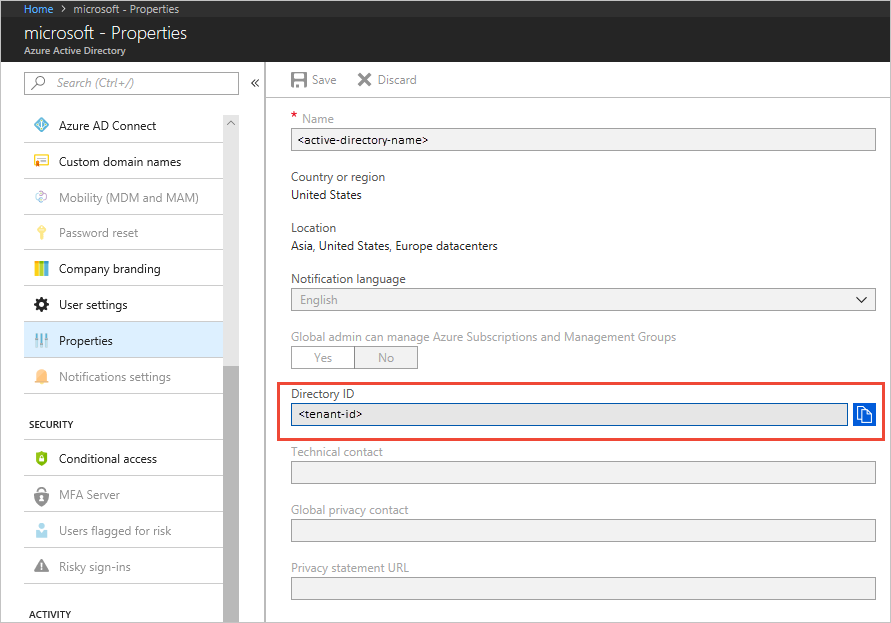

# Authenticate with Azure Active Directory from an Azure Storage application (Preview)

A key advantage of using Azure Active Directory (Azure AD) with Azure Storage is that your credentials no longer need to be stored in your code. Instead, you can request an OAuth 2.0 access token from Azure AD. Azure AD handles the authentication of the security principal (a user, group, or service principal) running the application. If authentication succeeds, Azure AD returns the access token to the application, and the application can then use the access token to authorize requests to Azure Storage.

This article shows how to configure your application for authentication with Azure AD. The code example features .NET, but other languages use a similar approach.

Before you can authenticate a security principal from your Azure Storage application, configure role-based access control (RBAC) settings for that security principal. Azure Storage defines RBAC roles that encompass permissions for containers and queues. When the RBAC role is assigned to a security principal, that security principal is granted access to that resource. For more information, see [Manage access rights to storage data with RBAC (Preview)](storage-auth-aad-rbac.md).

For an overview of the OAuth 2.0 code grant flow, see [Authorize access to Azure Active Directory web applications using the OAuth 2.0 code grant flow](../../active-directory/develop/v1-protocols-oauth-code.md).

[!INCLUDE [storage-auth-aad-note-include](../../../includes/storage-auth-aad-note-include.md)]

## Register your application with an Azure AD tenant

The first step in using Azure AD to authorize access to storage resources is registering your client application in an Azure AD tenant. Registering your application enables you to call the Azure [Active Directory Authentication Library](../../active-directory/active-directory-authentication-libraries.md) (ADAL) from your code. The ADAL provides an API for authenticating with Azure AD from your application. Registering your application also enables you to authorize calls from that application to Azure Storage APIs with an access token.

When you register your application, you supply information about your application to Azure AD. Azure AD then provides a client ID (also called an *application ID*) that you use to associate your application with Azure AD at runtime. To learn more about the client ID, see [Application and service principal objects in Azure Active Directory](../../active-directory/develop/app-objects-and-service-principals.md).

To register your Azure Storage application, follow the steps in the [Adding an Application](../../active-directory/develop/quickstart-v1-add-azure-ad-app.md) section in [Integrating applications with Azure Active Directory](../../active-directory/active-directory-integrating-applications.md). If you register your application as a native application, you can specify any valid URI for the **Redirect URI**. The value does not need to be a real endpoint.


After you've registered your application, you'll see the application ID (or client ID) under **Settings**:


For more information about registering an application with Azure AD, see [Integrating applications with Azure Active Directory](../../active-directory/develop/quickstart-v1-integrate-apps-with-azure-ad.md). 

## Grant your registered app permissions to Azure Storage

Next, you need to grant your application permissions to call Azure Storage APIs. This step enables your application to authorize calls to Azure Storage with Azure AD.

1. In the left-hand navigation pane of the Azure portal, choose **All services**, and search for **App Registrations**.
2. Search for the name of the registered application you created in the previous step.
3. Select your registered app and click **Settings**. In the **API Access** section, select **Required permissions**.
4. In the **Required permissions** blade, click the **Add** button.
5. Under **Select an API**, search for "Azure Storage", and select **Azure Storage** from the list of results.

    

6. Under **Select permissions**, check the box next to **Access Azure Storage**, and click **Select**.
7. Click **Done**.

The **Required Permissions** windows now shows that your Azure AD application has access to both Azure Active Directory and the Azure Storage. Permissions are granted to Azure AD automatically when you first register your app with Azure AD.


## .NET code example: Create a block blob

The code example shows how to get an access token from Azure AD. The access token is used to authenticate the specified user and then authorize a request to create a block blob. To get this sample working, first follow the steps outlined in the preceding sections.

> [!NOTE]
> As an owner of your Azure Storage account, you are not automatically assigned permissions to access data. You must explicitly assign yourself an RBAC role for Azure Storage. You can assign it at the level of your subscription, resource group, storage account, or container or queue. 
>
> For example, to run the sample code on a storage account where you are an owner and under your own user identity, you must assign the RBAC role for Blob Data Contributor to yourself. Otherwise, the call to create the blob will fail with HTTP status code 403 (Forbidden). For more information, see [Manage access rights to storage data with RBAC (Preview)](storage-auth-aad-rbac.md).

### Well-known values for authentication with Azure AD

To authenticate a security principal with Azure AD, you need to include some well-known values in your code.

#### Azure AD OAuth endpoint

The base Azure AD authority endpoint for OAuth 2.0 is as follows, where *tenant-id* is your Active Directory tenant ID (or directory ID):

`https://login.microsoftonline.com/<tenant-id>/oauth2/token`

The tenant ID identifies the Azure AD tenant to use for authentication. To retrieve the tenant ID, follow the steps outlined in **Get the tenant ID for your Azure Active Directory**.

#### Storage resource ID

Use the Azure Storage resource ID to acquire a token for authenticating requests to Azure Storage:

`https://storage.azure.com/`

### Get the tenant ID for your Azure Active Directory

To get the tenant ID, follow these steps:

1. In the Azure portal, select your Active Directory.
2. Click **Properties**.
3. Copy the GUID value provided for the **Directory ID**. This value is also called the tenant ID.



### Add references and using statements  

In Visual Studio, install the preview version of the Azure Storage client library. From the **Tools** menu, select **Nuget Package Manager**, then **Package Manager Console**. Type the following command into the console to install the latest version of the client library for .NET:

```
Install-Package WindowsAzure.Storage
```

Also install the latest version of ADAL:

```
Install-Package Microsoft.IdentityModel.Clients.ActiveDirectory
```

Next, add the following using statements to your code:

```dotnet
using System.Globalization;
using Microsoft.IdentityModel.Clients.ActiveDirectory; //ADAL client library for getting the access token
using Microsoft.WindowsAzure.Storage.Auth;
using Microsoft.WindowsAzure.Storage.Blob;
```

### Get an OAuth token from Azure AD

Next, add a method that requests a token from Azure AD. To request the token, call the [AuthenticationContext.AcquireTokenAsync](https://docs.microsoft.com/dotnet/api/microsoft.identitymodel.clients.activedirectory.authenticationcontext.acquiretokenasync) method. Make sure that you have the following values from the steps you followed previously:

- Tenant (directory) ID
- Client (application) ID
- Client redirection URI

```dotnet
static string GetUserOAuthToken()
{
    const string ResourceId = "https://storage.azure.com/";
    const string AuthEndpoint = "https://login.microsoftonline.com/{0}/oauth2/token";
    const string TenantId = "<tenant-id>"; // Tenant or directory ID

    // Construct the authority string from the Azure AD OAuth endpoint and the tenant ID. 
    string authority = string.Format(CultureInfo.InvariantCulture, AuthEndpoint, TenantId);
    AuthenticationContext authContext = new AuthenticationContext(authority);

    // Acquire an access token from Azure AD. 
    AuthenticationResult result = authContext.AcquireTokenAsync(ResourceId, 
                                                                "<client-id>", 
                                                                new Uri(@"<client-redirect-uri>"), 
                                                                new PlatformParameters(PromptBehavior.Auto)).Result;

    return result.AccessToken;
}
```

### Create the block blob

Finally, use the access token to create new storage credentials, and use those credentials to create the blob:

```dotnet
// Get the access token.
string accessToken = GetUserOAuthToken();

// Use the access token to create the storage credentials.
TokenCredential tokenCredential = new TokenCredential(accessToken);
StorageCredentials storageCredentials = new StorageCredentials(tokenCredential);

// Create a block blob using those credentials
CloudBlockBlob blob = new CloudBlockBlob(new Uri("https://storagesamples.blob.core.windows.net/sample-container/Blob1.txt"), storageCredentials);
```

> [!NOTE]
> Azure AD integration with Azure Storage requires that you use HTTPS for Azure Storage operations.

## Next steps

- To learn more about RBAC roles for Azure storage, see [Manage access rights to storage data with RBAC (Preview)](storage-auth-aad-rbac.md).
- To learn about using managed identities for Azure resources with Azure Storage, see [Authenticate access to blobs and queues with Azure managed identities for Azure Resources (Preview)](storage-auth-aad-msi.md).
- To learn how to log into Azure CLI and PowerShell with an Azure AD identity, see [Use an Azure AD identity to access Azure Storage with CLI or PowerShell (Preview)](storage-auth-aad-script.md).
- For additional information about Azure AD integration for Azure Blobs and Queues, see the Azure Storage team blog post, [Announcing the Preview of Azure AD Authentication for Azure Storage](https://azure.microsoft.com/blog/announcing-the-preview-of-aad-authentication-for-storage/).


