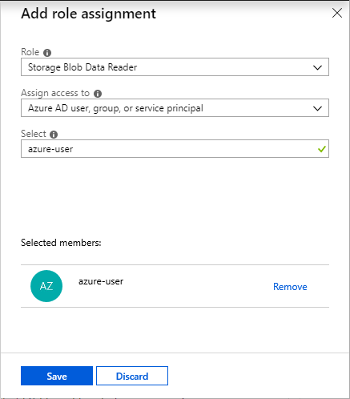
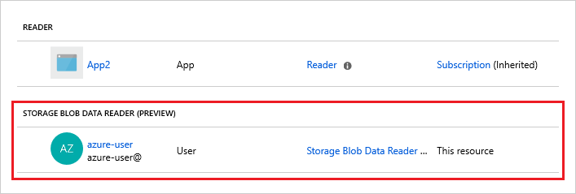

# Grant access to Azure blob and queue data with RBAC in the Azure portal

Azure Active Directory (Azure AD) authorizes access rights to secured resources through [role-based access control (RBAC)](../../role-based-access-control/overview.md). Azure Storage defines a set of built-in RBAC roles that encompass common sets of permissions used to access blob or queue data. 

When an RBAC role is assigned to an Azure AD security principal, Azure grants access to those resources for that security principal. Access can be scoped to the level of the subscription, the resource group, the storage account, or an individual container or queue. An Azure AD security principal may be a user, a group, an application service principal, or a [managed identity for Azure resources](../../active-directory/managed-identities-azure-resources/overview.md).

This article describes how to use the Azure portal to assign RBAC roles. The Azure portal provides a simple interface for assigning RBAC roles and managing access to your storage resources. You can also assign RBAC roles for blob and queue resources using Azure command-line tools or the Azure Storage management APIs. For more information about RBAC roles for storage resources, see [Authenticate access to Azure blobs and queues using Azure Active Directory](storage-auth-aad.md). 

## RBAC roles for blobs and queues

[!INCLUDE [storage-auth-rbac-roles-include](../../../includes/storage-auth-rbac-roles-include.md)]

## Determine resource scope 

[!INCLUDE [storage-auth-resource-scope-include](../../../includes/storage-auth-resource-scope-include.md)]

## Assign RBAC roles using the Azure portal

After you have determined the appropriate scope for a role assignment, navigate to that resource in the Azure portal. Display the **Access Control (IAM)** settings for the resource, and follow these instructions to manage role assignments:

1. Assign the appropriate Azure Storage RBAC role to grant access to an Azure AD security principal.

1. Assign the Azure Resource Manager [Reader](../../role-based-access-control/built-in-roles.md#reader) role to users who need to access containers or queues via the Azure portal using their Azure AD credentials. 

The following sections describe each of these steps in more detail.

> [!NOTE]
> As an owner of your Azure Storage account, you are not automatically assigned permissions to access data. You must explicitly assign yourself an RBAC role for Azure Storage. You can assign it at the level of your subscription, resource group, storage account, or a container or queue.
> 
> You cannot assign a role scoped to a container or queue if your storage account has a hierarchical namespace enabled.

### Assign a built-in RBAC role

Before you assign a role to a security principal, be sure to consider the scope of the permissions you are granting. Review the [Determine resource scope](#determine-resource-scope) section to decide the appropriate scope.

The procedure shown here assigns a role scoped to a container, but you can follow the same steps to assign a role scoped to a queue: 

1. In the [Azure portal](https://portal.azure.com), navigate to your storage account and display the **Overview** for the account.
1. Under Services, select **Blobs**. 
1. Locate the container for which you want to assign a role, and display the container's settings. 
1. Select **Access control (IAM)** to display access control settings for the container. Select the **Role assignments** tab to see the list of role assignments.

    

1. Click the **Add role assignment** button to add a new role.
1. In the **Add role assignment** window, select the Azure Storage role that you want to assign. Then search to locate the security principal to which you want to assign that role.

    

1. Click **Save**. The identity to whom you assigned the role appears listed under that role. For example, the following image shows that the user added now has read permissions to data in the container named *sample-container*.

    

You can follow similar steps to assign a role scoped to the storage account, resource group, or subscription.

### Assign the Reader role for portal access

When you assign a built-in or custom role for Azure Storage to a security principal, you are granting permissions to that security principal to perform operations on data in your storage account. The built-in **Data Reader** roles provide read permissions for the data in a container or queue, while the built-in **Data Contributor** roles provide read, write, and delete permissions to a container or queue. Permissions are scoped to the specified resource.  

For example, if you assign the **Storage Blob Data Contributor** role to user Mary at the level of a container named **sample-container**, then Mary is granted read, write, and delete access to all of the blobs in that container.

However, if Mary wants to view a blob in the Azure portal, then the **Storage Blob Data Contributor** role by itself will not provide sufficient permissions to navigate through the portal to the blob in order to view it. Additional Azure AD permissions are required to navigate through the portal and view the other resources that are visible there.

If your users need to be able to access blobs in the Azure portal, then assign them an additional RBAC role, the [Reader](../../role-based-access-control/built-in-roles.md#reader) role, to those users, at the level of the storage account or above. The **Reader** role is an Azure Resource Manager role that permits users to view storage account resources, but not modify them. It does not provide read permissions to data in Azure Storage, but only to account management resources.

Follow these steps to assign the **Reader** role so that a user can access blobs from the Azure portal. In this example, the assignment is scoped to the storage account:

1. In the [Azure portal](https://portal.azure.com), navigate to your storage account.
1. Select **Access control (IAM)** to display the access control settings for the storage account. Select the **Role assignments** tab to see the list of role assignments.
1. In the **Add role assignment** window, select the **Reader** role. 
1. From the **Assign access to** field, select **Azure AD user, group, or service principal**.
1. Search to locate the security principal to which you want to assign the role.
1. Save the role assignment.

> [!NOTE]
> Assigning the Reader role is necessary only for users who need to access blobs or queues using the Azure portal. 

## Next steps

- For more information about RBAC roles for storage resources, see [Authenticate access to Azure blobs and queues using Azure Active Directory](storage-auth-aad.md). 
- To learn more about RBAC, see [What is role-based access control (RBAC)?](../../role-based-access-control/overview.md).
- To learn how to assign and manage RBAC role assignments with Azure PowerShell, Azure CLI, or the REST API, see these articles:
    - [Manage role-based access control (RBAC) with Azure PowerShell](../../role-based-access-control/role-assignments-powershell.md)
    - [Manage role-based access control (RBAC) with Azure CLI](../../role-based-access-control/role-assignments-cli.md)
    - [Manage role-based access control (RBAC) with the REST API](../../role-based-access-control/role-assignments-rest.md)
- To learn how to authorize access to containers and queues from within your storage applications, see [Use Azure AD with Azure Storage applications](storage-auth-aad-app.md).
