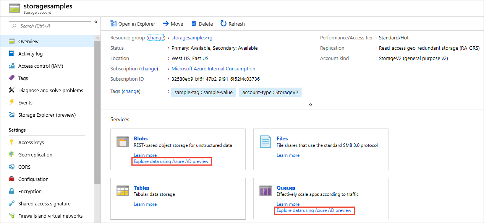

# Grant access to Azure containers and queues with RBAC in the Azure portal (preview)

Azure Active Directory (Azure AD) authorizes access rights to secured resources through [role-based access control (RBAC)](../../role-based-access-control/overview.md). Azure Storage defines a set of built-in RBAC roles that encompass common sets of permissions used to access containers or queues. 

When an RBAC role is assigned to an Azure AD security principal, that security principal is granted access to those resources, according to the specified scope. Access can be scoped to the level of the subscription, the resource group, the storage account, or an individual container or queue. An Azure AD security principal may be a user, a group, an application service principal, or a [managed identity for Azure resources](../../active-directory/managed-identities-azure-resources/overview.md). For an overview of identity in Azure AD, see [Understand Azure identity solutions](https://docs.microsoft.com/azure/active-directory/understand-azure-identity-solutions).

You can assign RBAC roles for blob and queue resources using the Azure portal, Azure command-line tools, or the Azure Storage management APIs. For more information about RBAC roles for storage resources, see [Authenticate access to Azure blobs and queues using Azure Active Directory (Preview)](storage-auth-aad.md).

## RBAC roles for blobs and queues

[!INCLUDE [storage-auth-rbac-roles-include](../../../includes/storage-auth-rbac-roles-include.md)]

> [!NOTE]
> As an owner of your Azure Storage account, you are not automatically assigned permissions to access data. You must explicitly assign yourself an RBAC role for Azure Storage. You can assign it at the level of your subscription, resource group, storage account, or a container or queue.

Assign an RBAC role to an Azure identity to grant permissions to containers or queues in your storage account. You can scope the role assignment to the storage account, or to a specific container or queue. 

Granting permissions with RBAC

Accessing resources with Azure AD credentials

## Determine resource scope 

Before you assign an RBAC role to a security principal, determine the scope of access that that security principal should have. Best practices dictate that it's always best to grant only the narrowest possible scope.

The following list describes the levels at which you can scope access to Azure blob and queue resources, starting with the narrowest scope:

- **An individual container.** At this scope, a security principal has access to all of the blobs in the container, as well as container properties and metadata.
- **An individual queue.** At this scope, a security principal has access to messages in the queue, as well as queue properties and metadata.
- **The storage account.** At this scope, a security principal has access to all containers and their blobs, and all queues and their messages.
- **The resource group.** At this scope, a security principal has access to all of the containers and queues in all of the storage accounts in the resource group.
- **The subscription.** At this scope, a security principal has access to all of the containers and queues in all of the storage accounts in all of the resource groups in the subscription.

When you have determined the desired scope for a role assignment, navigate to the appropriate resource in the Azure portal. Display the **Access Control (IAM)** settings for the resource, and follow the instructions in the subsequent sections to manage role assignments.

## Assign RBAC roles using the Azure portal

The Azure portal provides a simple interface for assigning RBAC roles and managing access to your storage resources. There are a few important points to keep in mind when using the Azure portal to assign permissions or to access storage resources using your your Azure AD credentials.

### Assign the Reader role for read access to blobs and queues in the Azure portal 

When you assign a built-in or custom role for Azure Storage to a security principal, you are granting permissions to that security principal to perform operations on data in your storage account. The built-in Data Reader roles provide read permissions for a resource or set of resources, while the built in Data Contributor roles provide read, write, and delete permissions. The permissions are scoped to the specified resource.  

For example, if you assign the **Storage Blob Data Contributor (Preview)** role to user Mary at the level of a container named **sample-container**, then Mary is granted read, write, and delete access to all of the blobs in that container.

However, if Mary wants to view a blob in the Azure portal, then the **Storage Blob Data Contributor (Preview)** role by itself will not provide sufficient permissions to navigate through the portal to the blob in order to view it. Additional Azure AD permissions are required to navigate through the portal and view the other resources that are visible there.

If your users need to be able to access blobs in the Azure portal, then assign them an additional RBAC role, the [Reader](../../role-based-access-control/built-in-roles.md#reader) role, to those users. The **Reader** role is an Azure Resource Manager role that permits users to view storage account resources, but not modify them. It does not provide read permissions to data in Azure Storage, but only to account management resources.

## Assign RBAC roles using the Azure portal

When you assign 

### Assign a role scoped to the storage account in the Azure portal

To assign a built-in role granting access to all containers or queues in the storage account in the Azure portal:

1. In the [Azure portal](https://portal.azure.com), navigate to your storage account.
1. Select your storage account, then select **Access control (IAM)** to display access control settings for the account. Select the **Role assignments** tab to see the list of role assignments.

    

1. Click the **Add role assignment** button to add a new role.
1. In the **Add role assignment** window, select the role to assign to an Azure AD identity. Then search to locate the identity to whom you want to assign that role. For example, the following image shows the **Storage Blob Data Reader (Preview)** role assigned to a user.

    

1. Click **Save**. The identity to whom you assigned the role appears listed under that role. For example, the following image shows that the user added now has read permissions to all blob data in the storage account.

    

### Assign a role scoped to a container or queue in the Azure portal

> [!IMPORTANT]
> You cannot assign a role scoped to a container or queue if your storage account has a hierarchical namespace enabled.

The steps for assigning a built-in role scoped to a container or to a queue are similar. The procedure shown here assigns a role scoped to a container, but you can follow the same steps to assign a role scoped to a queue: 

1. In the [Azure portal](https://portal.azure.com), navigate to your storage account and display the **Overview** for the account.
1. Under Services, select **Blobs**. 
1. Locate the container for which you want to assign a role, and display the container's settings. 
1. Select **Access control (IAM)** to display access control settings for the container. Select the **Role assignments** tab to see the list of role assignments.

    

1. Click the **Add role assignment** button to add a new role.
1. In the **Add role assignment** window, select the role that you want to assign to an Azure AD identity. Then search to locate the identity to which you want to assign that role.
1. Click **Save**. The identity to whom you assigned the role appears listed under that role. For example, the following image shows that the user added now has read permissions to data in the container named *sample-container*.

    

## Use Azure AD credentials with the portal

To access blobs or queues in the Azure portal using your Azure AD credentials, use the preview links shown in the following image:

If you access blob or queue data using the production links rather than the preview links, the Azure portal uses your account key to authorize access, rather than using Azure AD.

## Next steps

- To learn more about RBAC, see [What is role-based access control (RBAC)?](../../role-based-access-control/overview.md).
- To learn how to assign and manage RBAC role assignments with Azure PowerShell, Azure CLI, or the REST API, see these articles:
    - [Manage role-based access control (RBAC) with Azure PowerShell](../../role-based-access-control/role-assignments-powershell.md)
    - [Manage role-based access control (RBAC) with Azure CLI](../../role-based-access-control/role-assignments-cli.md)
    - [Manage role-based access control (RBAC) with the REST API](../../role-based-access-control/role-assignments-rest.md)
- To learn how to authorize access to containers and queues from within your storage applications, see [Use Azure AD with Azure Storage applications](storage-auth-aad-app.md).
- For additional information about Azure AD integration for Azure containers and queues, see the Azure Storage team blog post, [Announcing the Preview of Azure AD Authentication for Azure Storage](https://azure.microsoft.com/blog/announcing-the-preview-of-aad-authentication-for-storage/).
