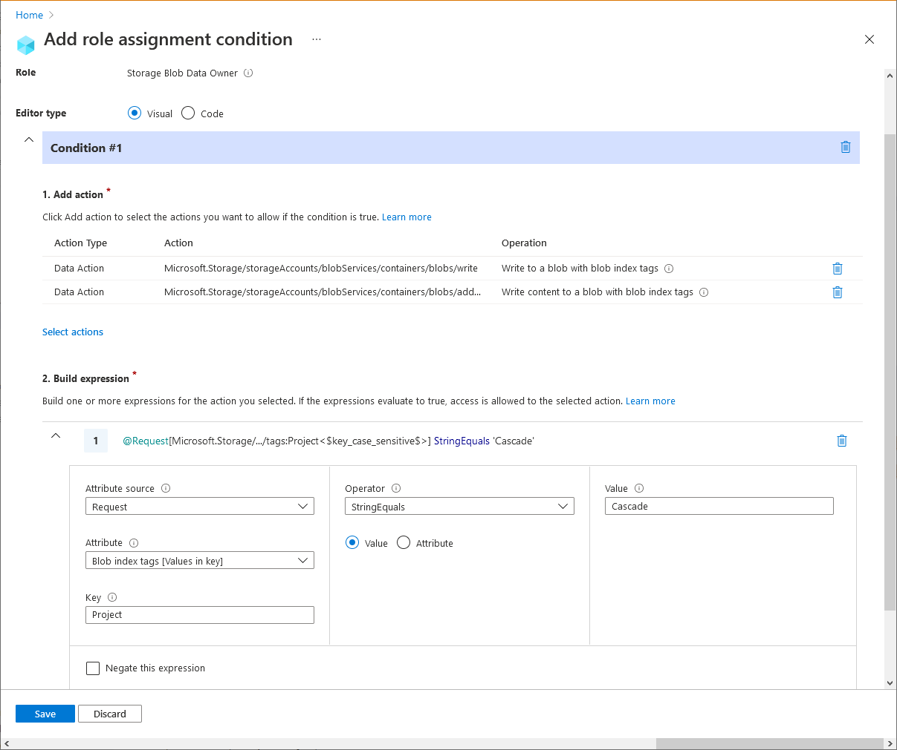
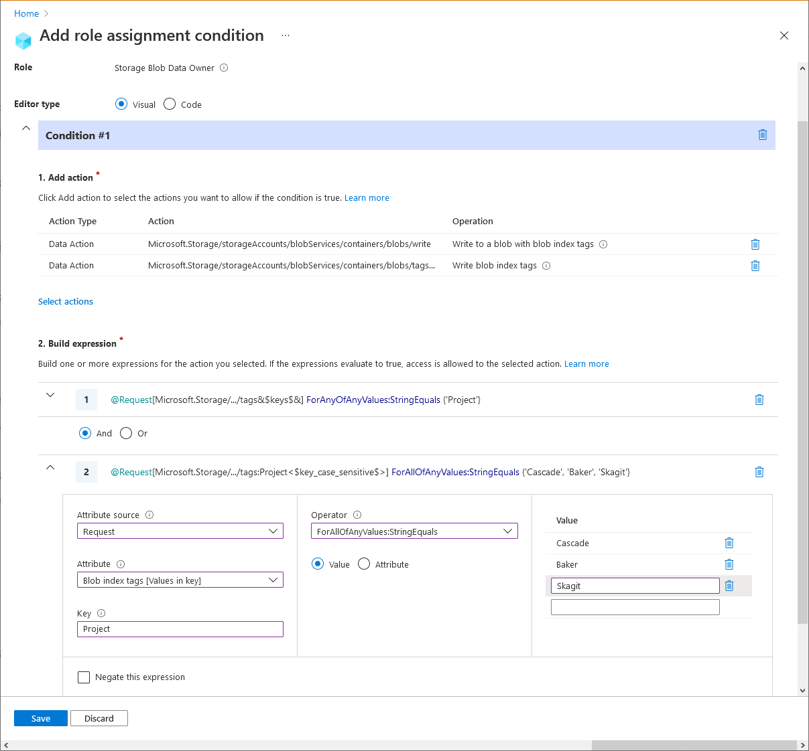
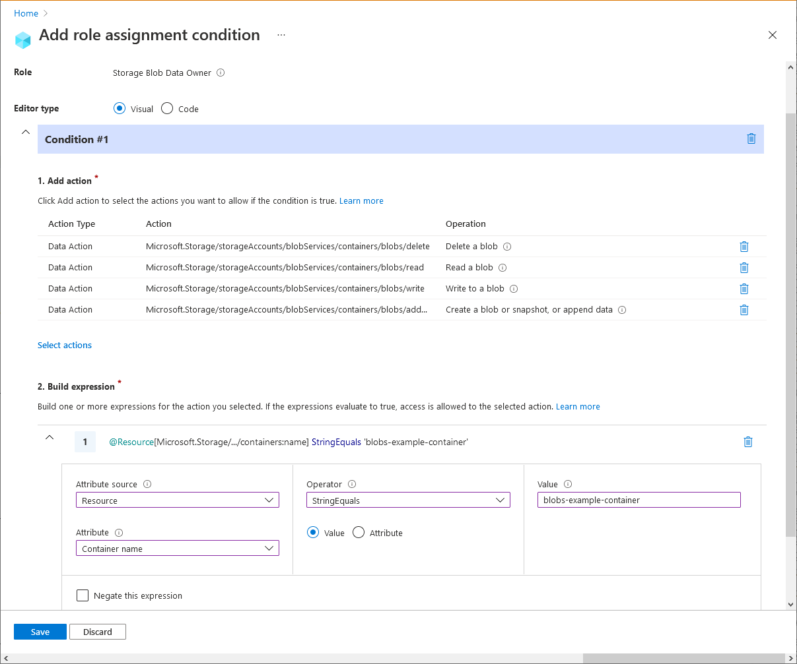
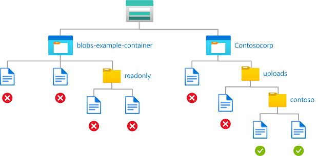
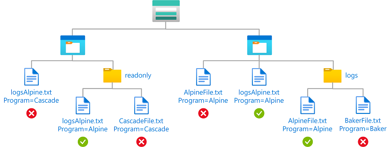
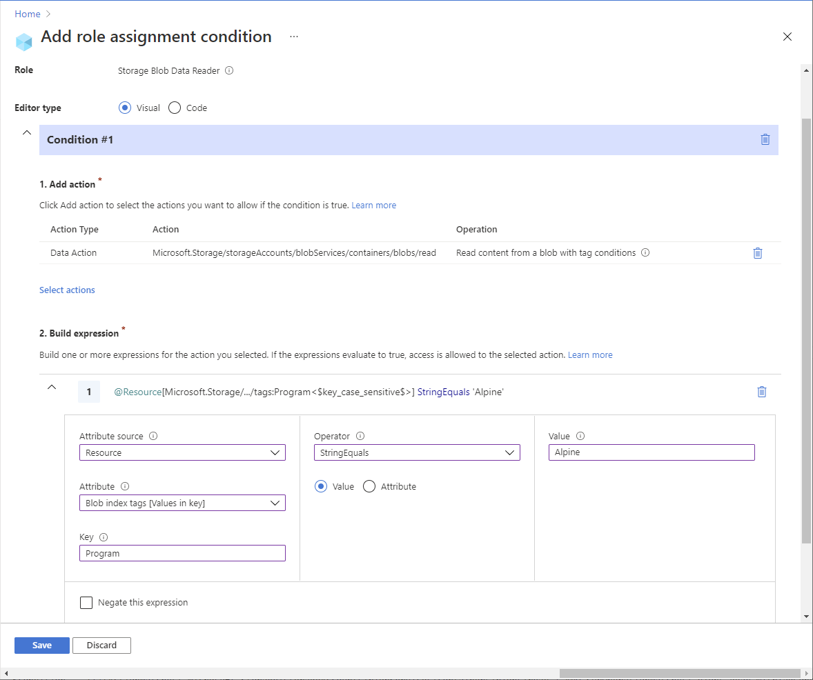
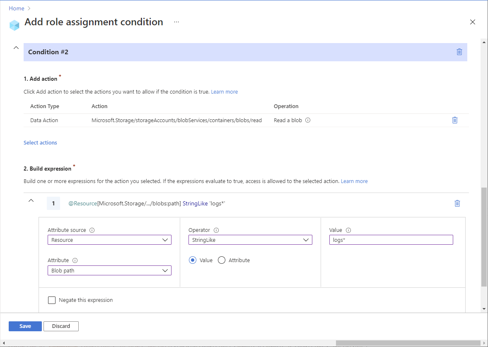

# Example Azure role assignment conditions (preview)

> [!IMPORTANT]
> Azure ABAC and Azure role assignment conditions are currently in preview.
> This preview version is provided without a service level agreement, and it's not recommended for production workloads. Certain features might not be supported or might have constrained capabilities.
> For more information, see [Supplemental Terms of Use for Microsoft Azure Previews](https://azure.microsoft.com/support/legal/preview-supplemental-terms/).

This article list some examples of role assignment conditions.

## Prerequisites

For information about the prerequisites to add or edit role assignment conditions, see [Conditions prerequisites](../../role-based-access-control/conditions-prerequisites.md).

## Example 1: Read access to blobs with a tag

This condition allows users to read blobs with a blob index tag key of Project and a tag value of Cascade. Attempts to access blobs without this key-value tag will not be allowed.

> [!TIP]
> Blobs also support the ability to store arbitrary user-defined key-value metadata. Although metadata is similar to blob index tags, you must use blob index tags with conditions. For more information, see [Manage and find Azure Blob data with blob index tags (preview)](../blobs/storage-manage-find-blobs.md).


```
(
    (
        !(ActionMatches{'Microsoft.Storage/storageAccounts/blobServices/containers/blobs/read'}
        AND
        @Request[subOperation] ForAnyOfAnyValues:StringEqualsIgnoreCase {'Blob.Read.WithTagConditions'})
    )
    OR
    (
        @Resource[Microsoft.Storage/storageAccounts/blobServices/containers/blobs/tags:Project<$key_case_sensitive$>] StringEquals 'Cascade'
    )
)
```

#### Azure portal

Here are the settings to add this condition using the Azure portal.

| Condition #1 | Setting |
| --- | --- |
| Actions | Read content from a blob with tag conditions |
| Attribute source | Resource |
| Attribute | Blob index tags [Values in key] |
| Key | {keyName} |
| Operator | StringEquals |
| Value | {keyValue} |


#### Azure PowerShell

Here's how to add this condition using Azure PowerShell.

```azurepowershell
$condition = "((!(ActionMatches{'Microsoft.Storage/storageAccounts/blobServices/containers/blobs/read'} AND @Request[subOperation] ForAnyOfAnyValues:StringEqualsIgnoreCase {'Blob.Read.WithTagConditions'})) OR (@Resource[Microsoft.Storage/storageAccounts/blobServices/containers/blobs/tags:Project<`$key_case_sensitive`$>] StringEquals 'Cascade'))"
$testRa = Get-AzRoleAssignment -Scope $scope -RoleDefinitionName $roleDefinitionName -ObjectId $userObjectID
$testRa.Condition = $condition
$testRa.ConditionVersion = "2.0"
Set-AzRoleAssignment -InputObject $testRa -PassThru
```

Here's how to test this condition.

```azurepowershell
$bearerCtx = New-AzStorageContext -StorageAccountName $storageAccountName
Get-AzStorageBlob -Container <containerName> -Blob <blobName> -Context $bearerCtx 
```

## Example 2: New blobs must include a tag

This condition requires that any new blobs must include a blob index tag key of Project and a tag value of Cascade.

> [!TIP]
> Blobs also support the ability to store arbitrary user-defined key-value metadata. Although metadata is similar to blob index tags, you must use blob index tags with conditions. For more information, see [Manage and find Azure Blob data with blob index tags (preview)](../blobs/storage-manage-find-blobs.md).

There are two permissions that allow you to create new blobs, so you must target both. You must add this condition to any role assignments that include one of the following permissions.

- /blobs/write (create or update) 
- /blobs/add/action (create)


```
(
 (
  !(ActionMatches{'Microsoft.Storage/storageAccounts/blobServices/containers/blobs/write'} AND @Request[subOperation] ForAnyOfAnyValues:StringEqualsIgnoreCase {'Blob.Write.WithTagHeaders'})
  AND
  !(ActionMatches{'Microsoft.Storage/storageAccounts/blobServices/containers/blobs/add/action'} AND @Request[subOperation] ForAnyOfAnyValues:StringEqualsIgnoreCase {'Blob.Write.WithTagHeaders'})
 )
 OR 
 (
  @Request[Microsoft.Storage/storageAccounts/blobServices/containers/blobs/tags:Project<$key_case_sensitive$>] StringEquals 'Cascade'
 )
)
```

#### Azure portal

Here are the settings to add this condition using the Azure portal.

| Condition #1 | Setting |
| --- | --- |
| Actions | Write to a blob with blob index tags<br/>Write content to a blob with blob index tags |
| Attribute source | Request |
| Attribute | Blob index tags [Values in key] |
| Key | {keyName} |
| Operator | StringEquals |
| Value | {keyValue} |



#### Azure PowerShell

Here's how to add this condition using Azure PowerShell.

```azurepowershell
$condition = "((!(ActionMatches{'Microsoft.Storage/storageAccounts/blobServices/containers/blobs/write'} AND @Request[subOperation] ForAnyOfAnyValues:StringEqualsIgnoreCase {'Blob.Write.WithTagHeaders'}) AND !(ActionMatches{'Microsoft.Storage/storageAccounts/blobServices/containers/blobs/add/action'} AND @Request[subOperation] ForAnyOfAnyValues:StringEqualsIgnoreCase {'Blob.Write.WithTagHeaders'})) OR (@Request[Microsoft.Storage/storageAccounts/blobServices/containers/blobs/tags:Project<`$key_case_sensitive`$>] StringEquals 'Cascade'))"
$testRa = Get-AzRoleAssignment -Scope $scope -RoleDefinitionName $roleDefinitionName -ObjectId $userObjectID
$testRa.Condition = $condition
$testRa.ConditionVersion = "2.0"
Set-AzRoleAssignment -InputObject $testRa -PassThru
```

Here's how to test this condition.

```azurepowershell
$localSrcFile = # path to an example file, can be an empty txt
$ungrantedTag = @{'Project'='Baker'}
$grantedTag = @{'Project'='Cascade'}
# Get new context for request
$bearerCtx = New-AzStorageContext -StorageAccountName $storageAccountName
# try ungranted tags
$content = Set-AzStorageBlobContent -File $localSrcFile -Container example2 -Blob "Example2.txt" -Tag $ungrantedTag -Context $bearerCtx
# try granted tags
$content = Set-AzStorageBlobContent -File $localSrcFile -Container example2 -Blob "Example2.txt" -Tag $grantedTag -Context $bearerCtx
```

## Example 3: Existing blobs must have tag keys

This condition requires that any existing blobs be tagged with at least one of the allowed blob index tag keys, Project or Program. This condition is useful for adding governance to existing blobs.

> [!TIP]
> Blobs also support the ability to store arbitrary user-defined key-value metadata. Although metadata is similar to blob index tags, you must use blob index tags with conditions. For more information, see [Manage and find Azure Blob data with blob index tags (preview)](../blobs/storage-manage-find-blobs.md).

There are two permissions that allow you to update tags on existing blobs, so you must target both. You must add this condition to any role assignments that include one of the following permissions.

- /blobs/write (update or create, cannot exclude create)
- /blobs/tags/write


```
(
 (
  !(ActionMatches{'Microsoft.Storage/storageAccounts/blobServices/containers/blobs/write'} AND @Request[subOperation] ForAnyOfAnyValues:StringEqualsIgnoreCase {'Blob.Write.WithTagHeaders'})
  AND
  !(ActionMatches{'Microsoft.Storage/storageAccounts/blobServices/containers/blobs/tags/write'})
 )
 OR 
 (
  @Request[Microsoft.Storage/storageAccounts/blobServices/containers/blobs/tags&$keys$&] ForAllOfAnyValues:StringEquals {'Project', 'Program'}
 )
)
```

#### Azure portal

Here are the settings to add this condition using the Azure portal.

| Condition #1 | Setting |
| --- | --- |
| Actions | Write to a blob with blob index tags<br/>Write blob index tags |
| Attribute source | Request |
| Attribute | Blob index tags [Keys] |
| Operator | ForAllOfAnyValues:StringEquals |
| Value | {keyName1}<br/>{keyName2} |


#### Azure PowerShell

Here's how to add this condition using Azure PowerShell.

```azurepowershell
$condition = "((!(ActionMatches{'Microsoft.Storage/storageAccounts/blobServices/containers/blobs/write'} AND @Request[subOperation] ForAnyOfAnyValues:StringEqualsIgnoreCase {'Blob.Write.WithTagHeaders'}) AND !(ActionMatches{'Microsoft.Storage/storageAccounts/blobServices/containers/blobs/tags/write'})) OR (@Request[Microsoft.Storage/storageAccounts/blobServices/containers/blobs/tags&`$keys`$&] ForAllOfAnyValues:StringEquals {'Project', 'Program'}))"
$testRa = Get-AzRoleAssignment -Scope $scope -RoleDefinitionName $roleDefinitionName -ObjectId $userObjectID
$testRa.Condition = $condition
$testRa.ConditionVersion = "2.0"
Set-AzRoleAssignment -InputObject $testRa -PassThru
```

Here's how to test this condition.

```azurepowershell
$localSrcFile = # path to an example file, can be an empty txt
$ungrantedTag = @{'Mode'='Baker'}
$grantedTag = @{'Program'='Alpine';'Project'='Cascade'}
# Get new context for request
$bearerCtx = New-AzStorageContext -StorageAccountName $storageAccountName
# try ungranted tags
$content = Set-AzStorageBlobContent -File $localSrcFile -Container example3 -Blob "Example3.txt" -Tag $ungrantedTag -Context $bearerCtx
# try granted tags
$content = Set-AzStorageBlobContent -File $localSrcFile -Container example3 -Blob "Example3.txt" -Tag $grantedTag -Context $bearerCtx
```

## Example 4: Existing blobs must have a tag key and values

This condition requires that any existing blobs to have a blob index tag key of Project and tag values of Cascade, Baker, or Skagit. This condition is useful for adding governance to existing blobs.

> [!TIP]
> Blobs also support the ability to store arbitrary user-defined key-value metadata. Although metadata is similar to blob index tags, you must use blob index tags with conditions. For more information, see [Manage and find Azure Blob data with blob index tags (preview)](../blobs/storage-manage-find-blobs.md).

There are two permissions that allow you to update tags on existing blobs, so you must target both. You must add this condition to any role assignments that include one of the following permissions.

- /blobs/write (update or create, cannot exclude create)
- /blobs/tags/write


```
(
 (
  !(ActionMatches{'Microsoft.Storage/storageAccounts/blobServices/containers/blobs/write'} AND @Request[subOperation] ForAnyOfAnyValues:StringEqualsIgnoreCase {'Blob.Write.WithTagHeaders'})
  AND
  !(ActionMatches{'Microsoft.Storage/storageAccounts/blobServices/containers/blobs/tags/write'})
 )
 OR 
 (
  @Request[Microsoft.Storage/storageAccounts/blobServices/containers/blobs/tags&$keys$&] ForAnyOfAnyValues:StringEquals {'Project'}
  AND
  @Request[Microsoft.Storage/storageAccounts/blobServices/containers/blobs/tags:Project<$key_case_sensitive$>] ForAllOfAnyValues:StringEquals {'Cascade', 'Baker', 'Skagit'}
 )
)
```

#### Azure portal

Here are the settings to add this condition using the Azure portal.

| Condition #1 | Setting |
| --- | --- |
| Actions | Write to a blob with blob index tags<br/>Write blob index tags |
| Attribute source | Request |
| Attribute | Blob index tags [Keys] |
| Operator | ForAnyOfAnyValues:StringEquals |
| Value | {keyName} |
| Operator | And |
| **Expression 2** |  |
| Attribute source | Request |
| Attribute | Blob index tags [Values in key] |
| Key | {keyName} |
| Operator | ForAllOfAnyValues:StringEquals |
| Value | {keyValue1}<br/>{keyValue2}<br/>{keyValue3} |



#### Azure PowerShell

Here's how to add this condition using Azure PowerShell.

```azurepowershell
$condition = "((!(ActionMatches{'Microsoft.Storage/storageAccounts/blobServices/containers/blobs/write'} AND @Request[subOperation] ForAnyOfAnyValues:StringEqualsIgnoreCase {'Blob.Write.WithTagHeaders'}) AND !(ActionMatches{'Microsoft.Storage/storageAccounts/blobServices/containers/blobs/tags/write'})) OR (@Request[Microsoft.Storage/storageAccounts/blobServices/containers/blobs/tags&`$keys`$&] ForAnyOfAnyValues:StringEquals {'Project'} AND @Request[Microsoft.Storage/storageAccounts/blobServices/containers/blobs/tags:Project<`$key_case_sensitive`$>] ForAllOfAnyValues:StringEquals {'Cascade', 'Baker', 'Skagit'}))"
$testRa = Get-AzRoleAssignment -Scope $scope -RoleDefinitionName $roleDefinitionName -ObjectId $userObjectID
$testRa.Condition = $condition
$testRa.ConditionVersion = "2.0"
Set-AzRoleAssignment -InputObject $testRa -PassThru
```

Here's how to test this condition.

```azurepowershell
$localSrcFile = <pathToLocalFile>
$ungrantedTag = @{'Project'='Alpine'}
$grantedTag1 = @{'Project'='Cascade'}
$grantedTag2 = @{'Project'='Baker'}
$grantedTag3 = @{'Project'='Skagit'}
# Get new context for request
$bearerCtx = New-AzStorageContext -StorageAccountName $storageAccountName
# try ungranted tags
Set-AzStorageBlobTag -Container example4 -Blob "Example4.txt" -Tag $ungrantedTag -Context $bearerCtx
# try granted tags
Set-AzStorageBlobTag -Container example4 -Blob "Example4.txt" -Tag $grantedTag1 -Context $bearerCtx
Set-AzStorageBlobTag -Container example4 -Blob "Example4.txt" -Tag $grantedTag2 -Context $bearerCtx
Set-AzStorageBlobTag -Container example4 -Blob "Example4.txt" -Tag $grantedTag3 -Context $bearerCtx
```

## Example 5: Read, write, or delete blobs in named containers

This condition allows users to read, write, or delete blobs in storage containers named blobs-example-container. This condition is useful for sharing specific storage containers with other users in a subscription.

There are four permissions for read, write, and delete of existing blobs, so you must target all permissions. You must add this condition to any role assignments that include one of the following permissions.

- /blobs/delete
- /blobs/read
- /blobs/write (update or create)
- /blobs/add/action (create)

Suboperations are not used in this condition because the subOperation is needed only when conditions are authored based on tags.


```
(
 (
  !(ActionMatches{'Microsoft.Storage/storageAccounts/blobServices/containers/blobs/delete'})
  AND
  !(ActionMatches{'Microsoft.Storage/storageAccounts/blobServices/containers/blobs/read'})
  AND
  !(ActionMatches{'Microsoft.Storage/storageAccounts/blobServices/containers/blobs/write'})
  AND
  !(ActionMatches{'Microsoft.Storage/storageAccounts/blobServices/containers/blobs/add/action'})
 )
 OR 
 (
  @Resource[Microsoft.Storage/storageAccounts/blobServices/containers:name] StringEquals 'blobs-example-container'
 )
)
```

#### Azure portal

Here are the settings to add this condition using the Azure portal.

| Condition #1 | Setting |
| --- | --- |
| Actions | Delete a blob<br/>Read a blob<br/>Write to a blob<br/>Create a blob or snapshot, or append data |
| Attribute source | Resource |
| Attribute | Container name |
| Operator | StringEquals |
| Value | {containerName} |



#### Azure PowerShell

Here's how to add this condition using Azure PowerShell.

```azurepowershell
$condition = "((!(ActionMatches{'Microsoft.Storage/storageAccounts/blobServices/containers/blobs/delete'}) AND !(ActionMatches{'Microsoft.Storage/storageAccounts/blobServices/containers/blobs/read'}) AND !(ActionMatches{'Microsoft.Storage/storageAccounts/blobServices/containers/blobs/write'}) AND !(ActionMatches{'Microsoft.Storage/storageAccounts/blobServices/containers/blobs/add/action'})) OR (@Resource[Microsoft.Storage/storageAccounts/blobServices/containers:name] StringEquals 'blobs-example-container'))"
$testRa = Get-AzRoleAssignment -Scope $scope -RoleDefinitionName $roleDefinitionName -ObjectId $userObjectID
$testRa.Condition = $condition
$testRa.ConditionVersion = "2.0"
Set-AzRoleAssignment -InputObject $testRa -PassThru
```

Here's how to test this condition.

```azurepowershell
$localSrcFile = <pathToLocalFile>
$grantedContainer = "blobs-example-container"
$ungrantedContainer = "ungranted"
# Get new context for request
$bearerCtx = New-AzStorageContext -StorageAccountName $storageAccountName
# Ungranted Container actions
$content = Set-AzStorageBlobContent -File $localSrcFile -Container $ungrantedContainer -Blob "Example5.txt" -Context $bearerCtx
$content = Get-AzStorageBlobContent -Container $ungrantedContainer -Blob "Example5.txt" -Context $bearerCtx
$content = Remove-AzStorageBlob -Container $ungrantedContainer -Blob "Example5.txt" -Context $bearerCtx
# Granted Container actions
$content = Set-AzStorageBlobContent -File $localSrcFile -Container $grantedContainer -Blob "Example5.txt" -Context $bearerCtx
$content = Get-AzStorageBlobContent -Container $grantedContainer -Blob "Example5.txt" -Context $bearerCtx
$content = Remove-AzStorageBlob -Container $grantedContainer -Blob "Example5.txt" -Context $bearerCtx
```

## Example 6: Read access to blobs in named containers with a path

This condition allows read access to storage containers named blobs-example-container with a blob path of readonly/*. This condition is useful for sharing specific parts of storage containers for read access with other users in the subscription.

You must add this condition to any role assignments that include the following permission.

- /blobs/read


```
(
    (
        !(ActionMatches{'Microsoft.Storage/storageAccounts/blobServices/containers/blobs/read'})
    )
    OR
    (
        @Resource[Microsoft.Storage/storageAccounts/blobServices/containers:name] StringEquals 'blobs-example-container'
        AND
        @Resource[Microsoft.Storage/storageAccounts/blobServices/containers/blobs:path] StringLike 'readonly/*'
    )
)
```

#### Azure portal

Here are the settings to add this condition using the Azure portal.

| Condition #1 | Setting |
| --- | --- |
| Actions | Read a blob |
| Attribute source | Resource |
| Attribute | Container name |
| Operator | StringEquals |
| Value | {containerName} |
| **Expression 2** |  |
| Operator | And |
| Attribute source | Resource |
| Attribute | Blob path |
| Operator | StringLike |
| Value | {pathString} |


#### Azure PowerShell

Here's how to add this condition using Azure PowerShell.

```azurepowershell
$condition = "((!(ActionMatches{'Microsoft.Storage/storageAccounts/blobServices/containers/blobs/read'})) OR (@Resource[Microsoft.Storage/storageAccounts/blobServices/containers:name] StringEquals 'blobs-example-container' AND @Resource[Microsoft.Storage/storageAccounts/blobServices/containers/blobs:path] StringLike 'readonly/*'))"
$testRa = Get-AzRoleAssignment -Scope $scope -RoleDefinitionName $roleDefinitionName -ObjectId $userObjectID
$testRa.Condition = $condition
$testRa.ConditionVersion = "2.0"
Set-AzRoleAssignment -InputObject $testRa -PassThru
```

Here's how to test this condition.

```azurepowershell
$grantedContainer = "blobs-example-container"
# Get new context for request
$bearerCtx = New-AzStorageContext -StorageAccountName $storageAccountName
# Try to get ungranted blob
$content = Get-AzStorageBlobContent -Container $grantedContainer -Blob "Ungranted.txt" -Context $bearerCtx
# Try to get granted blob
$content = Get-AzStorageBlobContent -Container $grantedContainer -Blob "readonly/Example6.txt" -Context $bearerCtx
```

## Example 7: Write access to blobs in named containers with a path

This condition allows a partner (an Azure AD guest user) to drop files into storage containers named Contosocorp with a path of uploads/contoso/*. This condition is useful for allowing other users to put data in storage containers.

You must add this condition to any role assignments that include the following permissions.

- /blobs/write (create or update)
- /blobs/add/action (create)



```
(
 (
  !(ActionMatches{'Microsoft.Storage/storageAccounts/blobServices/containers/blobs/write'})
  AND
  !(ActionMatches{'Microsoft.Storage/storageAccounts/blobServices/containers/blobs/add/action'})
 )
 OR 
 (
  @Resource[Microsoft.Storage/storageAccounts/blobServices/containers:name] StringEquals 'contosocorp'
  AND
  @Resource[Microsoft.Storage/storageAccounts/blobServices/containers/blobs:path] StringLike 'uploads/contoso/*'
 )
)
```

#### Azure portal

Here are the settings to add this condition using the Azure portal.

| Condition #1 | Setting |
| --- | --- |
| Actions | Write to a blob<br/>Create a blob or snapshot, or append data |
| Attribute source | Resource |
| Attribute | Container name |
| Operator | StringEquals |
| Value | {containerName} |
| **Expression 2** |  |
| Operator | And |
| Attribute source | Resource |
| Attribute | Blob path |
| Operator | StringLike |
| Value | {pathString} |


#### Azure PowerShell

Here's how to add this condition using Azure PowerShell.

```azurepowershell
$condition = "((!(ActionMatches{'Microsoft.Storage/storageAccounts/blobServices/containers/blobs/write'}) AND !(ActionMatches{'Microsoft.Storage/storageAccounts/blobServices/containers/blobs/add/action'})) OR (@Resource[Microsoft.Storage/storageAccounts/blobServices/containers:name] StringEquals 'contosocorp' AND @Resource[Microsoft.Storage/storageAccounts/blobServices/containers/blobs:path] StringLike 'uploads/contoso/*'))"
$testRa = Get-AzRoleAssignment -Scope $scope -RoleDefinitionName $roleDefinitionName -ObjectId $userObjectID
$testRa.Condition = $condition
$testRa.ConditionVersion = "2.0"
Set-AzRoleAssignment -InputObject $testRa -PassThru
```

Here's how to test this condition.

```azurepowershell
$grantedContainer = "contosocorp"
$localSrcFile = <pathToLocalFile>
$bearerCtx = New-AzStorageContext -StorageAccountName $storageAccountName
# Try to set ungranted blob
$content = Set-AzStorageBlobContent -Container $grantedContainer -Blob "Example7.txt" -Context $bearerCtx -File $localSrcFile
# Try to set granted blob
$content = Set-AzStorageBlobContent -Container $grantedContainer -Blob "uploads/contoso/Example7.txt" -Context $bearerCtx -File $localSrcFile
```

## Example 8: Read access to blobs with a tag and a path

This condition allows a user to read blobs with a blob index tag key of Program, a tag value of Alpine, and a blob path of logs*. The blob path of logs* also includes the blob name.

> [!TIP]
> Blobs also support the ability to store arbitrary user-defined key-value metadata. Although metadata is similar to blob index tags, you must use blob index tags with conditions. For more information, see [Manage and find Azure Blob data with blob index tags (preview)](../blobs/storage-manage-find-blobs.md).

You must add this condition to any role assignments that includes the following permission.

- /blobs/read



```
(
    (
        !(ActionMatches{'Microsoft.Storage/storageAccounts/blobServices/containers/blobs/read'}
        AND
        @Request[subOperation] ForAnyOfAnyValues:StringEqualsIgnoreCase {'Blob.Read.WithTagConditions'})
    )
    OR
    (
        @Resource[Microsoft.Storage/storageAccounts/blobServices/containers/blobs/tags:Program<$key_case_sensitive$>] StringEquals 'Alpine'
    )
)
AND
(
    (
        !(ActionMatches{'Microsoft.Storage/storageAccounts/blobServices/containers/blobs/read'})
    )
    OR
    (
        @Resource[Microsoft.Storage/storageAccounts/blobServices/containers/blobs:path] StringLike 'logs*'
    )
)
```

#### Azure portal

Here are the settings to add this condition using the Azure portal.

| Condition #1 | Setting |
| --- | --- |
| Actions | Read content from a blob with tag conditions |
| Attribute source | Resource |
| Attribute | Blob index tabs [Values in key] |
| Key | {keyName} |
| Operator | StringEquals |
| Value | {keyValue} |



| Condition #2 | Setting |
| --- | --- |
| Actions | Read a blob |
| Attribute source | Resource |
| Attribute | Blob path |
| Operator | StringLike |
| Value | {pathString} |



#### Azure PowerShell

Here's how to add this condition using Azure PowerShell.

```azurepowershell
$condition = "((!(ActionMatches{'Microsoft.Storage/storageAccounts/blobServices/containers/blobs/read'} AND @Request[subOperation] ForAnyOfAnyValues:StringEqualsIgnoreCase {'Blob.Read.WithTagConditions'})) OR (@Resource[Microsoft.Storage/storageAccounts/blobServices/containers/blobs/tags:Program<`$key_case_sensitive`$>] StringEquals 'Alpine')) AND ((!(ActionMatches{'Microsoft.Storage/storageAccounts/blobServices/containers/blobs/read'})) OR (@Resource[Microsoft.Storage/storageAccounts/blobServices/containers/blobs:path] StringLike 'logs*'))"
$testRa = Get-AzRoleAssignment -Scope $scope -RoleDefinitionName $roleDefinitionName -ObjectId $userObjectID
$testRa.Condition = $condition
$testRa.ConditionVersion = "2.0"
Set-AzRoleAssignment -InputObject $testRa -PassThru
```

Here's how to test this condition.

```azurepowershell
$grantedContainer = "contosocorp"
# Get new context for request
$bearerCtx = New-AzStorageContext -StorageAccountName $storageAccountName
# Try to get ungranted blobs
# Wrong name but right tags
$content = Get-AzStorageBlobContent -Container $grantedContainer -Blob "AlpineFile.txt" -Context $bearerCtx
# Right name but wrong tags
$content = Get-AzStorageBlobContent -Container $grantedContainer -Blob "logsAlpine.txt" -Context $bearerCtx
# Try to get granted blob
$content = Get-AzStorageBlobContent -Container $grantedContainer -Blob "logs/AlpineFile.txt" -Context $bearerCtx
```

## Next steps

- [Tutorial: Add a role assignment condition to restrict access to blobs using the Azure portal (preview)](storage-auth-abac-portal.md)
- [Actions and attributes for Azure role assignment conditions in Azure Storage (preview)](storage-auth-abac-attributes.md)
- [Azure role assignment condition format and syntax (preview)](../../role-based-access-control/conditions-format.md)
